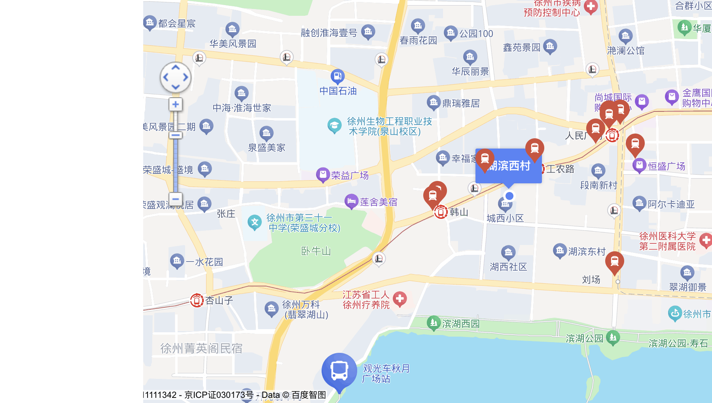
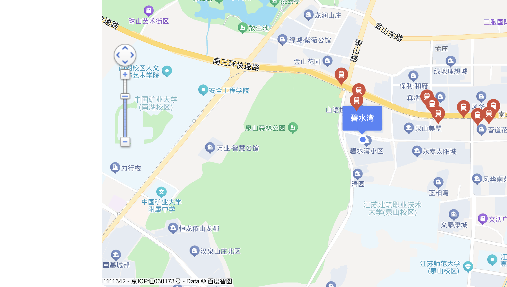
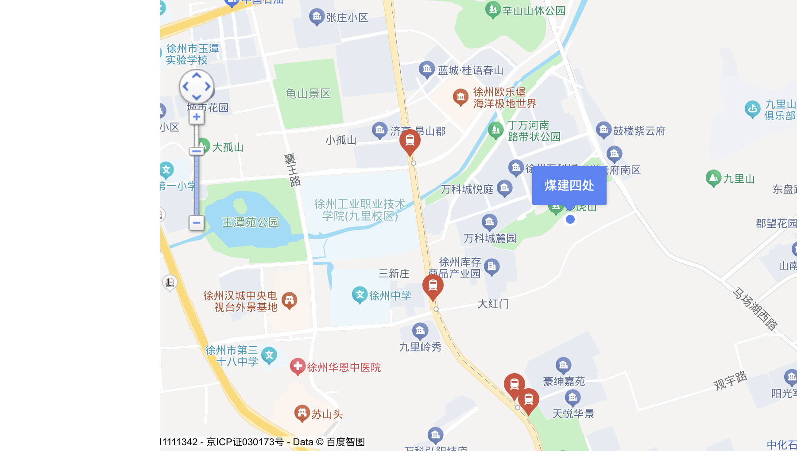

# 徐州自由居所 V3：真实住宅声学调查

## 第一部分：搜索结果总览

截至2026-09-27T12:18:02+08:00：取得**28套**贝壳普通住宅公开字段匹配线索，分布于**28个不同小区**。每个小区只展示一套代表房源，同小区备选不重复占位。
- 面积、挂牌价、精确楼层及电梯限制均有公开证据支持：**0套**。
- 再加地理范围初核通过：**0套**。南区环外补充单列，不冒称三环内。
- 有周边设施距离证据：**28套**；**实际安静、隔音与生活密度完全核验：0套**。周边地图证据不是睡眠质量证明。
- 因公开条件明确不符而排除：**2套**；其他缺字段的记录保留在线索，不当作合格。
- 本次优先级：安静 > 隔音 > 居住密度 > 价格；面积40—60㎡，优先约50㎡，无电梯仅1—3楼。20—35万元优先，35—45可接受，45—50补充，低于20另查低价原因。
- 是否值得继续：下列真实、不同小区的对象可补充调查；目前没有证据足以确认任何一套适合长期安静独居。下一步先补楼层/电梯与楼栋定位，再预约白天、夜间隔音测试。

### 优先调查入口（不是购买推荐）

| 小区 | 面积㎡/挂牌万元 | 精确楼层/电梯 | 已取得的环境线索 | 首要缺口 |
| --- | --- | --- | --- | --- |
| [合群小区](https://xz.ke.com/ershoufang/103152473801.html) | 47.34/29 | 2楼（公开描述；非现场核验）；未知 | 描述称边户：可核查是否减少邻户共墙；未取得完整户型/连接资料；徐州市儿童医院(东院) 880米；徐州幼儿师范高等专科学校附属幼儿园(玖玺园区) 504米；金鹰国际购物中心(人民广场店) 1184米 | 楼栋/窗户与噪声实测，范围和未明楼层/电梯 |
| [民和园](https://xz.ke.com/ershoufang/103135323540.html) | 58.91/30 | 3楼（公开描述；非现场核验）；未知 | 描述称边户：可核查是否减少邻户共墙；未取得完整户型/连接资料；泉山区西苑社区卫生服务中心 277米；西苑幼儿园 286米 | 楼栋/窗户与噪声实测，范围和未明楼层/电梯 |
| [湖滨西村](https://xz.ke.com/ershoufang/103134365756.html) | 59.02/30 | 3楼（公开描述；非现场核验）；未知 | C级地图显示滨湖公园/湖面，为环境调查提供目标；尚不能确认本套卧室朝向或避开交通声；徐州市泉山区段庄街道城西社区卫生服务站 203米；徐州市星光第二实验幼儿园 394米；恒盛广场(徐州泉山店) 1345米 | 楼栋/窗户与噪声实测，范围和未明楼层/电梯 |
| [碧水湾](https://xz.ke.com/ershoufang/103148275530.html) | 58.62/18.8 | 精确楼层未知；平台分段：高楼层 (共6层)；有（公开声明） | C级地图确认泉山森林公园环境线索；需寻找并核实不朝快速路的具体楼栋和卧室，当前并未确定；泉山区永嘉太阳城社区卫生服务站 919米；华商山语世家幼儿园 167米 | 楼栋/窗户与噪声实测，范围和未明楼层/电梯 |
| [煤建四处](https://xz.ke.com/ershoufang/103153885347.html) | 54.16/23 | 1楼（公开描述；非现场核验）；未知 | C级地图显示周边山体/公园，可优先核查非临街楼栋与卧室；不能据此排除道路、轨交或公园活动声音；鼓楼区九里街道四处社区卫生服务站 186米；徐州幼师幼教集团万科城幼儿园 405米 | 楼栋/窗户与噪声实测，范围和未明楼层/电梯 |
| [久隆澜桥](https://xz.ke.com/ershoufang/103151619872.html) | 53.95/23.5 | 精确楼层未知；平台分段：中楼层 (共33层)；有（公开声明） | 铜山区新都家园社区卫生服务站 619米；久隆皇家幼儿园 266米 | 楼栋/窗户与噪声实测，范围和未明楼层/电梯 |
| [黄河东岸小区](https://xz.ke.com/ershoufang/103152826296.html) | 50.35/18 | 精确楼层未知；平台分段：高楼层 (共7层)；有（公开声明） | 慧谷阳光幼儿园 394米；徐州和信广场-B区 578米 | 楼栋/窗户与噪声实测，范围和未明楼层/电梯 |
| [尚景园北区](https://xz.ke.com/ershoufang/103140757760.html) | 51.48/26.8 | 精确楼层未知；平台分段：高楼层 (共6层)；有（公开声明） | 徐州新华医院 409米；徐州铁路第一幼儿园 334米；南郊彩云里 923米 | 楼栋/窗户与噪声实测，范围和未明楼层/电梯 |
| [建国东路125号综合楼](https://xz.ke.com/ershoufang/103154195887.html) | 51.72/26 | 精确楼层未知；平台分段：高楼层 (共7层)；未知 | 徐州市第九人民医院 867米；机关一幼 410米；戏马台时尚广场 883米 | 楼栋/窗户与噪声实测，范围和未明楼层/电梯 |
| [事业小区](https://xz.ke.com/ershoufang/103140570454.html) | 48.05/27 | 精确楼层未知；平台分段：低楼层 (共7层)；未知 | 徐州市口腔医院 525米；徐州市星光实验幼儿园 718米；金鹰国际购物中心(彭城广场店) 1330米 | 楼栋/窗户与噪声实测，范围和未明楼层/电梯 |
| [民强园小区](https://xz.ke.com/ershoufang/103152687047.html) | 52.53/29.8 | 精确楼层未知；平台分段：中楼层 (共7层)；未知 | 云龙区黄山社区卫生服务中心 410米；兰庭幼儿园 208米；万达广场(徐州云龙店) 666米 | 楼栋/窗户与噪声实测，范围和未明楼层/电梯 |
| [东阁小区南区](https://xz.ke.com/ershoufang/103135065699.html) | 52.73/29.8 | 2楼（公开描述；非现场核验）；未知 | 徐州市第三人民医院 184米；鼓楼区实验幼儿园 452米；福源广场 318米 | 楼栋/窗户与噪声实测，范围和未明楼层/电梯 |
| [广山西路小区](https://xz.ke.com/ershoufang/103152788547.html) | 54.54/24.8 | 2楼（公开描述；非现场核验）；未知 | 陆军第七十一集团军医院 378米；徐州市重型幼儿园 430米；徐州蓝天百货 1440米 | 楼栋/窗户与噪声实测，范围和未明楼层/电梯 |
| [铁路18宿舍](https://xz.ke.com/ershoufang/103150156290.html) | 55.69/21.5 | 精确楼层未知；平台分段：低楼层 (共6层)；无（公开声明） | 瑞博医院 684米；九龙皇家幼儿园 575米 | 楼栋/窗户与噪声实测，范围和未明楼层/电梯 |
| [金苑小区北院](https://xz.ke.com/ershoufang/103153508605.html) | 55.76/22 | 精确楼层未知；平台分段：高楼层 (共7层)；未知 | 徐州经济技术开发区金碧社区卫生服务站 105米；徐州幼儿高等师范学校附属幼儿园(桃园路) 658米；徐州美的悦然里 1278米 | 楼栋/窗户与噪声实测，范围和未明楼层/电梯 |
| [宜居嘉园](https://xz.ke.com/ershoufang/103154032261.html) | 56.57/29 | 5楼（公开描述；非现场核验）；未知 | 鼓楼区琵琶街道清水湾社区卫生服务站 812米；宜居嘉园幼儿园 110米；君盛广场(徐州鼓楼店) 1364米 | 楼栋/窗户与噪声实测，范围和未明楼层/电梯 |
| [古槐园二期](https://xz.ke.com/ershoufang/103154118470.html) | 57.83/28 | 5楼（公开描述；非现场核验）；未知 | 云龙区子房街道铁刹社区卫生服务站 594米；徐州市重型幼儿园 314米；徐州蓝天百货 799米 | 楼栋/窗户与噪声实测，范围和未明楼层/电梯 |
| [老营盘小区](https://xz.ke.com/ershoufang/103144431302.html) | 50.33/15 | 精确楼层未知；平台分段：高楼层 (共7层)；未知 | 徐州九龙医院私密整形 154米；慧谷阳光幼儿园 424米；和信广场(徐州店) 390米 | 楼栋/窗户与噪声实测，范围和未明楼层/电梯 |
| [南坝山小区](https://xz.ke.com/ershoufang/103152400847.html) | 50.84/18 | 精确楼层未知；平台分段：中楼层 (共6层)；未知 | 徐州华美美容医院 241米；爱心幼儿园(东丰路) 795米；楚岳广场(徐州云龙店) 1101米 | 楼栋/窗户与噪声实测，范围和未明楼层/电梯 |
| [王场东村](https://xz.ke.com/ershoufang/103154110526.html) | 52.55/19.5 | 4楼（公开描述；非现场核验）；未知 | 鼓楼区丰财街道怡园亭社区卫生服务站 104米；徐州市朱庄中心幼儿园 951米；君盛广场(徐州鼓楼店) 1996米 | 楼栋/窗户与噪声实测，范围和未明楼层/电梯 |
| [黄河新村](https://xz.ke.com/ershoufang/103149706974.html) | 55.77/13.8 | 精确楼层未知；平台分段：高楼层 (共7层)；未知 | 徐州市儿童医院(东院) 198米；徐州市兴华路幼儿园 1120米；金鹰国际购物中心(人民广场店) 975米 | 楼栋/窗户与噪声实测，范围和未明楼层/电梯 |
| [新河花园](https://xz.ke.com/ershoufang/103153066133.html) | 56.42/15 | 1楼（公开描述；非现场核验）；未知 | 汉王镇新河社区卫生站 605米；新河矿希望双语幼儿园 830米 | 楼栋/窗户与噪声实测，范围和未明楼层/电梯 |
| [铁路29宿舍](https://xz.ke.com/ershoufang/103154128969.html) | 52.9/15.8 | 精确楼层未知；平台分段：中楼层 (共6层)；无（公开声明） | 鼓楼区丰财社区卫生服务站 1209米；徐州市下淀中心幼儿园 144米；徐州美的悦然里 1701米 | 楼栋/窗户与噪声实测，范围和未明楼层/电梯 |
| [工程小区](https://xz.ke.com/ershoufang/103139129308.html) | 59.28/45 | 精确楼层未知；平台分段：低楼层 (共6层)；未知 | 徐州市兴华路幼儿园 974米；金鹰国际购物中心(人民广场店) 884米 | 楼栋/窗户与噪声实测，范围和未明楼层/电梯 |
| [庞庄小区](https://xz.ke.com/ershoufang/103148487949.html) | 54.22/10 | 1楼（公开描述；非现场核验）；未知 | 国基贝儿幼儿园 373米 | 楼栋/窗户与噪声实测，范围和未明楼层/电梯 |

### 实际搜索覆盖

| 区域/片区 | 状态 | 初筛线索/不同小区 | 范围说明 | 来源 |
| --- | --- | --- | --- | --- |
| 泉山区总检 | ok | 30/5 | 行政区不是三环边界 | [贝壳列表](https://xz.ke.com/ershoufang/quanshanqu/ba40ea60bp0ep50) |
| 鼓楼区总检 | ok | 30/14 | 行政区不是三环边界 | [贝壳列表](https://xz.ke.com/ershoufang/gulouqu/ba40ea60bp0ep50) |
| 云龙区总检 | ok | 30/26 | 行政区不是三环边界 | [贝壳列表](https://xz.ke.com/ershoufang/yunlongqu/ba40ea60bp0ep50) |
| 黄山垅片区 | ok | 30/12 | 行政区不是三环边界 | [贝壳列表](https://xz.ke.com/ershoufang/huangshanlong/ba40ea60bp0ep50) |
| 楚王陵片区 | ok | 30/7 | 行政区不是三环边界 | [贝壳列表](https://xz.ke.com/ershoufang/chuwangling/ba40ea60bp0ep50) |
| 天桥东片区 | ok | 30/14 | 行政区不是三环边界 | [贝壳列表](https://xz.ke.com/ershoufang/tianqiaodong/ba40ea60bp0ep50) |
| 西苑片区 | ok | 30/7 | 行政区不是三环边界 | [贝壳列表](https://xz.ke.com/ershoufang/xiyuan1/ba40ea60bp0ep50) |
| 湖滨片区 | ok | 30/7 | 行政区不是三环边界 | [贝壳列表](https://xz.ke.com/ershoufang/hubin/ba40ea60bp0ep50) |
| 奎园片区 | ok | 26/11 | 行政区不是三环边界 | [贝壳列表](https://xz.ke.com/ershoufang/kuiyuan/ba40ea60bp0ep50) |
| 翟山片区 | ok | 28/4 | 行政区不是三环边界 | [贝壳列表](https://xz.ke.com/ershoufang/zhaishan/ba40ea60bp0ep50) |
| 老矿大片区 | ok | 30/7 | 行政区不是三环边界 | [贝壳列表](https://xz.ke.com/ershoufang/laokuangda/ba40ea60bp0ep50) |
| 民主北路片区 | ok | 30/7 | 行政区不是三环边界 | [贝壳列表](https://xz.ke.com/ershoufang/minzhubeilu/ba40ea60bp0ep50) |
| 坝子街片区 | ok | 30/11 | 行政区不是三环边界 | [贝壳列表](https://xz.ke.com/ershoufang/bazijie/ba40ea60bp0ep50) |
| 祥和片区 | ok | 30/7 | 行政区不是三环边界 | [贝壳列表](https://xz.ke.com/ershoufang/xianghe2/ba40ea60bp0ep50) |
| 经开区总检 | ok | 30/12 | 行政区不是三环边界 | [贝壳列表](https://xz.ke.com/ershoufang/xuzhoujingjijishukaifaqu/ba40ea60bp0ep50) |
| 铜山区近市区检索 | ok | 30/13 | 南区允许补充，边界另核 | [贝壳列表](https://xz.ke.com/ershoufang/tongshanqu/ba40ea60bp0ep50) |
| 铜山万达片区补充 | ok | 30/4 | 南区允许补充，边界另核 | [贝壳列表](https://xz.ke.com/ershoufang/tongshanwanda/ba40ea60bp0ep50) |
| 碧水湾定向检索 | ok | 7/1 | 南区允许补充，边界另核 | [贝壳列表](https://xz.ke.com/ershoufang/ba40ea60bp0ep50rs%E7%A2%A7%E6%B0%B4%E6%B9%BE/) |

## 第二部分：已初核基本条件的房源

此区要求面积、价格、住宅用途、楼层/电梯和允许地理范围有证据支持；安静、隔音仍需现场核验。

**目前没有同时满足以上已确认门槛的房源。**下面的待调查对象不冒充正式合格候选。

## 第三部分：值得继续调查的真实房源

这些是有真实贝壳来源的住宅线索，不是已完全合格房源。噪音源、结构与密度字段尽可能给证据；未知楼层/电梯、边界、楼栋及实测保持未知。
### 1. 合群小区 · 泉山区 儿童医院

**47.34㎡ · 2室1厅1卫 · 挂牌29万元**。[贝壳房源原页](https://xz.ke.com/ershoufang/103152473801.html)；[贝壳小区/地图/成交页](https://xz.ke.com/xiaoqu/8737127295996555/)。
挂牌单价：6126元/㎡（平台字段，非成交价）。
地址：(泉山区) 苏堤北路合群小区。挂牌日期：2026年07月14日；资料获取：2026-09-27T11:40:46+08:00。
楼层：2楼（公开描述；非现场核验）；电梯：未知；楼层状态：`pending_floor_or_elevator`。
范围：三环边界待核，不以行政区替代；所属检索片区：泉山区总检。

**安静与周边环境**

- 医疗：徐州市儿童医院(东院)约880米；徐州市儿童医院约888米。来源：[贝壳小区/地图/成交页](https://xz.ke.com/xiaoqu/8737127295996555/)（百度地图在贝壳页显示）。
- 教育：徐州幼儿师范高等专科学校附属幼儿园(玖玺园区)约504米；徐州市兴华路幼儿园约950米。来源：[贝壳小区/地图/成交页](https://xz.ke.com/xiaoqu/8737127295996555/)（百度地图在贝壳页显示）。
- 商业：金鹰国际购物中心(人民广场店)约1184米；荣盛商业广场约1245米。来源：[贝壳小区/地图/成交页](https://xz.ke.com/xiaoqu/8737127295996555/)（百度地图在贝壳页显示）。
- 描述线索（非独立核验）：交通出行“公里范围内有金鹰 金地 苏宁广场 市二院 口腔医院 公交 地铁站 生活配套齐全”。来源：[贝壳房源原页](https://xz.ke.com/ershoufang/103152473801.html)。
- 上述距离是平台小区参考点距离，计算口径未说明，不是楼栋或卧室距离；近医院/学校/商场表示需核验相关声源，不等于已经噪音超标。
- 主干道/高架、铁路及货运、夜市娱乐、医院急诊入口、学校广播与施工：未完成楼栋级排查。楼栋是否内部、卧室是否背街仍需确认。

**隔音证据与缺口**

- 房源建成年份：1997；结构：混合结构；整体朝向：南。来源：[贝壳房源原页](https://xz.ke.com/ershoufang/103152473801.html)。
- 分间信息：卧室A / 7.86平米 / 北 / 普通窗；卧室B / 13.2平米 / 南 / 普通窗。来源：[贝壳房源原页](https://xz.ke.com/ershoufang/103152473801.html)。窗型/朝向不证明隔音或是否临街。
- 楼板/共墙材料厚度、入户门及窗户隔声指标、电梯井/设备间邻接、管道振动资料未知。房龄与结构不能证明隔音好坏；实际脚步、说话、楼道及低频传声均未经现场验证。

**居住密度证据**

- 总户数：2900户；楼栋：55栋；容积率：1.2；绿化率：10%。来源：[贝壳小区/地图/成交页](https://xz.ke.com/xiaoqu/8737127295996555/)。
- 梯户比例：暂无数据（房源页）；电梯服务户数、楼间距、停车及公共空间拥挤程度未知。高/低容积率不直接等于吵/安静。
- 平台物业公司字段：无。需要现场核实管理状态，不能仅凭字段认定物业极差。

**历史成交：与本套挂牌分开**

| 贝壳显示成交日期 | 面积㎡/户型 | 历史成交万元 | 楼层 | 可比性 | 来源 |
| --- | --- | --- | --- | --- | --- |
| 2026-07-27 | 31.0/1室0厅 | 13.2 | 中楼层/5层 南 | 面积不同，不直接可比 | [小区页记录](https://xz.ke.com/xiaoqu/8737127295996555/) |
| 2026-07-24 | 66.39/3室1厅 | 26.8 | 中楼层/5层 南 | 面积不同，不直接可比 | [小区页记录](https://xz.ke.com/xiaoqu/8737127295996555/) |
| 2026-07-21 | 48.28/2室0厅 | 32.5 | 低楼层/5层 南 | 面积初步可比；楼层、电梯、朝向、装修与时间尚需匹配 | [小区页记录](https://xz.ke.com/xiaoqu/8737127295996555/) |
仅保留贝壳可见历史记录；样本数量、楼层、电梯、装修及时间可比性不足，不给合理购买价，不预测继续降价。

**符合与未确认**

- 已有公开字段支持：40—60㎡、50万元以内、普通住宅/商品房用途与平台产权字段；不等于登记机关产权核验。
- 楼层/电梯：2楼（公开描述；非现场核验），未知。条件仍不完整，不能列为已满足全部要求。
- 未证明：长期安静、实际隔音、公共空间不拥挤、楼栋/窗户位置及地理范围。
- 本套核验重点：楼层或电梯未知，先取得明确证据，避免无电梯4楼及以上。
- 楼层/电梯证据：标题“2楼 黄河公园 小两室 位置好”。来源：[贝壳房源原页](https://xz.ke.com/ershoufang/103152473801.html)；如相互矛盾保持未知。
- 楼层/电梯证据：房源描述/核心卖点“2楼 1室朝阳 边户精装修房东诚心卖价格好谈”。来源：[贝壳房源原页](https://xz.ke.com/ershoufang/103152473801.html)；如相互矛盾保持未知。

**现场隔音与生活核验清单**

- 工程证据：A=0、B=0、C=9、D=9。证据等级不是隔音等级。
- 有利条件：描述称边户：可核查是否减少邻户共墙；未取得完整户型/连接资料
- 风险调查：徐州市儿童医院(东院)：需定位医疗车辆/急诊声源、营业时段与卧室关系；实际声压未知；徐州市儿童医院：需定位医疗车辆/急诊声源、营业时段与卧室关系；实际声压未知；徐州市儿童医院-西院：需定位医疗车辆/急诊声源、营业时段与卧室关系；实际声压未知；徐州幼儿师范高等专科学校附属幼儿园(玖玺园区)：需定位广播/上下学声源、营业时段与卧室关系；实际声压未知
- 结构/材料真实可靠资料：未取得B级构造资料；实际隔音未取得A级测量。
- 原评分体系：C（证据不完整）；安静30分、隔音20分均暂不赋值，不增加第七项或用缺失填中分。
- [本套六维工程证据与资料缺口](property_discovery/acoustic_investigations.md#103152473801)；[规范与现场测量方法](property_discovery/acoustic_reference.md)。
- 工作日早间与周末晚间，在实际卧室分别开关窗观察道路、商业、学校和医院声音；核对楼栋是否临街及窗户面向。
- 请楼上正常走路、挪椅并使用卫生间，在卧室辨认脚步、冲水和管道声；未经许可不安排干扰性测试。
- 经相邻住户同意，以正常说话和楼道开关门测试墙体、入户门传声；核实共墙数量。
- 电梯上下运行或水泵启动时检查卧室低频声和结构振动；定位电梯井、机房及老旧管道。
- 查验楼板、墙体、门窗及改造资料，不能用房龄、混合结构或装修承诺替代隔音测试。
- 夜间观察出入口、停车、垃圾点和公共空间，核对楼间距、每层户数与电梯实际服务户数。

[查看贝壳公开房源图片](https://vrlab-image4.ljcdn.com/release/screenshot/auto3d-light-0OB8VPGW4jzMYAzJ/7d59f6b6473122c8e1c5405c82cb9b75/1784334484_7/pc0_5g2lgpweB.jpg?imageMogr2/quality/70/thumbnail/1024x)（原页引用，可能含VR渲染；图片不能证明安静或隔音）。

### 2. 民和园 · 泉山区 西苑

**58.91㎡ · 2室1厅1卫 · 挂牌30万元**。[贝壳房源原页](https://xz.ke.com/ershoufang/103135323540.html)；[贝壳小区/地图/成交页](https://xz.ke.com/xiaoqu/8737127627565047/)。
挂牌单价：5093元/㎡（平台字段，非成交价）。
地址：(泉山区) 民安路民和园。挂牌日期：2024年08月17日；资料获取：2026-09-27T11:58:37+08:00。
楼层：3楼（公开描述；非现场核验）；电梯：未知；楼层状态：`pending_floor_or_elevator`。
范围：三环边界待核，不以行政区替代；所属检索片区：西苑片区。

**安静与周边环境**

- 医疗：泉山区西苑社区卫生服务中心约277米；泉山区西苑社区卫生服务中心民健社区家庭医生工作室约812米。来源：[贝壳小区/地图/成交页](https://xz.ke.com/xiaoqu/8737127627565047/)（百度地图在贝壳页显示）。
- 教育：西苑幼儿园约286米；教育实验幼儿园(泉山区民安园社区卫生服务站东)约805米。来源：[贝壳小区/地图/成交页](https://xz.ke.com/xiaoqu/8737127627565047/)（百度地图在贝壳页显示）。
- 描述线索（非独立核验）：周边配套“小区南边是西苑体育公园 出了小区就是 菜市场 社区医院 银行一应俱全，生活设施很方便”。来源：[贝壳房源原页](https://xz.ke.com/ershoufang/103135323540.html)。
- 上述距离是平台小区参考点距离，计算口径未说明，不是楼栋或卧室距离；近医院/学校/商场表示需核验相关声源，不等于已经噪音超标。
- 主干道/高架、铁路及货运、夜市娱乐、医院急诊入口、学校广播与施工：未完成楼栋级排查。楼栋是否内部、卧室是否背街仍需确认。

**隔音证据与缺口**

- 房源建成年份：2007；结构：混合结构；整体朝向：南。来源：[贝壳房源原页](https://xz.ke.com/ershoufang/103135323540.html)。
- 分间信息：卧室A / 7.69平米 / 北 / 普通窗；卧室B / 14.05平米 / 南 / 普通窗。来源：[贝壳房源原页](https://xz.ke.com/ershoufang/103135323540.html)。窗型/朝向不证明隔音或是否临街。
- 楼板/共墙材料厚度、入户门及窗户隔声指标、电梯井/设备间邻接、管道振动资料未知。房龄与结构不能证明隔音好坏；实际脚步、说话、楼道及低频传声均未经现场验证。

**居住密度证据**

- 总户数：1220户；楼栋：24栋；容积率：1.5；绿化率：30%。来源：[贝壳小区/地图/成交页](https://xz.ke.com/xiaoqu/8737127627565047/)。
- 梯户比例：暂无数据（房源页）；电梯服务户数、楼间距、停车及公共空间拥挤程度未知。高/低容积率不直接等于吵/安静。
- 平台物业公司字段：徐州市荣威物业有限公司。需要现场核实管理状态，不能仅凭字段认定物业极差。

**历史成交：与本套挂牌分开**

| 贝壳显示成交日期 | 面积㎡/户型 | 历史成交万元 | 楼层 | 可比性 | 来源 |
| --- | --- | --- | --- | --- | --- |
| 2026-07-14 | 49.44/2室1厅 | 17.3 | 中楼层/7层 南 | 面积初步可比；楼层、电梯、朝向、装修与时间尚需匹配 | [小区页记录](https://xz.ke.com/xiaoqu/8737127627565047/) |
| 2026-07-02 | 83.65/2室2厅 | 18.0 | 高楼层/7层 南 | 面积不同，不直接可比 | [小区页记录](https://xz.ke.com/xiaoqu/8737127627565047/) |
| 2026-06-01 | 152.19/3室2厅 | 46.6 | 高楼层/7层 南 | 面积不同，不直接可比 | [小区页记录](https://xz.ke.com/xiaoqu/8737127627565047/) |
仅保留贝壳可见历史记录；样本数量、楼层、电梯、装修及时间可比性不足，不给合理购买价，不预测继续降价。

**符合与未确认**

- 已有公开字段支持：40—60㎡、50万元以内、普通住宅/商品房用途与平台产权字段；不等于登记机关产权核验。
- 楼层/电梯：3楼（公开描述；非现场核验），未知。条件仍不完整，不能列为已满足全部要求。
- 未证明：长期安静、实际隔音、公共空间不拥挤、楼栋/窗户位置及地理范围。
- 本套核验重点：楼层或电梯未知，先取得明确证据，避免无电梯4楼及以上。
- 楼层/电梯证据：标题“西苑民和园三楼小两室出门就是体育公”。来源：[贝壳房源原页](https://xz.ke.com/ershoufang/103135323540.html)；如相互矛盾保持未知。
- 楼层/电梯证据：房源描述/核心卖点“房子在三楼 小户型 总价低 边户通风好，配套齐全 生活方便”。来源：[贝壳房源原页](https://xz.ke.com/ershoufang/103135323540.html)；如相互矛盾保持未知。

**现场隔音与生活核验清单**

- 工程证据：A=0、B=0、C=6、D=9。证据等级不是隔音等级。
- 有利条件：描述称边户：可核查是否减少邻户共墙；未取得完整户型/连接资料
- 风险调查：泉山区西苑社区卫生服务中心：需定位医疗车辆/急诊声源、营业时段与卧室关系；实际声压未知；泉山区西苑社区卫生服务中心民健社区家庭医生工作室：需定位医疗车辆/急诊声源、营业时段与卧室关系；实际声压未知；徐州文慈眼科医院：需定位医疗车辆/急诊声源、营业时段与卧室关系；实际声压未知；西苑幼儿园：需定位广播/上下学声源、营业时段与卧室关系；实际声压未知
- 结构/材料真实可靠资料：未取得B级构造资料；实际隔音未取得A级测量。
- 原评分体系：C（证据不完整）；安静30分、隔音20分均暂不赋值，不增加第七项或用缺失填中分。
- [本套六维工程证据与资料缺口](property_discovery/acoustic_investigations.md#103135323540)；[规范与现场测量方法](property_discovery/acoustic_reference.md)。
- 工作日早间与周末晚间，在实际卧室分别开关窗观察道路、商业、学校和医院声音；核对楼栋是否临街及窗户面向。
- 请楼上正常走路、挪椅并使用卫生间，在卧室辨认脚步、冲水和管道声；未经许可不安排干扰性测试。
- 经相邻住户同意，以正常说话和楼道开关门测试墙体、入户门传声；核实共墙数量。
- 电梯上下运行或水泵启动时检查卧室低频声和结构振动；定位电梯井、机房及老旧管道。
- 查验楼板、墙体、门窗及改造资料，不能用房龄、混合结构或装修承诺替代隔音测试。
- 夜间观察出入口、停车、垃圾点和公共空间，核对楼间距、每层户数与电梯实际服务户数。

[查看贝壳公开房源图片](https://vrlab-image4.ljcdn.com/release/screenshot/auto3d-rdklmkB5c5BnoCxZSfcBgM/8c7a287a3682b289e1c6980899e0dc65/1728608471_0/pc0_ppDuTm5xO.jpg?imageMogr2/quality/70/thumbnail/1024x)（原页引用，可能含VR渲染；图片不能证明安静或隔音）。

### 3. 湖滨西村 · 泉山区 湖滨

**59.02㎡ · 2室1厅1卫 · 挂牌30万元**。[贝壳房源原页](https://xz.ke.com/ershoufang/103134365756.html)；[贝壳小区/地图/成交页](https://xz.ke.com/xiaoqu/8737127367364536/)。
挂牌单价：5084元/㎡（平台字段，非成交价）。
地址：(泉山区) 湖北路湖滨西村。挂牌日期：2024年07月05日；资料获取：2026-09-27T11:58:30+08:00。
楼层：3楼（公开描述；非现场核验）；电梯：未知；楼层状态：`pending_floor_or_elevator`。
范围：三环边界待核，不以行政区替代；所属检索片区：湖滨片区。

**安静与周边环境**

- 医疗：徐州市泉山区段庄街道城西社区卫生服务站约203米；泉山区湖滨社区卫生服务中心约925米。来源：[贝壳小区/地图/成交页](https://xz.ke.com/xiaoqu/8737127367364536/)（百度地图在贝壳页显示）。
- 教育：徐州市星光第二实验幼儿园约394米；徐州市泉山区教工幼儿园约543米。来源：[贝壳小区/地图/成交页](https://xz.ke.com/xiaoqu/8737127367364536/)（百度地图在贝壳页显示）。
- 商业：恒盛广场(徐州泉山店)约1345米；新都商业广场(徐州泉山店)约1573米。来源：[贝壳小区/地图/成交页](https://xz.ke.com/xiaoqu/8737127367364536/)（百度地图在贝壳页显示）。
- 地图/资料复核：地图显示湖滨西村参考点附近有工农路及轨道交通标记，南侧有滨湖公园和湖面；公园并不抵消道路及活动声风险。。来源：[贝壳公开百度地图](https://xz.ke.com/xiaoqu/8737127367364536/)。
- 地图/资料复核：贝壳地址为湖北路，地图参考标记则靠工农路一带；需核实小区范围、地图参考点与具体楼栋，不能按单一标记确定房源位置。。来源：[贝壳公开百度地图](https://xz.ke.com/xiaoqu/8737127367364536/)。

地图来源：[贝壳小区/地图/成交页](https://xz.ke.com/xiaoqu/8737127367364536/)；复核2026-09-27T12:08:20+08:00。地图参考点不是具体房源位置。
- 上述距离是平台小区参考点距离，计算口径未说明，不是楼栋或卧室距离；近医院/学校/商场表示需核验相关声源，不等于已经噪音超标。
- 主干道/高架、铁路及货运、夜市娱乐、医院急诊入口、学校广播与施工：未完成楼栋级排查。楼栋是否内部、卧室是否背街仍需确认。

**隔音证据与缺口**

- 房源建成年份：2000；结构：混合结构；整体朝向：南。来源：[贝壳房源原页](https://xz.ke.com/ershoufang/103134365756.html)。
- 分间信息：卧室A / 8.53平米 / 南 / 普通窗；卧室B / 13.63平米 / 南 / 普通窗。来源：[贝壳房源原页](https://xz.ke.com/ershoufang/103134365756.html)。窗型/朝向不证明隔音或是否临街。
- 楼板/共墙材料厚度、入户门及窗户隔声指标、电梯井/设备间邻接、管道振动资料未知。房龄与结构不能证明隔音好坏；实际脚步、说话、楼道及低频传声均未经现场验证。

**居住密度证据**

- 总户数：6474户；楼栋：125栋；容积率：1.2；绿化率：25%。来源：[贝壳小区/地图/成交页](https://xz.ke.com/xiaoqu/8737127367364536/)。
- 梯户比例：暂无数据（房源页）；电梯服务户数、楼间距、停车及公共空间拥挤程度未知。高/低容积率不直接等于吵/安静。
- 平台物业公司字段：无。需要现场核实管理状态，不能仅凭字段认定物业极差。

**历史成交：与本套挂牌分开**

| 贝壳显示成交日期 | 面积㎡/户型 | 历史成交万元 | 楼层 | 可比性 | 来源 |
| --- | --- | --- | --- | --- | --- |
| 2026-07-16 | 42.0/2室2厅 | 16.5 | 低楼层/6层 南 | 面积不同，不直接可比 | [小区页记录](https://xz.ke.com/xiaoqu/8737127367364536/) |
| 2026-07-14 | 53.71/2室1厅 | 41.0 | 低楼层/5层 南 | 面积初步可比；楼层、电梯、朝向、装修与时间尚需匹配 | [小区页记录](https://xz.ke.com/xiaoqu/8737127367364536/) |
| 2026-07-01 | 58.86/2室1厅 | 28.0 | 中楼层/6层 南 | 面积初步可比；楼层、电梯、朝向、装修与时间尚需匹配 | [小区页记录](https://xz.ke.com/xiaoqu/8737127367364536/) |
仅保留贝壳可见历史记录；样本数量、楼层、电梯、装修及时间可比性不足，不给合理购买价，不预测继续降价。

**符合与未确认**

- 已有公开字段支持：40—60㎡、50万元以内、普通住宅/商品房用途与平台产权字段；不等于登记机关产权核验。
- 楼层/电梯：3楼（公开描述；非现场核验），未知。条件仍不完整，不能列为已满足全部要求。
- 未证明：长期安静、实际隔音、公共空间不拥挤、楼栋/窗户位置及地理范围。
- 本套核验重点：楼层或电梯未知，先取得明确证据，避免无电梯4楼及以上。
- 楼层/电梯证据：标题“云龙湖畔 湖滨西村 三楼 二室 诚意出售”。来源：[贝壳房源原页](https://xz.ke.com/ershoufang/103134365756.html)；如相互矛盾保持未知。
- 楼层/电梯证据：房源描述/核心卖点“此房三楼 楼层好 采光好 全南户型 配套齐全”。来源：[贝壳房源原页](https://xz.ke.com/ershoufang/103134365756.html)；如相互矛盾保持未知。

**现场隔音与生活核验清单**

- 工程证据：A=0、B=0、C=11、D=8。证据等级不是隔音等级。
- 有利条件：C级地图显示滨湖公园/湖面，为环境调查提供目标；尚不能确认本套卧室朝向或避开交通声
- 风险调查：徐州市泉山区段庄街道城西社区卫生服务站：需定位医疗车辆/急诊声源、营业时段与卧室关系；实际声压未知；泉山区湖滨社区卫生服务中心：需定位医疗车辆/急诊声源、营业时段与卧室关系；实际声压未知；徐州彭城医院：需定位医疗车辆/急诊声源、营业时段与卧室关系；实际声压未知；徐州市星光第二实验幼儿园：需定位广播/上下学声源、营业时段与卧室关系；实际声压未知
- 结构/材料真实可靠资料：未取得B级构造资料；实际隔音未取得A级测量。
- 原评分体系：C（证据不完整）；安静30分、隔音20分均暂不赋值，不增加第七项或用缺失填中分。
- [本套六维工程证据与资料缺口](property_discovery/acoustic_investigations.md#103134365756)；[规范与现场测量方法](property_discovery/acoustic_reference.md)。
- 工作日早间与周末晚间，在实际卧室分别开关窗观察道路、商业、学校和医院声音；核对楼栋是否临街及窗户面向。
- 请楼上正常走路、挪椅并使用卫生间，在卧室辨认脚步、冲水和管道声；未经许可不安排干扰性测试。
- 经相邻住户同意，以正常说话和楼道开关门测试墙体、入户门传声；核实共墙数量。
- 电梯上下运行或水泵启动时检查卧室低频声和结构振动；定位电梯井、机房及老旧管道。
- 查验楼板、墙体、门窗及改造资料，不能用房龄、混合结构或装修承诺替代隔音测试。
- 夜间观察出入口、停车、垃圾点和公共空间，核对楼间距、每层户数与电梯实际服务户数。

[查看贝壳公开房源图片](https://vrlab-image4.ljcdn.com/release/screenshot/auto3d-Q_inznQFkC2ddYA2Vv7JwR/b1f54c24de27b3a6dfae5f81323c530a/1720254909_1/pc0_uXxXPsRca.jpg?imageMogr2/quality/70/thumbnail/1024x)（原页引用，可能含VR渲染；图片不能证明安静或隔音）。

### 4. 碧水湾 · 泉山区 泉山森林公园

**58.62㎡ · 2室1厅1卫 · 挂牌18.8万元**。[贝壳房源原页](https://xz.ke.com/ershoufang/103148275530.html)；[贝壳小区/地图/成交页](https://xz.ke.com/xiaoqu/8737127695724666/)。
挂牌单价：3208元/㎡（平台字段，非成交价）。
地址：(泉山区) 嘉美路碧水湾, 泉新路。挂牌日期：2026年01月29日；资料获取：2026-09-27T11:58:18+08:00。
楼层：精确楼层未知；平台分段：高楼层 (共6层)；电梯：有（公开声明）；楼层状态：`elevator_yes_floor_pending`。
范围：南区环外补充：用户明确允许碧水湾；小区参考点在南三环南侧，本套楼栋待核；所属检索片区：碧水湾定向检索。

**安静与周边环境**

- 医疗：泉山区永嘉太阳城社区卫生服务站约919米；嘉美社区卫生服务站约967米。来源：[贝壳小区/地图/成交页](https://xz.ke.com/xiaoqu/8737127695724666/)（百度地图在贝壳页显示）。
- 教育：华商山语世家幼儿园约167米；领航幼教集团太阳城幼儿园约794米。来源：[贝壳小区/地图/成交页](https://xz.ke.com/xiaoqu/8737127695724666/)（百度地图在贝壳页显示）。
- 地图/资料复核：地图显示碧水湾小区参考点位于南三环快速路南侧，西侧有泉山森林公园；按用户明确许可作为南区环外补充，不是三环内候选证明。。来源：[贝壳公开百度地图](https://xz.ke.com/xiaoqu/8737127695724666/)。
- 地图/资料复核：南三环快速路、大学片区均出现在该地图视图中；没有具体房源楼栋/窗户标记，不能确定卧室面向公园或估计室内分贝。。来源：[贝壳公开百度地图](https://xz.ke.com/xiaoqu/8737127695724666/)。

地图来源：[贝壳小区/地图/成交页](https://xz.ke.com/xiaoqu/8737127695724666/)；复核2026-09-27T12:08:20+08:00。地图参考点不是具体房源位置。
- 上述距离是平台小区参考点距离，计算口径未说明，不是楼栋或卧室距离；近医院/学校/商场表示需核验相关声源，不等于已经噪音超标。
- 主干道/高架、铁路及货运、夜市娱乐、医院急诊入口、学校广播与施工：未完成楼栋级排查。楼栋是否内部、卧室是否背街仍需确认。

**隔音证据与缺口**

- 房源建成年份：2009；结构：混合结构；整体朝向：南。来源：[贝壳房源原页](https://xz.ke.com/ershoufang/103148275530.html)。
- 分间信息：卧室 / 12.78平米 / 南 / 落地窗。来源：[贝壳房源原页](https://xz.ke.com/ershoufang/103148275530.html)。窗型/朝向不证明隔音或是否临街。
- 楼板/共墙材料厚度、入户门及窗户隔声指标、电梯井/设备间邻接、管道振动资料未知。房龄与结构不能证明隔音好坏；实际脚步、说话、楼道及低频传声均未经现场验证。

**居住密度证据**

- 总户数：4854户；楼栋：73栋；容积率：1.9；绿化率：30%。来源：[贝壳小区/地图/成交页](https://xz.ke.com/xiaoqu/8737127695724666/)。
- 梯户比例：暂无数据（房源页）；电梯服务户数、楼间距、停车及公共空间拥挤程度未知。高/低容积率不直接等于吵/安静。
- 平台物业公司字段：暂无信息。需要现场核实管理状态，不能仅凭字段认定物业极差。

**历史成交：与本套挂牌分开**

| 贝壳显示成交日期 | 面积㎡/户型 | 历史成交万元 | 楼层 | 可比性 | 来源 |
| --- | --- | --- | --- | --- | --- |
| 2026-07-01 | 144.57/5室2厅 | 75.0 | 高楼层/11层 南 | 面积不同，不直接可比 | [小区页记录](https://xz.ke.com/xiaoqu/8737127695724666/) |
| 2026-06-25 | 84.19/2室2厅 | 35.0 | 中楼层/18层 南 | 面积不同，不直接可比 | [小区页记录](https://xz.ke.com/xiaoqu/8737127695724666/) |
| 2026-06-10 | 93.21/3室1厅 | 34.6 | 高楼层/6层 南 | 面积不同，不直接可比 | [小区页记录](https://xz.ke.com/xiaoqu/8737127695724666/) |
仅保留贝壳可见历史记录；样本数量、楼层、电梯、装修及时间可比性不足，不给合理购买价，不预测继续降价。

**符合与未确认**

- 已有公开字段支持：40—60㎡、50万元以内、普通住宅/商品房用途与平台产权字段；不等于登记机关产权核验。
- 楼层/电梯：精确楼层未知；平台分段：高楼层 (共6层)，有（公开声明）。条件仍不完整，不能列为已满足全部要求。
- 未证明：长期安静、实际隔音、公共空间不拥挤、楼栋/窗户位置及地理范围。
- 本套核验重点：楼层或电梯未知，先取得明确证据，避免无电梯4楼及以上。
- 低于20万元：额外核查楼层、产权/占用、维修、采光及低价原因，不因为便宜降低生活要求。
- 楼层/电梯证据：房源描述/核心卖点“此房楼层好 采光好 南北通风 两室朝阳 电梯房”。来源：[贝壳房源原页](https://xz.ke.com/ershoufang/103148275530.html)；如相互矛盾保持未知。

**现场隔音与生活核验清单**

- 工程证据：A=0、B=0、C=8、D=8。证据等级不是隔音等级。
- 有利条件：C级地图确认泉山森林公园环境线索；需寻找并核实不朝快速路的具体楼栋和卧室，当前并未确定
- 风险调查：泉山区永嘉太阳城社区卫生服务站：需定位医疗车辆/急诊声源、营业时段与卧室关系；实际声压未知；嘉美社区卫生服务站：需定位医疗车辆/急诊声源、营业时段与卧室关系；实际声压未知；江苏建筑职业技术学院-医院：需定位医疗车辆/急诊声源、营业时段与卧室关系；实际声压未知；华商山语世家幼儿园：需定位广播/上下学声源、营业时段与卧室关系；实际声压未知
- 结构/材料真实可靠资料：未取得B级构造资料；实际隔音未取得A级测量。
- 原评分体系：C（证据不完整）；安静30分、隔音20分均暂不赋值，不增加第七项或用缺失填中分。
- [本套六维工程证据与资料缺口](property_discovery/acoustic_investigations.md#103148275530)；[规范与现场测量方法](property_discovery/acoustic_reference.md)。
- 工作日早间与周末晚间，在实际卧室分别开关窗观察道路、商业、学校和医院声音；核对楼栋是否临街及窗户面向。
- 请楼上正常走路、挪椅并使用卫生间，在卧室辨认脚步、冲水和管道声；未经许可不安排干扰性测试。
- 经相邻住户同意，以正常说话和楼道开关门测试墙体、入户门传声；核实共墙数量。
- 电梯上下运行或水泵启动时检查卧室低频声和结构振动；定位电梯井、机房及老旧管道。
- 查验楼板、墙体、门窗及改造资料，不能用房龄、混合结构或装修承诺替代隔音测试。
- 夜间观察出入口、停车、垃圾点和公共空间，核对楼间距、每层户数与电梯实际服务户数。

[查看贝壳公开房源图片](https://vrlab-image4.ljcdn.com/release/screenshot/auto3d-light-vEY8Zpb6eXyM7R9K/5d29677aa2f323b5131d704f8a0e22a6/1765158834_4/pc0_yxMQKfWq7.jpg?imageMogr2/quality/70/thumbnail/1024x)（原页引用，可能含VR渲染；图片不能证明安静或隔音）。

### 5. 煤建四处 · 鼓楼区 九里万科城

**54.16㎡ · 2室1厅1卫 · 挂牌23万元**。[贝壳房源原页](https://xz.ke.com/ershoufang/103153885347.html)；[贝壳小区/地图/成交页](https://xz.ke.com/xiaoqu/8737132128840546/)。
挂牌单价：4247元/㎡（平台字段，非成交价）。
地址：(鼓楼区) 天齐南路煤建四处。挂牌日期：2026年09月08日；资料获取：2026-09-27T11:45:45+08:00。
楼层：1楼（公开描述；非现场核验）；电梯：未知；楼层状态：`pending_floor_or_elevator`。
范围：三环边界待核，不以行政区替代；所属检索片区：鼓楼区总检。

**安静与周边环境**

- 医疗：鼓楼区九里街道四处社区卫生服务站约186米；鼓楼区九里街道九里山口社区卫生服务站约527米。来源：[贝壳小区/地图/成交页](https://xz.ke.com/xiaoqu/8737132128840546/)（百度地图在贝壳页显示）。
- 教育：徐州幼师幼教集团万科城幼儿园约405米；徐州市平山路幼儿园约1077米。来源：[贝壳小区/地图/成交页](https://xz.ke.com/xiaoqu/8737132128840546/)（百度地图在贝壳页显示）。
- 描述线索（非独立核验）：适宜人群“孕婴老幼本房适合自住，都方便楼层好配套齐全不临街距离植物园近环境优”。来源：[贝壳房源原页](https://xz.ke.com/ershoufang/103153885347.html)。
- 地图/资料复核：地图在煤建四处小区参考点周围显示九里山及丁万河南路带状公园；这证明周边有山体/公园标注，不证明该卧室安静。。来源：[贝壳公开百度地图](https://xz.ke.com/xiaoqu/8737132128840546/)。
- 地图/资料复核：地图西侧显示轨道交通标记，附近也有道路、学校与公共游览设施；具体线路/道路到楼栋距离、振动、游览活动时段未核。。来源：[贝壳公开百度地图](https://xz.ke.com/xiaoqu/8737132128840546/)。

地图来源：[贝壳小区/地图/成交页](https://xz.ke.com/xiaoqu/8737132128840546/)；复核2026-09-27T12:08:20+08:00。地图参考点不是具体房源位置。
- 上述距离是平台小区参考点距离，计算口径未说明，不是楼栋或卧室距离；近医院/学校/商场表示需核验相关声源，不等于已经噪音超标。
- 主干道/高架、铁路及货运、夜市娱乐、医院急诊入口、学校广播与施工：未完成楼栋级排查。楼栋是否内部、卧室是否背街仍需确认。

**隔音证据与缺口**

- 房源建成年份：未知；结构：混合结构；整体朝向：南。来源：[贝壳房源原页](https://xz.ke.com/ershoufang/103153885347.html)。
- 楼板/共墙材料厚度、入户门及窗户隔声指标、电梯井/设备间邻接、管道振动资料未知。房龄与结构不能证明隔音好坏；实际脚步、说话、楼道及低频传声均未经现场验证。

**居住密度证据**

- 总户数：154户；楼栋：11栋；容积率：未知；绿化率：未知。来源：[贝壳小区/地图/成交页](https://xz.ke.com/xiaoqu/8737132128840546/)。
- 梯户比例：暂无数据（房源页）；电梯服务户数、楼间距、停车及公共空间拥挤程度未知。高/低容积率不直接等于吵/安静。
- 平台物业公司字段：暂无信息。需要现场核实管理状态，不能仅凭字段认定物业极差。

**历史成交：与本套挂牌分开**

| 贝壳显示成交日期 | 面积㎡/户型 | 历史成交万元 | 楼层 | 可比性 | 来源 |
| --- | --- | --- | --- | --- | --- |
| 2026-07-08 | 73.93/3室1厅 | 18.5 | 低楼层/3层 南 | 面积不同，不直接可比 | [小区页记录](https://xz.ke.com/xiaoqu/8737132128840546/) |
| 2026-01-12 | 53.0/2室1厅 | 21.8 | 低楼层/3层 南 | 面积初步可比；楼层、电梯、朝向、装修与时间尚需匹配 | [小区页记录](https://xz.ke.com/xiaoqu/8737132128840546/) |
| 2025-03-08 | 51.28/2室1厅 | 16.0 | 低楼层/2层 南 | 面积初步可比；楼层、电梯、朝向、装修与时间尚需匹配 | [小区页记录](https://xz.ke.com/xiaoqu/8737132128840546/) |
仅保留贝壳可见历史记录；样本数量、楼层、电梯、装修及时间可比性不足，不给合理购买价，不预测继续降价。

**符合与未确认**

- 已有公开字段支持：40—60㎡、50万元以内、普通住宅/商品房用途与平台产权字段；不等于登记机关产权核验。
- 楼层/电梯：1楼（公开描述；非现场核验），未知。条件仍不完整，不能列为已满足全部要求。
- 未证明：长期安静、实际隔音、公共空间不拥挤、楼栋/窗户位置及地理范围。
- 本套核验重点：楼层或电梯未知，先取得明确证据，避免无电梯4楼及以上。
- 楼层/电梯证据：标题“此房1楼，户型格局方正，视野宽阔，采光充足交通便利”。来源：[贝壳房源原页](https://xz.ke.com/ershoufang/103153885347.html)；如相互矛盾保持未知。
- 楼层/电梯证据：房源描述/核心卖点“此房1楼，户型格局方正，视野宽阔，采光充足，交通便利”。来源：[贝壳房源原页](https://xz.ke.com/ershoufang/103153885347.html)；如相互矛盾保持未知。

**现场隔音与生活核验清单**

- 工程证据：A=0、B=0、C=8、D=5。证据等级不是隔音等级。
- 有利条件：C级地图显示周边山体/公园，可优先核查非临街楼栋与卧室；不能据此排除道路、轨交或公园活动声音；描述称不临街：可优先定位卧室窗户复核；仅D级线索，不是环境事实
- 风险调查：鼓楼区九里街道四处社区卫生服务站：需定位医疗车辆/急诊声源、营业时段与卧室关系；实际声压未知；鼓楼区九里街道九里山口社区卫生服务站：需定位医疗车辆/急诊声源、营业时段与卧室关系；实际声压未知；鼓楼区九里街道万科城社区卫生服务站：需定位医疗车辆/急诊声源、营业时段与卧室关系；实际声压未知；徐州幼师幼教集团万科城幼儿园：需定位广播/上下学声源、营业时段与卧室关系；实际声压未知
- 结构/材料真实可靠资料：未取得B级构造资料；实际隔音未取得A级测量。
- 原评分体系：C（证据不完整）；安静30分、隔音20分均暂不赋值，不增加第七项或用缺失填中分。
- [本套六维工程证据与资料缺口](property_discovery/acoustic_investigations.md#103153885347)；[规范与现场测量方法](property_discovery/acoustic_reference.md)。
- 工作日早间与周末晚间，在实际卧室分别开关窗观察道路、商业、学校和医院声音；核对楼栋是否临街及窗户面向。
- 请楼上正常走路、挪椅并使用卫生间，在卧室辨认脚步、冲水和管道声；未经许可不安排干扰性测试。
- 经相邻住户同意，以正常说话和楼道开关门测试墙体、入户门传声；核实共墙数量。
- 电梯上下运行或水泵启动时检查卧室低频声和结构振动；定位电梯井、机房及老旧管道。
- 查验楼板、墙体、门窗及改造资料，不能用房龄、混合结构或装修承诺替代隔音测试。
- 夜间观察出入口、停车、垃圾点和公共空间，核对楼间距、每层户数与电梯实际服务户数。

[查看贝壳公开房源图片](https://vrlab-image4.ljcdn.com/release/screenshot/auto3d-light-4lWOVdbXkJY2do1z/335fff24b24754759c298a1d170ef84d/1789008894_0/pc0_oaeY65BBp.jpg?imageMogr2/quality/70/thumbnail/1024x)（原页引用，可能含VR渲染；图片不能证明安静或隔音）。

### 6. 久隆澜桥 · 铜山区 铜山新区

**53.95㎡ · 1室1厅1卫 · 挂牌23.5万元**。[贝壳房源原页](https://xz.ke.com/ershoufang/103151619872.html)；[贝壳小区/地图/成交页](https://xz.ke.com/xiaoqu/8737127825801697/)。
挂牌单价：4356元/㎡（平台字段，非成交价）。
地址：(铜山区) 彭祖路久隆澜桥。挂牌日期：2026年06月12日；资料获取：2026-09-27T11:58:24+08:00。
楼层：精确楼层未知；平台分段：中楼层 (共33层)；电梯：有（公开声明）；楼层状态：`elevator_yes_floor_pending`。
范围：南区允许环外补充，实际边界待核；所属检索片区：铜山区近市区检索。

**安静与周边环境**

- 医疗：铜山区新都家园社区卫生服务站约619米；铜山街道樵村社区卫生服务站约849米。来源：[贝壳小区/地图/成交页](https://xz.ke.com/xiaoqu/8737127825801697/)（百度地图在贝壳页显示）。
- 教育：久隆皇家幼儿园约266米；樵村社区幼儿园约964米。来源：[贝壳小区/地图/成交页](https://xz.ke.com/xiaoqu/8737127825801697/)（百度地图在贝壳页显示）。
- 描述线索（非独立核验）：周边配套“小区配套有龙腰山佛手山公元市一院铜山中医院 万达广场宝信君澜假日酒店 楼下就 是铜山汽车总站 出行方便”。来源：[贝壳房源原页](https://xz.ke.com/ershoufang/103151619872.html)。
- 上述距离是平台小区参考点距离，计算口径未说明，不是楼栋或卧室距离；近医院/学校/商场表示需核验相关声源，不等于已经噪音超标。
- 主干道/高架、铁路及货运、夜市娱乐、医院急诊入口、学校广播与施工：未完成楼栋级排查。楼栋是否内部、卧室是否背街仍需确认。

**隔音证据与缺口**

- 房源建成年份：未知；结构：混合结构；整体朝向：北。来源：[贝壳房源原页](https://xz.ke.com/ershoufang/103151619872.html)。
- 分间信息：卧室 / 11.35平米 / 北 / 普通窗。来源：[贝壳房源原页](https://xz.ke.com/ershoufang/103151619872.html)。窗型/朝向不证明隔音或是否临街。
- 楼板/共墙材料厚度、入户门及窗户隔声指标、电梯井/设备间邻接、管道振动资料未知。房龄与结构不能证明隔音好坏；实际脚步、说话、楼道及低频传声均未经现场验证。

**居住密度证据**

- 总户数：737户；楼栋：20栋；容积率：1.79；绿化率：42%。来源：[贝壳小区/地图/成交页](https://xz.ke.com/xiaoqu/8737127825801697/)。
- 梯户比例：四梯十一户（房源页）；电梯服务户数、楼间距、停车及公共空间拥挤程度未知。高/低容积率不直接等于吵/安静。
- 平台物业公司字段：徐州国基物业管理有限公司。需要现场核实管理状态，不能仅凭字段认定物业极差。

**历史成交：与本套挂牌分开**

| 贝壳显示成交日期 | 面积㎡/户型 | 历史成交万元 | 楼层 | 可比性 | 来源 |
| --- | --- | --- | --- | --- | --- |
| 2026-06-19 | 106.79/2室2厅 | 47.0 | 高楼层/33层 南 | 面积不同，不直接可比 | [小区页记录](https://xz.ke.com/xiaoqu/8737127825801697/) |
| 2026-06-10 | 82.04/2室2厅 | 32.2 | 中楼层/33层 南 | 面积不同，不直接可比 | [小区页记录](https://xz.ke.com/xiaoqu/8737127825801697/) |
| 2026-03-23 | 53.95/1室1厅 | 24.0 | 低楼层/33层 北 | 面积初步可比；楼层、电梯、朝向、装修与时间尚需匹配 | [小区页记录](https://xz.ke.com/xiaoqu/8737127825801697/) |
仅保留贝壳可见历史记录；样本数量、楼层、电梯、装修及时间可比性不足，不给合理购买价，不预测继续降价。

**符合与未确认**

- 已有公开字段支持：40—60㎡、50万元以内、普通住宅/商品房用途与平台产权字段；不等于登记机关产权核验。
- 楼层/电梯：精确楼层未知；平台分段：中楼层 (共33层)，有（公开声明）。条件仍不完整，不能列为已满足全部要求。
- 未证明：长期安静、实际隔音、公共空间不拥挤、楼栋/窗户位置及地理范围。
- 本套核验重点：楼层或电梯未知，先取得明确证据，避免无电梯4楼及以上。
- 楼层/电梯证据：标题“久隆澜桥 楚河公园 出行方便 居住安静 电梯房”。来源：[贝壳房源原页](https://xz.ke.com/ershoufang/103151619872.html)；如相互矛盾保持未知。
- 楼层/电梯证据：结构化电梯字段“有”。来源：[贝壳房源原页](https://xz.ke.com/ershoufang/103151619872.html)；如相互矛盾保持未知。

**现场隔音与生活核验清单**

- 工程证据：A=0、B=0、C=6、D=7。证据等级不是隔音等级。
- 有利条件：未取得能够确认安静有利条件的构造/布局证据
- 风险调查：铜山区新都家园社区卫生服务站：需定位医疗车辆/急诊声源、营业时段与卧室关系；实际声压未知；铜山街道樵村社区卫生服务站：需定位医疗车辆/急诊声源、营业时段与卧室关系；实际声压未知；铜山区永新人家社区卫生服务站：需定位医疗车辆/急诊声源、营业时段与卧室关系；实际声压未知；久隆皇家幼儿园：需定位广播/上下学声源、营业时段与卧室关系；实际声压未知
- 结构/材料真实可靠资料：未取得B级构造资料；实际隔音未取得A级测量。
- 原评分体系：C（证据不完整）；安静30分、隔音20分均暂不赋值，不增加第七项或用缺失填中分。
- [本套六维工程证据与资料缺口](property_discovery/acoustic_investigations.md#103151619872)；[规范与现场测量方法](property_discovery/acoustic_reference.md)。
- 工作日早间与周末晚间，在实际卧室分别开关窗观察道路、商业、学校和医院声音；核对楼栋是否临街及窗户面向。
- 请楼上正常走路、挪椅并使用卫生间，在卧室辨认脚步、冲水和管道声；未经许可不安排干扰性测试。
- 经相邻住户同意，以正常说话和楼道开关门测试墙体、入户门传声；核实共墙数量。
- 电梯上下运行或水泵启动时检查卧室低频声和结构振动；定位电梯井、机房及老旧管道。
- 查验楼板、墙体、门窗及改造资料，不能用房龄、混合结构或装修承诺替代隔音测试。
- 夜间观察出入口、停车、垃圾点和公共空间，核对楼间距、每层户数与电梯实际服务户数。

[查看贝壳公开房源图片](https://vrlab-image4.ljcdn.com/release/screenshot/auto3d-light-zJbGZBBd07EZKewq/c045b9f99224c49939fee0944901a802/1781921635_2/pc0_yFEbVOzcU.jpg?imageMogr2/quality/70/thumbnail/1024x)（原页引用，可能含VR渲染；图片不能证明安静或隔音）。

### 7. 黄河东岸小区 · 鼓楼区 坝子街

**50.35㎡ · 2室1厅1卫 · 挂牌18万元**。[贝壳房源原页](https://xz.ke.com/ershoufang/103152826296.html)；[贝壳小区/地图/成交页](https://xz.ke.com/xiaoqu/8737127272935372/)。
挂牌单价：3575元/㎡（平台字段，非成交价）。
地址：(鼓楼区) 黄河东路黄河东岸小区。挂牌日期：2026年07月28日；资料获取：2026-09-27T11:59:05+08:00。
楼层：精确楼层未知；平台分段：高楼层 (共7层)；电梯：有（公开声明）；楼层状态：`elevator_yes_floor_pending`。
范围：三环边界待核，不以行政区替代；所属检索片区：鼓楼区总检, 坝子街片区。

**安静与周边环境**

- 教育：慧谷阳光幼儿园约394米；鼓楼区实验幼儿园约721米。来源：[贝壳小区/地图/成交页](https://xz.ke.com/xiaoqu/8737127272935372/)（百度地图在贝壳页显示）。
- 商业：徐州和信广场-B区约578米；福源广场约581米。来源：[贝壳小区/地图/成交页](https://xz.ke.com/xiaoqu/8737127272935372/)（百度地图在贝壳页显示）。
- 地图读取缺口：medical，原因`map_tab_did_not_switch`。未取得该类结果不能解释为周边没有设施。
- 描述线索（非独立核验）：周边配套“配套设施完善 金鹰 金地 苏宁广场三大商区环伺其周，苏宁广场 德基广场 1818美食广场 金地国际等多个底商写字楼 大型购物商场， 世纪华联 华润苏果 大润发等大型购物广场”。来源：[贝壳房源原页](https://xz.ke.com/ershoufang/103152826296.html)。
- 描述线索（非独立核验）：交通出行“公共自行车方便， 公交线路多;， 地铁口有地铁2号物资局站，距离徐州火车站2.2公里，高铁站12.3公里， 距离出城最近高速路口大约17公里 距离飞机场45公里左右”。来源：[贝壳房源原页](https://xz.ke.com/ershoufang/103152826296.html)。
- 上述距离是平台小区参考点距离，计算口径未说明，不是楼栋或卧室距离；近医院/学校/商场表示需核验相关声源，不等于已经噪音超标。
- 主干道/高架、铁路及货运、夜市娱乐、医院急诊入口、学校广播与施工：未完成楼栋级排查。楼栋是否内部、卧室是否背街仍需确认。

**隔音证据与缺口**

- 房源建成年份：2005；结构：混合结构；整体朝向：东。来源：[贝壳房源原页](https://xz.ke.com/ershoufang/103152826296.html)。
- 楼板/共墙材料厚度、入户门及窗户隔声指标、电梯井/设备间邻接、管道振动资料未知。房龄与结构不能证明隔音好坏；实际脚步、说话、楼道及低频传声均未经现场验证。

**居住密度证据**

- 总户数：1740户；楼栋：29栋；容积率：1.25；绿化率：30%。来源：[贝壳小区/地图/成交页](https://xz.ke.com/xiaoqu/8737127272935372/)。
- 梯户比例：一梯六户（房源页）；电梯服务户数、楼间距、停车及公共空间拥挤程度未知。高/低容积率不直接等于吵/安静。
- 平台物业公司字段：无物业管理服务。需要现场核实管理状态，不能仅凭字段认定物业极差。

**历史成交：与本套挂牌分开**

| 贝壳显示成交日期 | 面积㎡/户型 | 历史成交万元 | 楼层 | 可比性 | 来源 |
| --- | --- | --- | --- | --- | --- |
| 2026-06-21 | 74.4/2室1厅 | 33.5 | 中楼层/5层 南 | 面积不同，不直接可比 | [小区页记录](https://xz.ke.com/xiaoqu/8737127272935372/) |
| 2026-05-26 | 74.56/2室2厅 | 20.0 | 中楼层/9层 南 | 面积不同，不直接可比 | [小区页记录](https://xz.ke.com/xiaoqu/8737127272935372/) |
| 2025-10-04 | 29.44/1室1厅 | 12.2 | 低楼层/9层 南 | 面积不同，不直接可比 | [小区页记录](https://xz.ke.com/xiaoqu/8737127272935372/) |
仅保留贝壳可见历史记录；样本数量、楼层、电梯、装修及时间可比性不足，不给合理购买价，不预测继续降价。

**符合与未确认**

- 已有公开字段支持：40—60㎡、50万元以内、普通住宅/商品房用途与平台产权字段；不等于登记机关产权核验。
- 楼层/电梯：精确楼层未知；平台分段：高楼层 (共7层)，有（公开声明）。条件仍不完整，不能列为已满足全部要求。
- 未证明：长期安静、实际隔音、公共空间不拥挤、楼栋/窗户位置及地理范围。
- 本套核验重点：楼层或电梯未知，先取得明确证据，避免无电梯4楼及以上。
- 低于20万元：额外核查楼层、产权/占用、维修、采光及低价原因，不因为便宜降低生活要求。
- 楼层/电梯证据：结构化电梯字段“有”。来源：[贝壳房源原页](https://xz.ke.com/ershoufang/103152826296.html)；如相互矛盾保持未知。

**现场隔音与生活核验清单**

- 工程证据：A=0、B=0、C=6、D=8。证据等级不是隔音等级。
- 有利条件：未取得能够确认安静有利条件的构造/布局证据
- 风险调查：慧谷阳光幼儿园：需定位广播/上下学声源、营业时段与卧室关系；实际声压未知；鼓楼区实验幼儿园：需定位广播/上下学声源、营业时段与卧室关系；实际声压未知；徐州市白云东路幼儿园：需定位广播/上下学声源、营业时段与卧室关系；实际声压未知；徐州和信广场-B区：需定位营业/装卸/人流声源、营业时段与卧室关系；实际声压未知
- 结构/材料真实可靠资料：未取得B级构造资料；实际隔音未取得A级测量。
- 原评分体系：C（证据不完整）；安静30分、隔音20分均暂不赋值，不增加第七项或用缺失填中分。
- [本套六维工程证据与资料缺口](property_discovery/acoustic_investigations.md#103152826296)；[规范与现场测量方法](property_discovery/acoustic_reference.md)。
- 工作日早间与周末晚间，在实际卧室分别开关窗观察道路、商业、学校和医院声音；核对楼栋是否临街及窗户面向。
- 请楼上正常走路、挪椅并使用卫生间，在卧室辨认脚步、冲水和管道声；未经许可不安排干扰性测试。
- 经相邻住户同意，以正常说话和楼道开关门测试墙体、入户门传声；核实共墙数量。
- 电梯上下运行或水泵启动时检查卧室低频声和结构振动；定位电梯井、机房及老旧管道。
- 查验楼板、墙体、门窗及改造资料，不能用房龄、混合结构或装修承诺替代隔音测试。
- 夜间观察出入口、停车、垃圾点和公共空间，核对楼间距、每层户数与电梯实际服务户数。

[查看贝壳公开房源图片](https://vrlab-image4.ljcdn.com/release/screenshot/auto3d-light-zJbGZB4qLrlMKewq/5be9d73ce2cf12d5ebaf99f8cb31a7ff/1785478702_8/pc0_5hxoKsdfl.jpg?imageMogr2/quality/70/thumbnail/1024x)（原页引用，可能含VR渲染；图片不能证明安静或隔音）。

### 8. 尚景园北区 · 云龙区 天桥东

**51.48㎡ · 2室1厅1卫 · 挂牌26.8万元**。[贝壳房源原页](https://xz.ke.com/ershoufang/103140757760.html)；[贝壳小区/地图/成交页](https://xz.ke.com/xiaoqu/8737127579244943/)。
挂牌单价：5206元/㎡（平台字段，非成交价）。
地址：(云龙区) 黄河东路尚景园北区。挂牌日期：2025年04月07日；资料获取：2026-09-27T11:58:51+08:00。
楼层：精确楼层未知；平台分段：高楼层 (共6层)；电梯：有（公开声明）；楼层状态：`elevator_yes_floor_pending`。
范围：三环边界待核，不以行政区替代；所属检索片区：天桥东片区。

**安静与周边环境**

- 医疗：徐州新华医院约409米；徐州医科大学附属第三医院约717米。来源：[贝壳小区/地图/成交页](https://xz.ke.com/xiaoqu/8737127579244943/)（百度地图在贝壳页显示）。
- 教育：徐州铁路第一幼儿园约334米；徐州市云龙区教育实验幼儿园约660米。来源：[贝壳小区/地图/成交页](https://xz.ke.com/xiaoqu/8737127579244943/)（百度地图在贝壳页显示）。
- 商业：南郊彩云里约923米；戏马台时尚广场约1208米。来源：[贝壳小区/地图/成交页](https://xz.ke.com/xiaoqu/8737127579244943/)（百度地图在贝壳页显示）。
- 描述线索（非独立核验）：周边配套“小区旁边地铁、公交等公共交通配套齐全，开车出行也方便，小区旁边医院、、菜市都配备齐全，吃喝玩都方便”。来源：[贝壳房源原页](https://xz.ke.com/ershoufang/103140757760.html)。
- 上述距离是平台小区参考点距离，计算口径未说明，不是楼栋或卧室距离；近医院/学校/商场表示需核验相关声源，不等于已经噪音超标。
- 主干道/高架、铁路及货运、夜市娱乐、医院急诊入口、学校广播与施工：未完成楼栋级排查。楼栋是否内部、卧室是否背街仍需确认。

**隔音证据与缺口**

- 房源建成年份：2012；结构：钢混结构；整体朝向：南。来源：[贝壳房源原页](https://xz.ke.com/ershoufang/103140757760.html)。
- 分间信息：卧室A / 7.56平米 / 南 / 普通窗；卧室B / 10.61平米 / 南 / 普通窗。来源：[贝壳房源原页](https://xz.ke.com/ershoufang/103140757760.html)。窗型/朝向不证明隔音或是否临街。
- 楼板/共墙材料厚度、入户门及窗户隔声指标、电梯井/设备间邻接、管道振动资料未知。房龄与结构不能证明隔音好坏；实际脚步、说话、楼道及低频传声均未经现场验证。

**居住密度证据**

- 总户数：208户；楼栋：4栋；容积率：3；绿化率：20%。来源：[贝壳小区/地图/成交页](https://xz.ke.com/xiaoqu/8737127579244943/)。
- 梯户比例：暂无数据（房源页）；电梯服务户数、楼间距、停车及公共空间拥挤程度未知。高/低容积率不直接等于吵/安静。
- 平台物业公司字段：暂无信息。需要现场核实管理状态，不能仅凭字段认定物业极差。

**历史成交：与本套挂牌分开**

| 贝壳显示成交日期 | 面积㎡/户型 | 历史成交万元 | 楼层 | 可比性 | 来源 |
| --- | --- | --- | --- | --- | --- |
| 2026-06-12 | 51.48/2室1厅 | 24.5 | 中楼层/6层 南 | 面积初步可比；楼层、电梯、朝向、装修与时间尚需匹配 | [小区页记录](https://xz.ke.com/xiaoqu/8737127579244943/) |
| 2025-08-30 | 52.64/2室1厅 | 28.5 | 中楼层/6层 南 | 面积初步可比；楼层、电梯、朝向、装修与时间尚需匹配 | [小区页记录](https://xz.ke.com/xiaoqu/8737127579244943/) |
| 2024-09-16 | 51.48/2室1厅 | 41.0 | 中楼层/6层 南 | 面积初步可比；楼层、电梯、朝向、装修与时间尚需匹配 | [小区页记录](https://xz.ke.com/xiaoqu/8737127579244943/) |
仅保留贝壳可见历史记录；样本数量、楼层、电梯、装修及时间可比性不足，不给合理购买价，不预测继续降价。

**符合与未确认**

- 已有公开字段支持：40—60㎡、50万元以内、普通住宅/商品房用途与平台产权字段；不等于登记机关产权核验。
- 楼层/电梯：精确楼层未知；平台分段：高楼层 (共6层)，有（公开声明）。条件仍不完整，不能列为已满足全部要求。
- 未证明：长期安静、实际隔音、公共空间不拥挤、楼栋/窗户位置及地理范围。
- 本套核验重点：楼层或电梯未知，先取得明确证据，避免无电梯4楼及以上。
- 楼层/电梯证据：标题“电梯房 采光好 户型好 交通方便”。来源：[贝壳房源原页](https://xz.ke.com/ershoufang/103140757760.html)；如相互矛盾保持未知。

**现场隔音与生活核验清单**

- 工程证据：A=0、B=0、C=9、D=8。证据等级不是隔音等级。
- 有利条件：未取得能够确认安静有利条件的构造/布局证据
- 风险调查：徐州新华医院：需定位医疗车辆/急诊声源、营业时段与卧室关系；实际声压未知；徐州医科大学附属第三医院：需定位医疗车辆/急诊声源、营业时段与卧室关系；实际声压未知；徐州市妇幼保健院：需定位医疗车辆/急诊声源、营业时段与卧室关系；实际声压未知；徐州铁路第一幼儿园：需定位广播/上下学声源、营业时段与卧室关系；实际声压未知
- 结构/材料真实可靠资料：未取得B级构造资料；实际隔音未取得A级测量。
- 原评分体系：C（证据不完整）；安静30分、隔音20分均暂不赋值，不增加第七项或用缺失填中分。
- [本套六维工程证据与资料缺口](property_discovery/acoustic_investigations.md#103140757760)；[规范与现场测量方法](property_discovery/acoustic_reference.md)。
- 工作日早间与周末晚间，在实际卧室分别开关窗观察道路、商业、学校和医院声音；核对楼栋是否临街及窗户面向。
- 请楼上正常走路、挪椅并使用卫生间，在卧室辨认脚步、冲水和管道声；未经许可不安排干扰性测试。
- 经相邻住户同意，以正常说话和楼道开关门测试墙体、入户门传声；核实共墙数量。
- 电梯上下运行或水泵启动时检查卧室低频声和结构振动；定位电梯井、机房及老旧管道。
- 查验楼板、墙体、门窗及改造资料，不能用房龄、混合结构或装修承诺替代隔音测试。
- 夜间观察出入口、停车、垃圾点和公共空间，核对楼间距、每层户数与电梯实际服务户数。

[查看贝壳公开房源图片](https://vrlab-image4.ljcdn.com/release/screenshot/auto3d-nCEoazt-pGFAsR6X_XGHO8/78de54d9044364d8552b917d3166642a/1759807282_0/pc0_tFExSuY37.jpg?imageMogr2/quality/70/thumbnail/1024x)（原页引用，可能含VR渲染；图片不能证明安静或隔音）。

### 9. 建国东路125号综合楼 · 云龙区 戏马台

**51.72㎡ · 2室1厅1卫 · 挂牌26万元**。[贝壳房源原页](https://xz.ke.com/ershoufang/103154195887.html)；[贝壳小区/地图/成交页](https://xz.ke.com/xiaoqu/87370000000080/)。
挂牌单价：5028元/㎡（平台字段，非成交价）。
地址：(云龙区) 建国东路125号院。挂牌日期：2026年09月20日；资料获取：2026-09-27T11:39:47+08:00。
楼层：精确楼层未知；平台分段：高楼层 (共7层)；电梯：未知；楼层状态：`pending_floor_or_elevator`。
范围：三环边界待核，不以行政区替代；所属检索片区：云龙区总检。

**安静与周边环境**

- 医疗：徐州市第九人民医院约867米；云龙区云龙社区卫生服务中心约940米。来源：[贝壳小区/地图/成交页](https://xz.ke.com/xiaoqu/87370000000080/)（百度地图在贝壳页显示）。
- 教育：机关一幼约410米；江苏徐州公园巷幼儿园约461米。来源：[贝壳小区/地图/成交页](https://xz.ke.com/xiaoqu/87370000000080/)（百度地图在贝壳页显示）。
- 商业：戏马台时尚广场约883米；南郊彩云里约1148米。来源：[贝壳小区/地图/成交页](https://xz.ke.com/xiaoqu/87370000000080/)（百度地图在贝壳页显示）。
- 上述距离是平台小区参考点距离，计算口径未说明，不是楼栋或卧室距离；近医院/学校/商场表示需核验相关声源，不等于已经噪音超标。
- 主干道/高架、铁路及货运、夜市娱乐、医院急诊入口、学校广播与施工：未完成楼栋级排查。楼栋是否内部、卧室是否背街仍需确认。

**隔音证据与缺口**

- 房源建成年份：未知；结构：混合结构；整体朝向：南。来源：[贝壳房源原页](https://xz.ke.com/ershoufang/103154195887.html)。
- 分间信息：卧室 / 14.19平米 / 南 / 普通窗。来源：[贝壳房源原页](https://xz.ke.com/ershoufang/103154195887.html)。窗型/朝向不证明隔音或是否临街。
- 楼板/共墙材料厚度、入户门及窗户隔声指标、电梯井/设备间邻接、管道振动资料未知。房龄与结构不能证明隔音好坏；实际脚步、说话、楼道及低频传声均未经现场验证。

**居住密度证据**

- 总户数：56户；楼栋：1栋；容积率：2；绿化率：1%。来源：[贝壳小区/地图/成交页](https://xz.ke.com/xiaoqu/87370000000080/)。
- 梯户比例：暂无数据（房源页）；电梯服务户数、楼间距、停车及公共空间拥挤程度未知。高/低容积率不直接等于吵/安静。
- 平台物业公司字段：无物业管理服务。需要现场核实管理状态，不能仅凭字段认定物业极差。

**历史成交：与本套挂牌分开**

可靠历史成交未取得。[贝壳小区/地图/成交页](https://xz.ke.com/xiaoqu/87370000000080/)；不以小区参考均价代替成交，也不判断本套购买价是否合理。

**符合与未确认**

- 已有公开字段支持：40—60㎡、50万元以内、普通住宅/商品房用途与平台产权字段；不等于登记机关产权核验。
- 楼层/电梯：精确楼层未知；平台分段：高楼层 (共7层)，未知。条件仍不完整，不能列为已满足全部要求。
- 未证明：长期安静、实际隔音、公共空间不拥挤、楼栋/窗户位置及地理范围。
- 本套核验重点：楼层或电梯未知，先取得明确证据，避免无电梯4楼及以上。

**现场隔音与生活核验清单**

- 工程证据：A=0、B=0、C=9、D=6。证据等级不是隔音等级。
- 有利条件：未取得能够确认安静有利条件的构造/布局证据
- 风险调查：徐州市第九人民医院：需定位医疗车辆/急诊声源、营业时段与卧室关系；实际声压未知；云龙区云龙社区卫生服务中心：需定位医疗车辆/急诊声源、营业时段与卧室关系；实际声压未知；江苏省社区医院：需定位医疗车辆/急诊声源、营业时段与卧室关系；实际声压未知；机关一幼：需定位广播/上下学声源、营业时段与卧室关系；实际声压未知
- 结构/材料真实可靠资料：未取得B级构造资料；实际隔音未取得A级测量。
- 原评分体系：C（证据不完整）；安静30分、隔音20分均暂不赋值，不增加第七项或用缺失填中分。
- [本套六维工程证据与资料缺口](property_discovery/acoustic_investigations.md#103154195887)；[规范与现场测量方法](property_discovery/acoustic_reference.md)。
- 工作日早间与周末晚间，在实际卧室分别开关窗观察道路、商业、学校和医院声音；核对楼栋是否临街及窗户面向。
- 请楼上正常走路、挪椅并使用卫生间，在卧室辨认脚步、冲水和管道声；未经许可不安排干扰性测试。
- 经相邻住户同意，以正常说话和楼道开关门测试墙体、入户门传声；核实共墙数量。
- 电梯上下运行或水泵启动时检查卧室低频声和结构振动；定位电梯井、机房及老旧管道。
- 查验楼板、墙体、门窗及改造资料，不能用房龄、混合结构或装修承诺替代隔音测试。
- 夜间观察出入口、停车、垃圾点和公共空间，核对楼间距、每层户数与电梯实际服务户数。

[查看贝壳公开房源图片](https://vrlab-image4.ljcdn.com/release/screenshot/auto3d-light-05NoZE10gaJZe1On/9f0dc47ede90a9bf48dd510357bb10fd/1790046499_7/pc0_Snzyxym9n.jpg?imageMogr2/quality/70/thumbnail/1024x)（原页引用，可能含VR渲染；图片不能证明安静或隔音）。

### 10. 事业小区 · 泉山区 儿童医院

**48.05㎡ · 2室0厅1卫 · 挂牌27万元**。[贝壳房源原页](https://xz.ke.com/ershoufang/103140570454.html)；[贝壳小区/地图/成交页](https://xz.ke.com/xiaoqu/8737127294947215/)。
挂牌单价：5620元/㎡（平台字段，非成交价）。
地址：(泉山区) 西安北路事业小区, 事业巷, 事业巷115#。挂牌日期：2025年03月31日；资料获取：2026-09-27T11:39:10+08:00。
楼层：精确楼层未知；平台分段：低楼层 (共7层)；电梯：未知；楼层状态：`pending_floor_or_elevator`。
范围：三环边界待核，不以行政区替代；所属检索片区：泉山区总检。

**安静与周边环境**

- 医疗：徐州市口腔医院约525米；徐州市建筑工人医院约674米。来源：[贝壳小区/地图/成交页](https://xz.ke.com/xiaoqu/8737127294947215/)（百度地图在贝壳页显示）。
- 教育：徐州市星光实验幼儿园约718米；徐州立恩幼儿园约932米。来源：[贝壳小区/地图/成交页](https://xz.ke.com/xiaoqu/8737127294947215/)（百度地图在贝壳页显示）。
- 商业：金鹰国际购物中心(彭城广场店)约1330米；金鹰国际购物中心(人民广场店)约1453米。来源：[贝壳小区/地图/成交页](https://xz.ke.com/xiaoqu/8737127294947215/)（百度地图在贝壳页显示）。
- 描述线索（非独立核验）：适宜人群“此房 青年人带孩子，老人自住，出行方便 有商场 菜市场 古黄河 银行 距离公园较近”。来源：[贝壳房源原页](https://xz.ke.com/ershoufang/103140570454.html)。
- 描述线索（非独立核验）：周边配套“徐医附属医院 儿童医院 和平社区 金鹰二店 华美商厦 友谊商场 卡奈酒店 地铁一号线”。来源：[贝壳房源原页](https://xz.ke.com/ershoufang/103140570454.html)。
- 上述距离是平台小区参考点距离，计算口径未说明，不是楼栋或卧室距离；近医院/学校/商场表示需核验相关声源，不等于已经噪音超标。
- 主干道/高架、铁路及货运、夜市娱乐、医院急诊入口、学校广播与施工：未完成楼栋级排查。楼栋是否内部、卧室是否背街仍需确认。

**隔音证据与缺口**

- 房源建成年份：2000；结构：混合结构；整体朝向：东。来源：[贝壳房源原页](https://xz.ke.com/ershoufang/103140570454.html)。
- 分间信息：卧室A / 7.85平米 / 西 / 普通窗；卧室B / 16.54平米 / 东南 / 普通窗。来源：[贝壳房源原页](https://xz.ke.com/ershoufang/103140570454.html)。窗型/朝向不证明隔音或是否临街。
- 楼板/共墙材料厚度、入户门及窗户隔声指标、电梯井/设备间邻接、管道振动资料未知。房龄与结构不能证明隔音好坏；实际脚步、说话、楼道及低频传声均未经现场验证。

**居住密度证据**

- 总户数：1355户；楼栋：25栋；容积率：1.5；绿化率：10%。来源：[贝壳小区/地图/成交页](https://xz.ke.com/xiaoqu/8737127294947215/)。
- 梯户比例：暂无数据（房源页）；电梯服务户数、楼间距、停车及公共空间拥挤程度未知。高/低容积率不直接等于吵/安静。
- 平台物业公司字段：无物业管理服务。需要现场核实管理状态，不能仅凭字段认定物业极差。

**历史成交：与本套挂牌分开**

| 贝壳显示成交日期 | 面积㎡/户型 | 历史成交万元 | 楼层 | 可比性 | 来源 |
| --- | --- | --- | --- | --- | --- |
| 2026-05-18 | 64.49/3室1厅 | 30.0 | 低楼层/7层 南 | 面积不同，不直接可比 | [小区页记录](https://xz.ke.com/xiaoqu/8737127294947215/) |
| 2026-03-25 | 41.34/2室1厅 | 17.0 | 中楼层/4层 南 | 面积初步可比；楼层、电梯、朝向、装修与时间尚需匹配 | [小区页记录](https://xz.ke.com/xiaoqu/8737127294947215/) |
| 2026-02-21 | 59.02/2室1厅 | 17.0 | 中楼层/7层 南 | 面积不同，不直接可比 | [小区页记录](https://xz.ke.com/xiaoqu/8737127294947215/) |
仅保留贝壳可见历史记录；样本数量、楼层、电梯、装修及时间可比性不足，不给合理购买价，不预测继续降价。

**符合与未确认**

- 已有公开字段支持：40—60㎡、50万元以内、普通住宅/商品房用途与平台产权字段；不等于登记机关产权核验。
- 楼层/电梯：精确楼层未知；平台分段：低楼层 (共7层)，未知。条件仍不完整，不能列为已满足全部要求。
- 未证明：长期安静、实际隔音、公共空间不拥挤、楼栋/窗户位置及地理范围。
- 本套核验重点：楼层或电梯未知，先取得明确证据，避免无电梯4楼及以上。

**现场隔音与生活核验清单**

- 工程证据：A=0、B=0、C=9、D=8。证据等级不是隔音等级。
- 有利条件：未取得能够确认安静有利条件的构造/布局证据
- 风险调查：徐州市口腔医院：需定位医疗车辆/急诊声源、营业时段与卧室关系；实际声压未知；徐州市建筑工人医院：需定位医疗车辆/急诊声源、营业时段与卧室关系；实际声压未知；徐州医科大学附属医院：需定位医疗车辆/急诊声源、营业时段与卧室关系；实际声压未知；徐州市星光实验幼儿园：需定位广播/上下学声源、营业时段与卧室关系；实际声压未知
- 结构/材料真实可靠资料：未取得B级构造资料；实际隔音未取得A级测量。
- 原评分体系：C（证据不完整）；安静30分、隔音20分均暂不赋值，不增加第七项或用缺失填中分。
- [本套六维工程证据与资料缺口](property_discovery/acoustic_investigations.md#103140570454)；[规范与现场测量方法](property_discovery/acoustic_reference.md)。
- 工作日早间与周末晚间，在实际卧室分别开关窗观察道路、商业、学校和医院声音；核对楼栋是否临街及窗户面向。
- 请楼上正常走路、挪椅并使用卫生间，在卧室辨认脚步、冲水和管道声；未经许可不安排干扰性测试。
- 经相邻住户同意，以正常说话和楼道开关门测试墙体、入户门传声；核实共墙数量。
- 电梯上下运行或水泵启动时检查卧室低频声和结构振动；定位电梯井、机房及老旧管道。
- 查验楼板、墙体、门窗及改造资料，不能用房龄、混合结构或装修承诺替代隔音测试。
- 夜间观察出入口、停车、垃圾点和公共空间，核对楼间距、每层户数与电梯实际服务户数。

[查看贝壳公开房源图片](https://vrlab-image4.ljcdn.com/release/screenshot/auto3d-RCJhVlnynbi-NEvVqBKwDW/023a57b272156f002f324f205b461ade/1744166623_7/pc0_0y5FUSsaq.jpg?imageMogr2/quality/70/thumbnail/1024x)（原页引用，可能含VR渲染；图片不能证明安静或隔音）。

### 11. 民强园小区 · 云龙区 黄山垅

**52.53㎡ · 2室1厅1卫 · 挂牌29.8万元**。[贝壳房源原页](https://xz.ke.com/ershoufang/103152687047.html)；[贝壳小区/地图/成交页](https://xz.ke.com/xiaoqu/8737127294951560/)。
挂牌单价：5673元/㎡（平台字段，非成交价）。
地址：(云龙区) 东丰路民强园小区。挂牌日期：2026年07月23日；资料获取：2026-09-27T11:42:59+08:00。
楼层：精确楼层未知；平台分段：中楼层 (共7层)；电梯：未知；楼层状态：`pending_floor_or_elevator`。
范围：三环边界待核，不以行政区替代；所属检索片区：云龙区总检, 黄山垅片区。

**安静与周边环境**

- 医疗：云龙区黄山社区卫生服务中心约410米；徐州市东方人民医院约967米。来源：[贝壳小区/地图/成交页](https://xz.ke.com/xiaoqu/8737127294951560/)（百度地图在贝壳页显示）。
- 教育：兰庭幼儿园约208米；七彩阳光幼儿园约295米。来源：[贝壳小区/地图/成交页](https://xz.ke.com/xiaoqu/8737127294951560/)（百度地图在贝壳页显示）。
- 商业：万达广场(徐州云龙店)约666米；徐州云龙爱琴海购物中心约986米。来源：[贝壳小区/地图/成交页](https://xz.ke.com/xiaoqu/8737127294951560/)（百度地图在贝壳页显示）。
- 描述线索（非独立核验）：交通出行“地铁一号线庆丰路站，门口多路公交四通八达，门口自行车租赁点，绿色出行，生活便利，徐海路，和平路，东三环高架等”。来源：[贝壳房源原页](https://xz.ke.com/ershoufang/103152687047.html)。
- 上述距离是平台小区参考点距离，计算口径未说明，不是楼栋或卧室距离；近医院/学校/商场表示需核验相关声源，不等于已经噪音超标。
- 主干道/高架、铁路及货运、夜市娱乐、医院急诊入口、学校广播与施工：未完成楼栋级排查。楼栋是否内部、卧室是否背街仍需确认。

**隔音证据与缺口**

- 房源建成年份：2009；结构：混合结构；整体朝向：南。来源：[贝壳房源原页](https://xz.ke.com/ershoufang/103152687047.html)。
- 分间信息：卧室A / 14.32平米 / 南 / 普通窗；卧室B / 6.3平米 / 北 / 普通窗。来源：[贝壳房源原页](https://xz.ke.com/ershoufang/103152687047.html)。窗型/朝向不证明隔音或是否临街。
- 楼板/共墙材料厚度、入户门及窗户隔声指标、电梯井/设备间邻接、管道振动资料未知。房龄与结构不能证明隔音好坏；实际脚步、说话、楼道及低频传声均未经现场验证。

**居住密度证据**

- 总户数：812户；楼栋：11栋；容积率：1.1；绿化率：35%。来源：[贝壳小区/地图/成交页](https://xz.ke.com/xiaoqu/8737127294951560/)。
- 梯户比例：暂无数据（房源页）；电梯服务户数、楼间距、停车及公共空间拥挤程度未知。高/低容积率不直接等于吵/安静。
- 平台物业公司字段：徐州市华隆物业经营有限公司。需要现场核实管理状态，不能仅凭字段认定物业极差。

**历史成交：与本套挂牌分开**

| 贝壳显示成交日期 | 面积㎡/户型 | 历史成交万元 | 楼层 | 可比性 | 来源 |
| --- | --- | --- | --- | --- | --- |
| 2026-07-08 | 77.03/3室1厅 | 24.6 | 中楼层/7层 南 | 面积不同，不直接可比 | [小区页记录](https://xz.ke.com/xiaoqu/8737127294951560/) |
| 2026-05-25 | 39.45/1室1厅 | 14.8 | 低楼层/7层 南 | 面积不同，不直接可比 | [小区页记录](https://xz.ke.com/xiaoqu/8737127294951560/) |
| 2026-02-12 | 60.69/2室1厅 | 17.6 | 中楼层/7层 南 | 面积初步可比；楼层、电梯、朝向、装修与时间尚需匹配 | [小区页记录](https://xz.ke.com/xiaoqu/8737127294951560/) |
仅保留贝壳可见历史记录；样本数量、楼层、电梯、装修及时间可比性不足，不给合理购买价，不预测继续降价。

**符合与未确认**

- 已有公开字段支持：40—60㎡、50万元以内、普通住宅/商品房用途与平台产权字段；不等于登记机关产权核验。
- 楼层/电梯：精确楼层未知；平台分段：中楼层 (共7层)，未知。条件仍不完整，不能列为已满足全部要求。
- 未证明：长期安静、实际隔音、公共空间不拥挤、楼栋/窗户位置及地理范围。
- 本套核验重点：楼层或电梯未知，先取得明确证据，避免无电梯4楼及以上。

**现场隔音与生活核验清单**

- 工程证据：A=0、B=0、C=9、D=9。证据等级不是隔音等级。
- 有利条件：未取得能够确认安静有利条件的构造/布局证据
- 风险调查：云龙区黄山社区卫生服务中心：需定位医疗车辆/急诊声源、营业时段与卧室关系；实际声压未知；徐州市东方人民医院：需定位医疗车辆/急诊声源、营业时段与卧室关系；实际声压未知；徐州医健医院：需定位医疗车辆/急诊声源、营业时段与卧室关系；实际声压未知；兰庭幼儿园：需定位广播/上下学声源、营业时段与卧室关系；实际声压未知
- 结构/材料真实可靠资料：未取得B级构造资料；实际隔音未取得A级测量。
- 原评分体系：C（证据不完整）；安静30分、隔音20分均暂不赋值，不增加第七项或用缺失填中分。
- [本套六维工程证据与资料缺口](property_discovery/acoustic_investigations.md#103152687047)；[规范与现场测量方法](property_discovery/acoustic_reference.md)。
- 工作日早间与周末晚间，在实际卧室分别开关窗观察道路、商业、学校和医院声音；核对楼栋是否临街及窗户面向。
- 请楼上正常走路、挪椅并使用卫生间，在卧室辨认脚步、冲水和管道声；未经许可不安排干扰性测试。
- 经相邻住户同意，以正常说话和楼道开关门测试墙体、入户门传声；核实共墙数量。
- 电梯上下运行或水泵启动时检查卧室低频声和结构振动；定位电梯井、机房及老旧管道。
- 查验楼板、墙体、门窗及改造资料，不能用房龄、混合结构或装修承诺替代隔音测试。
- 夜间观察出入口、停车、垃圾点和公共空间，核对楼间距、每层户数与电梯实际服务户数。

[查看贝壳公开房源图片](https://vrlab-image4.ljcdn.com/release/screenshot/auto3d-light-nPOdM9vWyGkV53j4/88b2e79199334b754ce705c55249992b/1784881073_0/pc0_UobTdwREm.jpg?imageMogr2/quality/70/thumbnail/1024x)（原页引用，可能含VR渲染；图片不能证明安静或隔音）。

### 12. 东阁小区南区 · 鼓楼区 坝子街

**52.73㎡ · 2室1厅1卫 · 挂牌29.8万元**。[贝壳房源原页](https://xz.ke.com/ershoufang/103135065699.html)；[贝壳小区/地图/成交页](https://xz.ke.com/xiaoqu/8737127245596469/)。
挂牌单价：5652元/㎡（平台字段，非成交价）。
地址：(鼓楼区) 东阁街东阁小区。挂牌日期：2024年08月05日；资料获取：2026-09-27T11:41:04+08:00。
楼层：2楼（公开描述；非现场核验）；电梯：未知；楼层状态：`pending_floor_or_elevator`。
范围：三环边界待核，不以行政区替代；所属检索片区：鼓楼区总检, 坝子街片区。

**安静与周边环境**

- 医疗：徐州市第三人民医院约184米；鼓楼区鼓楼社区卫生服务中心约524米。来源：[贝壳小区/地图/成交页](https://xz.ke.com/xiaoqu/8737127245596469/)（百度地图在贝壳页显示）。
- 教育：鼓楼区实验幼儿园约452米；慧谷阳光幼儿园约490米。来源：[贝壳小区/地图/成交页](https://xz.ke.com/xiaoqu/8737127245596469/)（百度地图在贝壳页显示）。
- 商业：福源广场约318米；徐州和信广场-B区约818米。来源：[贝壳小区/地图/成交页](https://xz.ke.com/xiaoqu/8737127245596469/)（百度地图在贝壳页显示）。
- 描述线索（非独立核验）：周边配套“小区位置好，200米处就是福源广场和信广场、家乐福、喜市多便利店 医院：徐州市第三人民医院、徐州市肿瘤医院、徐州爱牙口腔医院 银行距离近。 交通方便 小区的北门和西门都有公交站台，多路公交车从小区门口经过。”。来源：[贝壳房源原页](https://xz.ke.com/ershoufang/103135065699.html)。
- 上述距离是平台小区参考点距离，计算口径未说明，不是楼栋或卧室距离；近医院/学校/商场表示需核验相关声源，不等于已经噪音超标。
- 主干道/高架、铁路及货运、夜市娱乐、医院急诊入口、学校广播与施工：未完成楼栋级排查。楼栋是否内部、卧室是否背街仍需确认。

**隔音证据与缺口**

- 房源建成年份：未知；结构：混合结构；整体朝向：南 北。来源：[贝壳房源原页](https://xz.ke.com/ershoufang/103135065699.html)。
- 分间信息：卧室A / 7.91平米 / 北 / 普通窗；卧室B / 11.3平米 / 南 / 普通窗。来源：[贝壳房源原页](https://xz.ke.com/ershoufang/103135065699.html)。窗型/朝向不证明隔音或是否临街。
- 楼板/共墙材料厚度、入户门及窗户隔声指标、电梯井/设备间邻接、管道振动资料未知。房龄与结构不能证明隔音好坏；实际脚步、说话、楼道及低频传声均未经现场验证。

**居住密度证据**

- 总户数：822户；楼栋：14栋；容积率：8；绿化率：20%。来源：[贝壳小区/地图/成交页](https://xz.ke.com/xiaoqu/8737127245596469/)。
- 梯户比例：暂无数据（房源页）；电梯服务户数、楼间距、停车及公共空间拥挤程度未知。高/低容积率不直接等于吵/安静。
- 平台物业公司字段：无物业公司。需要现场核实管理状态，不能仅凭字段认定物业极差。

**历史成交：与本套挂牌分开**

| 贝壳显示成交日期 | 面积㎡/户型 | 历史成交万元 | 楼层 | 可比性 | 来源 |
| --- | --- | --- | --- | --- | --- |
| 2026-06-16 | 94.03/2室2厅 | 32.5 | 中楼层/7层 北 南 | 面积不同，不直接可比 | [小区页记录](https://xz.ke.com/xiaoqu/8737127245596469/) |
| 2026-05-30 | 102.15/3室2厅 | 48.5 | 中楼层/7层 南 北 | 面积不同，不直接可比 | [小区页记录](https://xz.ke.com/xiaoqu/8737127245596469/) |
| 2026-04-17 | 42.3/1室1厅 | 17.8 | 中楼层/7层 南 | 面积初步可比；楼层、电梯、朝向、装修与时间尚需匹配 | [小区页记录](https://xz.ke.com/xiaoqu/8737127245596469/) |
仅保留贝壳可见历史记录；样本数量、楼层、电梯、装修及时间可比性不足，不给合理购买价，不预测继续降价。

**符合与未确认**

- 已有公开字段支持：40—60㎡、50万元以内、普通住宅/商品房用途与平台产权字段；不等于登记机关产权核验。
- 楼层/电梯：2楼（公开描述；非现场核验），未知。条件仍不完整，不能列为已满足全部要求。
- 未证明：长期安静、实际隔音、公共空间不拥挤、楼栋/窗户位置及地理范围。
- 本套核验重点：楼层或电梯未知，先取得明确证据，避免无电梯4楼及以上。
- 楼层/电梯证据：标题“二楼此房老证随时过户 楼层好 采光充足 生活便利”。来源：[贝壳房源原页](https://xz.ke.com/ershoufang/103135065699.html)；如相互矛盾保持未知。

**现场隔音与生活核验清单**

- 工程证据：A=0、B=0、C=9、D=7。证据等级不是隔音等级。
- 有利条件：未取得能够确认安静有利条件的构造/布局证据
- 风险调查：徐州市第三人民医院：需定位医疗车辆/急诊声源、营业时段与卧室关系；实际声压未知；鼓楼区鼓楼社区卫生服务中心：需定位医疗车辆/急诊声源、营业时段与卧室关系；实际声压未知；徐州九龙医院私密整形：需定位医疗车辆/急诊声源、营业时段与卧室关系；实际声压未知；鼓楼区实验幼儿园：需定位广播/上下学声源、营业时段与卧室关系；实际声压未知
- 结构/材料真实可靠资料：未取得B级构造资料；实际隔音未取得A级测量。
- 原评分体系：C（证据不完整）；安静30分、隔音20分均暂不赋值，不增加第七项或用缺失填中分。
- [本套六维工程证据与资料缺口](property_discovery/acoustic_investigations.md#103135065699)；[规范与现场测量方法](property_discovery/acoustic_reference.md)。
- 工作日早间与周末晚间，在实际卧室分别开关窗观察道路、商业、学校和医院声音；核对楼栋是否临街及窗户面向。
- 请楼上正常走路、挪椅并使用卫生间，在卧室辨认脚步、冲水和管道声；未经许可不安排干扰性测试。
- 经相邻住户同意，以正常说话和楼道开关门测试墙体、入户门传声；核实共墙数量。
- 电梯上下运行或水泵启动时检查卧室低频声和结构振动；定位电梯井、机房及老旧管道。
- 查验楼板、墙体、门窗及改造资料，不能用房龄、混合结构或装修承诺替代隔音测试。
- 夜间观察出入口、停车、垃圾点和公共空间，核对楼间距、每层户数与电梯实际服务户数。

[查看贝壳公开房源图片](https://vrlab-image4.ljcdn.com/release/screenshot/auto3d--EBup7qfj2QJtvCmkRNTJl/a1a85c2832c0017287d20665e5470034/1723001525_3/pc0_WGMV9J3uB.jpg?imageMogr2/quality/70/thumbnail/1024x)（原页引用，可能含VR渲染；图片不能证明安静或隔音）。

### 13. 广山西路小区 · 云龙区 九七医院

**54.54㎡ · 2室1厅1卫 · 挂牌24.8万元**。[贝壳房源原页](https://xz.ke.com/ershoufang/103152788547.html)；[贝壳小区/地图/成交页](https://xz.ke.com/xiaoqu/8737135924147234/)。
挂牌单价：4548元/㎡（平台字段，非成交价）。
地址：(云龙区) 广山西路小区。挂牌日期：2026年07月27日；资料获取：2026-09-27T11:41:22+08:00。
楼层：2楼（公开描述；非现场核验）；电梯：未知；楼层状态：`pending_floor_or_elevator`。
范围：三环边界待核，不以行政区替代；所属检索片区：云龙区总检。

**安静与周边环境**

- 医疗：陆军第七十一集团军医院约378米；云龙区子房街道铁刹社区卫生服务站约498米。来源：[贝壳小区/地图/成交页](https://xz.ke.com/xiaoqu/8737135924147234/)（百度地图在贝壳页显示）。
- 教育：徐州市重型幼儿园约430米；鸿雁幼儿园约925米。来源：[贝壳小区/地图/成交页](https://xz.ke.com/xiaoqu/8737135924147234/)（百度地图在贝壳页显示）。
- 商业：徐州蓝天百货约1440米；和信广场(徐州店)约1784米。来源：[贝壳小区/地图/成交页](https://xz.ke.com/xiaoqu/8737135924147234/)（百度地图在贝壳页显示）。
- 上述距离是平台小区参考点距离，计算口径未说明，不是楼栋或卧室距离；近医院/学校/商场表示需核验相关声源，不等于已经噪音超标。
- 主干道/高架、铁路及货运、夜市娱乐、医院急诊入口、学校广播与施工：未完成楼栋级排查。楼栋是否内部、卧室是否背街仍需确认。

**隔音证据与缺口**

- 房源建成年份：未知；结构：混合结构；整体朝向：南。来源：[贝壳房源原页](https://xz.ke.com/ershoufang/103152788547.html)。
- 分间信息：卧室A / 14.79平米 / 南 / 普通窗；卧室B / 13.39平米 / 南 / 普通窗。来源：[贝壳房源原页](https://xz.ke.com/ershoufang/103152788547.html)。窗型/朝向不证明隔音或是否临街。
- 楼板/共墙材料厚度、入户门及窗户隔声指标、电梯井/设备间邻接、管道振动资料未知。房龄与结构不能证明隔音好坏；实际脚步、说话、楼道及低频传声均未经现场验证。

**居住密度证据**

- 总户数：570户；楼栋：21栋；容积率：1.4；绿化率：30%。来源：[贝壳小区/地图/成交页](https://xz.ke.com/xiaoqu/8737135924147234/)。
- 梯户比例：暂无数据（房源页）；电梯服务户数、楼间距、停车及公共空间拥挤程度未知。高/低容积率不直接等于吵/安静。
- 平台物业公司字段：暂无信息。需要现场核实管理状态，不能仅凭字段认定物业极差。

**历史成交：与本套挂牌分开**

| 贝壳显示成交日期 | 面积㎡/户型 | 历史成交万元 | 楼层 | 可比性 | 来源 |
| --- | --- | --- | --- | --- | --- |
| 2026-06-17 | 58.72/2室1厅 | 15.5 | 中楼层/5层 南 北 | 面积初步可比；楼层、电梯、朝向、装修与时间尚需匹配 | [小区页记录](https://xz.ke.com/xiaoqu/8737135924147234/) |
| 2026-05-09 | 46.27/2室0厅 | 11.5 | 低楼层/7层 东 西 | 面积初步可比；楼层、电梯、朝向、装修与时间尚需匹配 | [小区页记录](https://xz.ke.com/xiaoqu/8737135924147234/) |
| 2025-08-12 | 58.57/2室1厅 | 29.8 | 低楼层/5层 东 | 面积初步可比；楼层、电梯、朝向、装修与时间尚需匹配 | [小区页记录](https://xz.ke.com/xiaoqu/8737135924147234/) |
仅保留贝壳可见历史记录；样本数量、楼层、电梯、装修及时间可比性不足，不给合理购买价，不预测继续降价。

**符合与未确认**

- 已有公开字段支持：40—60㎡、50万元以内、普通住宅/商品房用途与平台产权字段；不等于登记机关产权核验。
- 楼层/电梯：2楼（公开描述；非现场核验），未知。条件仍不完整，不能列为已满足全部要求。
- 未证明：长期安静、实际隔音、公共空间不拥挤、楼栋/窗户位置及地理范围。
- 本套核验重点：楼层或电梯未知，先取得明确证据，避免无电梯4楼及以上。
- 楼层/电梯证据：标题“九七医院 地铁口 2楼 两室朝南 户型方正 采光佳”。来源：[贝壳房源原页](https://xz.ke.com/ershoufang/103152788547.html)；如相互矛盾保持未知。
- 楼层/电梯证据：房源描述/核心卖点“房子2楼 老证 随时交易过户 楼层中等 采光好 无遮挡”。来源：[贝壳房源原页](https://xz.ke.com/ershoufang/103152788547.html)；如相互矛盾保持未知。

**现场隔音与生活核验清单**

- 工程证据：A=0、B=0、C=9、D=7。证据等级不是隔音等级。
- 有利条件：未取得能够确认安静有利条件的构造/布局证据
- 风险调查：陆军第七十一集团军医院：需定位医疗车辆/急诊声源、营业时段与卧室关系；实际声压未知；云龙区子房街道铁刹社区卫生服务站：需定位医疗车辆/急诊声源、营业时段与卧室关系；实际声压未知；白云山社区卫生服务站：需定位医疗车辆/急诊声源、营业时段与卧室关系；实际声压未知；徐州市重型幼儿园：需定位广播/上下学声源、营业时段与卧室关系；实际声压未知
- 结构/材料真实可靠资料：未取得B级构造资料；实际隔音未取得A级测量。
- 原评分体系：C（证据不完整）；安静30分、隔音20分均暂不赋值，不增加第七项或用缺失填中分。
- [本套六维工程证据与资料缺口](property_discovery/acoustic_investigations.md#103152788547)；[规范与现场测量方法](property_discovery/acoustic_reference.md)。
- 工作日早间与周末晚间，在实际卧室分别开关窗观察道路、商业、学校和医院声音；核对楼栋是否临街及窗户面向。
- 请楼上正常走路、挪椅并使用卫生间，在卧室辨认脚步、冲水和管道声；未经许可不安排干扰性测试。
- 经相邻住户同意，以正常说话和楼道开关门测试墙体、入户门传声；核实共墙数量。
- 电梯上下运行或水泵启动时检查卧室低频声和结构振动；定位电梯井、机房及老旧管道。
- 查验楼板、墙体、门窗及改造资料，不能用房龄、混合结构或装修承诺替代隔音测试。
- 夜间观察出入口、停车、垃圾点和公共空间，核对楼间距、每层户数与电梯实际服务户数。

[查看贝壳公开房源图片](https://vrlab-image4.ljcdn.com/release/screenshot/auto3d-light-d3vP2RRPvkA2QlYg/7cc819b0b2274f7c317dfc3c665444eb/1785288830_4/pc0_0Jcs6ch22.jpg?imageMogr2/quality/70/thumbnail/1024x)（原页引用，可能含VR渲染；图片不能证明安静或隔音）。

### 14. 铁路18宿舍 · 徐州经济技术开发区 下淀

**55.69㎡ · 2室1厅1卫 · 挂牌21.5万元**。[贝壳房源原页](https://xz.ke.com/ershoufang/103150156290.html)；[贝壳小区/地图/成交页](https://xz.ke.com/xiaoqu/8737130761953151/)。
挂牌单价：3861元/㎡（平台字段，非成交价）。
地址：(徐州经济技术开发区) 二十九宿舍门前路铁路18宿舍。挂牌日期：2026年04月19日；资料获取：2026-09-27T11:41:43+08:00。
楼层：精确楼层未知；平台分段：低楼层 (共6层)；电梯：无（公开声明）；楼层状态：`pending_floor_or_elevator`。
范围：三环边界待核，不以行政区替代；所属检索片区：经开区总检。

**安静与周边环境**

- 医疗：瑞博医院约684米；徐州惠仁中医医院约1111米。来源：[贝壳小区/地图/成交页](https://xz.ke.com/xiaoqu/8737130761953151/)（百度地图在贝壳页显示）。
- 教育：九龙皇家幼儿园约575米；徐州市下淀中心幼儿园约593米。来源：[贝壳小区/地图/成交页](https://xz.ke.com/xiaoqu/8737130761953151/)（百度地图在贝壳页显示）。
- 上述距离是平台小区参考点距离，计算口径未说明，不是楼栋或卧室距离；近医院/学校/商场表示需核验相关声源，不等于已经噪音超标。
- 主干道/高架、铁路及货运、夜市娱乐、医院急诊入口、学校广播与施工：未完成楼栋级排查。楼栋是否内部、卧室是否背街仍需确认。

**隔音证据与缺口**

- 房源建成年份：未知；结构：混合结构；整体朝向：南 北。来源：[贝壳房源原页](https://xz.ke.com/ershoufang/103150156290.html)。
- 分间信息：卧室A / 7.51平米 / 北 / 普通窗；卧室B / 13.14平米 / 南 / 普通窗。来源：[贝壳房源原页](https://xz.ke.com/ershoufang/103150156290.html)。窗型/朝向不证明隔音或是否临街。
- 楼板/共墙材料厚度、入户门及窗户隔声指标、电梯井/设备间邻接、管道振动资料未知。房龄与结构不能证明隔音好坏；实际脚步、说话、楼道及低频传声均未经现场验证。

**居住密度证据**

- 总户数：1206户；楼栋：22栋；容积率：1.4；绿化率：23%。来源：[贝壳小区/地图/成交页](https://xz.ke.com/xiaoqu/8737130761953151/)。
- 梯户比例：暂无数据（房源页）；电梯服务户数、楼间距、停车及公共空间拥挤程度未知。高/低容积率不直接等于吵/安静。
- 平台物业公司字段：暂无信息。需要现场核实管理状态，不能仅凭字段认定物业极差。

**历史成交：与本套挂牌分开**

| 贝壳显示成交日期 | 面积㎡/户型 | 历史成交万元 | 楼层 | 可比性 | 来源 |
| --- | --- | --- | --- | --- | --- |
| 2026-08-12 | 49.88/2室1厅 | 13.5 | 中楼层/6层 南 | 面积初步可比；楼层、电梯、朝向、装修与时间尚需匹配 | [小区页记录](https://xz.ke.com/xiaoqu/8737130761953151/) |
| 2026-07-15 | 75.45/2室1厅 | 9.6 | 高楼层/7层 南 北 | 面积不同，不直接可比 | [小区页记录](https://xz.ke.com/xiaoqu/8737130761953151/) |
| 2026-07-06 | 54.92/2室1厅 | 16.8 | 低楼层/7层 南 | 面积初步可比；楼层、电梯、朝向、装修与时间尚需匹配 | [小区页记录](https://xz.ke.com/xiaoqu/8737130761953151/) |
仅保留贝壳可见历史记录；样本数量、楼层、电梯、装修及时间可比性不足，不给合理购买价，不预测继续降价。

**符合与未确认**

- 已有公开字段支持：40—60㎡、50万元以内、普通住宅/商品房用途与平台产权字段；不等于登记机关产权核验。
- 楼层/电梯：精确楼层未知；平台分段：低楼层 (共6层)，无（公开声明）。条件仍不完整，不能列为已满足全部要求。
- 未证明：长期安静、实际隔音、公共空间不拥挤、楼栋/窗户位置及地理范围。
- 本套核验重点：楼层或电梯未知，先取得明确证据，避免无电梯4楼及以上。
- 楼层/电梯证据：房源描述/核心卖点“近市区，生活交通便利，步梯房公摊小区，总价低”。来源：[贝壳房源原页](https://xz.ke.com/ershoufang/103150156290.html)；如相互矛盾保持未知。

**现场隔音与生活核验清单**

- 工程证据：A=0、B=0、C=6、D=8。证据等级不是隔音等级。
- 有利条件：未取得能够确认安静有利条件的构造/布局证据
- 风险调查：瑞博医院：需定位医疗车辆/急诊声源、营业时段与卧室关系；实际声压未知；徐州惠仁中医医院：需定位医疗车辆/急诊声源、营业时段与卧室关系；实际声压未知；鼓楼区丰财街道怡园亭社区卫生服务站：需定位医疗车辆/急诊声源、营业时段与卧室关系；实际声压未知；九龙皇家幼儿园：需定位广播/上下学声源、营业时段与卧室关系；实际声压未知
- 结构/材料真实可靠资料：未取得B级构造资料；实际隔音未取得A级测量。
- 原评分体系：C（证据不完整）；安静30分、隔音20分均暂不赋值，不增加第七项或用缺失填中分。
- [本套六维工程证据与资料缺口](property_discovery/acoustic_investigations.md#103150156290)；[规范与现场测量方法](property_discovery/acoustic_reference.md)。
- 工作日早间与周末晚间，在实际卧室分别开关窗观察道路、商业、学校和医院声音；核对楼栋是否临街及窗户面向。
- 请楼上正常走路、挪椅并使用卫生间，在卧室辨认脚步、冲水和管道声；未经许可不安排干扰性测试。
- 经相邻住户同意，以正常说话和楼道开关门测试墙体、入户门传声；核实共墙数量。
- 电梯上下运行或水泵启动时检查卧室低频声和结构振动；定位电梯井、机房及老旧管道。
- 查验楼板、墙体、门窗及改造资料，不能用房龄、混合结构或装修承诺替代隔音测试。
- 夜间观察出入口、停车、垃圾点和公共空间，核对楼间距、每层户数与电梯实际服务户数。

[查看贝壳公开房源图片](https://vrlab-image4.ljcdn.com/release/screenshot/auto3d-light-qOxl24EPr7pMnX19/b68e82b76f3e77225b3a243407b6cbc5/1776565424_0/pc0_QrSodnTPm.jpg?imageMogr2/quality/70/thumbnail/1024x)（原页引用，可能含VR渲染；图片不能证明安静或隔音）。

### 15. 金苑小区北院 · 徐州经济技术开发区 金山桥大厦

**55.76㎡ · 2室1厅1卫 · 挂牌22万元**。[贝壳房源原页](https://xz.ke.com/ershoufang/103153508605.html)；[贝壳小区/地图/成交页](https://xz.ke.com/xiaoqu/8737127626508403/)。
挂牌单价：3946元/㎡（平台字段，非成交价）。
地址：(徐州经济技术开发区) 龙潭路金苑小区北院。挂牌日期：2026年08月25日；资料获取：2026-09-27T11:44:51+08:00。
楼层：精确楼层未知；平台分段：高楼层 (共7层)；电梯：未知；楼层状态：`pending_floor_or_elevator`。
范围：三环边界待核，不以行政区替代；所属检索片区：经开区总检。

**安静与周边环境**

- 医疗：徐州经济技术开发区金碧社区卫生服务站约105米；金苑社区卫生服务站约262米。来源：[贝壳小区/地图/成交页](https://xz.ke.com/xiaoqu/8737127626508403/)（百度地图在贝壳页显示）。
- 教育：徐州幼儿高等师范学校附属幼儿园(桃园路)约658米；妮德幼儿园约771米。来源：[贝壳小区/地图/成交页](https://xz.ke.com/xiaoqu/8737127626508403/)（百度地图在贝壳页显示）。
- 商业：徐州美的悦然里约1278米。来源：[贝壳小区/地图/成交页](https://xz.ke.com/xiaoqu/8737127626508403/)（百度地图在贝壳页显示）。
- 描述线索（非独立核验）：交通出行“小区北边有公交站台，南边也有，由此经过的公交车多不胜数，有67路，112路，673路，55路，73路，93路等。小区位于杨山路还有大型农贸市场，距离高架出入口500米，生活便利出入便捷。”。来源：[贝壳房源原页](https://xz.ke.com/ershoufang/103153508605.html)。
- 上述距离是平台小区参考点距离，计算口径未说明，不是楼栋或卧室距离；近医院/学校/商场表示需核验相关声源，不等于已经噪音超标。
- 主干道/高架、铁路及货运、夜市娱乐、医院急诊入口、学校广播与施工：未完成楼栋级排查。楼栋是否内部、卧室是否背街仍需确认。

**隔音证据与缺口**

- 房源建成年份：2003；结构：混合结构；整体朝向：南。来源：[贝壳房源原页](https://xz.ke.com/ershoufang/103153508605.html)。
- 分间信息：卧室A / 8.34平米 / 北 / 普通窗；卧室B / 12.36平米 / 南 / 普通窗。来源：[贝壳房源原页](https://xz.ke.com/ershoufang/103153508605.html)。窗型/朝向不证明隔音或是否临街。
- 楼板/共墙材料厚度、入户门及窗户隔声指标、电梯井/设备间邻接、管道振动资料未知。房龄与结构不能证明隔音好坏；实际脚步、说话、楼道及低频传声均未经现场验证。

**居住密度证据**

- 总户数：893户；楼栋：20栋；容积率：1.9；绿化率：10%。来源：[贝壳小区/地图/成交页](https://xz.ke.com/xiaoqu/8737127626508403/)。
- 梯户比例：暂无数据（房源页）；电梯服务户数、楼间距、停车及公共空间拥挤程度未知。高/低容积率不直接等于吵/安静。
- 平台物业公司字段：自组物业。需要现场核实管理状态，不能仅凭字段认定物业极差。

**历史成交：与本套挂牌分开**

| 贝壳显示成交日期 | 面积㎡/户型 | 历史成交万元 | 楼层 | 可比性 | 来源 |
| --- | --- | --- | --- | --- | --- |
| 2026-06-15 | 75.07/2室1厅 | 14.8 | 高楼层/7层 南 北 | 面积不同，不直接可比 | [小区页记录](https://xz.ke.com/xiaoqu/8737127626508403/) |
| 2026-06-10 | 57.24/2室1厅 | 16.9 | 高楼层/7层 南 | 面积初步可比；楼层、电梯、朝向、装修与时间尚需匹配 | [小区页记录](https://xz.ke.com/xiaoqu/8737127626508403/) |
| 2026-03-30 | 59.76/1室1厅 | 16.0 | 高楼层/6层 南 | 面积初步可比；楼层、电梯、朝向、装修与时间尚需匹配 | [小区页记录](https://xz.ke.com/xiaoqu/8737127626508403/) |
仅保留贝壳可见历史记录；样本数量、楼层、电梯、装修及时间可比性不足，不给合理购买价，不预测继续降价。

**符合与未确认**

- 已有公开字段支持：40—60㎡、50万元以内、普通住宅/商品房用途与平台产权字段；不等于登记机关产权核验。
- 楼层/电梯：精确楼层未知；平台分段：高楼层 (共7层)，未知。条件仍不完整，不能列为已满足全部要求。
- 未证明：长期安静、实际隔音、公共空间不拥挤、楼栋/窗户位置及地理范围。
- 本套核验重点：楼层或电梯未知，先取得明确证据，避免无电梯4楼及以上。

**现场隔音与生活核验清单**

- 工程证据：A=0、B=0、C=7、D=9。证据等级不是隔音等级。
- 有利条件：未取得能够确认安静有利条件的构造/布局证据
- 风险调查：徐州经济技术开发区金碧社区卫生服务站：需定位医疗车辆/急诊声源、营业时段与卧室关系；实际声压未知；金苑社区卫生服务站：需定位医疗车辆/急诊声源、营业时段与卧室关系；实际声压未知；碧螺社区卫生服务站：需定位医疗车辆/急诊声源、营业时段与卧室关系；实际声压未知；徐州幼儿高等师范学校附属幼儿园(桃园路)：需定位广播/上下学声源、营业时段与卧室关系；实际声压未知
- 结构/材料真实可靠资料：未取得B级构造资料；实际隔音未取得A级测量。
- 原评分体系：C（证据不完整）；安静30分、隔音20分均暂不赋值，不增加第七项或用缺失填中分。
- [本套六维工程证据与资料缺口](property_discovery/acoustic_investigations.md#103153508605)；[规范与现场测量方法](property_discovery/acoustic_reference.md)。
- 工作日早间与周末晚间，在实际卧室分别开关窗观察道路、商业、学校和医院声音；核对楼栋是否临街及窗户面向。
- 请楼上正常走路、挪椅并使用卫生间，在卧室辨认脚步、冲水和管道声；未经许可不安排干扰性测试。
- 经相邻住户同意，以正常说话和楼道开关门测试墙体、入户门传声；核实共墙数量。
- 电梯上下运行或水泵启动时检查卧室低频声和结构振动；定位电梯井、机房及老旧管道。
- 查验楼板、墙体、门窗及改造资料，不能用房龄、混合结构或装修承诺替代隔音测试。
- 夜间观察出入口、停车、垃圾点和公共空间，核对楼间距、每层户数与电梯实际服务户数。

[查看贝壳公开房源图片](https://vrlab-image4.ljcdn.com/release/screenshot/auto3d-light-nPOdM9X4x8g253j4/d7e5f045eb8174790a27eccc6f408693/1789265005_3/pc0_Os2wVvF6z.jpg?imageMogr2/quality/70/thumbnail/1024x)（原页引用，可能含VR渲染；图片不能证明安静或隔音）。

### 16. 宜居嘉园 · 鼓楼区 鼓楼生态园

**56.57㎡ · 2室1厅1卫 · 挂牌29万元**。[贝壳房源原页](https://xz.ke.com/ershoufang/103154032261.html)；[贝壳小区/地图/成交页](https://xz.ke.com/xiaoqu/8737127555136730/)。
挂牌单价：5127元/㎡（平台字段，非成交价）。
地址：(鼓楼区) 徐运新河西路宜居嘉园。挂牌日期：2026年09月14日；资料获取：2026-09-27T11:44:15+08:00。
楼层：5楼（公开描述；非现场核验）；电梯：未知；楼层状态：`pending_floor_or_elevator`。
范围：三环边界待核，不以行政区替代；所属检索片区：鼓楼区总检。

**安静与周边环境**

- 医疗：鼓楼区琵琶街道清水湾社区卫生服务站约812米；徐州第三人民医院北院约1044米。来源：[贝壳小区/地图/成交页](https://xz.ke.com/xiaoqu/8737127555136730/)（百度地图在贝壳页显示）。
- 教育：宜居嘉园幼儿园约110米；徐州市鼓楼区滨河花园幼儿园约565米。来源：[贝壳小区/地图/成交页](https://xz.ke.com/xiaoqu/8737127555136730/)（百度地图在贝壳页显示）。
- 商业：君盛广场(徐州鼓楼店)约1364米。来源：[贝壳小区/地图/成交页](https://xz.ke.com/xiaoqu/8737127555136730/)（百度地图在贝壳页显示）。
- 描述线索（非独立核验）：周边配套“小区一公里内有地铁2号线，新健康医院，崇信学包，琵琶农贸市场。”。来源：[贝壳房源原页](https://xz.ke.com/ershoufang/103154032261.html)。
- 上述距离是平台小区参考点距离，计算口径未说明，不是楼栋或卧室距离；近医院/学校/商场表示需核验相关声源，不等于已经噪音超标。
- 主干道/高架、铁路及货运、夜市娱乐、医院急诊入口、学校广播与施工：未完成楼栋级排查。楼栋是否内部、卧室是否背街仍需确认。

**隔音证据与缺口**

- 房源建成年份：2015；结构：钢混结构；整体朝向：北 南。来源：[贝壳房源原页](https://xz.ke.com/ershoufang/103154032261.html)。
- 分间信息：卧室A / 10.57平米 / 南 / 普通窗；卧室B / 6.55平米 / 南 / 普通窗。来源：[贝壳房源原页](https://xz.ke.com/ershoufang/103154032261.html)。窗型/朝向不证明隔音或是否临街。
- 楼板/共墙材料厚度、入户门及窗户隔声指标、电梯井/设备间邻接、管道振动资料未知。房龄与结构不能证明隔音好坏；实际脚步、说话、楼道及低频传声均未经现场验证。

**居住密度证据**

- 总户数：2021户；楼栋：30栋；容积率：1.8；绿化率：30%。来源：[贝壳小区/地图/成交页](https://xz.ke.com/xiaoqu/8737127555136730/)。
- 梯户比例：暂无数据（房源页）；电梯服务户数、楼间距、停车及公共空间拥挤程度未知。高/低容积率不直接等于吵/安静。
- 平台物业公司字段：徐州市滨园物业服务有限公司。需要现场核实管理状态，不能仅凭字段认定物业极差。

**历史成交：与本套挂牌分开**

| 贝壳显示成交日期 | 面积㎡/户型 | 历史成交万元 | 楼层 | 可比性 | 来源 |
| --- | --- | --- | --- | --- | --- |
| 2026-07-11 | 64.69/2室2厅 | 30.5 | 中楼层/6层 南 北 | 面积初步可比；楼层、电梯、朝向、装修与时间尚需匹配 | [小区页记录](https://xz.ke.com/xiaoqu/8737127555136730/) |
| 2026-07-04 | 56.45/2室1厅 | 33.0 | 低楼层/6层 南 | 面积初步可比；楼层、电梯、朝向、装修与时间尚需匹配 | [小区页记录](https://xz.ke.com/xiaoqu/8737127555136730/) |
| 2026-06-17 | 94.69/3室2厅 | 44.5 | 低楼层/18层 南 | 面积不同，不直接可比 | [小区页记录](https://xz.ke.com/xiaoqu/8737127555136730/) |
仅保留贝壳可见历史记录；样本数量、楼层、电梯、装修及时间可比性不足，不给合理购买价，不预测继续降价。

**符合与未确认**

- 已有公开字段支持：40—60㎡、50万元以内、普通住宅/商品房用途与平台产权字段；不等于登记机关产权核验。
- 楼层/电梯：5楼（公开描述；非现场核验），未知。条件仍不完整，不能列为已满足全部要求。
- 未证明：长期安静、实际隔音、公共空间不拥挤、楼栋/窗户位置及地理范围。
- 本套核验重点：楼层或电梯未知，先取得明确证据，避免无电梯4楼及以上。
- 楼层/电梯证据：标题“房子是5楼2室，产权清晰，近地铁2号线，精装2室。”。来源：[贝壳房源原页](https://xz.ke.com/ershoufang/103154032261.html)；如相互矛盾保持未知。
- 楼层/电梯证据：房源描述/核心卖点“房子是5楼2室，产权清晰，近地铁2号线，精装2室，保养好 。”。来源：[贝壳房源原页](https://xz.ke.com/ershoufang/103154032261.html)；如相互矛盾保持未知。

**现场隔音与生活核验清单**

- 工程证据：A=0、B=0、C=7、D=9。证据等级不是隔音等级。
- 有利条件：未取得能够确认安静有利条件的构造/布局证据
- 风险调查：鼓楼区琵琶街道清水湾社区卫生服务站：需定位医疗车辆/急诊声源、营业时段与卧室关系；实际声压未知；徐州第三人民医院北院：需定位医疗车辆/急诊声源、营业时段与卧室关系；实际声压未知；徐州新健康医院：需定位医疗车辆/急诊声源、营业时段与卧室关系；实际声压未知；宜居嘉园幼儿园：需定位广播/上下学声源、营业时段与卧室关系；实际声压未知
- 结构/材料真实可靠资料：未取得B级构造资料；实际隔音未取得A级测量。
- 原评分体系：C（证据不完整）；安静30分、隔音20分均暂不赋值，不增加第七项或用缺失填中分。
- [本套六维工程证据与资料缺口](property_discovery/acoustic_investigations.md#103154032261)；[规范与现场测量方法](property_discovery/acoustic_reference.md)。
- 工作日早间与周末晚间，在实际卧室分别开关窗观察道路、商业、学校和医院声音；核对楼栋是否临街及窗户面向。
- 请楼上正常走路、挪椅并使用卫生间，在卧室辨认脚步、冲水和管道声；未经许可不安排干扰性测试。
- 经相邻住户同意，以正常说话和楼道开关门测试墙体、入户门传声；核实共墙数量。
- 电梯上下运行或水泵启动时检查卧室低频声和结构振动；定位电梯井、机房及老旧管道。
- 查验楼板、墙体、门窗及改造资料，不能用房龄、混合结构或装修承诺替代隔音测试。
- 夜间观察出入口、停车、垃圾点和公共空间，核对楼间距、每层户数与电梯实际服务户数。

[查看贝壳公开房源图片](https://vrlab-image4.ljcdn.com/release/screenshot/auto3d-light-AQrP20GYBQbZzD8K/eccda439a6b465f48afefebbefa77477/1789536802_5/pc0_yBpGtLx4C.jpg?imageMogr2/quality/70/thumbnail/1024x)（原页引用，可能含VR渲染；图片不能证明安静或隔音）。

### 17. 古槐园二期 · 云龙区 天桥东

**57.83㎡ · 2室2厅1卫 · 挂牌28万元**。[贝壳房源原页](https://xz.ke.com/ershoufang/103154118470.html)；[贝壳小区/地图/成交页](https://xz.ke.com/xiaoqu/8737127592881261/)。
挂牌单价：4842元/㎡（平台字段，非成交价）。
地址：(云龙区) 铜山路62号。挂牌日期：2026年09月17日；资料获取：2026-09-27T11:58:58+08:00。
楼层：5楼（公开描述；非现场核验）；电梯：未知；楼层状态：`pending_floor_or_elevator`。
范围：三环边界待核，不以行政区替代；所属检索片区：云龙区总检, 天桥东片区。

**安静与周边环境**

- 医疗：云龙区子房街道铁刹社区卫生服务站约594米；徐州国信康医院约986米。来源：[贝壳小区/地图/成交页](https://xz.ke.com/xiaoqu/8737127592881261/)（百度地图在贝壳页显示）。
- 教育：徐州市重型幼儿园约314米；徐州市津浦花园中心幼儿园约779米。来源：[贝壳小区/地图/成交页](https://xz.ke.com/xiaoqu/8737127592881261/)（百度地图在贝壳页显示）。
- 商业：徐州蓝天百货约799米；和信广场(徐州店)约1301米。来源：[贝壳小区/地图/成交页](https://xz.ke.com/xiaoqu/8737127592881261/)（百度地图在贝壳页显示）。
- 描述线索（非独立核验）：周边配套“地铁距离400米，公交站台200米，火车站500米，和信广场800米，门口哈罗电动车。”。来源：[贝壳房源原页](https://xz.ke.com/ershoufang/103154118470.html)。
- 上述距离是平台小区参考点距离，计算口径未说明，不是楼栋或卧室距离；近医院/学校/商场表示需核验相关声源，不等于已经噪音超标。
- 主干道/高架、铁路及货运、夜市娱乐、医院急诊入口、学校广播与施工：未完成楼栋级排查。楼栋是否内部、卧室是否背街仍需确认。

**隔音证据与缺口**

- 房源建成年份：2009；结构：混合结构；整体朝向：南。来源：[贝壳房源原页](https://xz.ke.com/ershoufang/103154118470.html)。
- 楼板/共墙材料厚度、入户门及窗户隔声指标、电梯井/设备间邻接、管道振动资料未知。房龄与结构不能证明隔音好坏；实际脚步、说话、楼道及低频传声均未经现场验证。

**居住密度证据**

- 总户数：462户；楼栋：8栋；容积率：6；绿化率：10%。来源：[贝壳小区/地图/成交页](https://xz.ke.com/xiaoqu/8737127592881261/)。
- 梯户比例：暂无数据（房源页）；电梯服务户数、楼间距、停车及公共空间拥挤程度未知。高/低容积率不直接等于吵/安静。
- 平台物业公司字段：无物业管理服务。需要现场核实管理状态，不能仅凭字段认定物业极差。

**历史成交：与本套挂牌分开**

| 贝壳显示成交日期 | 面积㎡/户型 | 历史成交万元 | 楼层 | 可比性 | 来源 |
| --- | --- | --- | --- | --- | --- |
| 2026-05-24 | 72.7/2室1厅 | 31.8 | 低楼层/6层 南 | 面积不同，不直接可比 | [小区页记录](https://xz.ke.com/xiaoqu/8737127592881261/) |
| 2025-09-14 | 48.4/2室1厅 | 28.0 | 低楼层/6层 南 | 面积初步可比；楼层、电梯、朝向、装修与时间尚需匹配 | [小区页记录](https://xz.ke.com/xiaoqu/8737127592881261/) |
| 2025-03-15 | 33.48/1室1厅 | 16.0 | 中楼层/6层 南 | 面积不同，不直接可比 | [小区页记录](https://xz.ke.com/xiaoqu/8737127592881261/) |
仅保留贝壳可见历史记录；样本数量、楼层、电梯、装修及时间可比性不足，不给合理购买价，不预测继续降价。

**符合与未确认**

- 已有公开字段支持：40—60㎡、50万元以内、普通住宅/商品房用途与平台产权字段；不等于登记机关产权核验。
- 楼层/电梯：5楼（公开描述；非现场核验），未知。条件仍不完整，不能列为已满足全部要求。
- 未证明：长期安静、实际隔音、公共空间不拥挤、楼栋/窗户位置及地理范围。
- 本套核验重点：楼层或电梯未知，先取得明确证据，避免无电梯4楼及以上。
- 楼层/电梯证据：房源描述/核心卖点“满二 老证，小区配套齐全，5楼中间楼层，采光好。”。来源：[贝壳房源原页](https://xz.ke.com/ershoufang/103154118470.html)；如相互矛盾保持未知。

**现场隔音与生活核验清单**

- 工程证据：A=0、B=0、C=9、D=6。证据等级不是隔音等级。
- 有利条件：未取得能够确认安静有利条件的构造/布局证据
- 风险调查：云龙区子房街道铁刹社区卫生服务站：需定位医疗车辆/急诊声源、营业时段与卧室关系；实际声压未知；徐州国信康医院：需定位医疗车辆/急诊声源、营业时段与卧室关系；实际声压未知；陆军第七十一集团军医院：需定位医疗车辆/急诊声源、营业时段与卧室关系；实际声压未知；徐州市重型幼儿园：需定位广播/上下学声源、营业时段与卧室关系；实际声压未知
- 结构/材料真实可靠资料：未取得B级构造资料；实际隔音未取得A级测量。
- 原评分体系：C（证据不完整）；安静30分、隔音20分均暂不赋值，不增加第七项或用缺失填中分。
- [本套六维工程证据与资料缺口](property_discovery/acoustic_investigations.md#103154118470)；[规范与现场测量方法](property_discovery/acoustic_reference.md)。
- 工作日早间与周末晚间，在实际卧室分别开关窗观察道路、商业、学校和医院声音；核对楼栋是否临街及窗户面向。
- 请楼上正常走路、挪椅并使用卫生间，在卧室辨认脚步、冲水和管道声；未经许可不安排干扰性测试。
- 经相邻住户同意，以正常说话和楼道开关门测试墙体、入户门传声；核实共墙数量。
- 电梯上下运行或水泵启动时检查卧室低频声和结构振动；定位电梯井、机房及老旧管道。
- 查验楼板、墙体、门窗及改造资料，不能用房龄、混合结构或装修承诺替代隔音测试。
- 夜间观察出入口、停车、垃圾点和公共空间，核对楼间距、每层户数与电梯实际服务户数。

[查看贝壳公开房源图片](https://vrlab-image4.ljcdn.com/release/screenshot/auto3d-light-d3vP2RnWr0z2QlYg/57566721df4eff23dc3683160f317153/1776219573_0/pc0_mh5FayXqf.jpg?imageMogr2/quality/70/thumbnail/1024x)（原页引用，可能含VR渲染；图片不能证明安静或隔音）。

### 18. 老营盘小区 · 鼓楼区 坝子街

**50.33㎡ · 2室1厅1卫 · 挂牌15万元**。[贝壳房源原页](https://xz.ke.com/ershoufang/103144431302.html)；[贝壳小区/地图/成交页](https://xz.ke.com/xiaoqu/8737127271884316/)。
挂牌单价：2981元/㎡（平台字段，非成交价）。
地址：(鼓楼区) 前进路112号。挂牌日期：2025年08月21日；资料获取：2026-09-27T11:39:27+08:00。
楼层：精确楼层未知；平台分段：高楼层 (共7层)；电梯：未知；楼层状态：`pending_floor_or_elevator`。
范围：三环边界待核，不以行政区替代；所属检索片区：鼓楼区总检, 坝子街片区。

**安静与周边环境**

- 医疗：徐州九龙医院私密整形约154米；鼓楼区鼓楼社区卫生服务中心约538米。来源：[贝壳小区/地图/成交页](https://xz.ke.com/xiaoqu/8737127271884316/)（百度地图在贝壳页显示）。
- 教育：慧谷阳光幼儿园约424米；徐州市白云东路幼儿园约859米。来源：[贝壳小区/地图/成交页](https://xz.ke.com/xiaoqu/8737127271884316/)（百度地图在贝壳页显示）。
- 商业：和信广场(徐州店)约390米；徐州和信广场-B区约421米。来源：[贝壳小区/地图/成交页](https://xz.ke.com/xiaoqu/8737127271884316/)（百度地图在贝壳页显示）。
- 描述线索（非独立核验）：核心卖点“小区环境不错，交通配套，医院都有”。来源：[贝壳房源原页](https://xz.ke.com/ershoufang/103144431302.html)。
- 描述线索（非独立核验）：周边配套“和信广场，三院肿瘤医院，烟厂，地铁一号线和三号线。中核大厦。”。来源：[贝壳房源原页](https://xz.ke.com/ershoufang/103144431302.html)。
- 上述距离是平台小区参考点距离，计算口径未说明，不是楼栋或卧室距离；近医院/学校/商场表示需核验相关声源，不等于已经噪音超标。
- 主干道/高架、铁路及货运、夜市娱乐、医院急诊入口、学校广播与施工：未完成楼栋级排查。楼栋是否内部、卧室是否背街仍需确认。

**隔音证据与缺口**

- 房源建成年份：未知；结构：混合结构；整体朝向：南。来源：[贝壳房源原页](https://xz.ke.com/ershoufang/103144431302.html)。
- 楼板/共墙材料厚度、入户门及窗户隔声指标、电梯井/设备间邻接、管道振动资料未知。房龄与结构不能证明隔音好坏；实际脚步、说话、楼道及低频传声均未经现场验证。

**居住密度证据**

- 总户数：1275户；楼栋：17栋；容积率：1.5；绿化率：20%。来源：[贝壳小区/地图/成交页](https://xz.ke.com/xiaoqu/8737127271884316/)。
- 梯户比例：暂无数据（房源页）；电梯服务户数、楼间距、停车及公共空间拥挤程度未知。高/低容积率不直接等于吵/安静。
- 平台物业公司字段：无物业公司。需要现场核实管理状态，不能仅凭字段认定物业极差。

**历史成交：与本套挂牌分开**

| 贝壳显示成交日期 | 面积㎡/户型 | 历史成交万元 | 楼层 | 可比性 | 来源 |
| --- | --- | --- | --- | --- | --- |
| 2026-04-11 | 43.84/1室1厅 | 16.8 | 中楼层/4层 东 西 | 面积初步可比；楼层、电梯、朝向、装修与时间尚需匹配 | [小区页记录](https://xz.ke.com/xiaoqu/8737127271884316/) |
| 2026-03-25 | 49.74/2室1厅 | 19.0 | 中楼层/7层 南 | 面积初步可比；楼层、电梯、朝向、装修与时间尚需匹配 | [小区页记录](https://xz.ke.com/xiaoqu/8737127271884316/) |
| 2026-03-24 | 59.1/2室1厅 | 14.2 | 高楼层/6层 南 | 面积初步可比；楼层、电梯、朝向、装修与时间尚需匹配 | [小区页记录](https://xz.ke.com/xiaoqu/8737127271884316/) |
仅保留贝壳可见历史记录；样本数量、楼层、电梯、装修及时间可比性不足，不给合理购买价，不预测继续降价。

**符合与未确认**

- 已有公开字段支持：40—60㎡、50万元以内、普通住宅/商品房用途与平台产权字段；不等于登记机关产权核验。
- 楼层/电梯：精确楼层未知；平台分段：高楼层 (共7层)，未知。条件仍不完整，不能列为已满足全部要求。
- 未证明：长期安静、实际隔音、公共空间不拥挤、楼栋/窗户位置及地理范围。
- 本套核验重点：楼层或电梯未知，先取得明确证据，避免无电梯4楼及以上。
- 低于20万元：额外核查楼层、产权/占用、维修、采光及低价原因，不因为便宜降低生活要求。

**现场隔音与生活核验清单**

- 工程证据：A=0、B=0、C=9、D=5。证据等级不是隔音等级。
- 有利条件：未取得能够确认安静有利条件的构造/布局证据
- 风险调查：徐州九龙医院私密整形：需定位医疗车辆/急诊声源、营业时段与卧室关系；实际声压未知；鼓楼区鼓楼社区卫生服务中心：需定位医疗车辆/急诊声源、营业时段与卧室关系；实际声压未知；徐州市第三人民医院：需定位医疗车辆/急诊声源、营业时段与卧室关系；实际声压未知；慧谷阳光幼儿园：需定位广播/上下学声源、营业时段与卧室关系；实际声压未知
- 结构/材料真实可靠资料：未取得B级构造资料；实际隔音未取得A级测量。
- 原评分体系：C（证据不完整）；安静30分、隔音20分均暂不赋值，不增加第七项或用缺失填中分。
- [本套六维工程证据与资料缺口](property_discovery/acoustic_investigations.md#103144431302)；[规范与现场测量方法](property_discovery/acoustic_reference.md)。
- 工作日早间与周末晚间，在实际卧室分别开关窗观察道路、商业、学校和医院声音；核对楼栋是否临街及窗户面向。
- 请楼上正常走路、挪椅并使用卫生间，在卧室辨认脚步、冲水和管道声；未经许可不安排干扰性测试。
- 经相邻住户同意，以正常说话和楼道开关门测试墙体、入户门传声；核实共墙数量。
- 电梯上下运行或水泵启动时检查卧室低频声和结构振动；定位电梯井、机房及老旧管道。
- 查验楼板、墙体、门窗及改造资料，不能用房龄、混合结构或装修承诺替代隔音测试。
- 夜间观察出入口、停车、垃圾点和公共空间，核对楼间距、每层户数与电梯实际服务户数。

[查看贝壳公开房源图片](https://vrlab-image4.ljcdn.com/release/screenshot/auto3d-light-5KrO2okwyvW2oake/069acf83d13dadf49114815009e5e165/1760949619_3/pc0_hqJoBxSWq.jpg?imageMogr2/quality/70/thumbnail/1024x)（原页引用，可能含VR渲染；图片不能证明安静或隔音）。

### 19. 南坝山小区 · 云龙区 黄山垅

**50.84㎡ · 2室1厅1卫 · 挂牌18万元**。[贝壳房源原页](https://xz.ke.com/ershoufang/103152400847.html)；[贝壳小区/地图/成交页](https://xz.ke.com/xiaoqu/8737127518420821/)。
挂牌单价：3541元/㎡（平台字段，非成交价）。
地址：(云龙区) 黄山路6号。挂牌日期：2026年07月11日；资料获取：2026-09-27T11:44:32+08:00。
楼层：精确楼层未知；平台分段：中楼层 (共6层)；电梯：未知；楼层状态：`pending_floor_or_elevator`。
范围：三环边界待核，不以行政区替代；所属检索片区：云龙区总检, 黄山垅片区。

**安静与周边环境**

- 医疗：徐州华美美容医院约241米；陆军第七十一集团军医院约1030米。来源：[贝壳小区/地图/成交页](https://xz.ke.com/xiaoqu/8737127518420821/)（百度地图在贝壳页显示）。
- 教育：爱心幼儿园(东丰路)约795米；金茂悦幼儿园约973米。来源：[贝壳小区/地图/成交页](https://xz.ke.com/xiaoqu/8737127518420821/)（百度地图在贝壳页显示）。
- 商业：楚岳广场(徐州云龙店)约1101米；徐州云龙爱琴海购物中心约1130米。来源：[贝壳小区/地图/成交页](https://xz.ke.com/xiaoqu/8737127518420821/)（百度地图在贝壳页显示）。
- 描述线索（非独立核验）：周边配套“万达广场、月星环球港广场麦德龙，迪卡侬，宜家，易初莲花，民富园。 医院：九七医院 妇幼保健院”。来源：[贝壳房源原页](https://xz.ke.com/ershoufang/103152400847.html)。
- 描述线索（非独立核验）：交通出行“出门就是公交站台，离地铁口一号线也近，去火车站、高铁站、汽车站都很方便”。来源：[贝壳房源原页](https://xz.ke.com/ershoufang/103152400847.html)。
- 上述距离是平台小区参考点距离，计算口径未说明，不是楼栋或卧室距离；近医院/学校/商场表示需核验相关声源，不等于已经噪音超标。
- 主干道/高架、铁路及货运、夜市娱乐、医院急诊入口、学校广播与施工：未完成楼栋级排查。楼栋是否内部、卧室是否背街仍需确认。

**隔音证据与缺口**

- 房源建成年份：2009；结构：混合结构；整体朝向：南 北。来源：[贝壳房源原页](https://xz.ke.com/ershoufang/103152400847.html)。
- 分间信息：卧室A / 12.17平米 / 南 / 普通窗；卧室B / 6.35平米 / 北 / 普通窗。来源：[贝壳房源原页](https://xz.ke.com/ershoufang/103152400847.html)。窗型/朝向不证明隔音或是否临街。
- 楼板/共墙材料厚度、入户门及窗户隔声指标、电梯井/设备间邻接、管道振动资料未知。房龄与结构不能证明隔音好坏；实际脚步、说话、楼道及低频传声均未经现场验证。

**居住密度证据**

- 总户数：372户；楼栋：9栋；容积率：5；绿化率：20%。来源：[贝壳小区/地图/成交页](https://xz.ke.com/xiaoqu/8737127518420821/)。
- 梯户比例：暂无数据（房源页）；电梯服务户数、楼间距、停车及公共空间拥挤程度未知。高/低容积率不直接等于吵/安静。
- 平台物业公司字段：无物业管理服务。需要现场核实管理状态，不能仅凭字段认定物业极差。

**历史成交：与本套挂牌分开**

| 贝壳显示成交日期 | 面积㎡/户型 | 历史成交万元 | 楼层 | 可比性 | 来源 |
| --- | --- | --- | --- | --- | --- |
| 2026-06-11 | 55.0/2室1厅 | 9.7 | 高楼层/6层 南 | 面积初步可比；楼层、电梯、朝向、装修与时间尚需匹配 | [小区页记录](https://xz.ke.com/xiaoqu/8737127518420821/) |
| 2025-11-25 | 61.02/2室2厅 | 23.0 | 低楼层/6层 南 | 面积不同，不直接可比 | [小区页记录](https://xz.ke.com/xiaoqu/8737127518420821/) |
| 2025-10-21 | 94.03/3室1厅 | 21.0 | 高楼层/6层 南 | 面积不同，不直接可比 | [小区页记录](https://xz.ke.com/xiaoqu/8737127518420821/) |
仅保留贝壳可见历史记录；样本数量、楼层、电梯、装修及时间可比性不足，不给合理购买价，不预测继续降价。

**符合与未确认**

- 已有公开字段支持：40—60㎡、50万元以内、普通住宅/商品房用途与平台产权字段；不等于登记机关产权核验。
- 楼层/电梯：精确楼层未知；平台分段：中楼层 (共6层)，未知。条件仍不完整，不能列为已满足全部要求。
- 未证明：长期安静、实际隔音、公共空间不拥挤、楼栋/窗户位置及地理范围。
- 本套核验重点：楼层或电梯未知，先取得明确证据，避免无电梯4楼及以上。
- 低于20万元：额外核查楼层、产权/占用、维修、采光及低价原因，不因为便宜降低生活要求。

**现场隔音与生活核验清单**

- 工程证据：A=0、B=0、C=8、D=9。证据等级不是隔音等级。
- 有利条件：未取得能够确认安静有利条件的构造/布局证据
- 风险调查：徐州华美美容医院：需定位医疗车辆/急诊声源、营业时段与卧室关系；实际声压未知；陆军第七十一集团军医院：需定位医疗车辆/急诊声源、营业时段与卧室关系；实际声压未知；徐州医健医院：需定位医疗车辆/急诊声源、营业时段与卧室关系；实际声压未知；爱心幼儿园(东丰路)：需定位广播/上下学声源、营业时段与卧室关系；实际声压未知
- 结构/材料真实可靠资料：未取得B级构造资料；实际隔音未取得A级测量。
- 原评分体系：C（证据不完整）；安静30分、隔音20分均暂不赋值，不增加第七项或用缺失填中分。
- [本套六维工程证据与资料缺口](property_discovery/acoustic_investigations.md#103152400847)；[规范与现场测量方法](property_discovery/acoustic_reference.md)。
- 工作日早间与周末晚间，在实际卧室分别开关窗观察道路、商业、学校和医院声音；核对楼栋是否临街及窗户面向。
- 请楼上正常走路、挪椅并使用卫生间，在卧室辨认脚步、冲水和管道声；未经许可不安排干扰性测试。
- 经相邻住户同意，以正常说话和楼道开关门测试墙体、入户门传声；核实共墙数量。
- 电梯上下运行或水泵启动时检查卧室低频声和结构振动；定位电梯井、机房及老旧管道。
- 查验楼板、墙体、门窗及改造资料，不能用房龄、混合结构或装修承诺替代隔音测试。
- 夜间观察出入口、停车、垃圾点和公共空间，核对楼间距、每层户数与电梯实际服务户数。

[查看贝壳公开房源图片](https://vrlab-image4.ljcdn.com/release/screenshot/auto3d-light-B0A12krn8aaZndLp/6711ef993207f35049f8e21c59ed774e/1783993490_11/pc0_CgCmkhI5Y.jpg?imageMogr2/quality/70/thumbnail/1024x)（原页引用，可能含VR渲染；图片不能证明安静或隔音）。

### 20. 王场东村 · 鼓楼区 王场

**52.55㎡ · 2室1厅1卫 · 挂牌19.5万元**。[贝壳房源原页](https://xz.ke.com/ershoufang/103154110526.html)；[贝壳小区/地图/成交页](https://xz.ke.com/xiaoqu/8737127547791317/)。
挂牌单价：3711元/㎡（平台字段，非成交价）。
地址：(鼓楼区) 复兴北路130号。挂牌日期：2026年09月17日；资料获取：2026-09-27T11:42:39+08:00。
楼层：4楼（公开描述；非现场核验）；电梯：未知；楼层状态：`pending_floor_or_elevator`。
范围：三环边界待核，不以行政区替代；所属检索片区：鼓楼区总检。

**安静与周边环境**

- 医疗：鼓楼区丰财街道怡园亭社区卫生服务站约104米；徐州市鼓楼区环城社区卫生服务中心约279米。来源：[贝壳小区/地图/成交页](https://xz.ke.com/xiaoqu/8737127547791317/)（百度地图在贝壳页显示）。
- 教育：徐州市朱庄中心幼儿园约951米；振兴祥和幼儿园约1021米。来源：[贝壳小区/地图/成交页](https://xz.ke.com/xiaoqu/8737127547791317/)（百度地图在贝壳页显示）。
- 商业：君盛广场(徐州鼓楼店)约1996米。来源：[贝壳小区/地图/成交页](https://xz.ke.com/xiaoqu/8737127547791317/)（百度地图在贝壳页显示）。
- 描述线索（非独立核验）：周边配套“方圆3公里，医院电力医院，朱庄医院，瑞博医院。购物：世纪华联，王场菜市场，君盛广场，鼓楼广场。娱乐：王场公园，祥和公园，荆马河带状公园”。来源：[贝壳房源原页](https://xz.ke.com/ershoufang/103154110526.html)。
- 描述线索（非独立核验）：交通出行“小区门口有36、602、607、88、89、48路公交车，距离火车站3公里左右，有直达线路，地铁1、2、3号线距离1.5公里”。来源：[贝壳房源原页](https://xz.ke.com/ershoufang/103154110526.html)。
- 上述距离是平台小区参考点距离，计算口径未说明，不是楼栋或卧室距离；近医院/学校/商场表示需核验相关声源，不等于已经噪音超标。
- 主干道/高架、铁路及货运、夜市娱乐、医院急诊入口、学校广播与施工：未完成楼栋级排查。楼栋是否内部、卧室是否背街仍需确认。

**隔音证据与缺口**

- 房源建成年份：未知；结构：混合结构；整体朝向：南。来源：[贝壳房源原页](https://xz.ke.com/ershoufang/103154110526.html)。
- 分间信息：卧室A / 7.48平米 / 北 / 飘窗；卧室B / 13.26平米 / 南 / 普通窗。来源：[贝壳房源原页](https://xz.ke.com/ershoufang/103154110526.html)。窗型/朝向不证明隔音或是否临街。
- 楼板/共墙材料厚度、入户门及窗户隔声指标、电梯井/设备间邻接、管道振动资料未知。房龄与结构不能证明隔音好坏；实际脚步、说话、楼道及低频传声均未经现场验证。

**居住密度证据**

- 总户数：1686户；楼栋：39栋；容积率：2.5；绿化率：25%。来源：[贝壳小区/地图/成交页](https://xz.ke.com/xiaoqu/8737127547791317/)。
- 梯户比例：暂无数据（房源页）；电梯服务户数、楼间距、停车及公共空间拥挤程度未知。高/低容积率不直接等于吵/安静。
- 平台物业公司字段：无物业公司。需要现场核实管理状态，不能仅凭字段认定物业极差。

**历史成交：与本套挂牌分开**

| 贝壳显示成交日期 | 面积㎡/户型 | 历史成交万元 | 楼层 | 可比性 | 来源 |
| --- | --- | --- | --- | --- | --- |
| 2026-04-19 | 56.54/2室1厅 | 36.3 | 低楼层/6层 南 | 面积初步可比；楼层、电梯、朝向、装修与时间尚需匹配 | [小区页记录](https://xz.ke.com/xiaoqu/8737127547791317/) |
| 2026-03-22 | 51.27/2室1厅 | 12.0 | 中楼层/6层 南 | 面积初步可比；楼层、电梯、朝向、装修与时间尚需匹配 | [小区页记录](https://xz.ke.com/xiaoqu/8737127547791317/) |
| 2026-01-15 | 58.75/2室1厅 | 12.6 | 高楼层/6层 南 | 面积初步可比；楼层、电梯、朝向、装修与时间尚需匹配 | [小区页记录](https://xz.ke.com/xiaoqu/8737127547791317/) |
仅保留贝壳可见历史记录；样本数量、楼层、电梯、装修及时间可比性不足，不给合理购买价，不预测继续降价。

**符合与未确认**

- 已有公开字段支持：40—60㎡、50万元以内、普通住宅/商品房用途与平台产权字段；不等于登记机关产权核验。
- 楼层/电梯：4楼（公开描述；非现场核验），未知。条件仍不完整，不能列为已满足全部要求。
- 未证明：长期安静、实际隔音、公共空间不拥挤、楼栋/窗户位置及地理范围。
- 本套核验重点：楼层或电梯未知，先取得明确证据，避免无电梯4楼及以上。
- 低于20万元：额外核查楼层、产权/占用、维修、采光及低价原因，不因为便宜降低生活要求。
- 楼层/电梯证据：标题“王场东村 简装4楼 两室一厅 采光充足”。来源：[贝壳房源原页](https://xz.ke.com/ershoufang/103154110526.html)；如相互矛盾保持未知。
- 楼层/电梯证据：房源描述/核心卖点“此房为4楼，采光好，此房位置好，出行便利，小区门口有站台”。来源：[贝壳房源原页](https://xz.ke.com/ershoufang/103154110526.html)；如相互矛盾保持未知。

**现场隔音与生活核验清单**

- 工程证据：A=0、B=0、C=7、D=7。证据等级不是隔音等级。
- 有利条件：未取得能够确认安静有利条件的构造/布局证据
- 风险调查：鼓楼区丰财街道怡园亭社区卫生服务站：需定位医疗车辆/急诊声源、营业时段与卧室关系；实际声压未知；徐州市鼓楼区环城社区卫生服务中心：需定位医疗车辆/急诊声源、营业时段与卧室关系；实际声压未知；徐州市化工医院：需定位医疗车辆/急诊声源、营业时段与卧室关系；实际声压未知；徐州市朱庄中心幼儿园：需定位广播/上下学声源、营业时段与卧室关系；实际声压未知
- 结构/材料真实可靠资料：未取得B级构造资料；实际隔音未取得A级测量。
- 原评分体系：C（证据不完整）；安静30分、隔音20分均暂不赋值，不增加第七项或用缺失填中分。
- [本套六维工程证据与资料缺口](property_discovery/acoustic_investigations.md#103154110526)；[规范与现场测量方法](property_discovery/acoustic_reference.md)。
- 工作日早间与周末晚间，在实际卧室分别开关窗观察道路、商业、学校和医院声音；核对楼栋是否临街及窗户面向。
- 请楼上正常走路、挪椅并使用卫生间，在卧室辨认脚步、冲水和管道声；未经许可不安排干扰性测试。
- 经相邻住户同意，以正常说话和楼道开关门测试墙体、入户门传声；核实共墙数量。
- 电梯上下运行或水泵启动时检查卧室低频声和结构振动；定位电梯井、机房及老旧管道。
- 查验楼板、墙体、门窗及改造资料，不能用房龄、混合结构或装修承诺替代隔音测试。
- 夜间观察出入口、停车、垃圾点和公共空间，核对楼间距、每层户数与电梯实际服务户数。

[查看贝壳公开房源图片](https://vrlab-image4.ljcdn.com/release/screenshot/auto3d-light-XlDNZQ8dR0zVAgxK/636d8389b7a5adcfed3f1e689e028f61/1789876883_0/pc0_d99DoCRJ6.jpg?imageMogr2/quality/70/thumbnail/1024x)（原页引用，可能含VR渲染；图片不能证明安静或隔音）。

### 21. 黄河新村 · 泉山区 儿童医院

**55.77㎡ · 2室1厅1卫 · 挂牌13.8万元**。[贝壳房源原页](https://xz.ke.com/ershoufang/103149706974.html)；[贝壳小区/地图/成交页](https://xz.ke.com/xiaoqu/8737131076562465/)。
挂牌单价：2475元/㎡（平台字段，非成交价）。
地址：(泉山区) 苏堤北路新事业小区, 苏堤北路。挂牌日期：2026年04月02日；资料获取：2026-09-27T11:42:22+08:00。
楼层：精确楼层未知；平台分段：高楼层 (共7层)；电梯：未知；楼层状态：`pending_floor_or_elevator`。
范围：三环边界待核，不以行政区替代；所属检索片区：泉山区总检。

**安静与周边环境**

- 医疗：徐州市儿童医院(东院)约198米；徐州市儿童医院约313米。来源：[贝壳小区/地图/成交页](https://xz.ke.com/xiaoqu/8737131076562465/)（百度地图在贝壳页显示）。
- 教育：徐州市兴华路幼儿园约1120米；徐矿集团机关幼儿园约1223米。来源：[贝壳小区/地图/成交页](https://xz.ke.com/xiaoqu/8737131076562465/)（百度地图在贝壳页显示）。
- 商业：金鹰国际购物中心(人民广场店)约975米；尚城国际购物中心(泉山店)约1263米。来源：[贝壳小区/地图/成交页](https://xz.ke.com/xiaoqu/8737131076562465/)（百度地图在贝壳页显示）。
- 描述线索（非独立核验）：周边配套“地铁一号线，距离金鹰二店，华美商厦，友谊商场，徐州市二院，儿童医院，黄河菜市场都近，多路公交方便出行”。来源：[贝壳房源原页](https://xz.ke.com/ershoufang/103149706974.html)。
- 上述距离是平台小区参考点距离，计算口径未说明，不是楼栋或卧室距离；近医院/学校/商场表示需核验相关声源，不等于已经噪音超标。
- 主干道/高架、铁路及货运、夜市娱乐、医院急诊入口、学校广播与施工：未完成楼栋级排查。楼栋是否内部、卧室是否背街仍需确认。

**隔音证据与缺口**

- 房源建成年份：1996；结构：混合结构；整体朝向：西 北。来源：[贝壳房源原页](https://xz.ke.com/ershoufang/103149706974.html)。
- 楼板/共墙材料厚度、入户门及窗户隔声指标、电梯井/设备间邻接、管道振动资料未知。房龄与结构不能证明隔音好坏；实际脚步、说话、楼道及低频传声均未经现场验证。

**居住密度证据**

- 总户数：5313户；楼栋：127栋；容积率：1.5；绿化率：20%。来源：[贝壳小区/地图/成交页](https://xz.ke.com/xiaoqu/8737131076562465/)。
- 梯户比例：暂无数据（房源页）；电梯服务户数、楼间距、停车及公共空间拥挤程度未知。高/低容积率不直接等于吵/安静。
- 平台物业公司字段：暂无信息。需要现场核实管理状态，不能仅凭字段认定物业极差。

**历史成交：与本套挂牌分开**

| 贝壳显示成交日期 | 面积㎡/户型 | 历史成交万元 | 楼层 | 可比性 | 来源 |
| --- | --- | --- | --- | --- | --- |
| 2026-07-28 | 72.85/2室1厅 | 26.0 | 高楼层/6层 南 北 | 面积不同，不直接可比 | [小区页记录](https://xz.ke.com/xiaoqu/8737131076562465/) |
| 2026-07-18 | 73.88/3室2厅 | 46.5 | 低楼层/4层 南 | 面积不同，不直接可比 | [小区页记录](https://xz.ke.com/xiaoqu/8737131076562465/) |
| 2026-07-09 | 82.64/2室2厅 | 29.5 | 高楼层/7层 南 | 面积不同，不直接可比 | [小区页记录](https://xz.ke.com/xiaoqu/8737131076562465/) |
仅保留贝壳可见历史记录；样本数量、楼层、电梯、装修及时间可比性不足，不给合理购买价，不预测继续降价。

**符合与未确认**

- 已有公开字段支持：40—60㎡、50万元以内、普通住宅/商品房用途与平台产权字段；不等于登记机关产权核验。
- 楼层/电梯：精确楼层未知；平台分段：高楼层 (共7层)，未知。条件仍不完整，不能列为已满足全部要求。
- 未证明：长期安静、实际隔音、公共空间不拥挤、楼栋/窗户位置及地理范围。
- 本套核验重点：楼层或电梯未知，先取得明确证据，避免无电梯4楼及以上。
- 低于20万元：额外核查楼层、产权/占用、维修、采光及低价原因，不因为便宜降低生活要求。

**现场隔音与生活核验清单**

- 工程证据：A=0、B=0、C=9、D=6。证据等级不是隔音等级。
- 有利条件：未取得能够确认安静有利条件的构造/布局证据
- 风险调查：徐州市儿童医院(东院)：需定位医疗车辆/急诊声源、营业时段与卧室关系；实际声压未知；徐州市儿童医院：需定位医疗车辆/急诊声源、营业时段与卧室关系；实际声压未知；徐州市口腔医院：需定位医疗车辆/急诊声源、营业时段与卧室关系；实际声压未知；徐州市兴华路幼儿园：需定位广播/上下学声源、营业时段与卧室关系；实际声压未知
- 结构/材料真实可靠资料：未取得B级构造资料；实际隔音未取得A级测量。
- 原评分体系：C（证据不完整）；安静30分、隔音20分均暂不赋值，不增加第七项或用缺失填中分。
- [本套六维工程证据与资料缺口](property_discovery/acoustic_investigations.md#103149706974)；[规范与现场测量方法](property_discovery/acoustic_reference.md)。
- 工作日早间与周末晚间，在实际卧室分别开关窗观察道路、商业、学校和医院声音；核对楼栋是否临街及窗户面向。
- 请楼上正常走路、挪椅并使用卫生间，在卧室辨认脚步、冲水和管道声；未经许可不安排干扰性测试。
- 经相邻住户同意，以正常说话和楼道开关门测试墙体、入户门传声；核实共墙数量。
- 电梯上下运行或水泵启动时检查卧室低频声和结构振动；定位电梯井、机房及老旧管道。
- 查验楼板、墙体、门窗及改造资料，不能用房龄、混合结构或装修承诺替代隔音测试。
- 夜间观察出入口、停车、垃圾点和公共空间，核对楼间距、每层户数与电梯实际服务户数。

[查看贝壳公开房源图片](https://vrlab-image4.ljcdn.com/release/screenshot/auto3d-light-5KrO2oaPvwOVoake/de153d5dc775694e918da5311316c5bc/1775267073_9/pc0_pmzczpXMY.jpg?imageMogr2/quality/70/thumbnail/1024x)（原页引用，可能含VR渲染；图片不能证明安静或隔音）。

### 22. 新河花园 · 铜山区 铜山区

**56.42㎡ · 2室1厅1卫 · 挂牌15万元**。[贝壳房源原页](https://xz.ke.com/ershoufang/103153066133.html)；[贝壳小区/地图/成交页](https://xz.ke.com/xiaoqu/8737129164172119/)。
挂牌单价：2659元/㎡（平台字段，非成交价）。
地址：(铜山区) 徐肖线新河花园。挂牌日期：2026年08月07日；资料获取：2026-09-27T11:43:37+08:00。
楼层：1楼（公开描述；非现场核验）；电梯：未知；楼层状态：`pending_floor_or_elevator`。
范围：南区允许环外补充，实际边界待核；所属检索片区：铜山区近市区检索。

**安静与周边环境**

- 医疗：汉王镇新河社区卫生站约605米；汉王镇中心卫生院第一门诊部约755米。来源：[贝壳小区/地图/成交页](https://xz.ke.com/xiaoqu/8737129164172119/)（百度地图在贝壳页显示）。
- 教育：新河矿希望双语幼儿园约830米；新河中心幼儿园约867米。来源：[贝壳小区/地图/成交页](https://xz.ke.com/xiaoqu/8737129164172119/)（百度地图在贝壳页显示）。
- 上述距离是平台小区参考点距离，计算口径未说明，不是楼栋或卧室距离；近医院/学校/商场表示需核验相关声源，不等于已经噪音超标。
- 主干道/高架、铁路及货运、夜市娱乐、医院急诊入口、学校广播与施工：未完成楼栋级排查。楼栋是否内部、卧室是否背街仍需确认。

**隔音证据与缺口**

- 房源建成年份：未知；结构：钢混结构；整体朝向：南。来源：[贝壳房源原页](https://xz.ke.com/ershoufang/103153066133.html)。
- 楼板/共墙材料厚度、入户门及窗户隔声指标、电梯井/设备间邻接、管道振动资料未知。房龄与结构不能证明隔音好坏；实际脚步、说话、楼道及低频传声均未经现场验证。

**居住密度证据**

- 总户数：693户；楼栋：22栋；容积率：1.26；绿化率：35%。来源：[贝壳小区/地图/成交页](https://xz.ke.com/xiaoqu/8737129164172119/)。
- 梯户比例：暂无数据（房源页）；电梯服务户数、楼间距、停车及公共空间拥挤程度未知。高/低容积率不直接等于吵/安静。
- 平台物业公司字段：无物业公司。需要现场核实管理状态，不能仅凭字段认定物业极差。

**历史成交：与本套挂牌分开**

| 贝壳显示成交日期 | 面积㎡/户型 | 历史成交万元 | 楼层 | 可比性 | 来源 |
| --- | --- | --- | --- | --- | --- |
| 2026-07-22 | 71.36/3室2厅 | 19.0 | 低楼层/7层 南 | 面积不同，不直接可比 | [小区页记录](https://xz.ke.com/xiaoqu/8737129164172119/) |
| 2026-07-14 | 57.88/2室2厅 | 9.0 | 中楼层/6层 南 | 面积初步可比；楼层、电梯、朝向、装修与时间尚需匹配 | [小区页记录](https://xz.ke.com/xiaoqu/8737129164172119/) |
| 2026-04-30 | 65.0/2室1厅 | 9.0 | 高楼层/6层 南 | 面积初步可比；楼层、电梯、朝向、装修与时间尚需匹配 | [小区页记录](https://xz.ke.com/xiaoqu/8737129164172119/) |
仅保留贝壳可见历史记录；样本数量、楼层、电梯、装修及时间可比性不足，不给合理购买价，不预测继续降价。

**符合与未确认**

- 已有公开字段支持：40—60㎡、50万元以内、普通住宅/商品房用途与平台产权字段；不等于登记机关产权核验。
- 楼层/电梯：1楼（公开描述；非现场核验），未知。条件仍不完整，不能列为已满足全部要求。
- 未证明：长期安静、实际隔音、公共空间不拥挤、楼栋/窗户位置及地理范围。
- 本套核验重点：楼层或电梯未知，先取得明确证据，避免无电梯4楼及以上。
- 低于20万元：额外核查楼层、产权/占用、维修、采光及低价原因，不因为便宜降低生活要求。
- 楼层/电梯证据：标题“房子在一楼老年人居住或者年轻人刚需居住随时能过户带”。来源：[贝壳房源原页](https://xz.ke.com/ershoufang/103153066133.html)；如相互矛盾保持未知。
- 楼层/电梯证据：房源描述/核心卖点“房子在一楼老年人居住、或者年轻人刚需居住随时能过户带”。来源：[贝壳房源原页](https://xz.ke.com/ershoufang/103153066133.html)；如相互矛盾保持未知。

**现场隔音与生活核验清单**

- 工程证据：A=0、B=0、C=5、D=5。证据等级不是隔音等级。
- 有利条件：未取得能够确认安静有利条件的构造/布局证据
- 风险调查：汉王镇新河社区卫生站：需定位医疗车辆/急诊声源、营业时段与卧室关系；实际声压未知；汉王镇中心卫生院第一门诊部：需定位医疗车辆/急诊声源、营业时段与卧室关系；实际声压未知；新河矿希望双语幼儿园：需定位广播/上下学声源、营业时段与卧室关系；实际声压未知；新河中心幼儿园：需定位广播/上下学声源、营业时段与卧室关系；实际声压未知
- 结构/材料真实可靠资料：未取得B级构造资料；实际隔音未取得A级测量。
- 原评分体系：C（证据不完整）；安静30分、隔音20分均暂不赋值，不增加第七项或用缺失填中分。
- [本套六维工程证据与资料缺口](property_discovery/acoustic_investigations.md#103153066133)；[规范与现场测量方法](property_discovery/acoustic_reference.md)。
- 工作日早间与周末晚间，在实际卧室分别开关窗观察道路、商业、学校和医院声音；核对楼栋是否临街及窗户面向。
- 请楼上正常走路、挪椅并使用卫生间，在卧室辨认脚步、冲水和管道声；未经许可不安排干扰性测试。
- 经相邻住户同意，以正常说话和楼道开关门测试墙体、入户门传声；核实共墙数量。
- 电梯上下运行或水泵启动时检查卧室低频声和结构振动；定位电梯井、机房及老旧管道。
- 查验楼板、墙体、门窗及改造资料，不能用房龄、混合结构或装修承诺替代隔音测试。
- 夜间观察出入口、停车、垃圾点和公共空间，核对楼间距、每层户数与电梯实际服务户数。

[查看贝壳公开房源图片](https://ke-image.ljcdn.com/110000-inspection/b2a8b34ce1a00b504227ee487b954efd-098.jpg!m_fill,w_710,h_400,lg_north_west,lx_0,ly_0,l_fbk,f_jpg,ls_50?from=ke.com)（原页引用，可能含VR渲染；图片不能证明安静或隔音）。

### 23. 铁路29宿舍 · 徐州经济技术开发区 下淀

**52.9㎡ · 2室1厅1卫 · 挂牌15.8万元**。[贝壳房源原页](https://xz.ke.com/ershoufang/103154128969.html)；[贝壳小区/地图/成交页](https://xz.ke.com/xiaoqu/8737131964103967/)。
挂牌单价：2987元/㎡（平台字段，非成交价）。
地址：(徐州经济技术开发区) 下淀北路铁路29宿舍。挂牌日期：2026年09月18日；资料获取：2026-09-27T11:40:05+08:00。
楼层：精确楼层未知；平台分段：中楼层 (共6层)；电梯：无（公开声明）；楼层状态：`pending_floor_or_elevator`。
范围：三环边界待核，不以行政区替代；所属检索片区：经开区总检。

**安静与周边环境**

- 医疗：鼓楼区丰财社区卫生服务站约1209米；徐州京阜心血管医院约1237米。来源：[贝壳小区/地图/成交页](https://xz.ke.com/xiaoqu/8737131964103967/)（百度地图在贝壳页显示）。
- 教育：徐州市下淀中心幼儿园约144米；江苏省优质幼儿园约832米。来源：[贝壳小区/地图/成交页](https://xz.ke.com/xiaoqu/8737131964103967/)（百度地图在贝壳页显示）。
- 商业：徐州美的悦然里约1701米。来源：[贝壳小区/地图/成交页](https://xz.ke.com/xiaoqu/8737131964103967/)（百度地图在贝壳页显示）。
- 上述距离是平台小区参考点距离，计算口径未说明，不是楼栋或卧室距离；近医院/学校/商场表示需核验相关声源，不等于已经噪音超标。
- 主干道/高架、铁路及货运、夜市娱乐、医院急诊入口、学校广播与施工：未完成楼栋级排查。楼栋是否内部、卧室是否背街仍需确认。

**隔音证据与缺口**

- 房源建成年份：未知；结构：未知结构；整体朝向：南。来源：[贝壳房源原页](https://xz.ke.com/ershoufang/103154128969.html)。
- 分间信息：卧室A / 8.76平米 / 南 / 普通窗；卧室B / 12.52平米 / 南 / 普通窗。来源：[贝壳房源原页](https://xz.ke.com/ershoufang/103154128969.html)。窗型/朝向不证明隔音或是否临街。
- 楼板/共墙材料厚度、入户门及窗户隔声指标、电梯井/设备间邻接、管道振动资料未知。房龄与结构不能证明隔音好坏；实际脚步、说话、楼道及低频传声均未经现场验证。

**居住密度证据**

- 总户数：1356户；楼栋：36栋；容积率：未知；绿化率：20%。来源：[贝壳小区/地图/成交页](https://xz.ke.com/xiaoqu/8737131964103967/)。
- 梯户比例：暂无数据（房源页）；电梯服务户数、楼间距、停车及公共空间拥挤程度未知。高/低容积率不直接等于吵/安静。
- 平台物业公司字段：暂无信息。需要现场核实管理状态，不能仅凭字段认定物业极差。

**历史成交：与本套挂牌分开**

| 贝壳显示成交日期 | 面积㎡/户型 | 历史成交万元 | 楼层 | 可比性 | 来源 |
| --- | --- | --- | --- | --- | --- |
| 2026-07-14 | 52.7/2室1厅 | 7.6 | 高楼层/6层 南 | 面积初步可比；楼层、电梯、朝向、装修与时间尚需匹配 | [小区页记录](https://xz.ke.com/xiaoqu/8737131964103967/) |
| 2026-06-26 | 52.7/2室1厅 | 20.0 | 低楼层/6层 南 北 | 面积初步可比；楼层、电梯、朝向、装修与时间尚需匹配 | [小区页记录](https://xz.ke.com/xiaoqu/8737131964103967/) |
| 2026-05-25 | 52.7/2室1厅 | 11.0 | 高楼层/6层 南 | 面积初步可比；楼层、电梯、朝向、装修与时间尚需匹配 | [小区页记录](https://xz.ke.com/xiaoqu/8737131964103967/) |
仅保留贝壳可见历史记录；样本数量、楼层、电梯、装修及时间可比性不足，不给合理购买价，不预测继续降价。

**符合与未确认**

- 已有公开字段支持：40—60㎡、50万元以内、普通住宅/商品房用途与平台产权字段；不等于登记机关产权核验。
- 楼层/电梯：精确楼层未知；平台分段：中楼层 (共6层)，无（公开声明）。条件仍不完整，不能列为已满足全部要求。
- 未证明：长期安静、实际隔音、公共空间不拥挤、楼栋/窗户位置及地理范围。
- 本套核验重点：楼层或电梯未知，先取得明确证据，避免无电梯4楼及以上。
- 低于20万元：额外核查楼层、产权/占用、维修、采光及低价原因，不因为便宜降低生活要求。
- 楼层/电梯证据：房源描述/核心卖点“近市区，生活交通便利，步梯房公摊小区，总价低集中供暖”。来源：[贝壳房源原页](https://xz.ke.com/ershoufang/103154128969.html)；如相互矛盾保持未知。

**现场隔音与生活核验清单**

- 工程证据：A=0、B=0、C=7、D=7。证据等级不是隔音等级。
- 有利条件：未取得能够确认安静有利条件的构造/布局证据
- 风险调查：鼓楼区丰财社区卫生服务站：需定位医疗车辆/急诊声源、营业时段与卧室关系；实际声压未知；徐州京阜心血管医院：需定位医疗车辆/急诊声源、营业时段与卧室关系；实际声压未知；鼓楼区丰财街道怡园亭社区卫生服务站：需定位医疗车辆/急诊声源、营业时段与卧室关系；实际声压未知；徐州市下淀中心幼儿园：需定位广播/上下学声源、营业时段与卧室关系；实际声压未知
- 结构/材料真实可靠资料：未取得B级构造资料；实际隔音未取得A级测量。
- 原评分体系：C（证据不完整）；安静30分、隔音20分均暂不赋值，不增加第七项或用缺失填中分。
- [本套六维工程证据与资料缺口](property_discovery/acoustic_investigations.md#103154128969)；[规范与现场测量方法](property_discovery/acoustic_reference.md)。
- 工作日早间与周末晚间，在实际卧室分别开关窗观察道路、商业、学校和医院声音；核对楼栋是否临街及窗户面向。
- 请楼上正常走路、挪椅并使用卫生间，在卧室辨认脚步、冲水和管道声；未经许可不安排干扰性测试。
- 经相邻住户同意，以正常说话和楼道开关门测试墙体、入户门传声；核实共墙数量。
- 电梯上下运行或水泵启动时检查卧室低频声和结构振动；定位电梯井、机房及老旧管道。
- 查验楼板、墙体、门窗及改造资料，不能用房龄、混合结构或装修承诺替代隔音测试。
- 夜间观察出入口、停车、垃圾点和公共空间，核对楼间距、每层户数与电梯实际服务户数。

[查看贝壳公开房源图片](https://vrlab-image4.ljcdn.com/release/screenshot/auto3d-light-9Jpa2apX17nZDxoN/7c8a04ead69f5b7a72364422632922b6/1770169557_8/pc0_7KTmON88X.jpg?imageMogr2/quality/70/thumbnail/1024x)（原页引用，可能含VR渲染；图片不能证明安静或隔音）。

### 24. 工程小区 · 泉山区 儿童医院

**59.28㎡ · 2室1厅1卫 · 挂牌45万元**。[贝壳房源原页](https://xz.ke.com/ershoufang/103139129308.html)；[贝壳小区/地图/成交页](https://xz.ke.com/xiaoqu/8737127275032196/)。
挂牌单价：7592元/㎡（平台字段，非成交价）。
地址：(泉山区) 苏堤南路109号。挂牌日期：2025年02月10日；资料获取：2026-09-27T11:45:29+08:00。
楼层：精确楼层未知；平台分段：低楼层 (共6层)；电梯：未知；楼层状态：`pending_floor_or_elevator`。
范围：三环边界待核，不以行政区替代；所属检索片区：泉山区总检。

**安静与周边环境**

- 教育：徐州市兴华路幼儿园约974米；徐矿集团机关幼儿园约1229米。来源：[贝壳小区/地图/成交页](https://xz.ke.com/xiaoqu/8737127275032196/)（百度地图在贝壳页显示）。
- 商业：金鹰国际购物中心(人民广场店)约884米；尚城国际购物中心(泉山店)约1157米。来源：[贝壳小区/地图/成交页](https://xz.ke.com/xiaoqu/8737127275032196/)（百度地图在贝壳页显示）。
- 地图读取缺口：medical，原因`map_tab_did_not_switch`。未取得该类结果不能解释为周边没有设施。
- 上述距离是平台小区参考点距离，计算口径未说明，不是楼栋或卧室距离；近医院/学校/商场表示需核验相关声源，不等于已经噪音超标。
- 主干道/高架、铁路及货运、夜市娱乐、医院急诊入口、学校广播与施工：未完成楼栋级排查。楼栋是否内部、卧室是否背街仍需确认。

**隔音证据与缺口**

- 房源建成年份：2009；结构：混合结构；整体朝向：南。来源：[贝壳房源原页](https://xz.ke.com/ershoufang/103139129308.html)。
- 分间信息：卧室A / 8.82平米 / 北 / 普通窗；卧室B / 12.04平米 / 南 / 普通窗。来源：[贝壳房源原页](https://xz.ke.com/ershoufang/103139129308.html)。窗型/朝向不证明隔音或是否临街。
- 楼板/共墙材料厚度、入户门及窗户隔声指标、电梯井/设备间邻接、管道振动资料未知。房龄与结构不能证明隔音好坏；实际脚步、说话、楼道及低频传声均未经现场验证。

**居住密度证据**

- 总户数：656户；楼栋：13栋；容积率：未知；绿化率：未知。来源：[贝壳小区/地图/成交页](https://xz.ke.com/xiaoqu/8737127275032196/)。
- 梯户比例：暂无数据（房源页）；电梯服务户数、楼间距、停车及公共空间拥挤程度未知。高/低容积率不直接等于吵/安静。
- 平台物业公司字段：无。需要现场核实管理状态，不能仅凭字段认定物业极差。

**历史成交：与本套挂牌分开**

| 贝壳显示成交日期 | 面积㎡/户型 | 历史成交万元 | 楼层 | 可比性 | 来源 |
| --- | --- | --- | --- | --- | --- |
| 2026-06-14 | 52.04/2室1厅 | 16.8 | 中楼层/7层 南 | 面积初步可比；楼层、电梯、朝向、装修与时间尚需匹配 | [小区页记录](https://xz.ke.com/xiaoqu/8737127275032196/) |
| 2026-04-20 | 66.78/2室1厅 | 13.5 | 高楼层/7层 南 北 | 面积初步可比；楼层、电梯、朝向、装修与时间尚需匹配 | [小区页记录](https://xz.ke.com/xiaoqu/8737127275032196/) |
| 2025-11-13 | 66.0/3室1厅 | 25.5 | 中楼层/7层 南 | 面积初步可比；楼层、电梯、朝向、装修与时间尚需匹配 | [小区页记录](https://xz.ke.com/xiaoqu/8737127275032196/) |
仅保留贝壳可见历史记录；样本数量、楼层、电梯、装修及时间可比性不足，不给合理购买价，不预测继续降价。

**符合与未确认**

- 已有公开字段支持：40—60㎡、50万元以内、普通住宅/商品房用途与平台产权字段；不等于登记机关产权核验。
- 楼层/电梯：精确楼层未知；平台分段：低楼层 (共6层)，未知。条件仍不完整，不能列为已满足全部要求。
- 未证明：长期安静、实际隔音、公共空间不拥挤、楼栋/窗户位置及地理范围。
- 本套核验重点：楼层或电梯未知，先取得明确证据，避免无电梯4楼及以上。

**现场隔音与生活核验清单**

- 工程证据：A=0、B=0、C=6、D=7。证据等级不是隔音等级。
- 有利条件：未取得能够确认安静有利条件的构造/布局证据
- 风险调查：徐州市兴华路幼儿园：需定位广播/上下学声源、营业时段与卧室关系；实际声压未知；徐矿集团机关幼儿园：需定位广播/上下学声源、营业时段与卧室关系；实际声压未知；徐州立恩幼儿园：需定位广播/上下学声源、营业时段与卧室关系；实际声压未知；金鹰国际购物中心(人民广场店)：需定位营业/装卸/人流声源、营业时段与卧室关系；实际声压未知
- 结构/材料真实可靠资料：未取得B级构造资料；实际隔音未取得A级测量。
- 原评分体系：C（证据不完整）；安静30分、隔音20分均暂不赋值，不增加第七项或用缺失填中分。
- [本套六维工程证据与资料缺口](property_discovery/acoustic_investigations.md#103139129308)；[规范与现场测量方法](property_discovery/acoustic_reference.md)。
- 工作日早间与周末晚间，在实际卧室分别开关窗观察道路、商业、学校和医院声音；核对楼栋是否临街及窗户面向。
- 请楼上正常走路、挪椅并使用卫生间，在卧室辨认脚步、冲水和管道声；未经许可不安排干扰性测试。
- 经相邻住户同意，以正常说话和楼道开关门测试墙体、入户门传声；核实共墙数量。
- 电梯上下运行或水泵启动时检查卧室低频声和结构振动；定位电梯井、机房及老旧管道。
- 查验楼板、墙体、门窗及改造资料，不能用房龄、混合结构或装修承诺替代隔音测试。
- 夜间观察出入口、停车、垃圾点和公共空间，核对楼间距、每层户数与电梯实际服务户数。

[查看贝壳公开房源图片](https://vrlab-image4.ljcdn.com/release/screenshot/auto3d-eGTLgyXTkFGiG0-yOuXVbH/8d548a8465660a2d3bbe7d5b114aa4a1/1739585095_5/pc0_vMMMbDZpR.jpg?imageMogr2/quality/70/thumbnail/1024x)（原页引用，可能含VR渲染；图片不能证明安静或隔音）。

### 25. 庞庄小区 · 铜山区 铜山区

**54.22㎡ · 2室1厅1卫 · 挂牌10万元**。[贝壳房源原页](https://xz.ke.com/ershoufang/103148487949.html)；[贝壳小区/地图/成交页](https://xz.ke.com/xiaoqu/8737131265410521/)。
挂牌单价：1845元/㎡（平台字段，非成交价）。
地址：(铜山区) 育才路庞庄小区。挂牌日期：2026年02月09日；资料获取：2026-09-27T11:40:27+08:00。
楼层：1楼（公开描述；非现场核验）；电梯：未知；楼层状态：`pending_floor_or_elevator`。
范围：南区允许环外补充，实际边界待核；所属检索片区：铜山区近市区检索。

**安静与周边环境**

- 教育：国基贝儿幼儿园约373米；徐州市明诚中心幼儿园约582米。来源：[贝壳小区/地图/成交页](https://xz.ke.com/xiaoqu/8737131265410521/)（百度地图在贝壳页显示）。
- 地图读取缺口：medical，原因`map_tab_did_not_switch`。未取得该类结果不能解释为周边没有设施。
- 上述距离是平台小区参考点距离，计算口径未说明，不是楼栋或卧室距离；近医院/学校/商场表示需核验相关声源，不等于已经噪音超标。
- 主干道/高架、铁路及货运、夜市娱乐、医院急诊入口、学校广播与施工：未完成楼栋级排查。楼栋是否内部、卧室是否背街仍需确认。

**隔音证据与缺口**

- 房源建成年份：未知；结构：混合结构；整体朝向：南 北。来源：[贝壳房源原页](https://xz.ke.com/ershoufang/103148487949.html)。
- 楼板/共墙材料厚度、入户门及窗户隔声指标、电梯井/设备间邻接、管道振动资料未知。房龄与结构不能证明隔音好坏；实际脚步、说话、楼道及低频传声均未经现场验证。

**居住密度证据**

- 总户数：586户；楼栋：12栋；容积率：未知；绿化率：未知。来源：[贝壳小区/地图/成交页](https://xz.ke.com/xiaoqu/8737131265410521/)。
- 梯户比例：暂无数据（房源页）；电梯服务户数、楼间距、停车及公共空间拥挤程度未知。高/低容积率不直接等于吵/安静。
- 平台物业公司字段：暂无信息。需要现场核实管理状态，不能仅凭字段认定物业极差。

**历史成交：与本套挂牌分开**

| 贝壳显示成交日期 | 面积㎡/户型 | 历史成交万元 | 楼层 | 可比性 | 来源 |
| --- | --- | --- | --- | --- | --- |
| 2026-07-14 | 56.14/2室1厅 | 7.4 | 中楼层/5层 南 | 面积初步可比；楼层、电梯、朝向、装修与时间尚需匹配 | [小区页记录](https://xz.ke.com/xiaoqu/8737131265410521/) |
| 2026-01-23 | 55.88/2室2厅 | 5.8 | 高楼层/5层 南 | 面积初步可比；楼层、电梯、朝向、装修与时间尚需匹配 | [小区页记录](https://xz.ke.com/xiaoqu/8737131265410521/) |
| 2026-01-23 | 56.14/2室1厅 | 5.8 | 高楼层/5层 南 | 面积初步可比；楼层、电梯、朝向、装修与时间尚需匹配 | [小区页记录](https://xz.ke.com/xiaoqu/8737131265410521/) |
仅保留贝壳可见历史记录；样本数量、楼层、电梯、装修及时间可比性不足，不给合理购买价，不预测继续降价。

**符合与未确认**

- 已有公开字段支持：40—60㎡、50万元以内、普通住宅/商品房用途与平台产权字段；不等于登记机关产权核验。
- 楼层/电梯：1楼（公开描述；非现场核验），未知。条件仍不完整，不能列为已满足全部要求。
- 未证明：长期安静、实际隔音、公共空间不拥挤、楼栋/窗户位置及地理范围。
- 本套核验重点：楼层或电梯未知，先取得明确证据，避免无电梯4楼及以上。
- 低于20万元：额外核查楼层、产权/占用、维修、采光及低价原因，不因为便宜降低生活要求。
- 楼层/电梯证据：标题“一楼带院，房东诚心卖，方便看房两室”。来源：[贝壳房源原页](https://xz.ke.com/ershoufang/103148487949.html)；如相互矛盾保持未知。
- 楼层/电梯证据：房源描述/核心卖点“不限售、随时过户、总价低、能贷款，一楼带院”。来源：[贝壳房源原页](https://xz.ke.com/ershoufang/103148487949.html)；如相互矛盾保持未知。

**现场隔音与生活核验清单**

- 工程证据：A=0、B=0、C=3、D=4。证据等级不是隔音等级。
- 有利条件：未取得能够确认安静有利条件的构造/布局证据
- 风险调查：国基贝儿幼儿园：需定位广播/上下学声源、营业时段与卧室关系；实际声压未知；徐州市明诚中心幼儿园：需定位广播/上下学声源、营业时段与卧室关系；实际声压未知；李庄双语幼儿园(环镇南路)：需定位广播/上下学声源、营业时段与卧室关系；实际声压未知；公开描述1楼：核查入口、停车及楼道开关门，楼上撞击声路径仍存在
- 结构/材料真实可靠资料：未取得B级构造资料；实际隔音未取得A级测量。
- 原评分体系：C（证据不完整）；安静30分、隔音20分均暂不赋值，不增加第七项或用缺失填中分。
- [本套六维工程证据与资料缺口](property_discovery/acoustic_investigations.md#103148487949)；[规范与现场测量方法](property_discovery/acoustic_reference.md)。
- 工作日早间与周末晚间，在实际卧室分别开关窗观察道路、商业、学校和医院声音；核对楼栋是否临街及窗户面向。
- 请楼上正常走路、挪椅并使用卫生间，在卧室辨认脚步、冲水和管道声；未经许可不安排干扰性测试。
- 经相邻住户同意，以正常说话和楼道开关门测试墙体、入户门传声；核实共墙数量。
- 电梯上下运行或水泵启动时检查卧室低频声和结构振动；定位电梯井、机房及老旧管道。
- 查验楼板、墙体、门窗及改造资料，不能用房龄、混合结构或装修承诺替代隔音测试。
- 夜间观察出入口、停车、垃圾点和公共空间，核对楼间距、每层户数与电梯实际服务户数。

[查看贝壳公开房源图片](https://ke-image.ljcdn.com/110000-inspection/6148cb03b2e3bcf66c9727204b63c11c-051.jpg!m_fill,w_710,h_400,lg_north_west,lx_0,ly_0,l_fbk,f_jpg,ls_50?from=ke.com)（原页引用，可能含VR渲染；图片不能证明安静或隔音）。

## 暂停优先：密度或使用描述冲突

以下挂牌虽有普通住宅字段，但公共空间密度或民宿/办公/阁楼描述需特别核验；不以低价把它们放在首页主要候选中。
### 1. 财富湾 · 铜山区 铜山新区

**52.66㎡ · 1室1厅1卫 · 挂牌24.6万元**。[贝壳房源原页](https://xz.ke.com/ershoufang/103154116354.html)；[贝壳小区/地图/成交页](https://xz.ke.com/xiaoqu/8737127656915372/)。
挂牌单价：4672元/㎡（平台字段，非成交价）。
地址：(铜山区) 彭祖路4号, 北京路。挂牌日期：2026年09月17日；资料获取：2026-09-27T11:42:02+08:00。
楼层：精确楼层未知；平台分段：低楼层 (共21层)；电梯：有（公开声明）；楼层状态：`elevator_yes_floor_pending`。
范围：南区允许环外补充，实际边界待核；所属检索片区：铜山区近市区检索。

**安静与周边环境**

- 医疗：铜山区铜山街道南洋国际社区卫生服务站约441米；万泰社区卫生服务站约892米。来源：[贝壳小区/地图/成交页](https://xz.ke.com/xiaoqu/8737127656915372/)（百度地图在贝壳页显示）。
- 教育：徐州幼师无名山幼儿园约408米；剑桥幼儿园(黄山路)约566米。来源：[贝壳小区/地图/成交页](https://xz.ke.com/xiaoqu/8737127656915372/)（百度地图在贝壳页显示）。
- 上述距离是平台小区参考点距离，计算口径未说明，不是楼栋或卧室距离；近医院/学校/商场表示需核验相关声源，不等于已经噪音超标。
- 主干道/高架、铁路及货运、夜市娱乐、医院急诊入口、学校广播与施工：未完成楼栋级排查。楼栋是否内部、卧室是否背街仍需确认。

**隔音证据与缺口**

- 房源建成年份：2012；结构：钢混结构；整体朝向：南。来源：[贝壳房源原页](https://xz.ke.com/ershoufang/103154116354.html)。
- 分间信息：卧室 / 15.27平米 / 南 / 普通窗。来源：[贝壳房源原页](https://xz.ke.com/ershoufang/103154116354.html)。窗型/朝向不证明隔音或是否临街。
- 楼板/共墙材料厚度、入户门及窗户隔声指标、电梯井/设备间邻接、管道振动资料未知。房龄与结构不能证明隔音好坏；实际脚步、说话、楼道及低频传声均未经现场验证。

**居住密度证据**

- 总户数：936户；楼栋：6栋；容积率：2.99；绿化率：32%。来源：[贝壳小区/地图/成交页](https://xz.ke.com/xiaoqu/8737127656915372/)。
- 梯户比例：两梯十四户（房源页）；电梯服务户数、楼间距、停车及公共空间拥挤程度未知。高/低容积率不直接等于吵/安静。
- 平台物业公司字段：徐州中汉物业管理公司。需要现场核实管理状态，不能仅凭字段认定物业极差。

**历史成交：与本套挂牌分开**

| 贝壳显示成交日期 | 面积㎡/户型 | 历史成交万元 | 楼层 | 可比性 | 来源 |
| --- | --- | --- | --- | --- | --- |
| 2026-08-03 | 56.42/1室1厅 | 17.0 | 高楼层/21层 北 | 面积初步可比；楼层、电梯、朝向、装修与时间尚需匹配 | [小区页记录](https://xz.ke.com/xiaoqu/8737127656915372/) |
| 2026-05-20 | 96.66/2室2厅 | 47.0 | 中楼层/24层 南 | 面积不同，不直接可比 | [小区页记录](https://xz.ke.com/xiaoqu/8737127656915372/) |
| 2026-04-28 | 95.54/2室1厅 | 46.3 | 高楼层/24层 南 | 面积不同，不直接可比 | [小区页记录](https://xz.ke.com/xiaoqu/8737127656915372/) |
仅保留贝壳可见历史记录；样本数量、楼层、电梯、装修及时间可比性不足，不给合理购买价，不预测继续降价。

**符合与未确认**

- 已有公开字段支持：40—60㎡、50万元以内、普通住宅/商品房用途与平台产权字段；不等于登记机关产权核验。
- 楼层/电梯：精确楼层未知；平台分段：低楼层 (共21层)，有（公开声明）。条件仍不完整，不能列为已满足全部要求。
- 未证明：长期安静、实际隔音、公共空间不拥挤、楼栋/窗户位置及地理范围。
- 本套核验重点：楼层或电梯未知，先取得明确证据，避免无电梯4楼及以上。
- 楼层/电梯证据：结构化电梯字段“有”。来源：[贝壳房源原页](https://xz.ke.com/ershoufang/103154116354.html)；如相互矛盾保持未知。

**现场隔音与生活核验清单**

- 工程证据：A=0、B=0、C=6、D=8。证据等级不是隔音等级。
- 有利条件：未取得能够确认安静有利条件的构造/布局证据
- 风险调查：每层多户共用交通空间：核查走廊门声、共墙数量及电梯运行；不是已确认噪声超标；铜山区铜山街道南洋国际社区卫生服务站：需定位医疗车辆/急诊声源、营业时段与卧室关系；实际声压未知；万泰社区卫生服务站：需定位医疗车辆/急诊声源、营业时段与卧室关系；实际声压未知；无名山社区卫生服务站：需定位医疗车辆/急诊声源、营业时段与卧室关系；实际声压未知
- 结构/材料真实可靠资料：未取得B级构造资料；实际隔音未取得A级测量。
- 原评分体系：C（证据不完整）；安静30分、隔音20分均暂不赋值，不增加第七项或用缺失填中分。
- [本套六维工程证据与资料缺口](property_discovery/acoustic_investigations.md#103154116354)；[规范与现场测量方法](property_discovery/acoustic_reference.md)。
- 暂停优先调查的居住冲突：平台梯户比例涉及14/28户，共用空间密度、走廊布局及服务范围待核。先核查，不因便宜忽略。
- 工作日早间与周末晚间，在实际卧室分别开关窗观察道路、商业、学校和医院声音；核对楼栋是否临街及窗户面向。
- 请楼上正常走路、挪椅并使用卫生间，在卧室辨认脚步、冲水和管道声；未经许可不安排干扰性测试。
- 经相邻住户同意，以正常说话和楼道开关门测试墙体、入户门传声；核实共墙数量。
- 电梯上下运行或水泵启动时检查卧室低频声和结构振动；定位电梯井、机房及老旧管道。
- 查验楼板、墙体、门窗及改造资料，不能用房龄、混合结构或装修承诺替代隔音测试。
- 夜间观察出入口、停车、垃圾点和公共空间，核对楼间距、每层户数与电梯实际服务户数。

[查看贝壳公开房源图片](https://vrlab-image4.ljcdn.com/release/screenshot/auto3d-light-d3vP2RRdEPL2QlYg/dbdb32f54e8fbf159bd9d463be79efff/1789868195_3/pc0_F8ijLQVXM.jpg?imageMogr2/quality/70/thumbnail/1024x)（原页引用，可能含VR渲染；图片不能证明安静或隔音）。

### 2. 康乐园 · 铜山区 铜山新区

**51.98㎡ · 2室1厅1卫 · 挂牌13万元**。[贝壳房源原页](https://xz.ke.com/ershoufang/103153485760.html)；[贝壳小区/地图/成交页](https://xz.ke.com/xiaoqu/8737127660065236/)。
挂牌单价：2501元/㎡（平台字段，非成交价）。
地址：(铜山区) 淮河西路3号。挂牌日期：2026年08月24日；资料获取：2026-09-27T11:45:12+08:00。
楼层：精确楼层未知；平台分段：高楼层 (共7层)；电梯：未知；楼层状态：`pending_floor_or_elevator`。
范围：南区允许环外补充，实际边界待核；所属检索片区：铜山区近市区检索。

**安静与周边环境**

- 医疗：徐州市铜山区中医院约527米；同昌社区卫生服务站约539米。来源：[贝壳小区/地图/成交页](https://xz.ke.com/xiaoqu/8737127660065236/)（百度地图在贝壳页显示）。
- 教育：其乐幼儿园约349米；徐州幼师无名山幼儿园约733米。来源：[贝壳小区/地图/成交页](https://xz.ke.com/xiaoqu/8737127660065236/)（百度地图在贝壳页显示）。
- 商业：万达广场(徐州铜山店)约1483米；徐州铜山印象里约1504米。来源：[贝壳小区/地图/成交页](https://xz.ke.com/xiaoqu/8737127660065236/)（百度地图在贝壳页显示）。
- 上述距离是平台小区参考点距离，计算口径未说明，不是楼栋或卧室距离；近医院/学校/商场表示需核验相关声源，不等于已经噪音超标。
- 主干道/高架、铁路及货运、夜市娱乐、医院急诊入口、学校广播与施工：未完成楼栋级排查。楼栋是否内部、卧室是否背街仍需确认。

**隔音证据与缺口**

- 房源建成年份：2000；结构：混合结构；整体朝向：南。来源：[贝壳房源原页](https://xz.ke.com/ershoufang/103153485760.html)。
- 分间信息：卧室 / 10.22平米 / 北 / 普通窗。来源：[贝壳房源原页](https://xz.ke.com/ershoufang/103153485760.html)。窗型/朝向不证明隔音或是否临街。
- 楼板/共墙材料厚度、入户门及窗户隔声指标、电梯井/设备间邻接、管道振动资料未知。房龄与结构不能证明隔音好坏；实际脚步、说话、楼道及低频传声均未经现场验证。

**居住密度证据**

- 总户数：1321户；楼栋：35栋；容积率：1.5；绿化率：34%。来源：[贝壳小区/地图/成交页](https://xz.ke.com/xiaoqu/8737127660065236/)。
- 梯户比例：暂无数据（房源页）；电梯服务户数、楼间距、停车及公共空间拥挤程度未知。高/低容积率不直接等于吵/安静。
- 平台物业公司字段：铜山县康乐园物业管理有限公司。需要现场核实管理状态，不能仅凭字段认定物业极差。

**历史成交：与本套挂牌分开**

| 贝壳显示成交日期 | 面积㎡/户型 | 历史成交万元 | 楼层 | 可比性 | 来源 |
| --- | --- | --- | --- | --- | --- |
| 2026-07-08 | 117.91/3室2厅 | 55.0 | 中楼层/6层 南 | 面积不同，不直接可比 | [小区页记录](https://xz.ke.com/xiaoqu/8737127660065236/) |
| 2026-05-31 | 97.06/3室2厅 | 35.3 | 低楼层/7层 南 | 面积不同，不直接可比 | [小区页记录](https://xz.ke.com/xiaoqu/8737127660065236/) |
| 2026-04-22 | 97.08/3室2厅 | 21.4 | 高楼层/7层 南 | 面积不同，不直接可比 | [小区页记录](https://xz.ke.com/xiaoqu/8737127660065236/) |
仅保留贝壳可见历史记录；样本数量、楼层、电梯、装修及时间可比性不足，不给合理购买价，不预测继续降价。

**符合与未确认**

- 已有公开字段支持：40—60㎡、50万元以内、普通住宅/商品房用途与平台产权字段；不等于登记机关产权核验。
- 楼层/电梯：精确楼层未知；平台分段：高楼层 (共7层)，未知。条件仍不完整，不能列为已满足全部要求。
- 未证明：长期安静、实际隔音、公共空间不拥挤、楼栋/窗户位置及地理范围。
- 本套核验重点：楼层或电梯未知，先取得明确证据，避免无电梯4楼及以上。
- 低于20万元：额外核查楼层、产权/占用、维修、采光及低价原因，不因为便宜降低生活要求。

**现场隔音与生活核验清单**

- 工程证据：A=0、B=0、C=8、D=8。证据等级不是隔音等级。
- 有利条件：未取得能够确认安静有利条件的构造/布局证据
- 风险调查：徐州市铜山区中医院：需定位医疗车辆/急诊声源、营业时段与卧室关系；实际声压未知；同昌社区卫生服务站：需定位医疗车辆/急诊声源、营业时段与卧室关系；实际声压未知；玉泉河社区卫生服务站：需定位医疗车辆/急诊声源、营业时段与卧室关系；实际声压未知；其乐幼儿园：需定位广播/上下学声源、营业时段与卧室关系；实际声压未知
- 结构/材料真实可靠资料：未取得B级构造资料；实际隔音未取得A级测量。
- 原评分体系：C（证据不完整）；安静30分、隔音20分均暂不赋值，不增加第七项或用缺失填中分。
- [本套六维工程证据与资料缺口](property_discovery/acoustic_investigations.md#103153485760)；[规范与现场测量方法](property_discovery/acoustic_reference.md)。
- 暂停优先调查的居住冲突：描述涉及民宿/办公或阁楼，正常居住用途、邻户使用及产权范围须额外核查。先核查，不因便宜忽略。
- 工作日早间与周末晚间，在实际卧室分别开关窗观察道路、商业、学校和医院声音；核对楼栋是否临街及窗户面向。
- 请楼上正常走路、挪椅并使用卫生间，在卧室辨认脚步、冲水和管道声；未经许可不安排干扰性测试。
- 经相邻住户同意，以正常说话和楼道开关门测试墙体、入户门传声；核实共墙数量。
- 电梯上下运行或水泵启动时检查卧室低频声和结构振动；定位电梯井、机房及老旧管道。
- 查验楼板、墙体、门窗及改造资料，不能用房龄、混合结构或装修承诺替代隔音测试。
- 夜间观察出入口、停车、垃圾点和公共空间，核对楼间距、每层户数与电梯实际服务户数。

[查看贝壳公开房源图片](https://vrlab-image4.ljcdn.com/release/screenshot/auto3d-light-vDE325BeGv7MNW15/e7e0d105ac4e8a0c15d3403f3669fdae/1787543109_0/pc0_0ZwyjKbXY.jpg?imageMogr2/quality/70/thumbnail/1024x)（原页引用，可能含VR渲染；图片不能证明安静或隔音）。

### 3. 南都国际 · 泉山区 老矿大

**47.16㎡ · 1室1厅1卫 · 挂牌16万元**。[贝壳房源原页](https://xz.ke.com/ershoufang/103152203261.html)；[贝壳小区/地图/成交页](https://xz.ke.com/xiaoqu/8737130305383777/)。
挂牌单价：3393元/㎡（平台字段，非成交价）。
地址：(泉山区) 解放南路389号。挂牌日期：2026年07月04日；资料获取：2026-09-27T11:43:58+08:00。
楼层：精确楼层未知；平台分段：低楼层 (共18层)；电梯：有（公开声明）；楼层状态：`elevator_yes_floor_pending`。
范围：三环边界待核，不以行政区替代；所属检索片区：老矿大片区。

**安静与周边环境**

- 医疗：徐州矿西眼科医院约485米；徐州百汇妇科医院约490米。来源：[贝壳小区/地图/成交页](https://xz.ke.com/xiaoqu/8737130305383777/)（百度地图在贝壳页显示）。
- 教育：徐幼英伦城堡幼儿园约413米；天成幼儿园约797米。来源：[贝壳小区/地图/成交页](https://xz.ke.com/xiaoqu/8737130305383777/)（百度地图在贝壳页显示）。
- 商业：三胞国际广场(徐州泉山店)约373米。来源：[贝壳小区/地图/成交页](https://xz.ke.com/xiaoqu/8737130305383777/)（百度地图在贝壳页显示）。
- 描述线索（非独立核验）：周边配套“有三胞广场，欢乐买，四大银行老矿大，眼科医院百汇医院，矿西菜市、”。来源：[贝壳房源原页](https://xz.ke.com/ershoufang/103152203261.html)。
- 描述线索（非独立核验）：交通出行“有地下车库。下楼就是3号线地铁口，多路公交站台，南三环高架，出入出行方便”。来源：[贝壳房源原页](https://xz.ke.com/ershoufang/103152203261.html)。
- 上述距离是平台小区参考点距离，计算口径未说明，不是楼栋或卧室距离；近医院/学校/商场表示需核验相关声源，不等于已经噪音超标。
- 主干道/高架、铁路及货运、夜市娱乐、医院急诊入口、学校广播与施工：未完成楼栋级排查。楼栋是否内部、卧室是否背街仍需确认。

**隔音证据与缺口**

- 房源建成年份：2010；结构：钢混结构；整体朝向：南。来源：[贝壳房源原页](https://xz.ke.com/ershoufang/103152203261.html)。
- 分间信息：卧室 / 27.59平米 / 东 / 普通窗。来源：[贝壳房源原页](https://xz.ke.com/ershoufang/103152203261.html)。窗型/朝向不证明隔音或是否临街。
- 楼板/共墙材料厚度、入户门及窗户隔声指标、电梯井/设备间邻接、管道振动资料未知。房龄与结构不能证明隔音好坏；实际脚步、说话、楼道及低频传声均未经现场验证。

**居住密度证据**

- 总户数：1759户；楼栋：6栋；容积率：未知；绿化率：15%。来源：[贝壳小区/地图/成交页](https://xz.ke.com/xiaoqu/8737130305383777/)。
- 梯户比例：两梯二十八户（房源页）；电梯服务户数、楼间距、停车及公共空间拥挤程度未知。高/低容积率不直接等于吵/安静。
- 平台物业公司字段：无。需要现场核实管理状态，不能仅凭字段认定物业极差。

**历史成交：与本套挂牌分开**

| 贝壳显示成交日期 | 面积㎡/户型 | 历史成交万元 | 楼层 | 可比性 | 来源 |
| --- | --- | --- | --- | --- | --- |
| 2026-03-24 | 50.34/1室1厅 | 12.8 | 低楼层/16层 北 西 | 面积初步可比；楼层、电梯、朝向、装修与时间尚需匹配 | [小区页记录](https://xz.ke.com/xiaoqu/8737130305383777/) |
| 2026-01-26 | 56.96/1室0厅 | 17.3 | 高楼层/16层 东 西 | 面积不同，不直接可比 | [小区页记录](https://xz.ke.com/xiaoqu/8737130305383777/) |
| 2025-09-30 | 50.5/1室1厅 | 14.5 | 低楼层/16层 北 | 面积初步可比；楼层、电梯、朝向、装修与时间尚需匹配 | [小区页记录](https://xz.ke.com/xiaoqu/8737130305383777/) |
仅保留贝壳可见历史记录；样本数量、楼层、电梯、装修及时间可比性不足，不给合理购买价，不预测继续降价。

**符合与未确认**

- 已有公开字段支持：40—60㎡、50万元以内、普通住宅/商品房用途与平台产权字段；不等于登记机关产权核验。
- 楼层/电梯：精确楼层未知；平台分段：低楼层 (共18层)，有（公开声明）。条件仍不完整，不能列为已满足全部要求。
- 未证明：长期安静、实际隔音、公共空间不拥挤、楼栋/窗户位置及地理范围。
- 本套核验重点：楼层或电梯未知，先取得明确证据，避免无电梯4楼及以上。
- 低于20万元：额外核查楼层、产权/占用、维修、采光及低价原因，不因为便宜降低生活要求。
- 楼层/电梯证据：结构化电梯字段“有”。来源：[贝壳房源原页](https://xz.ke.com/ershoufang/103152203261.html)；如相互矛盾保持未知。

**现场隔音与生活核验清单**

- 工程证据：A=0、B=0、C=7、D=8。证据等级不是隔音等级。
- 有利条件：未取得能够确认安静有利条件的构造/布局证据
- 风险调查：每层多户共用交通空间：核查走廊门声、共墙数量及电梯运行；不是已确认噪声超标；徐州矿西眼科医院：需定位医疗车辆/急诊声源、营业时段与卧室关系；实际声压未知；徐州百汇妇科医院：需定位医疗车辆/急诊声源、营业时段与卧室关系；实际声压未知；泉山区泰山社区卫生服务中心：需定位医疗车辆/急诊声源、营业时段与卧室关系；实际声压未知
- 结构/材料真实可靠资料：未取得B级构造资料；实际隔音未取得A级测量。
- 原评分体系：C（证据不完整）；安静30分、隔音20分均暂不赋值，不增加第七项或用缺失填中分。
- [本套六维工程证据与资料缺口](property_discovery/acoustic_investigations.md#103152203261)；[规范与现场测量方法](property_discovery/acoustic_reference.md)。
- 暂停优先调查的居住冲突：平台梯户比例涉及14/28户，共用空间密度、走廊布局及服务范围待核；描述涉及民宿/办公或阁楼，正常居住用途、邻户使用及产权范围须额外核查。先核查，不因便宜忽略。
- 工作日早间与周末晚间，在实际卧室分别开关窗观察道路、商业、学校和医院声音；核对楼栋是否临街及窗户面向。
- 请楼上正常走路、挪椅并使用卫生间，在卧室辨认脚步、冲水和管道声；未经许可不安排干扰性测试。
- 经相邻住户同意，以正常说话和楼道开关门测试墙体、入户门传声；核实共墙数量。
- 电梯上下运行或水泵启动时检查卧室低频声和结构振动；定位电梯井、机房及老旧管道。
- 查验楼板、墙体、门窗及改造资料，不能用房龄、混合结构或装修承诺替代隔音测试。
- 夜间观察出入口、停车、垃圾点和公共空间，核对楼间距、每层户数与电梯实际服务户数。

[查看贝壳公开房源图片](https://vrlab-image4.ljcdn.com/release/screenshot/auto3d-light-B0A12kbwQRaZndLp/cef27f80257b926aa679cb8de414a70f/1785205415_5/pc0_W13g2gtO3.jpg?imageMogr2/quality/70/thumbnail/1024x)（原页引用，可能含VR渲染；图片不能证明安静或隔音）。

## 明确排除与其他待补线索

| 小区 | 面积㎡/挂牌万元 | 房源 | 原因 |
| --- | --- | --- | --- |
| 新成花园 | 50.06/18 | [贝壳](https://xz.ke.com/ershoufang/103154139607.html) | 公开描述步梯5楼，超出无电梯1—3楼限制 |
| 梅月园 | 42.81/20 | [贝壳](https://xz.ke.com/ershoufang/103153956386.html) | 公开描述步梯5楼，超出无电梯1—3楼限制 |

## 方法、证据边界与复现

- V1重复原因：仅读默认首页和价格页，达到房源套数就停止；报告阶段去重太晚。V2分区域片区、按小区ID去重、轮流调查不同区域，先读完有限覆盖计划，再以有效小区数或访问/数量上限停止。
- 未确认楼层或电梯不算门槛通过；结构、房龄、容积率和周边距离不直接等于安静/吵或隔音好/差。
- 所有挂牌与历史成交仅来自贝壳。公开描述是声明；地图距离是平台参考点数据；实际噪声、楼板传声和密度体验要到具体房间核验。
- 遇登录墙、验证码及访问限制立即停止平台访问，不绕过；截图、坐标不用于猜具体房号。
- 本轮原始公开字段、来源及获取时间：`property_discovery/data/runs/20260927T121802109121+0800.json`。旧快照保留。
- 执行：`python3 -m property_discovery.discover --target 20`。边界：有限搜索计划、最多60套详情，最多2套/小区；不无限扩区或翻页。
