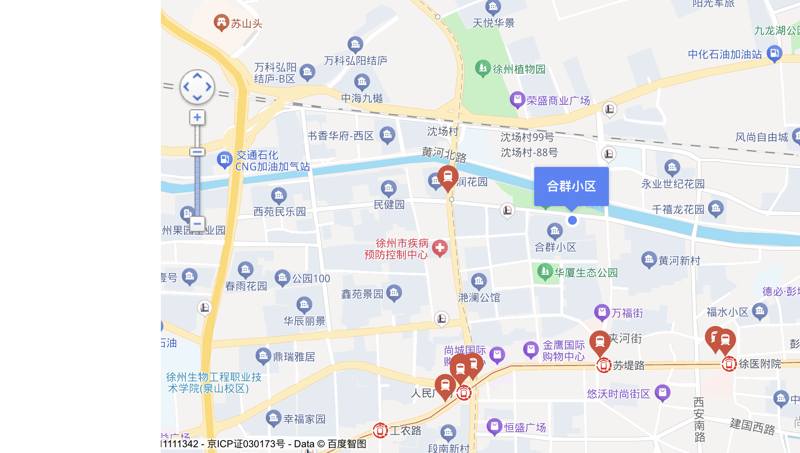
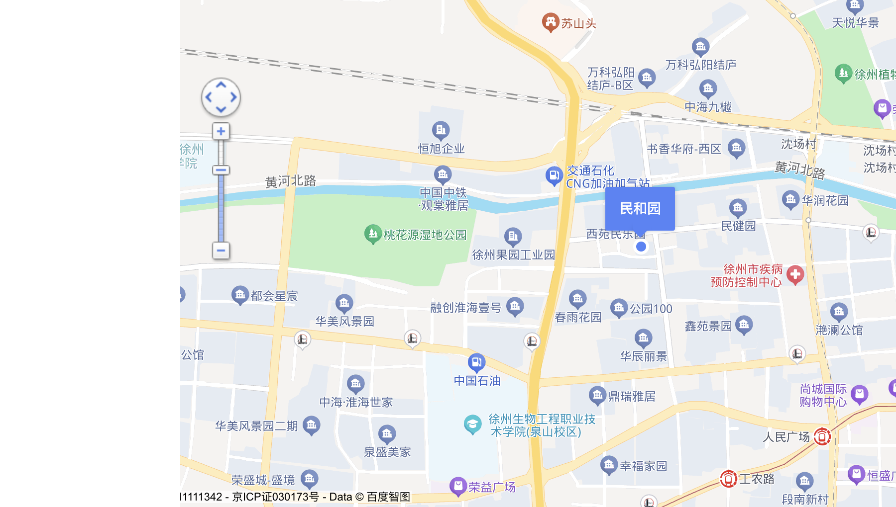

# 房源六维声学工程调查

资料截至：2026-09-27T13:36:32+08:00；快照：`20260927T133632069622+0800`。

[候选住宅首页](../candidate_properties.md) · [规范、参考构造与现场流程](acoustic_reference.md)

下列每条证据关联具体房源或小区参考点。A/B/C/D是证据等级，不是隔音等级。地图C级不证明实际室内噪声。

## 事业小区 · 48.05㎡ / 27万元

[贝壳房源](https://xz.ke.com/ershoufang/103140570454.html)；状态：public_fields_match。

### 已有证据

| 维度 | 等级 | 实际取得的资料及范围 | 获取时间 | 来源 |
| --- | --- | --- | --- | --- |
| 建筑结构 | D | 建筑结构：混合结构；未取得构造或竣工资料 | 2026-09-27T11:39:10+08:00 | [原页](https://xz.ke.com/ershoufang/103140570454.html) |
| 建筑结构 | D | 建筑类型：板楼；未取得构造或竣工资料 | 2026-09-27T11:39:10+08:00 | [原页](https://xz.ke.com/ershoufang/103140570454.html) |
| 建筑结构 | D | 建成年份：2000；不代表楼板/墙体性能 | 2026-09-27T11:39:10+08:00 | [原页](https://xz.ke.com/ershoufang/103140570454.html) |
| 楼栋与户型布局 | D | 分间字段：卧室A / 7.85平米 / 西 / 普通窗 | 2026-09-27T11:39:10+08:00 | [原页](https://xz.ke.com/ershoufang/103140570454.html) |
| 楼栋与户型布局 | D | 分间字段：卧室B / 16.54平米 / 东南 / 普通窗 | 2026-09-27T11:39:10+08:00 | [原页](https://xz.ke.com/ershoufang/103140570454.html) |
| 楼栋与户型布局 | D | 贝壳小区字段房屋总数：1355户；非竣工数据 | 2026-09-27T11:50:34+08:00 | [原页](https://xz.ke.com/xiaoqu/8737127294947215/) |
| 楼栋与户型布局 | D | 贝壳小区字段楼栋总数：25栋；非竣工数据 | 2026-09-27T11:50:34+08:00 | [原页](https://xz.ke.com/xiaoqu/8737127294947215/) |
| 楼栋与户型布局 | D | 贝壳小区字段容积率：1.5；非竣工数据 | 2026-09-27T11:50:34+08:00 | [原页](https://xz.ke.com/xiaoqu/8737127294947215/) |
| 外部噪声环境 | C | 徐州市口腔医院约525米；地图参考点距离，不是卧室距离 | 2026-09-27T11:50:34+08:00 | [原页](https://xz.ke.com/xiaoqu/8737127294947215/) |
| 外部噪声环境 | C | 徐州市建筑工人医院约674米；地图参考点距离，不是卧室距离 | 2026-09-27T11:50:34+08:00 | [原页](https://xz.ke.com/xiaoqu/8737127294947215/) |
| 外部噪声环境 | C | 徐州医科大学附属医院约737米；地图参考点距离，不是卧室距离 | 2026-09-27T11:50:34+08:00 | [原页](https://xz.ke.com/xiaoqu/8737127294947215/) |
| 外部噪声环境 | C | 徐州市星光实验幼儿园约718米；地图参考点距离，不是卧室距离 | 2026-09-27T11:50:34+08:00 | [原页](https://xz.ke.com/xiaoqu/8737127294947215/) |
| 外部噪声环境 | C | 徐州立恩幼儿园约932米；地图参考点距离，不是卧室距离 | 2026-09-27T11:50:34+08:00 | [原页](https://xz.ke.com/xiaoqu/8737127294947215/) |
| 外部噪声环境 | C | 韩铭幼教中心(国华大厦西)约973米；地图参考点距离，不是卧室距离 | 2026-09-27T11:50:34+08:00 | [原页](https://xz.ke.com/xiaoqu/8737127294947215/) |
| 外部噪声环境 | C | 金鹰国际购物中心(彭城广场店)约1330米；地图参考点距离，不是卧室距离 | 2026-09-27T11:50:34+08:00 | [原页](https://xz.ke.com/xiaoqu/8737127294947215/) |
| 外部噪声环境 | C | 金鹰国际购物中心(人民广场店)约1453米；地图参考点距离，不是卧室距离 | 2026-09-27T11:50:34+08:00 | [原页](https://xz.ke.com/xiaoqu/8737127294947215/) |
| 外部噪声环境 | C | 鹏创富景广场约1576米；地图参考点距离，不是卧室距离 | 2026-09-27T11:50:34+08:00 | [原页](https://xz.ke.com/xiaoqu/8737127294947215/) |

### 六维缺口与下一步

| 维度 | 尚未核实 | 获取/验证方法 |
| --- | --- | --- |
| 建筑结构 | 楼板厚度及连接、分户墙构造、侧向传声路径、竣工/改造图纸 | 业主/物业/城建档案核对本楼栋竣工和改造图纸；对应户号与节点 |
| 建筑材料 | 具体材料厚度与层序、浮筑层及声桥、门窗构件检测报告、密封及安装质量 | 索取具体层序、厚度及完整构件检测；现场核查安装、缝隙和声桥 |
| 楼栋与户型布局 | 楼栋定位及卧室朝向与道路关系、共墙数量、上下层厨卫/卧室对应、电梯井邻接 | 取得带方位平面图、楼栋定位及上下层对应，经许可现场核实 |
| 外部噪声环境 | 主干道/铁路/夜市/工地楼栋级调查、昼夜声源工况、实际室内噪声 | 核对具体卧室到声源路径与时段，昼夜访问及关窗代表性测量 |
| 设备与管道 | 电梯/水泵/变压器位置、隔振基础与管道支架、排水立管与卧室共墙、设备运行频谱 | 物业标注设备房/管井，经许可运行各设备，测低频/排水与振动 |
| 现场声学验证 | 规范化空气声与撞击声测量、校准与背景修正、混响及频带数据、夜间卧室和设备测量 | 许可邻户配合；采用有效版本现场标准、校准仪器和完整报告，手机只作观察 |

### 本套结论

- 已确认的有利工程条件：没有A级或B级证明；不得把下列线索当成已验证性能。
- 值得核实的线索：仅有周边、布局和平台字段，尚缺具体有利条件
- 风险/需要排除的路径：未识别不等于不存在，需补声源和房间定位
- 隔音实际验证：未完成。结构材料可靠资料：未取得；普通窗/结构标签不能证明指标。
- 原评分输出：`{'community': '事业小区', 'score': None, 'score_range': [0, 100], 'grade': 'C', 'reason': 'incomplete_evidence', 'dimension_points': {}, 'evidence_coverage_percent': 0, 'failed_gates': [], 'unknown_gates': ['residential_clear_title', 'structurally_safe', 'no_major_road_noise', 'not_above_commercial_street', 'not_overcrowded', 'acceptable_property_management', 'adequate_daylight', 'not_investment_only', 'floor', 'elevator'], 'unknown_dimensions': ['quiet', 'sound', 'density', 'convenience', 'price', 'liquidity'], 'warnings': [], 'calculated_unit_price_yuan': 5619.15, 'purchase_authorized': False, 'interpretation': 'C表示证据不完整，不表示隔音中等；区间不是价格或品质排序'}`。数值分为空，不以0—100区间推荐购买。

### 地理、楼层及现场调查结果

- 地理：{'status': 'inside_reference', 'inside_third_ring': True, 'wgs84_approx': (117.16949137650198, 34.26849616645061), 'distance_to_ring_m_approx': 3415, 'buffer_m': 750, 'scope': '小区参考点初核；不是房源楼栋测绘确认', 'reason': '750米保守待核带包含道路宽度、双向车道差异、坐标转换误差和未取得的小区范围；不是实际误差上限或法律边界'}。三环内字段仅参考点初核，不是本套测绘。
- 楼层：精确楼层未知；平台分段：低楼层 (共7层)；电梯：未知；证据状态：public_platform_claims_not_on_site。
- 当前阻碍：楼层/电梯条件尚未通过；尚缺具体环境/布局复核，不用泛化周边POI凑看房名单；本轮挂牌有效性未刷新
- 分间朝向：卧室A / 7.85平米 / 西 / 普通窗；卧室B / 16.54平米 / 东南 / 普通窗
- 楼栋、每层户数、井道/设备房、楼板/墙体构造：尚未取得对应资料，须现场与档案核实。

### 公开成交样本（排序先匹配面积和室厅数）

记录原采集：2026-09-27T11:50:34+08:00；当前挂牌27万不是成交价。
- [本套公开图片](https://vrlab-image4.ljcdn.com/release/screenshot/auto3d-RCJhVlnynbi-NEvVqBKwDW/023a57b272156f002f324f205b461ade/1744166623_7/pc0_0y5FUSsaq.jpg?imageMogr2/quality/70/thumbnail/1024x)（不能从普通图片推算墙板厚度或分贝）。
- [2026-03-25](https://xz.ke.com/chengjiao/103131482442.html)：41.34㎡ / 17.0万 / 2室1厅 / 中楼层/4层 南；仅面积初步匹配，室厅数不同或缺失；精确楼层/电梯/装修未匹配，不用于合理买价。
- [2026-02-21](https://xz.ke.com/chengjiao/103145274571.html)：59.02㎡ / 17.0万 / 2室1厅 / 中楼层/7层 南；面积不同，不直接可比。
- [2026-05-18](https://xz.ke.com/chengjiao/103148723165.html)：64.49㎡ / 30.0万 / 3室1厅 / 低楼层/7层 南；面积不同，不直接可比。
- 现场：工作日早间与周末晚间，在实际卧室分别开关窗观察道路、商业、学校和医院声音；核对楼栋是否临街及窗户面向。
- 现场：请楼上正常走路、挪椅并使用卫生间，在卧室辨认脚步、冲水和管道声；未经许可不安排干扰性测试。
- 现场：经相邻住户同意，以正常说话和楼道开关门测试墙体、入户门传声；核实共墙数量。
- 现场：电梯上下运行或水泵启动时检查卧室低频声和结构振动；定位电梯井、机房及老旧管道。
- 现场：查验楼板、墙体、门窗及改造资料，不能用房龄、混合结构或装修承诺替代隔音测试。
- 现场：夜间观察出入口、停车、垃圾点和公共空间，核对楼间距、每层户数与电梯实际服务户数。

## 老营盘小区 · 50.33㎡ / 15万元

[贝壳房源](https://xz.ke.com/ershoufang/103144431302.html)；状态：public_fields_match。

### 已有证据

| 维度 | 等级 | 实际取得的资料及范围 | 获取时间 | 来源 |
| --- | --- | --- | --- | --- |
| 建筑结构 | D | 建筑结构：混合结构；未取得构造或竣工资料 | 2026-09-27T11:39:27+08:00 | [原页](https://xz.ke.com/ershoufang/103144431302.html) |
| 建筑结构 | D | 建筑类型：板塔结合；未取得构造或竣工资料 | 2026-09-27T11:39:27+08:00 | [原页](https://xz.ke.com/ershoufang/103144431302.html) |
| 楼栋与户型布局 | D | 贝壳小区字段房屋总数：1275户；非竣工数据 | 2026-09-27T11:50:47+08:00 | [原页](https://xz.ke.com/xiaoqu/8737127271884316/) |
| 楼栋与户型布局 | D | 贝壳小区字段楼栋总数：17栋；非竣工数据 | 2026-09-27T11:50:47+08:00 | [原页](https://xz.ke.com/xiaoqu/8737127271884316/) |
| 楼栋与户型布局 | D | 贝壳小区字段容积率：1.5；非竣工数据 | 2026-09-27T11:50:47+08:00 | [原页](https://xz.ke.com/xiaoqu/8737127271884316/) |
| 外部噪声环境 | C | 徐州九龙医院私密整形约154米；地图参考点距离，不是卧室距离 | 2026-09-27T11:50:47+08:00 | [原页](https://xz.ke.com/xiaoqu/8737127271884316/) |
| 外部噪声环境 | C | 鼓楼区鼓楼社区卫生服务中心约538米；地图参考点距离，不是卧室距离 | 2026-09-27T11:50:47+08:00 | [原页](https://xz.ke.com/xiaoqu/8737127271884316/) |
| 外部噪声环境 | C | 徐州市第三人民医院约628米；地图参考点距离，不是卧室距离 | 2026-09-27T11:50:47+08:00 | [原页](https://xz.ke.com/xiaoqu/8737127271884316/) |
| 外部噪声环境 | C | 慧谷阳光幼儿园约424米；地图参考点距离，不是卧室距离 | 2026-09-27T11:50:47+08:00 | [原页](https://xz.ke.com/xiaoqu/8737127271884316/) |
| 外部噪声环境 | C | 徐州市白云东路幼儿园约859米；地图参考点距离，不是卧室距离 | 2026-09-27T11:50:47+08:00 | [原页](https://xz.ke.com/xiaoqu/8737127271884316/) |
| 外部噪声环境 | C | 鼓楼区实验幼儿园约966米；地图参考点距离，不是卧室距离 | 2026-09-27T11:50:47+08:00 | [原页](https://xz.ke.com/xiaoqu/8737127271884316/) |
| 外部噪声环境 | C | 和信广场(徐州店)约390米；地图参考点距离，不是卧室距离 | 2026-09-27T11:50:47+08:00 | [原页](https://xz.ke.com/xiaoqu/8737127271884316/) |
| 外部噪声环境 | C | 徐州和信广场-B区约421米；地图参考点距离，不是卧室距离 | 2026-09-27T11:50:47+08:00 | [原页](https://xz.ke.com/xiaoqu/8737127271884316/) |
| 外部噪声环境 | C | 福源广场约827米；地图参考点距离，不是卧室距离 | 2026-09-27T11:50:47+08:00 | [原页](https://xz.ke.com/xiaoqu/8737127271884316/) |

### 六维缺口与下一步

| 维度 | 尚未核实 | 获取/验证方法 |
| --- | --- | --- |
| 建筑结构 | 楼板厚度及连接、分户墙构造、侧向传声路径、竣工/改造图纸 | 业主/物业/城建档案核对本楼栋竣工和改造图纸；对应户号与节点 |
| 建筑材料 | 具体材料厚度与层序、浮筑层及声桥、门窗构件检测报告、密封及安装质量 | 索取具体层序、厚度及完整构件检测；现场核查安装、缝隙和声桥 |
| 楼栋与户型布局 | 楼栋定位及卧室朝向与道路关系、共墙数量、上下层厨卫/卧室对应、电梯井邻接 | 取得带方位平面图、楼栋定位及上下层对应，经许可现场核实 |
| 外部噪声环境 | 主干道/铁路/夜市/工地楼栋级调查、昼夜声源工况、实际室内噪声 | 核对具体卧室到声源路径与时段，昼夜访问及关窗代表性测量 |
| 设备与管道 | 电梯/水泵/变压器位置、隔振基础与管道支架、排水立管与卧室共墙、设备运行频谱 | 物业标注设备房/管井，经许可运行各设备，测低频/排水与振动 |
| 现场声学验证 | 规范化空气声与撞击声测量、校准与背景修正、混响及频带数据、夜间卧室和设备测量 | 许可邻户配合；采用有效版本现场标准、校准仪器和完整报告，手机只作观察 |

### 本套结论

- 已确认的有利工程条件：没有A级或B级证明；不得把下列线索当成已验证性能。
- 值得核实的线索：仅有周边、布局和平台字段，尚缺具体有利条件
- 风险/需要排除的路径：未识别不等于不存在，需补声源和房间定位
- 隔音实际验证：未完成。结构材料可靠资料：未取得；普通窗/结构标签不能证明指标。
- 原评分输出：`{'community': '老营盘小区', 'score': None, 'score_range': [0, 100], 'grade': 'C', 'reason': 'incomplete_evidence', 'dimension_points': {}, 'evidence_coverage_percent': 0, 'failed_gates': [], 'unknown_gates': ['residential_clear_title', 'structurally_safe', 'no_major_road_noise', 'not_above_commercial_street', 'not_overcrowded', 'acceptable_property_management', 'adequate_daylight', 'not_investment_only', 'floor', 'elevator'], 'unknown_dimensions': ['quiet', 'sound', 'density', 'convenience', 'price', 'liquidity'], 'warnings': [], 'calculated_unit_price_yuan': 2980.33, 'purchase_authorized': False, 'interpretation': 'C表示证据不完整，不表示隔音中等；区间不是价格或品质排序'}`。数值分为空，不以0—100区间推荐购买。

### 地理、楼层及现场调查结果

- 地理：{'status': 'inside_reference', 'inside_third_ring': True, 'wgs84_approx': (117.19354878392426, 34.269755432555236), 'distance_to_ring_m_approx': 2278, 'buffer_m': 750, 'scope': '小区参考点初核；不是房源楼栋测绘确认', 'reason': '750米保守待核带包含道路宽度、双向车道差异、坐标转换误差和未取得的小区范围；不是实际误差上限或法律边界'}。三环内字段仅参考点初核，不是本套测绘。
- 楼层：精确楼层未知；平台分段：高楼层 (共7层)；电梯：未知；证据状态：public_platform_claims_not_on_site。
- 当前阻碍：楼层/电梯条件尚未通过；尚缺具体环境/布局复核，不用泛化周边POI凑看房名单；本轮挂牌有效性未刷新
- 分间朝向：未知
- 楼栋、每层户数、井道/设备房、楼板/墙体构造：尚未取得对应资料，须现场与档案核实。

### 公开成交样本（排序先匹配面积和室厅数）

记录原采集：2026-09-27T11:50:47+08:00；当前挂牌15万不是成交价。
- [本套公开图片](https://vrlab-image4.ljcdn.com/release/screenshot/auto3d-light-5KrO2okwyvW2oake/069acf83d13dadf49114815009e5e165/1760949619_3/pc0_hqJoBxSWq.jpg?imageMogr2/quality/70/thumbnail/1024x)（不能从普通图片推算墙板厚度或分贝）。
- [2026-03-25](https://xz.ke.com/chengjiao/103145970399.html)：49.74㎡ / 19.0万 / 2室1厅 / 中楼层/7层 南；面积及室厅数初步匹配；精确楼层/电梯/装修未匹配，不用于合理买价。
- [2026-03-24](https://xz.ke.com/chengjiao/103149211865.html)：59.1㎡ / 14.2万 / 2室1厅 / 高楼层/6层 南；面积及室厅数初步匹配；精确楼层/电梯/装修未匹配，不用于合理买价。
- [2026-04-11](https://xz.ke.com/chengjiao/103146209935.html)：43.84㎡ / 16.8万 / 1室1厅 / 中楼层/4层 东 西；仅面积初步匹配，室厅数不同或缺失；精确楼层/电梯/装修未匹配，不用于合理买价。
- 现场：工作日早间与周末晚间，在实际卧室分别开关窗观察道路、商业、学校和医院声音；核对楼栋是否临街及窗户面向。
- 现场：请楼上正常走路、挪椅并使用卫生间，在卧室辨认脚步、冲水和管道声；未经许可不安排干扰性测试。
- 现场：经相邻住户同意，以正常说话和楼道开关门测试墙体、入户门传声；核实共墙数量。
- 现场：电梯上下运行或水泵启动时检查卧室低频声和结构振动；定位电梯井、机房及老旧管道。
- 现场：查验楼板、墙体、门窗及改造资料，不能用房龄、混合结构或装修承诺替代隔音测试。
- 现场：夜间观察出入口、停车、垃圾点和公共空间，核对楼间距、每层户数与电梯实际服务户数。

## 建国东路125号综合楼 · 51.72㎡ / 26万元

[贝壳房源](https://xz.ke.com/ershoufang/103154195887.html)；状态：public_fields_match。

### 已有证据

| 维度 | 等级 | 实际取得的资料及范围 | 获取时间 | 来源 |
| --- | --- | --- | --- | --- |
| 建筑结构 | D | 建筑结构：混合结构；未取得构造或竣工资料 | 2026-09-27T11:39:47+08:00 | [原页](https://xz.ke.com/ershoufang/103154195887.html) |
| 建筑结构 | D | 建筑类型：板塔结合；未取得构造或竣工资料 | 2026-09-27T11:39:47+08:00 | [原页](https://xz.ke.com/ershoufang/103154195887.html) |
| 楼栋与户型布局 | D | 分间字段：卧室 / 14.19平米 / 南 / 普通窗 | 2026-09-27T11:39:47+08:00 | [原页](https://xz.ke.com/ershoufang/103154195887.html) |
| 楼栋与户型布局 | D | 贝壳小区字段房屋总数：56户；非竣工数据 | 2026-09-27T11:50:58+08:00 | [原页](https://xz.ke.com/xiaoqu/87370000000080/) |
| 楼栋与户型布局 | D | 贝壳小区字段楼栋总数：1栋；非竣工数据 | 2026-09-27T11:50:58+08:00 | [原页](https://xz.ke.com/xiaoqu/87370000000080/) |
| 楼栋与户型布局 | D | 贝壳小区字段容积率：2；非竣工数据 | 2026-09-27T11:50:58+08:00 | [原页](https://xz.ke.com/xiaoqu/87370000000080/) |
| 外部噪声环境 | C | 徐州市第九人民医院约867米；地图参考点距离，不是卧室距离 | 2026-09-27T11:50:58+08:00 | [原页](https://xz.ke.com/xiaoqu/87370000000080/) |
| 外部噪声环境 | C | 云龙区云龙社区卫生服务中心约940米；地图参考点距离，不是卧室距离 | 2026-09-27T11:50:58+08:00 | [原页](https://xz.ke.com/xiaoqu/87370000000080/) |
| 外部噪声环境 | C | 江苏省社区医院约949米；地图参考点距离，不是卧室距离 | 2026-09-27T11:50:58+08:00 | [原页](https://xz.ke.com/xiaoqu/87370000000080/) |
| 外部噪声环境 | C | 机关一幼约410米；地图参考点距离，不是卧室距离 | 2026-09-27T11:50:58+08:00 | [原页](https://xz.ke.com/xiaoqu/87370000000080/) |
| 外部噪声环境 | C | 江苏徐州公园巷幼儿园约461米；地图参考点距离，不是卧室距离 | 2026-09-27T11:50:58+08:00 | [原页](https://xz.ke.com/xiaoqu/87370000000080/) |
| 外部噪声环境 | C | 徐州市云龙区教育实验幼儿园约525米；地图参考点距离，不是卧室距离 | 2026-09-27T11:50:58+08:00 | [原页](https://xz.ke.com/xiaoqu/87370000000080/) |
| 外部噪声环境 | C | 戏马台时尚广场约883米；地图参考点距离，不是卧室距离 | 2026-09-27T11:50:58+08:00 | [原页](https://xz.ke.com/xiaoqu/87370000000080/) |
| 外部噪声环境 | C | 南郊彩云里约1148米；地图参考点距离，不是卧室距离 | 2026-09-27T11:50:58+08:00 | [原页](https://xz.ke.com/xiaoqu/87370000000080/) |
| 外部噪声环境 | C | 徐州蓝天百货约1171米；地图参考点距离，不是卧室距离 | 2026-09-27T11:50:58+08:00 | [原页](https://xz.ke.com/xiaoqu/87370000000080/) |

### 六维缺口与下一步

| 维度 | 尚未核实 | 获取/验证方法 |
| --- | --- | --- |
| 建筑结构 | 楼板厚度及连接、分户墙构造、侧向传声路径、竣工/改造图纸 | 业主/物业/城建档案核对本楼栋竣工和改造图纸；对应户号与节点 |
| 建筑材料 | 具体材料厚度与层序、浮筑层及声桥、门窗构件检测报告、密封及安装质量 | 索取具体层序、厚度及完整构件检测；现场核查安装、缝隙和声桥 |
| 楼栋与户型布局 | 楼栋定位及卧室朝向与道路关系、共墙数量、上下层厨卫/卧室对应、电梯井邻接 | 取得带方位平面图、楼栋定位及上下层对应，经许可现场核实 |
| 外部噪声环境 | 主干道/铁路/夜市/工地楼栋级调查、昼夜声源工况、实际室内噪声 | 核对具体卧室到声源路径与时段，昼夜访问及关窗代表性测量 |
| 设备与管道 | 电梯/水泵/变压器位置、隔振基础与管道支架、排水立管与卧室共墙、设备运行频谱 | 物业标注设备房/管井，经许可运行各设备，测低频/排水与振动 |
| 现场声学验证 | 规范化空气声与撞击声测量、校准与背景修正、混响及频带数据、夜间卧室和设备测量 | 许可邻户配合；采用有效版本现场标准、校准仪器和完整报告，手机只作观察 |

### 本套结论

- 已确认的有利工程条件：没有A级或B级证明；不得把下列线索当成已验证性能。
- 值得核实的线索：仅有周边、布局和平台字段，尚缺具体有利条件
- 风险/需要排除的路径：未识别不等于不存在，需补声源和房间定位
- 隔音实际验证：未完成。结构材料可靠资料：未取得；普通窗/结构标签不能证明指标。
- 原评分输出：`{'community': '建国东路125号综合楼', 'score': None, 'score_range': [0, 100], 'grade': 'C', 'reason': 'incomplete_evidence', 'dimension_points': {}, 'evidence_coverage_percent': 0, 'failed_gates': [], 'unknown_gates': ['residential_clear_title', 'structurally_safe', 'no_major_road_noise', 'not_above_commercial_street', 'not_overcrowded', 'acceptable_property_management', 'adequate_daylight', 'not_investment_only', 'floor', 'elevator'], 'unknown_dimensions': ['quiet', 'sound', 'density', 'convenience', 'price', 'liquidity'], 'warnings': [], 'calculated_unit_price_yuan': 5027.07, 'purchase_authorized': False, 'interpretation': 'C表示证据不完整，不表示隔音中等；区间不是价格或品质排序'}`。数值分为空，不以0—100区间推荐购买。

### 地理、楼层及现场调查结果

- 地理：{'status': 'inside_reference', 'inside_third_ring': True, 'wgs84_approx': (117.19263188741027, 34.25940472401111), 'distance_to_ring_m_approx': 2568, 'buffer_m': 750, 'scope': '小区参考点初核；不是房源楼栋测绘确认', 'reason': '750米保守待核带包含道路宽度、双向车道差异、坐标转换误差和未取得的小区范围；不是实际误差上限或法律边界'}。三环内字段仅参考点初核，不是本套测绘。
- 楼层：精确楼层未知；平台分段：高楼层 (共7层)；电梯：未知；证据状态：public_platform_claims_not_on_site。
- 当前阻碍：楼层/电梯条件尚未通过；尚缺具体环境/布局复核，不用泛化周边POI凑看房名单；本轮挂牌有效性未刷新
- 分间朝向：卧室 / 14.19平米 / 南 / 普通窗
- 楼栋、每层户数、井道/设备房、楼板/墙体构造：尚未取得对应资料，须现场与档案核实。

### 公开成交样本（排序先匹配面积和室厅数）

记录原采集：2026-09-27T11:50:58+08:00；当前挂牌26万不是成交价。
- [本套公开图片](https://vrlab-image4.ljcdn.com/release/screenshot/auto3d-light-05NoZE10gaJZe1On/9f0dc47ede90a9bf48dd510357bb10fd/1790046499_7/pc0_Snzyxym9n.jpg?imageMogr2/quality/70/thumbnail/1024x)（不能从普通图片推算墙板厚度或分贝）。
- 现场：工作日早间与周末晚间，在实际卧室分别开关窗观察道路、商业、学校和医院声音；核对楼栋是否临街及窗户面向。
- 现场：请楼上正常走路、挪椅并使用卫生间，在卧室辨认脚步、冲水和管道声；未经许可不安排干扰性测试。
- 现场：经相邻住户同意，以正常说话和楼道开关门测试墙体、入户门传声；核实共墙数量。
- 现场：电梯上下运行或水泵启动时检查卧室低频声和结构振动；定位电梯井、机房及老旧管道。
- 现场：查验楼板、墙体、门窗及改造资料，不能用房龄、混合结构或装修承诺替代隔音测试。
- 现场：夜间观察出入口、停车、垃圾点和公共空间，核对楼间距、每层户数与电梯实际服务户数。

## 铁路29宿舍 · 52.9㎡ / 15.8万元

[贝壳房源](https://xz.ke.com/ershoufang/103154128969.html)；状态：public_fields_match。

### 已有证据

| 维度 | 等级 | 实际取得的资料及范围 | 获取时间 | 来源 |
| --- | --- | --- | --- | --- |
| 建筑结构 | D | 建筑结构：未知结构；未取得构造或竣工资料 | 2026-09-27T11:40:05+08:00 | [原页](https://xz.ke.com/ershoufang/103154128969.html) |
| 建筑结构 | D | 建筑类型：暂无数据；未取得构造或竣工资料 | 2026-09-27T11:40:05+08:00 | [原页](https://xz.ke.com/ershoufang/103154128969.html) |
| 楼栋与户型布局 | D | 分间字段：卧室A / 8.76平米 / 南 / 普通窗 | 2026-09-27T11:40:05+08:00 | [原页](https://xz.ke.com/ershoufang/103154128969.html) |
| 楼栋与户型布局 | D | 分间字段：卧室B / 12.52平米 / 南 / 普通窗 | 2026-09-27T11:40:05+08:00 | [原页](https://xz.ke.com/ershoufang/103154128969.html) |
| 楼栋与户型布局 | D | 贝壳小区字段房屋总数：1356户；非竣工数据 | 2026-09-27T11:51:10+08:00 | [原页](https://xz.ke.com/xiaoqu/8737131964103967/) |
| 楼栋与户型布局 | D | 贝壳小区字段楼栋总数：36栋；非竣工数据 | 2026-09-27T11:51:10+08:00 | [原页](https://xz.ke.com/xiaoqu/8737131964103967/) |
| 外部噪声环境 | C | 鼓楼区丰财社区卫生服务站约1209米；地图参考点距离，不是卧室距离 | 2026-09-27T11:51:10+08:00 | [原页](https://xz.ke.com/xiaoqu/8737131964103967/) |
| 外部噪声环境 | C | 徐州京阜心血管医院约1237米；地图参考点距离，不是卧室距离 | 2026-09-27T11:51:10+08:00 | [原页](https://xz.ke.com/xiaoqu/8737131964103967/) |
| 外部噪声环境 | C | 鼓楼区丰财街道怡园亭社区卫生服务站约1249米；地图参考点距离，不是卧室距离 | 2026-09-27T11:51:10+08:00 | [原页](https://xz.ke.com/xiaoqu/8737131964103967/) |
| 外部噪声环境 | C | 徐州市下淀中心幼儿园约144米；地图参考点距离，不是卧室距离 | 2026-09-27T11:51:10+08:00 | [原页](https://xz.ke.com/xiaoqu/8737131964103967/) |
| 外部噪声环境 | C | 江苏省优质幼儿园约832米；地图参考点距离，不是卧室距离 | 2026-09-27T11:51:10+08:00 | [原页](https://xz.ke.com/xiaoqu/8737131964103967/) |
| 外部噪声环境 | C | 香槟城幼儿园约1284米；地图参考点距离，不是卧室距离 | 2026-09-27T11:51:10+08:00 | [原页](https://xz.ke.com/xiaoqu/8737131964103967/) |
| 外部噪声环境 | C | 徐州美的悦然里约1701米；地图参考点距离，不是卧室距离 | 2026-09-27T11:51:10+08:00 | [原页](https://xz.ke.com/xiaoqu/8737131964103967/) |
| 楼栋与户型布局 | D | 核心卖点：近市区，生活交通便利，步梯房公摊小区，总价低集中供暖 | 2026-09-27T11:40:05+08:00 | [原页](https://xz.ke.com/ershoufang/103154128969.html) |

### 六维缺口与下一步

| 维度 | 尚未核实 | 获取/验证方法 |
| --- | --- | --- |
| 建筑结构 | 楼板厚度及连接、分户墙构造、侧向传声路径、竣工/改造图纸 | 业主/物业/城建档案核对本楼栋竣工和改造图纸；对应户号与节点 |
| 建筑材料 | 具体材料厚度与层序、浮筑层及声桥、门窗构件检测报告、密封及安装质量 | 索取具体层序、厚度及完整构件检测；现场核查安装、缝隙和声桥 |
| 楼栋与户型布局 | 楼栋定位及卧室朝向与道路关系、共墙数量、上下层厨卫/卧室对应、电梯井邻接 | 取得带方位平面图、楼栋定位及上下层对应，经许可现场核实 |
| 外部噪声环境 | 主干道/铁路/夜市/工地楼栋级调查、昼夜声源工况、实际室内噪声 | 核对具体卧室到声源路径与时段，昼夜访问及关窗代表性测量 |
| 设备与管道 | 电梯/水泵/变压器位置、隔振基础与管道支架、排水立管与卧室共墙、设备运行频谱 | 物业标注设备房/管井，经许可运行各设备，测低频/排水与振动 |
| 现场声学验证 | 规范化空气声与撞击声测量、校准与背景修正、混响及频带数据、夜间卧室和设备测量 | 许可邻户配合；采用有效版本现场标准、校准仪器和完整报告，手机只作观察 |

### 本套结论

- 已确认的有利工程条件：没有A级或B级证明；不得把下列线索当成已验证性能。
- 值得核实的线索：仅有周边、布局和平台字段，尚缺具体有利条件
- 风险/需要排除的路径：徐州市下淀中心幼儿园地图参考点约144米：先核查操场/接送口与本套窗户关系；未确认广播、遮挡或实际噪声
- 隔音实际验证：未完成。结构材料可靠资料：未取得；普通窗/结构标签不能证明指标。
- 原评分输出：`{'community': '铁路29宿舍', 'score': None, 'score_range': [0, 100], 'grade': 'C', 'reason': 'incomplete_evidence', 'dimension_points': {}, 'evidence_coverage_percent': 0, 'failed_gates': [], 'unknown_gates': ['residential_clear_title', 'structurally_safe', 'no_major_road_noise', 'not_above_commercial_street', 'not_overcrowded', 'acceptable_property_management', 'adequate_daylight', 'not_investment_only', 'floor'], 'unknown_dimensions': ['quiet', 'sound', 'density', 'convenience', 'price', 'liquidity'], 'warnings': [], 'calculated_unit_price_yuan': 2986.77, 'purchase_authorized': False, 'interpretation': 'C表示证据不完整，不表示隔音中等；区间不是价格或品质排序'}`。数值分为空，不以0—100区间推荐购买。

### 地理、楼层及现场调查结果

- 地理：{'status': 'inside_reference', 'inside_third_ring': True, 'wgs84_approx': (117.21301049001863, 34.29289762711223), 'distance_to_ring_m_approx': 1755, 'buffer_m': 750, 'scope': '小区参考点初核；不是房源楼栋测绘确认', 'reason': '750米保守待核带包含道路宽度、双向车道差异、坐标转换误差和未取得的小区范围；不是实际误差上限或法律边界'}。三环内字段仅参考点初核，不是本套测绘。
- 楼层：精确楼层未知；平台分段：中楼层 (共6层)；电梯：无（公开声明）；证据状态：public_platform_claims_not_on_site。
- 当前阻碍：楼层/电梯条件尚未通过；尚缺具体环境/布局复核，不用泛化周边POI凑看房名单；本轮挂牌有效性未刷新
- 分间朝向：卧室A / 8.76平米 / 南 / 普通窗；卧室B / 12.52平米 / 南 / 普通窗
- 楼栋、每层户数、井道/设备房、楼板/墙体构造：尚未取得对应资料，须现场与档案核实。

### 公开成交样本（排序先匹配面积和室厅数）

记录原采集：2026-09-27T11:51:10+08:00；当前挂牌15.8万不是成交价。
- [本套公开图片](https://vrlab-image4.ljcdn.com/release/screenshot/auto3d-light-9Jpa2apX17nZDxoN/7c8a04ead69f5b7a72364422632922b6/1770169557_8/pc0_7KTmON88X.jpg?imageMogr2/quality/70/thumbnail/1024x)（不能从普通图片推算墙板厚度或分贝）。
- [2026-05-25](https://xz.ke.com/chengjiao/103150269616.html)：52.7㎡ / 11.0万 / 2室1厅 / 高楼层/6层 南；面积及室厅数初步匹配；精确楼层/电梯/装修未匹配，不用于合理买价。
- [2026-06-26](https://xz.ke.com/chengjiao/103147130807.html)：52.7㎡ / 20.0万 / 2室1厅 / 低楼层/6层 南 北；面积及室厅数初步匹配；精确楼层/电梯/装修未匹配，不用于合理买价。
- [2026-07-14](https://xz.ke.com/chengjiao/103150493058.html)：52.7㎡ / 7.6万 / 2室1厅 / 高楼层/6层 南；面积及室厅数初步匹配；精确楼层/电梯/装修未匹配，不用于合理买价。
- 现场：工作日早间与周末晚间，在实际卧室分别开关窗观察道路、商业、学校和医院声音；核对楼栋是否临街及窗户面向。
- 现场：请楼上正常走路、挪椅并使用卫生间，在卧室辨认脚步、冲水和管道声；未经许可不安排干扰性测试。
- 现场：经相邻住户同意，以正常说话和楼道开关门测试墙体、入户门传声；核实共墙数量。
- 现场：电梯上下运行或水泵启动时检查卧室低频声和结构振动；定位电梯井、机房及老旧管道。
- 现场：查验楼板、墙体、门窗及改造资料，不能用房龄、混合结构或装修承诺替代隔音测试。
- 现场：夜间观察出入口、停车、垃圾点和公共空间，核对楼间距、每层户数与电梯实际服务户数。

## 庞庄小区 · 54.22㎡ / 10万元

[贝壳房源](https://xz.ke.com/ershoufang/103148487949.html)；状态：public_fields_match。

### 已有证据

| 维度 | 等级 | 实际取得的资料及范围 | 获取时间 | 来源 |
| --- | --- | --- | --- | --- |
| 建筑结构 | D | 建筑结构：混合结构；未取得构造或竣工资料 | 2026-09-27T11:40:27+08:00 | [原页](https://xz.ke.com/ershoufang/103148487949.html) |
| 建筑结构 | D | 建筑类型：暂无数据；未取得构造或竣工资料 | 2026-09-27T11:40:27+08:00 | [原页](https://xz.ke.com/ershoufang/103148487949.html) |
| 楼栋与户型布局 | D | 贝壳小区字段房屋总数：586户；非竣工数据 | 2026-09-27T11:51:22+08:00 | [原页](https://xz.ke.com/xiaoqu/8737131265410521/) |
| 楼栋与户型布局 | D | 贝壳小区字段楼栋总数：12栋；非竣工数据 | 2026-09-27T11:51:22+08:00 | [原页](https://xz.ke.com/xiaoqu/8737131265410521/) |
| 外部噪声环境 | C | 国基贝儿幼儿园约373米；地图参考点距离，不是卧室距离 | 2026-09-27T11:51:22+08:00 | [原页](https://xz.ke.com/xiaoqu/8737131265410521/) |
| 外部噪声环境 | C | 徐州市明诚中心幼儿园约582米；地图参考点距离，不是卧室距离 | 2026-09-27T11:51:22+08:00 | [原页](https://xz.ke.com/xiaoqu/8737131265410521/) |
| 外部噪声环境 | C | 李庄双语幼儿园(环镇南路)约822米；地图参考点距离，不是卧室距离 | 2026-09-27T11:51:22+08:00 | [原页](https://xz.ke.com/xiaoqu/8737131265410521/) |

### 六维缺口与下一步

| 维度 | 尚未核实 | 获取/验证方法 |
| --- | --- | --- |
| 建筑结构 | 楼板厚度及连接、分户墙构造、侧向传声路径、竣工/改造图纸 | 业主/物业/城建档案核对本楼栋竣工和改造图纸；对应户号与节点 |
| 建筑材料 | 具体材料厚度与层序、浮筑层及声桥、门窗构件检测报告、密封及安装质量 | 索取具体层序、厚度及完整构件检测；现场核查安装、缝隙和声桥 |
| 楼栋与户型布局 | 楼栋定位及卧室朝向与道路关系、共墙数量、上下层厨卫/卧室对应、电梯井邻接 | 取得带方位平面图、楼栋定位及上下层对应，经许可现场核实 |
| 外部噪声环境 | 主干道/铁路/夜市/工地楼栋级调查、昼夜声源工况、实际室内噪声 | 核对具体卧室到声源路径与时段，昼夜访问及关窗代表性测量 |
| 设备与管道 | 电梯/水泵/变压器位置、隔振基础与管道支架、排水立管与卧室共墙、设备运行频谱 | 物业标注设备房/管井，经许可运行各设备，测低频/排水与振动 |
| 现场声学验证 | 规范化空气声与撞击声测量、校准与背景修正、混响及频带数据、夜间卧室和设备测量 | 许可邻户配合；采用有效版本现场标准、校准仪器和完整报告，手机只作观察 |

### 本套结论

- 已确认的有利工程条件：没有A级或B级证明；不得把下列线索当成已验证性能。
- 值得核实的线索：仅有周边、布局和平台字段，尚缺具体有利条件
- 风险/需要排除的路径：公开描述1楼：核查入口、停车及楼道开关门，楼上撞击声路径仍存在
- 隔音实际验证：未完成。结构材料可靠资料：未取得；普通窗/结构标签不能证明指标。
- 原评分输出：`{'community': '庞庄小区', 'score': None, 'score_range': [0, 100], 'grade': 'D', 'reason': 'hard_gate_failed', 'dimension_points': {}, 'evidence_coverage_percent': 0, 'failed_gates': ['inside_third_ring'], 'unknown_gates': ['residential_clear_title', 'structurally_safe', 'no_major_road_noise', 'not_above_commercial_street', 'not_overcrowded', 'acceptable_property_management', 'adequate_daylight', 'not_investment_only', 'elevator'], 'unknown_dimensions': ['quiet', 'sound', 'density', 'convenience', 'price', 'liquidity'], 'warnings': [], 'calculated_unit_price_yuan': 1844.34, 'purchase_authorized': False, 'interpretation': 'C表示证据不完整，不表示隔音中等；区间不是价格或品质排序'}`。数值分为空，不以0—100区间推荐购买。

### 地理、楼层及现场调查结果

- 地理：{'status': 'outside_reference', 'inside_third_ring': False, 'wgs84_approx': (117.10448055825, 34.351790159655515), 'distance_to_ring_m_approx': 4612, 'buffer_m': 750, 'scope': '小区参考点初核；不是房源楼栋测绘确认', 'reason': '750米保守待核带包含道路宽度、双向车道差异、坐标转换误差和未取得的小区范围；不是实际误差上限或法律边界'}。三环内字段仅参考点初核，不是本套测绘。
- 楼层：1楼（公开描述；非现场核验）；电梯：未知；证据状态：public_platform_claims_not_on_site。
- 当前阻碍：三环内位置尚未通过：outside_reference；尚缺具体环境/布局复核，不用泛化周边POI凑看房名单；本轮挂牌有效性未刷新
- 分间朝向：未知
- 楼栋、每层户数、井道/设备房、楼板/墙体构造：尚未取得对应资料，须现场与档案核实。

### 公开成交样本（排序先匹配面积和室厅数）

记录原采集：2026-09-27T11:51:22+08:00；当前挂牌10万不是成交价。
- [本套公开图片](https://ke-image.ljcdn.com/110000-inspection/6148cb03b2e3bcf66c9727204b63c11c-051.jpg!m_fill,w_710,h_400,lg_north_west,lx_0,ly_0,l_fbk,f_jpg,ls_50?from=ke.com)（不能从普通图片推算墙板厚度或分贝）。
- [2026-01-23](https://xz.ke.com/chengjiao/103147441232.html)：56.14㎡ / 5.8万 / 2室1厅 / 高楼层/5层 南；面积及室厅数初步匹配；精确楼层/电梯/装修未匹配，不用于合理买价。
- [2026-07-14](https://xz.ke.com/chengjiao/103150337636.html)：56.14㎡ / 7.4万 / 2室1厅 / 中楼层/5层 南；面积及室厅数初步匹配；精确楼层/电梯/装修未匹配，不用于合理买价。
- [2026-01-23](https://xz.ke.com/chengjiao/103145438199.html)：55.88㎡ / 5.8万 / 2室2厅 / 高楼层/5层 南；仅面积初步匹配，室厅数不同或缺失；精确楼层/电梯/装修未匹配，不用于合理买价。
- 现场：工作日早间与周末晚间，在实际卧室分别开关窗观察道路、商业、学校和医院声音；核对楼栋是否临街及窗户面向。
- 现场：请楼上正常走路、挪椅并使用卫生间，在卧室辨认脚步、冲水和管道声；未经许可不安排干扰性测试。
- 现场：经相邻住户同意，以正常说话和楼道开关门测试墙体、入户门传声；核实共墙数量。
- 现场：电梯上下运行或水泵启动时检查卧室低频声和结构振动；定位电梯井、机房及老旧管道。
- 现场：查验楼板、墙体、门窗及改造资料，不能用房龄、混合结构或装修承诺替代隔音测试。
- 现场：夜间观察出入口、停车、垃圾点和公共空间，核对楼间距、每层户数与电梯实际服务户数。

## 合群小区 · 47.34㎡ / 29.0万元

[贝壳房源](https://xz.ke.com/ershoufang/103152473801.html)；状态：public_fields_match。

### 已有证据

| 维度 | 等级 | 实际取得的资料及范围 | 获取时间 | 来源 |
| --- | --- | --- | --- | --- |
| 建筑结构 | D | 建筑结构：混合结构；未取得构造或竣工资料 | 2026-09-27T13:32:46+08:00 | [原页](https://xz.ke.com/ershoufang/103152473801.html) |
| 建筑结构 | D | 建筑类型：板楼；未取得构造或竣工资料 | 2026-09-27T13:32:46+08:00 | [原页](https://xz.ke.com/ershoufang/103152473801.html) |
| 建筑结构 | D | 建成年份：1997；不代表楼板/墙体性能 | 2026-09-27T13:32:46+08:00 | [原页](https://xz.ke.com/ershoufang/103152473801.html) |
| 楼栋与户型布局 | D | 分间字段：卧室A / 7.86平米 / 北 / 普通窗 | 2026-09-27T13:32:46+08:00 | [原页](https://xz.ke.com/ershoufang/103152473801.html) |
| 楼栋与户型布局 | D | 分间字段：卧室B / 13.2平米 / 南 / 普通窗 | 2026-09-27T13:32:46+08:00 | [原页](https://xz.ke.com/ershoufang/103152473801.html) |
| 楼栋与户型布局 | D | 贝壳小区字段房屋总数：2900户；非竣工数据 | 2026-09-27T11:51:34+08:00 | [原页](https://xz.ke.com/xiaoqu/8737127295996555/) |
| 楼栋与户型布局 | D | 贝壳小区字段楼栋总数：55栋；非竣工数据 | 2026-09-27T11:51:34+08:00 | [原页](https://xz.ke.com/xiaoqu/8737127295996555/) |
| 楼栋与户型布局 | D | 贝壳小区字段容积率：1.2；非竣工数据 | 2026-09-27T11:51:34+08:00 | [原页](https://xz.ke.com/xiaoqu/8737127295996555/) |
| 外部噪声环境 | C | 徐州市儿童医院(东院)约880米；地图参考点距离，不是卧室距离 | 2026-09-27T11:51:34+08:00 | [原页](https://xz.ke.com/xiaoqu/8737127295996555/) |
| 外部噪声环境 | C | 徐州市儿童医院约888米；地图参考点距离，不是卧室距离 | 2026-09-27T11:51:34+08:00 | [原页](https://xz.ke.com/xiaoqu/8737127295996555/) |
| 外部噪声环境 | C | 徐州市儿童医院-西院约907米；地图参考点距离，不是卧室距离 | 2026-09-27T11:51:34+08:00 | [原页](https://xz.ke.com/xiaoqu/8737127295996555/) |
| 外部噪声环境 | C | 徐州幼儿师范高等专科学校附属幼儿园(玖玺园区)约504米；地图参考点距离，不是卧室距离 | 2026-09-27T11:51:34+08:00 | [原页](https://xz.ke.com/xiaoqu/8737127295996555/) |
| 外部噪声环境 | C | 徐州市兴华路幼儿园约950米；地图参考点距离，不是卧室距离 | 2026-09-27T11:51:34+08:00 | [原页](https://xz.ke.com/xiaoqu/8737127295996555/) |
| 外部噪声环境 | C | 阳光峰景幼儿园约1510米；地图参考点距离，不是卧室距离 | 2026-09-27T11:51:34+08:00 | [原页](https://xz.ke.com/xiaoqu/8737127295996555/) |
| 外部噪声环境 | C | 金鹰国际购物中心(人民广场店)约1184米；地图参考点距离，不是卧室距离 | 2026-09-27T11:51:34+08:00 | [原页](https://xz.ke.com/xiaoqu/8737127295996555/) |
| 外部噪声环境 | C | 荣盛商业广场约1245米；地图参考点距离，不是卧室距离 | 2026-09-27T11:51:34+08:00 | [原页](https://xz.ke.com/xiaoqu/8737127295996555/) |
| 外部噪声环境 | C | 尚城国际购物中心(泉山店)约1356米；地图参考点距离，不是卧室距离 | 2026-09-27T11:51:34+08:00 | [原页](https://xz.ke.com/xiaoqu/8737127295996555/) |
| 外部噪声环境 | C | 2026-09-27贝壳公开百度地图复核：合群参考点南侧标有华厦生态公园、北侧为河道；更北侧出现铁路绘图符号。未取得比例尺、线路类型、楼栋或声源距离，不能据此认定公园安静或铁路有噪声。 | 2026-09-27 | [原页](https://xz.ke.com/xiaoqu/8737127295996555/) |
| 楼栋与户型布局 | D | 核心卖点：2楼 1室朝阳 边户精装修房东诚心卖价格好谈 | 2026-09-27T13:32:46+08:00 | [原页](https://xz.ke.com/ershoufang/103152473801.html) |

### 六维缺口与下一步

| 维度 | 尚未核实 | 获取/验证方法 |
| --- | --- | --- |
| 建筑结构 | 楼板厚度及连接、分户墙构造、侧向传声路径、竣工/改造图纸 | 业主/物业/城建档案核对本楼栋竣工和改造图纸；对应户号与节点 |
| 建筑材料 | 具体材料厚度与层序、浮筑层及声桥、门窗构件检测报告、密封及安装质量 | 索取具体层序、厚度及完整构件检测；现场核查安装、缝隙和声桥 |
| 楼栋与户型布局 | 楼栋定位及卧室朝向与道路关系、共墙数量、上下层厨卫/卧室对应、电梯井邻接 | 取得带方位平面图、楼栋定位及上下层对应，经许可现场核实 |
| 外部噪声环境 | 主干道/铁路/夜市/工地楼栋级调查、昼夜声源工况、实际室内噪声 | 核对具体卧室到声源路径与时段，昼夜访问及关窗代表性测量 |
| 设备与管道 | 电梯/水泵/变压器位置、隔振基础与管道支架、排水立管与卧室共墙、设备运行频谱 | 物业标注设备房/管井，经许可运行各设备，测低频/排水与振动 |
| 现场声学验证 | 规范化空气声与撞击声测量、校准与背景修正、混响及频带数据、夜间卧室和设备测量 | 许可邻户配合；采用有效版本现场标准、校准仪器和完整报告，手机只作观察 |

### 本套结论

- 已确认的有利工程条件：没有A级或B级证明；不得把下列线索当成已验证性能。
- 值得核实的线索：描述称边户：可核查是否减少邻户共墙；未取得完整户型/连接资料
- 风险/需要排除的路径：南北卧室可选择不代表有一间安静；苏堤北路与本套窗户关系、共墙及楼上脚步仍未排除。
- 隔音实际验证：未完成。结构材料可靠资料：未取得；普通窗/结构标签不能证明指标。
- 原评分输出：`{'community': '合群小区', 'score': None, 'score_range': [0, 100], 'grade': 'C', 'reason': 'incomplete_evidence', 'dimension_points': {}, 'evidence_coverage_percent': 0, 'failed_gates': [], 'unknown_gates': ['residential_clear_title', 'structurally_safe', 'no_major_road_noise', 'not_above_commercial_street', 'not_overcrowded', 'acceptable_property_management', 'adequate_daylight', 'not_investment_only', 'elevator'], 'unknown_dimensions': ['quiet', 'sound', 'density', 'convenience', 'price', 'liquidity'], 'warnings': [], 'calculated_unit_price_yuan': 6125.9, 'purchase_authorized': False, 'interpretation': 'C表示证据不完整，不表示隔音中等；区间不是价格或品质排序'}`。数值分为空，不以0—100区间推荐购买。

### 地理、楼层及现场调查结果

- 地理：{'status': 'inside_reference', 'inside_third_ring': True, 'wgs84_approx': (117.16041390380063, 34.2738867583359), 'distance_to_ring_m_approx': 2521, 'buffer_m': 750, 'scope': '小区参考点初核；不是房源楼栋测绘确认', 'reason': '750米保守待核带包含道路宽度、双向车道差异、坐标转换误差和未取得的小区范围；不是实际误差上限或法律边界'}。三环内字段仅参考点初核，不是本套测绘。
- 楼层：2楼（公开描述；非现场核验）；电梯：未知；证据状态：public_platform_claims_not_on_site。
- 当前阻碍：可安排取证型看房；实际隔音、产权与安全仍未核验
- 分间朝向：卧室A / 7.86平米 / 北 / 普通窗；卧室B / 13.2平米 / 南 / 普通窗
- 楼栋、每层户数、井道/设备房、楼板/墙体构造：尚未取得对应资料，须现场与档案核实。

### 公开成交样本（排序先匹配面积和室厅数）

记录原采集：2026-09-27T11:51:34+08:00；当前挂牌29.0万不是成交价。
- [本套公开图片](https://vrlab-image4.ljcdn.com/release/screenshot/auto3d-light-0OB8VPGW4jzMYAzJ/7d59f6b6473122c8e1c5405c82cb9b75/1784334484_7/pc0_5g2lgpweB.jpg?imageMogr2/quality/70/thumbnail/1024x)（不能从普通图片推算墙板厚度或分贝）。
- [2026-07-21](https://xz.ke.com/chengjiao/103151047914.html)：48.28㎡ / 32.5万 / 2室0厅 / 低楼层/5层 南；仅面积初步匹配，室厅数不同或缺失；精确楼层/电梯/装修未匹配，不用于合理买价。
- [2026-07-27](https://xz.ke.com/chengjiao/103150401587.html)：31.0㎡ / 13.2万 / 1室0厅 / 中楼层/5层 南；面积不同，不直接可比。
- [2026-07-24](https://xz.ke.com/chengjiao/103134099567.html)：66.39㎡ / 26.8万 / 3室1厅 / 中楼层/5层 南；面积不同，不直接可比。

- 现场：工作日早间与周末晚间，在实际卧室分别开关窗观察道路、商业、学校和医院声音；核对楼栋是否临街及窗户面向。
- 现场：请楼上正常走路、挪椅并使用卫生间，在卧室辨认脚步、冲水和管道声；未经许可不安排干扰性测试。
- 现场：经相邻住户同意，以正常说话和楼道开关门测试墙体、入户门传声；核实共墙数量。
- 现场：电梯上下运行或水泵启动时检查卧室低频声和结构振动；定位电梯井、机房及老旧管道。
- 现场：查验楼板、墙体、门窗及改造资料，不能用房龄、混合结构或装修承诺替代隔音测试。
- 现场：夜间观察出入口、停车、垃圾点和公共空间，核对楼间距、每层户数与电梯实际服务户数。

## 东阁小区南区 · 52.73㎡ / 29.8万元

[贝壳房源](https://xz.ke.com/ershoufang/103135065699.html)；状态：public_fields_match。

### 已有证据

| 维度 | 等级 | 实际取得的资料及范围 | 获取时间 | 来源 |
| --- | --- | --- | --- | --- |
| 建筑结构 | D | 建筑结构：混合结构；未取得构造或竣工资料 | 2026-09-27T11:41:04+08:00 | [原页](https://xz.ke.com/ershoufang/103135065699.html) |
| 建筑结构 | D | 建筑类型：板楼；未取得构造或竣工资料 | 2026-09-27T11:41:04+08:00 | [原页](https://xz.ke.com/ershoufang/103135065699.html) |
| 楼栋与户型布局 | D | 分间字段：卧室A / 7.91平米 / 北 / 普通窗 | 2026-09-27T11:41:04+08:00 | [原页](https://xz.ke.com/ershoufang/103135065699.html) |
| 楼栋与户型布局 | D | 分间字段：卧室B / 11.3平米 / 南 / 普通窗 | 2026-09-27T11:41:04+08:00 | [原页](https://xz.ke.com/ershoufang/103135065699.html) |
| 楼栋与户型布局 | D | 贝壳小区字段房屋总数：822户；非竣工数据 | 2026-09-27T11:51:46+08:00 | [原页](https://xz.ke.com/xiaoqu/8737127245596469/) |
| 楼栋与户型布局 | D | 贝壳小区字段楼栋总数：14栋；非竣工数据 | 2026-09-27T11:51:46+08:00 | [原页](https://xz.ke.com/xiaoqu/8737127245596469/) |
| 楼栋与户型布局 | D | 贝壳小区字段容积率：8；非竣工数据 | 2026-09-27T11:51:46+08:00 | [原页](https://xz.ke.com/xiaoqu/8737127245596469/) |
| 外部噪声环境 | C | 徐州市第三人民医院约184米；地图参考点距离，不是卧室距离 | 2026-09-27T11:51:46+08:00 | [原页](https://xz.ke.com/xiaoqu/8737127245596469/) |
| 外部噪声环境 | C | 鼓楼区鼓楼社区卫生服务中心约524米；地图参考点距离，不是卧室距离 | 2026-09-27T11:51:46+08:00 | [原页](https://xz.ke.com/xiaoqu/8737127245596469/) |
| 外部噪声环境 | C | 徐州九龙医院私密整形约583米；地图参考点距离，不是卧室距离 | 2026-09-27T11:51:46+08:00 | [原页](https://xz.ke.com/xiaoqu/8737127245596469/) |
| 外部噪声环境 | C | 鼓楼区实验幼儿园约452米；地图参考点距离，不是卧室距离 | 2026-09-27T11:51:46+08:00 | [原页](https://xz.ke.com/xiaoqu/8737127245596469/) |
| 外部噪声环境 | C | 慧谷阳光幼儿园约490米；地图参考点距离，不是卧室距离 | 2026-09-27T11:51:46+08:00 | [原页](https://xz.ke.com/xiaoqu/8737127245596469/) |
| 外部噪声环境 | C | 徐州市白云东路幼儿园约852米；地图参考点距离，不是卧室距离 | 2026-09-27T11:51:46+08:00 | [原页](https://xz.ke.com/xiaoqu/8737127245596469/) |
| 外部噪声环境 | C | 福源广场约318米；地图参考点距离，不是卧室距离 | 2026-09-27T11:51:46+08:00 | [原页](https://xz.ke.com/xiaoqu/8737127245596469/) |
| 外部噪声环境 | C | 徐州和信广场-B区约818米；地图参考点距离，不是卧室距离 | 2026-09-27T11:51:46+08:00 | [原页](https://xz.ke.com/xiaoqu/8737127245596469/) |
| 外部噪声环境 | C | 和信广场(徐州店)约845米；地图参考点距离，不是卧室距离 | 2026-09-27T11:51:46+08:00 | [原页](https://xz.ke.com/xiaoqu/8737127245596469/) |

### 六维缺口与下一步

| 维度 | 尚未核实 | 获取/验证方法 |
| --- | --- | --- |
| 建筑结构 | 楼板厚度及连接、分户墙构造、侧向传声路径、竣工/改造图纸 | 业主/物业/城建档案核对本楼栋竣工和改造图纸；对应户号与节点 |
| 建筑材料 | 具体材料厚度与层序、浮筑层及声桥、门窗构件检测报告、密封及安装质量 | 索取具体层序、厚度及完整构件检测；现场核查安装、缝隙和声桥 |
| 楼栋与户型布局 | 楼栋定位及卧室朝向与道路关系、共墙数量、上下层厨卫/卧室对应、电梯井邻接 | 取得带方位平面图、楼栋定位及上下层对应，经许可现场核实 |
| 外部噪声环境 | 主干道/铁路/夜市/工地楼栋级调查、昼夜声源工况、实际室内噪声 | 核对具体卧室到声源路径与时段，昼夜访问及关窗代表性测量 |
| 设备与管道 | 电梯/水泵/变压器位置、隔振基础与管道支架、排水立管与卧室共墙、设备运行频谱 | 物业标注设备房/管井，经许可运行各设备，测低频/排水与振动 |
| 现场声学验证 | 规范化空气声与撞击声测量、校准与背景修正、混响及频带数据、夜间卧室和设备测量 | 许可邻户配合；采用有效版本现场标准、校准仪器和完整报告，手机只作观察 |

### 本套结论

- 已确认的有利工程条件：没有A级或B级证明；不得把下列线索当成已验证性能。
- 值得核实的线索：仅有周边、布局和平台字段，尚缺具体有利条件
- 风险/需要排除的路径：未识别不等于不存在，需补声源和房间定位
- 隔音实际验证：未完成。结构材料可靠资料：未取得；普通窗/结构标签不能证明指标。
- 原评分输出：`{'community': '东阁小区南区', 'score': None, 'score_range': [0, 100], 'grade': 'C', 'reason': 'incomplete_evidence', 'dimension_points': {}, 'evidence_coverage_percent': 0, 'failed_gates': [], 'unknown_gates': ['residential_clear_title', 'structurally_safe', 'no_major_road_noise', 'not_above_commercial_street', 'not_overcrowded', 'acceptable_property_management', 'adequate_daylight', 'not_investment_only', 'elevator'], 'unknown_dimensions': ['quiet', 'sound', 'density', 'convenience', 'price', 'liquidity'], 'warnings': [], 'calculated_unit_price_yuan': 5651.43, 'purchase_authorized': False, 'interpretation': 'C表示证据不完整，不表示隔音中等；区间不是价格或品质排序'}`。数值分为空，不以0—100区间推荐购买。

### 地理、楼层及现场调查结果

- 地理：{'status': 'inside_reference', 'inside_third_ring': True, 'wgs84_approx': (117.19038364439604, 34.27260825478305), 'distance_to_ring_m_approx': 2571, 'buffer_m': 750, 'scope': '小区参考点初核；不是房源楼栋测绘确认', 'reason': '750米保守待核带包含道路宽度、双向车道差异、坐标转换误差和未取得的小区范围；不是实际误差上限或法律边界'}。三环内字段仅参考点初核，不是本套测绘。
- 楼层：2楼（公开描述；非现场核验）；电梯：未知；证据状态：public_platform_claims_not_on_site。
- 当前阻碍：尚缺具体环境/布局复核，不用泛化周边POI凑看房名单；本轮挂牌有效性未刷新
- 分间朝向：卧室A / 7.91平米 / 北 / 普通窗；卧室B / 11.3平米 / 南 / 普通窗
- 楼栋、每层户数、井道/设备房、楼板/墙体构造：尚未取得对应资料，须现场与档案核实。

### 公开成交样本（排序先匹配面积和室厅数）

记录原采集：2026-09-27T11:51:46+08:00；当前挂牌29.8万不是成交价。
- [本套公开图片](https://vrlab-image4.ljcdn.com/release/screenshot/auto3d--EBup7qfj2QJtvCmkRNTJl/a1a85c2832c0017287d20665e5470034/1723001525_3/pc0_WGMV9J3uB.jpg?imageMogr2/quality/70/thumbnail/1024x)（不能从普通图片推算墙板厚度或分贝）。
- [2026-04-17](https://xz.ke.com/chengjiao/103150086125.html)：42.3㎡ / 17.8万 / 1室1厅 / 中楼层/7层 南；仅面积初步匹配，室厅数不同或缺失；精确楼层/电梯/装修未匹配，不用于合理买价。
- [2026-06-16](https://xz.ke.com/chengjiao/103150203128.html)：94.03㎡ / 32.5万 / 2室2厅 / 中楼层/7层 北 南；面积不同，不直接可比。
- [2026-05-30](https://xz.ke.com/chengjiao/103149046285.html)：102.15㎡ / 48.5万 / 3室2厅 / 中楼层/7层 南 北；面积不同，不直接可比。
- 现场：工作日早间与周末晚间，在实际卧室分别开关窗观察道路、商业、学校和医院声音；核对楼栋是否临街及窗户面向。
- 现场：请楼上正常走路、挪椅并使用卫生间，在卧室辨认脚步、冲水和管道声；未经许可不安排干扰性测试。
- 现场：经相邻住户同意，以正常说话和楼道开关门测试墙体、入户门传声；核实共墙数量。
- 现场：电梯上下运行或水泵启动时检查卧室低频声和结构振动；定位电梯井、机房及老旧管道。
- 现场：查验楼板、墙体、门窗及改造资料，不能用房龄、混合结构或装修承诺替代隔音测试。
- 现场：夜间观察出入口、停车、垃圾点和公共空间，核对楼间距、每层户数与电梯实际服务户数。

## 广山西路小区 · 54.54㎡ / 24.8万元

[贝壳房源](https://xz.ke.com/ershoufang/103152788547.html)；状态：public_fields_match。

### 已有证据

| 维度 | 等级 | 实际取得的资料及范围 | 获取时间 | 来源 |
| --- | --- | --- | --- | --- |
| 建筑结构 | D | 建筑结构：混合结构；未取得构造或竣工资料 | 2026-09-27T11:41:22+08:00 | [原页](https://xz.ke.com/ershoufang/103152788547.html) |
| 建筑结构 | D | 建筑类型：暂无数据；未取得构造或竣工资料 | 2026-09-27T11:41:22+08:00 | [原页](https://xz.ke.com/ershoufang/103152788547.html) |
| 楼栋与户型布局 | D | 分间字段：卧室A / 14.79平米 / 南 / 普通窗 | 2026-09-27T11:41:22+08:00 | [原页](https://xz.ke.com/ershoufang/103152788547.html) |
| 楼栋与户型布局 | D | 分间字段：卧室B / 13.39平米 / 南 / 普通窗 | 2026-09-27T11:41:22+08:00 | [原页](https://xz.ke.com/ershoufang/103152788547.html) |
| 楼栋与户型布局 | D | 贝壳小区字段房屋总数：570户；非竣工数据 | 2026-09-27T11:51:58+08:00 | [原页](https://xz.ke.com/xiaoqu/8737135924147234/) |
| 楼栋与户型布局 | D | 贝壳小区字段楼栋总数：21栋；非竣工数据 | 2026-09-27T11:51:58+08:00 | [原页](https://xz.ke.com/xiaoqu/8737135924147234/) |
| 楼栋与户型布局 | D | 贝壳小区字段容积率：1.4；非竣工数据 | 2026-09-27T11:51:58+08:00 | [原页](https://xz.ke.com/xiaoqu/8737135924147234/) |
| 外部噪声环境 | C | 陆军第七十一集团军医院约378米；地图参考点距离，不是卧室距离 | 2026-09-27T11:51:58+08:00 | [原页](https://xz.ke.com/xiaoqu/8737135924147234/) |
| 外部噪声环境 | C | 云龙区子房街道铁刹社区卫生服务站约498米；地图参考点距离，不是卧室距离 | 2026-09-27T11:51:58+08:00 | [原页](https://xz.ke.com/xiaoqu/8737135924147234/) |
| 外部噪声环境 | C | 白云山社区卫生服务站约1183米；地图参考点距离，不是卧室距离 | 2026-09-27T11:51:58+08:00 | [原页](https://xz.ke.com/xiaoqu/8737135924147234/) |
| 外部噪声环境 | C | 徐州市重型幼儿园约430米；地图参考点距离，不是卧室距离 | 2026-09-27T11:51:58+08:00 | [原页](https://xz.ke.com/xiaoqu/8737135924147234/) |
| 外部噪声环境 | C | 鸿雁幼儿园约925米；地图参考点距离，不是卧室距离 | 2026-09-27T11:51:58+08:00 | [原页](https://xz.ke.com/xiaoqu/8737135924147234/) |
| 外部噪声环境 | C | 锦绣滨湖幼儿园约1512米；地图参考点距离，不是卧室距离 | 2026-09-27T11:51:58+08:00 | [原页](https://xz.ke.com/xiaoqu/8737135924147234/) |
| 外部噪声环境 | C | 徐州蓝天百货约1440米；地图参考点距离，不是卧室距离 | 2026-09-27T11:51:58+08:00 | [原页](https://xz.ke.com/xiaoqu/8737135924147234/) |
| 外部噪声环境 | C | 和信广场(徐州店)约1784米；地图参考点距离，不是卧室距离 | 2026-09-27T11:51:58+08:00 | [原页](https://xz.ke.com/xiaoqu/8737135924147234/) |
| 外部噪声环境 | C | 徐州和信广场-B区约1787米；地图参考点距离，不是卧室距离 | 2026-09-27T11:51:58+08:00 | [原页](https://xz.ke.com/xiaoqu/8737135924147234/) |

### 六维缺口与下一步

| 维度 | 尚未核实 | 获取/验证方法 |
| --- | --- | --- |
| 建筑结构 | 楼板厚度及连接、分户墙构造、侧向传声路径、竣工/改造图纸 | 业主/物业/城建档案核对本楼栋竣工和改造图纸；对应户号与节点 |
| 建筑材料 | 具体材料厚度与层序、浮筑层及声桥、门窗构件检测报告、密封及安装质量 | 索取具体层序、厚度及完整构件检测；现场核查安装、缝隙和声桥 |
| 楼栋与户型布局 | 楼栋定位及卧室朝向与道路关系、共墙数量、上下层厨卫/卧室对应、电梯井邻接 | 取得带方位平面图、楼栋定位及上下层对应，经许可现场核实 |
| 外部噪声环境 | 主干道/铁路/夜市/工地楼栋级调查、昼夜声源工况、实际室内噪声 | 核对具体卧室到声源路径与时段，昼夜访问及关窗代表性测量 |
| 设备与管道 | 电梯/水泵/变压器位置、隔振基础与管道支架、排水立管与卧室共墙、设备运行频谱 | 物业标注设备房/管井，经许可运行各设备，测低频/排水与振动 |
| 现场声学验证 | 规范化空气声与撞击声测量、校准与背景修正、混响及频带数据、夜间卧室和设备测量 | 许可邻户配合；采用有效版本现场标准、校准仪器和完整报告，手机只作观察 |

### 本套结论

- 已确认的有利工程条件：没有A级或B级证明；不得把下列线索当成已验证性能。
- 值得核实的线索：仅有周边、布局和平台字段，尚缺具体有利条件
- 风险/需要排除的路径：未识别不等于不存在，需补声源和房间定位
- 隔音实际验证：未完成。结构材料可靠资料：未取得；普通窗/结构标签不能证明指标。
- 原评分输出：`{'community': '广山西路小区', 'score': None, 'score_range': [0, 100], 'grade': 'C', 'reason': 'incomplete_evidence', 'dimension_points': {}, 'evidence_coverage_percent': 0, 'failed_gates': [], 'unknown_gates': ['inside_third_ring', 'residential_clear_title', 'structurally_safe', 'no_major_road_noise', 'not_above_commercial_street', 'not_overcrowded', 'acceptable_property_management', 'adequate_daylight', 'not_investment_only', 'elevator'], 'unknown_dimensions': ['quiet', 'sound', 'density', 'convenience', 'price', 'liquidity'], 'warnings': [], 'calculated_unit_price_yuan': 4547.12, 'purchase_authorized': False, 'interpretation': 'C表示证据不完整，不表示隔音中等；区间不是价格或品质排序'}`。数值分为空，不以0—100区间推荐购买。

### 地理、楼层及现场调查结果

- 地理：{'status': 'near_boundary', 'inside_third_ring': None, 'wgs84_approx': (117.21289731642096, 34.266662466154166), 'distance_to_ring_m_approx': 551, 'buffer_m': 750, 'scope': '小区参考点初核；不是房源楼栋测绘确认', 'reason': '750米保守待核带包含道路宽度、双向车道差异、坐标转换误差和未取得的小区范围；不是实际误差上限或法律边界'}。三环内字段仅参考点初核，不是本套测绘。
- 楼层：2楼（公开描述；非现场核验）；电梯：未知；证据状态：public_platform_claims_not_on_site。
- 当前阻碍：三环内位置尚未通过：near_boundary；尚缺具体环境/布局复核，不用泛化周边POI凑看房名单；本轮挂牌有效性未刷新
- 分间朝向：卧室A / 14.79平米 / 南 / 普通窗；卧室B / 13.39平米 / 南 / 普通窗
- 楼栋、每层户数、井道/设备房、楼板/墙体构造：尚未取得对应资料，须现场与档案核实。

### 公开成交样本（排序先匹配面积和室厅数）

记录原采集：2026-09-27T11:51:58+08:00；当前挂牌24.8万不是成交价。
- [本套公开图片](https://vrlab-image4.ljcdn.com/release/screenshot/auto3d-light-d3vP2RRPvkA2QlYg/7cc819b0b2274f7c317dfc3c665444eb/1785288830_4/pc0_0Jcs6ch22.jpg?imageMogr2/quality/70/thumbnail/1024x)（不能从普通图片推算墙板厚度或分贝）。
- [2025-08-12](https://xz.ke.com/chengjiao/103142374244.html)：58.57㎡ / 29.8万 / 2室1厅 / 低楼层/5层 东；面积及室厅数初步匹配；精确楼层/电梯/装修未匹配，不用于合理买价。
- [2026-06-17](https://xz.ke.com/chengjiao/103149567122.html)：58.72㎡ / 15.5万 / 2室1厅 / 中楼层/5层 南 北；面积及室厅数初步匹配；精确楼层/电梯/装修未匹配，不用于合理买价。
- [2026-05-09](https://xz.ke.com/chengjiao/103147044197.html)：46.27㎡ / 11.5万 / 2室0厅 / 低楼层/7层 东 西；仅面积初步匹配，室厅数不同或缺失；精确楼层/电梯/装修未匹配，不用于合理买价。
- 现场：工作日早间与周末晚间，在实际卧室分别开关窗观察道路、商业、学校和医院声音；核对楼栋是否临街及窗户面向。
- 现场：请楼上正常走路、挪椅并使用卫生间，在卧室辨认脚步、冲水和管道声；未经许可不安排干扰性测试。
- 现场：经相邻住户同意，以正常说话和楼道开关门测试墙体、入户门传声；核实共墙数量。
- 现场：电梯上下运行或水泵启动时检查卧室低频声和结构振动；定位电梯井、机房及老旧管道。
- 现场：查验楼板、墙体、门窗及改造资料，不能用房龄、混合结构或装修承诺替代隔音测试。
- 现场：夜间观察出入口、停车、垃圾点和公共空间，核对楼间距、每层户数与电梯实际服务户数。

## 铁路18宿舍 · 55.69㎡ / 21.5万元

[贝壳房源](https://xz.ke.com/ershoufang/103150156290.html)；状态：public_fields_match。

### 已有证据

| 维度 | 等级 | 实际取得的资料及范围 | 获取时间 | 来源 |
| --- | --- | --- | --- | --- |
| 建筑结构 | D | 建筑结构：混合结构；未取得构造或竣工资料 | 2026-09-27T11:41:43+08:00 | [原页](https://xz.ke.com/ershoufang/103150156290.html) |
| 建筑结构 | D | 建筑类型：板楼；未取得构造或竣工资料 | 2026-09-27T11:41:43+08:00 | [原页](https://xz.ke.com/ershoufang/103150156290.html) |
| 楼栋与户型布局 | D | 分间字段：卧室A / 7.51平米 / 北 / 普通窗 | 2026-09-27T11:41:43+08:00 | [原页](https://xz.ke.com/ershoufang/103150156290.html) |
| 楼栋与户型布局 | D | 分间字段：卧室B / 13.14平米 / 南 / 普通窗 | 2026-09-27T11:41:43+08:00 | [原页](https://xz.ke.com/ershoufang/103150156290.html) |
| 楼栋与户型布局 | D | 贝壳小区字段房屋总数：1206户；非竣工数据 | 2026-09-27T11:52:10+08:00 | [原页](https://xz.ke.com/xiaoqu/8737130761953151/) |
| 楼栋与户型布局 | D | 贝壳小区字段楼栋总数：22栋；非竣工数据 | 2026-09-27T11:52:10+08:00 | [原页](https://xz.ke.com/xiaoqu/8737130761953151/) |
| 楼栋与户型布局 | D | 贝壳小区字段容积率：1.4；非竣工数据 | 2026-09-27T11:52:10+08:00 | [原页](https://xz.ke.com/xiaoqu/8737130761953151/) |
| 外部噪声环境 | C | 瑞博医院约684米；地图参考点距离，不是卧室距离 | 2026-09-27T11:52:10+08:00 | [原页](https://xz.ke.com/xiaoqu/8737130761953151/) |
| 外部噪声环境 | C | 徐州惠仁中医医院约1111米；地图参考点距离，不是卧室距离 | 2026-09-27T11:52:10+08:00 | [原页](https://xz.ke.com/xiaoqu/8737130761953151/) |
| 外部噪声环境 | C | 鼓楼区丰财街道怡园亭社区卫生服务站约1146米；地图参考点距离，不是卧室距离 | 2026-09-27T11:52:10+08:00 | [原页](https://xz.ke.com/xiaoqu/8737130761953151/) |
| 外部噪声环境 | C | 九龙皇家幼儿园约575米；地图参考点距离，不是卧室距离 | 2026-09-27T11:52:10+08:00 | [原页](https://xz.ke.com/xiaoqu/8737130761953151/) |
| 外部噪声环境 | C | 徐州市下淀中心幼儿园约593米；地图参考点距离，不是卧室距离 | 2026-09-27T11:52:10+08:00 | [原页](https://xz.ke.com/xiaoqu/8737130761953151/) |
| 外部噪声环境 | C | 香槟城幼儿园约1047米；地图参考点距离，不是卧室距离 | 2026-09-27T11:52:10+08:00 | [原页](https://xz.ke.com/xiaoqu/8737130761953151/) |
| 楼栋与户型布局 | D | 核心卖点：近市区，生活交通便利，步梯房公摊小区，总价低 | 2026-09-27T11:41:43+08:00 | [原页](https://xz.ke.com/ershoufang/103150156290.html) |

### 六维缺口与下一步

| 维度 | 尚未核实 | 获取/验证方法 |
| --- | --- | --- |
| 建筑结构 | 楼板厚度及连接、分户墙构造、侧向传声路径、竣工/改造图纸 | 业主/物业/城建档案核对本楼栋竣工和改造图纸；对应户号与节点 |
| 建筑材料 | 具体材料厚度与层序、浮筑层及声桥、门窗构件检测报告、密封及安装质量 | 索取具体层序、厚度及完整构件检测；现场核查安装、缝隙和声桥 |
| 楼栋与户型布局 | 楼栋定位及卧室朝向与道路关系、共墙数量、上下层厨卫/卧室对应、电梯井邻接 | 取得带方位平面图、楼栋定位及上下层对应，经许可现场核实 |
| 外部噪声环境 | 主干道/铁路/夜市/工地楼栋级调查、昼夜声源工况、实际室内噪声 | 核对具体卧室到声源路径与时段，昼夜访问及关窗代表性测量 |
| 设备与管道 | 电梯/水泵/变压器位置、隔振基础与管道支架、排水立管与卧室共墙、设备运行频谱 | 物业标注设备房/管井，经许可运行各设备，测低频/排水与振动 |
| 现场声学验证 | 规范化空气声与撞击声测量、校准与背景修正、混响及频带数据、夜间卧室和设备测量 | 许可邻户配合；采用有效版本现场标准、校准仪器和完整报告，手机只作观察 |

### 本套结论

- 已确认的有利工程条件：没有A级或B级证明；不得把下列线索当成已验证性能。
- 值得核实的线索：仅有周边、布局和平台字段，尚缺具体有利条件
- 风险/需要排除的路径：未识别不等于不存在，需补声源和房间定位
- 隔音实际验证：未完成。结构材料可靠资料：未取得；普通窗/结构标签不能证明指标。
- 原评分输出：`{'community': '铁路18宿舍', 'score': None, 'score_range': [0, 100], 'grade': 'C', 'reason': 'incomplete_evidence', 'dimension_points': {}, 'evidence_coverage_percent': 0, 'failed_gates': [], 'unknown_gates': ['residential_clear_title', 'structurally_safe', 'no_major_road_noise', 'not_above_commercial_street', 'not_overcrowded', 'acceptable_property_management', 'adequate_daylight', 'not_investment_only', 'floor'], 'unknown_dimensions': ['quiet', 'sound', 'density', 'convenience', 'price', 'liquidity'], 'warnings': [], 'calculated_unit_price_yuan': 3860.66, 'purchase_authorized': False, 'interpretation': 'C表示证据不完整，不表示隔音中等；区间不是价格或品质排序'}`。数值分为空，不以0—100区间推荐购买。

### 地理、楼层及现场调查结果

- 地理：{'status': 'inside_reference', 'inside_third_ring': True, 'wgs84_approx': (117.21160924669934, 34.28756797433029), 'distance_to_ring_m_approx': 1516, 'buffer_m': 750, 'scope': '小区参考点初核；不是房源楼栋测绘确认', 'reason': '750米保守待核带包含道路宽度、双向车道差异、坐标转换误差和未取得的小区范围；不是实际误差上限或法律边界'}。三环内字段仅参考点初核，不是本套测绘。
- 楼层：精确楼层未知；平台分段：低楼层 (共6层)；电梯：无（公开声明）；证据状态：public_platform_claims_not_on_site。
- 当前阻碍：楼层/电梯条件尚未通过；尚缺具体环境/布局复核，不用泛化周边POI凑看房名单；本轮挂牌有效性未刷新
- 分间朝向：卧室A / 7.51平米 / 北 / 普通窗；卧室B / 13.14平米 / 南 / 普通窗
- 楼栋、每层户数、井道/设备房、楼板/墙体构造：尚未取得对应资料，须现场与档案核实。

### 公开成交样本（排序先匹配面积和室厅数）

记录原采集：2026-09-27T11:52:10+08:00；当前挂牌21.5万不是成交价。
- [本套公开图片](https://vrlab-image4.ljcdn.com/release/screenshot/auto3d-light-qOxl24EPr7pMnX19/b68e82b76f3e77225b3a243407b6cbc5/1776565424_0/pc0_QrSodnTPm.jpg?imageMogr2/quality/70/thumbnail/1024x)（不能从普通图片推算墙板厚度或分贝）。
- [2026-07-06](https://xz.ke.com/chengjiao/103151875939.html)：54.92㎡ / 16.8万 / 2室1厅 / 低楼层/7层 南；面积及室厅数初步匹配；精确楼层/电梯/装修未匹配，不用于合理买价。
- [2026-08-12](https://xz.ke.com/chengjiao/103149399797.html)：49.88㎡ / 13.5万 / 2室1厅 / 中楼层/6层 南；面积及室厅数初步匹配；精确楼层/电梯/装修未匹配，不用于合理买价。
- [2026-07-15](https://xz.ke.com/chengjiao/103150520845.html)：75.45㎡ / 9.6万 / 2室1厅 / 高楼层/7层 南 北；面积不同，不直接可比。
- 现场：工作日早间与周末晚间，在实际卧室分别开关窗观察道路、商业、学校和医院声音；核对楼栋是否临街及窗户面向。
- 现场：请楼上正常走路、挪椅并使用卫生间，在卧室辨认脚步、冲水和管道声；未经许可不安排干扰性测试。
- 现场：经相邻住户同意，以正常说话和楼道开关门测试墙体、入户门传声；核实共墙数量。
- 现场：电梯上下运行或水泵启动时检查卧室低频声和结构振动；定位电梯井、机房及老旧管道。
- 现场：查验楼板、墙体、门窗及改造资料，不能用房龄、混合结构或装修承诺替代隔音测试。
- 现场：夜间观察出入口、停车、垃圾点和公共空间，核对楼间距、每层户数与电梯实际服务户数。

## 财富湾 · 52.66㎡ / 24.6万元

[贝壳房源](https://xz.ke.com/ershoufang/103154116354.html)；状态：public_fields_match。

### 已有证据

| 维度 | 等级 | 实际取得的资料及范围 | 获取时间 | 来源 |
| --- | --- | --- | --- | --- |
| 建筑结构 | D | 建筑结构：钢混结构；未取得构造或竣工资料 | 2026-09-27T11:42:02+08:00 | [原页](https://xz.ke.com/ershoufang/103154116354.html) |
| 建筑结构 | D | 建筑类型：板塔结合；未取得构造或竣工资料 | 2026-09-27T11:42:02+08:00 | [原页](https://xz.ke.com/ershoufang/103154116354.html) |
| 建筑结构 | D | 建成年份：2012；不代表楼板/墙体性能 | 2026-09-27T11:42:02+08:00 | [原页](https://xz.ke.com/ershoufang/103154116354.html) |
| 楼栋与户型布局 | D | 分间字段：卧室 / 15.27平米 / 南 / 普通窗 | 2026-09-27T11:42:02+08:00 | [原页](https://xz.ke.com/ershoufang/103154116354.html) |
| 楼栋与户型布局 | D | 梯户比例：两梯十四户 | 2026-09-27T11:42:02+08:00 | [原页](https://xz.ke.com/ershoufang/103154116354.html) |
| 楼栋与户型布局 | D | 贝壳小区字段房屋总数：936户；非竣工数据 | 2026-09-27T11:52:22+08:00 | [原页](https://xz.ke.com/xiaoqu/8737127656915372/) |
| 楼栋与户型布局 | D | 贝壳小区字段楼栋总数：6栋；非竣工数据 | 2026-09-27T11:52:22+08:00 | [原页](https://xz.ke.com/xiaoqu/8737127656915372/) |
| 楼栋与户型布局 | D | 贝壳小区字段容积率：2.99；非竣工数据 | 2026-09-27T11:52:22+08:00 | [原页](https://xz.ke.com/xiaoqu/8737127656915372/) |
| 外部噪声环境 | C | 铜山区铜山街道南洋国际社区卫生服务站约441米；地图参考点距离，不是卧室距离 | 2026-09-27T11:52:22+08:00 | [原页](https://xz.ke.com/xiaoqu/8737127656915372/) |
| 外部噪声环境 | C | 万泰社区卫生服务站约892米；地图参考点距离，不是卧室距离 | 2026-09-27T11:52:22+08:00 | [原页](https://xz.ke.com/xiaoqu/8737127656915372/) |
| 外部噪声环境 | C | 无名山社区卫生服务站约1177米；地图参考点距离，不是卧室距离 | 2026-09-27T11:52:22+08:00 | [原页](https://xz.ke.com/xiaoqu/8737127656915372/) |
| 外部噪声环境 | C | 徐州幼师无名山幼儿园约408米；地图参考点距离，不是卧室距离 | 2026-09-27T11:52:22+08:00 | [原页](https://xz.ke.com/xiaoqu/8737127656915372/) |
| 外部噪声环境 | C | 剑桥幼儿园(黄山路)约566米；地图参考点距离，不是卧室距离 | 2026-09-27T11:52:22+08:00 | [原页](https://xz.ke.com/xiaoqu/8737127656915372/) |
| 外部噪声环境 | C | 铜山区中亚幼儿园约758米；地图参考点距离，不是卧室距离 | 2026-09-27T11:52:22+08:00 | [原页](https://xz.ke.com/xiaoqu/8737127656915372/) |

### 六维缺口与下一步

| 维度 | 尚未核实 | 获取/验证方法 |
| --- | --- | --- |
| 建筑结构 | 楼板厚度及连接、分户墙构造、侧向传声路径、竣工/改造图纸 | 业主/物业/城建档案核对本楼栋竣工和改造图纸；对应户号与节点 |
| 建筑材料 | 具体材料厚度与层序、浮筑层及声桥、门窗构件检测报告、密封及安装质量 | 索取具体层序、厚度及完整构件检测；现场核查安装、缝隙和声桥 |
| 楼栋与户型布局 | 楼栋定位及卧室朝向与道路关系、共墙数量、上下层厨卫/卧室对应、电梯井邻接 | 取得带方位平面图、楼栋定位及上下层对应，经许可现场核实 |
| 外部噪声环境 | 主干道/铁路/夜市/工地楼栋级调查、昼夜声源工况、实际室内噪声 | 核对具体卧室到声源路径与时段，昼夜访问及关窗代表性测量 |
| 设备与管道 | 电梯/水泵/变压器位置、隔振基础与管道支架、排水立管与卧室共墙、设备运行频谱 | 物业标注设备房/管井，经许可运行各设备，测低频/排水与振动 |
| 现场声学验证 | 规范化空气声与撞击声测量、校准与背景修正、混响及频带数据、夜间卧室和设备测量 | 许可邻户配合；采用有效版本现场标准、校准仪器和完整报告，手机只作观察 |

### 本套结论

- 已确认的有利工程条件：没有A级或B级证明；不得把下列线索当成已验证性能。
- 值得核实的线索：仅有周边、布局和平台字段，尚缺具体有利条件
- 风险/需要排除的路径：每层多户共用交通空间：核查走廊门声、共墙数量及电梯运行；不是已确认噪声超标
- 隔音实际验证：未完成。结构材料可靠资料：未取得；普通窗/结构标签不能证明指标。
- 原评分输出：`{'community': '财富湾', 'score': None, 'score_range': [0, 100], 'grade': 'D', 'reason': 'hard_gate_failed', 'dimension_points': {}, 'evidence_coverage_percent': 0, 'failed_gates': ['inside_third_ring'], 'unknown_gates': ['residential_clear_title', 'structurally_safe', 'no_major_road_noise', 'not_above_commercial_street', 'not_overcrowded', 'acceptable_property_management', 'adequate_daylight', 'not_investment_only', 'floor'], 'unknown_dimensions': ['quiet', 'sound', 'density', 'convenience', 'price', 'liquidity'], 'warnings': [], 'calculated_unit_price_yuan': 4671.48, 'purchase_authorized': False, 'interpretation': 'C表示证据不完整，不表示隔音中等；区间不是价格或品质排序'}`。数值分为空，不以0—100区间推荐购买。

### 地理、楼层及现场调查结果

- 地理：{'status': 'outside_reference', 'inside_third_ring': False, 'wgs84_approx': (117.17462226375027, 34.175578352003534), 'distance_to_ring_m_approx': 4433, 'buffer_m': 750, 'scope': '小区参考点初核；不是房源楼栋测绘确认', 'reason': '750米保守待核带包含道路宽度、双向车道差异、坐标转换误差和未取得的小区范围；不是实际误差上限或法律边界'}。三环内字段仅参考点初核，不是本套测绘。
- 楼层：精确楼层未知；平台分段：低楼层 (共21层)；电梯：有（公开声明）；证据状态：public_platform_claims_not_on_site。
- 当前阻碍：楼层/电梯条件尚未通过；三环内位置尚未通过：outside_reference；平台梯户比例涉及14/28户，共用空间密度、走廊布局及服务范围待核；尚缺具体环境/布局复核，不用泛化周边POI凑看房名单；本轮挂牌有效性未刷新
- 分间朝向：卧室 / 15.27平米 / 南 / 普通窗
- 楼栋、每层户数、井道/设备房、楼板/墙体构造：尚未取得对应资料，须现场与档案核实。

### 公开成交样本（排序先匹配面积和室厅数）

记录原采集：2026-09-27T11:52:22+08:00；当前挂牌24.6万不是成交价。
- [本套公开图片](https://vrlab-image4.ljcdn.com/release/screenshot/auto3d-light-d3vP2RRdEPL2QlYg/dbdb32f54e8fbf159bd9d463be79efff/1789868195_3/pc0_F8ijLQVXM.jpg?imageMogr2/quality/70/thumbnail/1024x)（不能从普通图片推算墙板厚度或分贝）。
- [2026-08-03](https://xz.ke.com/chengjiao/103149109923.html)：56.42㎡ / 17.0万 / 1室1厅 / 高楼层/21层 北；面积及室厅数初步匹配；精确楼层/电梯/装修未匹配，不用于合理买价。
- [2026-04-28](https://xz.ke.com/chengjiao/103140620856.html)：95.54㎡ / 46.3万 / 2室1厅 / 高楼层/24层 南；面积不同，不直接可比。
- [2026-05-20](https://xz.ke.com/chengjiao/103132808735.html)：96.66㎡ / 47.0万 / 2室2厅 / 中楼层/24层 南；面积不同，不直接可比。
- 现场：工作日早间与周末晚间，在实际卧室分别开关窗观察道路、商业、学校和医院声音；核对楼栋是否临街及窗户面向。
- 现场：请楼上正常走路、挪椅并使用卫生间，在卧室辨认脚步、冲水和管道声；未经许可不安排干扰性测试。
- 现场：经相邻住户同意，以正常说话和楼道开关门测试墙体、入户门传声；核实共墙数量。
- 现场：电梯上下运行或水泵启动时检查卧室低频声和结构振动；定位电梯井、机房及老旧管道。
- 现场：查验楼板、墙体、门窗及改造资料，不能用房龄、混合结构或装修承诺替代隔音测试。
- 现场：夜间观察出入口、停车、垃圾点和公共空间，核对楼间距、每层户数与电梯实际服务户数。

## 黄河新村 · 55.77㎡ / 13.8万元

[贝壳房源](https://xz.ke.com/ershoufang/103149706974.html)；状态：public_fields_match。

### 已有证据

| 维度 | 等级 | 实际取得的资料及范围 | 获取时间 | 来源 |
| --- | --- | --- | --- | --- |
| 建筑结构 | D | 建筑结构：混合结构；未取得构造或竣工资料 | 2026-09-27T11:42:22+08:00 | [原页](https://xz.ke.com/ershoufang/103149706974.html) |
| 建筑结构 | D | 建筑类型：板楼；未取得构造或竣工资料 | 2026-09-27T11:42:22+08:00 | [原页](https://xz.ke.com/ershoufang/103149706974.html) |
| 建筑结构 | D | 建成年份：1996；不代表楼板/墙体性能 | 2026-09-27T11:42:22+08:00 | [原页](https://xz.ke.com/ershoufang/103149706974.html) |
| 楼栋与户型布局 | D | 贝壳小区字段房屋总数：5313户；非竣工数据 | 2026-09-27T11:52:34+08:00 | [原页](https://xz.ke.com/xiaoqu/8737131076562465/) |
| 楼栋与户型布局 | D | 贝壳小区字段楼栋总数：127栋；非竣工数据 | 2026-09-27T11:52:34+08:00 | [原页](https://xz.ke.com/xiaoqu/8737131076562465/) |
| 楼栋与户型布局 | D | 贝壳小区字段容积率：1.5；非竣工数据 | 2026-09-27T11:52:34+08:00 | [原页](https://xz.ke.com/xiaoqu/8737131076562465/) |
| 外部噪声环境 | C | 徐州市儿童医院(东院)约198米；地图参考点距离，不是卧室距离 | 2026-09-27T11:52:34+08:00 | [原页](https://xz.ke.com/xiaoqu/8737131076562465/) |
| 外部噪声环境 | C | 徐州市儿童医院约313米；地图参考点距离，不是卧室距离 | 2026-09-27T11:52:34+08:00 | [原页](https://xz.ke.com/xiaoqu/8737131076562465/) |
| 外部噪声环境 | C | 徐州市口腔医院约591米；地图参考点距离，不是卧室距离 | 2026-09-27T11:52:34+08:00 | [原页](https://xz.ke.com/xiaoqu/8737131076562465/) |
| 外部噪声环境 | C | 徐州市兴华路幼儿园约1120米；地图参考点距离，不是卧室距离 | 2026-09-27T11:52:34+08:00 | [原页](https://xz.ke.com/xiaoqu/8737131076562465/) |
| 外部噪声环境 | C | 徐矿集团机关幼儿园约1223米；地图参考点距离，不是卧室距离 | 2026-09-27T11:52:34+08:00 | [原页](https://xz.ke.com/xiaoqu/8737131076562465/) |
| 外部噪声环境 | C | 徐州立恩幼儿园约1259米；地图参考点距离，不是卧室距离 | 2026-09-27T11:52:34+08:00 | [原页](https://xz.ke.com/xiaoqu/8737131076562465/) |
| 外部噪声环境 | C | 金鹰国际购物中心(人民广场店)约975米；地图参考点距离，不是卧室距离 | 2026-09-27T11:52:34+08:00 | [原页](https://xz.ke.com/xiaoqu/8737131076562465/) |
| 外部噪声环境 | C | 尚城国际购物中心(泉山店)约1263米；地图参考点距离，不是卧室距离 | 2026-09-27T11:52:34+08:00 | [原页](https://xz.ke.com/xiaoqu/8737131076562465/) |
| 外部噪声环境 | C | 新都商业广场(徐州泉山店)约1341米；地图参考点距离，不是卧室距离 | 2026-09-27T11:52:34+08:00 | [原页](https://xz.ke.com/xiaoqu/8737131076562465/) |

### 六维缺口与下一步

| 维度 | 尚未核实 | 获取/验证方法 |
| --- | --- | --- |
| 建筑结构 | 楼板厚度及连接、分户墙构造、侧向传声路径、竣工/改造图纸 | 业主/物业/城建档案核对本楼栋竣工和改造图纸；对应户号与节点 |
| 建筑材料 | 具体材料厚度与层序、浮筑层及声桥、门窗构件检测报告、密封及安装质量 | 索取具体层序、厚度及完整构件检测；现场核查安装、缝隙和声桥 |
| 楼栋与户型布局 | 楼栋定位及卧室朝向与道路关系、共墙数量、上下层厨卫/卧室对应、电梯井邻接 | 取得带方位平面图、楼栋定位及上下层对应，经许可现场核实 |
| 外部噪声环境 | 主干道/铁路/夜市/工地楼栋级调查、昼夜声源工况、实际室内噪声 | 核对具体卧室到声源路径与时段，昼夜访问及关窗代表性测量 |
| 设备与管道 | 电梯/水泵/变压器位置、隔振基础与管道支架、排水立管与卧室共墙、设备运行频谱 | 物业标注设备房/管井，经许可运行各设备，测低频/排水与振动 |
| 现场声学验证 | 规范化空气声与撞击声测量、校准与背景修正、混响及频带数据、夜间卧室和设备测量 | 许可邻户配合；采用有效版本现场标准、校准仪器和完整报告，手机只作观察 |

### 本套结论

- 已确认的有利工程条件：没有A级或B级证明；不得把下列线索当成已验证性能。
- 值得核实的线索：仅有周边、布局和平台字段，尚缺具体有利条件
- 风险/需要排除的路径：未识别不等于不存在，需补声源和房间定位
- 隔音实际验证：未完成。结构材料可靠资料：未取得；普通窗/结构标签不能证明指标。
- 原评分输出：`{'community': '黄河新村', 'score': None, 'score_range': [0, 100], 'grade': 'C', 'reason': 'incomplete_evidence', 'dimension_points': {}, 'evidence_coverage_percent': 0, 'failed_gates': [], 'unknown_gates': ['residential_clear_title', 'structurally_safe', 'no_major_road_noise', 'not_above_commercial_street', 'not_overcrowded', 'acceptable_property_management', 'adequate_daylight', 'not_investment_only', 'floor', 'elevator'], 'unknown_dimensions': ['quiet', 'sound', 'density', 'convenience', 'price', 'liquidity'], 'warnings': [], 'calculated_unit_price_yuan': 2474.45, 'purchase_authorized': False, 'interpretation': 'C表示证据不完整，不表示隔音中等；区间不是价格或品质排序'}`。数值分为空，不以0—100区间推荐购买。

### 地理、楼层及现场调查结果

- 地理：{'status': 'inside_reference', 'inside_third_ring': True, 'wgs84_approx': (117.16426437736136, 34.269539700661426), 'distance_to_ring_m_approx': 2922, 'buffer_m': 750, 'scope': '小区参考点初核；不是房源楼栋测绘确认', 'reason': '750米保守待核带包含道路宽度、双向车道差异、坐标转换误差和未取得的小区范围；不是实际误差上限或法律边界'}。三环内字段仅参考点初核，不是本套测绘。
- 楼层：精确楼层未知；平台分段：高楼层 (共7层)；电梯：未知；证据状态：public_platform_claims_not_on_site。
- 当前阻碍：楼层/电梯条件尚未通过；尚缺具体环境/布局复核，不用泛化周边POI凑看房名单；本轮挂牌有效性未刷新
- 分间朝向：未知
- 楼栋、每层户数、井道/设备房、楼板/墙体构造：尚未取得对应资料，须现场与档案核实。

### 公开成交样本（排序先匹配面积和室厅数）

记录原采集：2026-09-27T11:52:34+08:00；当前挂牌13.8万不是成交价。
- [本套公开图片](https://vrlab-image4.ljcdn.com/release/screenshot/auto3d-light-5KrO2oaPvwOVoake/de153d5dc775694e918da5311316c5bc/1775267073_9/pc0_pmzczpXMY.jpg?imageMogr2/quality/70/thumbnail/1024x)（不能从普通图片推算墙板厚度或分贝）。
- [2026-07-28](https://xz.ke.com/chengjiao/103136161462.html)：72.85㎡ / 26.0万 / 2室1厅 / 高楼层/6层 南 北；面积不同，不直接可比。
- [2026-07-18](https://xz.ke.com/chengjiao/103149948228.html)：73.88㎡ / 46.5万 / 3室2厅 / 低楼层/4层 南；面积不同，不直接可比。
- [2026-07-09](https://xz.ke.com/chengjiao/103146905006.html)：82.64㎡ / 29.5万 / 2室2厅 / 高楼层/7层 南；面积不同，不直接可比。
- 现场：工作日早间与周末晚间，在实际卧室分别开关窗观察道路、商业、学校和医院声音；核对楼栋是否临街及窗户面向。
- 现场：请楼上正常走路、挪椅并使用卫生间，在卧室辨认脚步、冲水和管道声；未经许可不安排干扰性测试。
- 现场：经相邻住户同意，以正常说话和楼道开关门测试墙体、入户门传声；核实共墙数量。
- 现场：电梯上下运行或水泵启动时检查卧室低频声和结构振动；定位电梯井、机房及老旧管道。
- 现场：查验楼板、墙体、门窗及改造资料，不能用房龄、混合结构或装修承诺替代隔音测试。
- 现场：夜间观察出入口、停车、垃圾点和公共空间，核对楼间距、每层户数与电梯实际服务户数。

## 王场东村 · 52.55㎡ / 19.5万元

[贝壳房源](https://xz.ke.com/ershoufang/103154110526.html)；状态：public_fields_match。

### 已有证据

| 维度 | 等级 | 实际取得的资料及范围 | 获取时间 | 来源 |
| --- | --- | --- | --- | --- |
| 建筑结构 | D | 建筑结构：混合结构；未取得构造或竣工资料 | 2026-09-27T11:42:39+08:00 | [原页](https://xz.ke.com/ershoufang/103154110526.html) |
| 建筑结构 | D | 建筑类型：板塔结合；未取得构造或竣工资料 | 2026-09-27T11:42:39+08:00 | [原页](https://xz.ke.com/ershoufang/103154110526.html) |
| 楼栋与户型布局 | D | 分间字段：卧室A / 7.48平米 / 北 / 飘窗 | 2026-09-27T11:42:39+08:00 | [原页](https://xz.ke.com/ershoufang/103154110526.html) |
| 楼栋与户型布局 | D | 分间字段：卧室B / 13.26平米 / 南 / 普通窗 | 2026-09-27T11:42:39+08:00 | [原页](https://xz.ke.com/ershoufang/103154110526.html) |
| 楼栋与户型布局 | D | 贝壳小区字段房屋总数：1686户；非竣工数据 | 2026-09-27T11:52:46+08:00 | [原页](https://xz.ke.com/xiaoqu/8737127547791317/) |
| 楼栋与户型布局 | D | 贝壳小区字段楼栋总数：39栋；非竣工数据 | 2026-09-27T11:52:46+08:00 | [原页](https://xz.ke.com/xiaoqu/8737127547791317/) |
| 楼栋与户型布局 | D | 贝壳小区字段容积率：2.5；非竣工数据 | 2026-09-27T11:52:46+08:00 | [原页](https://xz.ke.com/xiaoqu/8737127547791317/) |
| 外部噪声环境 | C | 鼓楼区丰财街道怡园亭社区卫生服务站约104米；地图参考点距离，不是卧室距离 | 2026-09-27T11:52:46+08:00 | [原页](https://xz.ke.com/xiaoqu/8737127547791317/) |
| 外部噪声环境 | C | 徐州市鼓楼区环城社区卫生服务中心约279米；地图参考点距离，不是卧室距离 | 2026-09-27T11:52:46+08:00 | [原页](https://xz.ke.com/xiaoqu/8737127547791317/) |
| 外部噪声环境 | C | 徐州市化工医院约290米；地图参考点距离，不是卧室距离 | 2026-09-27T11:52:46+08:00 | [原页](https://xz.ke.com/xiaoqu/8737127547791317/) |
| 外部噪声环境 | C | 徐州市朱庄中心幼儿园约951米；地图参考点距离，不是卧室距离 | 2026-09-27T11:52:46+08:00 | [原页](https://xz.ke.com/xiaoqu/8737127547791317/) |
| 外部噪声环境 | C | 振兴祥和幼儿园约1021米；地图参考点距离，不是卧室距离 | 2026-09-27T11:52:46+08:00 | [原页](https://xz.ke.com/xiaoqu/8737127547791317/) |
| 外部噪声环境 | C | 九龙皇家幼儿园约1065米；地图参考点距离，不是卧室距离 | 2026-09-27T11:52:46+08:00 | [原页](https://xz.ke.com/xiaoqu/8737127547791317/) |
| 外部噪声环境 | C | 君盛广场(徐州鼓楼店)约1996米；地图参考点距离，不是卧室距离 | 2026-09-27T11:52:46+08:00 | [原页](https://xz.ke.com/xiaoqu/8737127547791317/) |

### 六维缺口与下一步

| 维度 | 尚未核实 | 获取/验证方法 |
| --- | --- | --- |
| 建筑结构 | 楼板厚度及连接、分户墙构造、侧向传声路径、竣工/改造图纸 | 业主/物业/城建档案核对本楼栋竣工和改造图纸；对应户号与节点 |
| 建筑材料 | 具体材料厚度与层序、浮筑层及声桥、门窗构件检测报告、密封及安装质量 | 索取具体层序、厚度及完整构件检测；现场核查安装、缝隙和声桥 |
| 楼栋与户型布局 | 楼栋定位及卧室朝向与道路关系、共墙数量、上下层厨卫/卧室对应、电梯井邻接 | 取得带方位平面图、楼栋定位及上下层对应，经许可现场核实 |
| 外部噪声环境 | 主干道/铁路/夜市/工地楼栋级调查、昼夜声源工况、实际室内噪声 | 核对具体卧室到声源路径与时段，昼夜访问及关窗代表性测量 |
| 设备与管道 | 电梯/水泵/变压器位置、隔振基础与管道支架、排水立管与卧室共墙、设备运行频谱 | 物业标注设备房/管井，经许可运行各设备，测低频/排水与振动 |
| 现场声学验证 | 规范化空气声与撞击声测量、校准与背景修正、混响及频带数据、夜间卧室和设备测量 | 许可邻户配合；采用有效版本现场标准、校准仪器和完整报告，手机只作观察 |

### 本套结论

- 已确认的有利工程条件：没有A级或B级证明；不得把下列线索当成已验证性能。
- 值得核实的线索：仅有周边、布局和平台字段，尚缺具体有利条件
- 风险/需要排除的路径：未识别不等于不存在，需补声源和房间定位
- 隔音实际验证：未完成。结构材料可靠资料：未取得；普通窗/结构标签不能证明指标。
- 原评分输出：`{'community': '王场东村', 'score': None, 'score_range': [0, 100], 'grade': 'C', 'reason': 'incomplete_evidence', 'dimension_points': {}, 'evidence_coverage_percent': 0, 'failed_gates': [], 'unknown_gates': ['residential_clear_title', 'structurally_safe', 'no_major_road_noise', 'not_above_commercial_street', 'not_overcrowded', 'acceptable_property_management', 'adequate_daylight', 'not_investment_only', 'elevator'], 'unknown_dimensions': ['quiet', 'sound', 'density', 'convenience', 'price', 'liquidity'], 'warnings': [], 'calculated_unit_price_yuan': 3710.75, 'purchase_authorized': False, 'interpretation': 'C表示证据不完整，不表示隔音中等；区间不是价格或品质排序'}`。数值分为空，不以0—100区间推荐购买。

### 地理、楼层及现场调查结果

- 地理：{'status': 'inside_reference', 'inside_third_ring': True, 'wgs84_approx': (117.20281031077442, 34.29053113799865), 'distance_to_ring_m_approx': 2375, 'buffer_m': 750, 'scope': '小区参考点初核；不是房源楼栋测绘确认', 'reason': '750米保守待核带包含道路宽度、双向车道差异、坐标转换误差和未取得的小区范围；不是实际误差上限或法律边界'}。三环内字段仅参考点初核，不是本套测绘。
- 楼层：4楼（公开描述；非现场核验）；电梯：未知；证据状态：public_platform_claims_not_on_site。
- 当前阻碍：楼层/电梯条件尚未通过；尚缺具体环境/布局复核，不用泛化周边POI凑看房名单；本轮挂牌有效性未刷新
- 分间朝向：卧室A / 7.48平米 / 北 / 飘窗；卧室B / 13.26平米 / 南 / 普通窗
- 楼栋、每层户数、井道/设备房、楼板/墙体构造：尚未取得对应资料，须现场与档案核实。

### 公开成交样本（排序先匹配面积和室厅数）

记录原采集：2026-09-27T11:52:46+08:00；当前挂牌19.5万不是成交价。
- [本套公开图片](https://vrlab-image4.ljcdn.com/release/screenshot/auto3d-light-XlDNZQ8dR0zVAgxK/636d8389b7a5adcfed3f1e689e028f61/1789876883_0/pc0_d99DoCRJ6.jpg?imageMogr2/quality/70/thumbnail/1024x)（不能从普通图片推算墙板厚度或分贝）。
- [2026-03-22](https://xz.ke.com/chengjiao/103146081564.html)：51.27㎡ / 12.0万 / 2室1厅 / 中楼层/6层 南；面积及室厅数初步匹配；精确楼层/电梯/装修未匹配，不用于合理买价。
- [2026-04-19](https://xz.ke.com/chengjiao/103146751551.html)：56.54㎡ / 36.3万 / 2室1厅 / 低楼层/6层 南；面积及室厅数初步匹配；精确楼层/电梯/装修未匹配，不用于合理买价。
- [2026-01-15](https://xz.ke.com/chengjiao/103141709915.html)：58.75㎡ / 12.6万 / 2室1厅 / 高楼层/6层 南；面积及室厅数初步匹配；精确楼层/电梯/装修未匹配，不用于合理买价。
- 现场：工作日早间与周末晚间，在实际卧室分别开关窗观察道路、商业、学校和医院声音；核对楼栋是否临街及窗户面向。
- 现场：请楼上正常走路、挪椅并使用卫生间，在卧室辨认脚步、冲水和管道声；未经许可不安排干扰性测试。
- 现场：经相邻住户同意，以正常说话和楼道开关门测试墙体、入户门传声；核实共墙数量。
- 现场：电梯上下运行或水泵启动时检查卧室低频声和结构振动；定位电梯井、机房及老旧管道。
- 现场：查验楼板、墙体、门窗及改造资料，不能用房龄、混合结构或装修承诺替代隔音测试。
- 现场：夜间观察出入口、停车、垃圾点和公共空间，核对楼间距、每层户数与电梯实际服务户数。

## 民强园小区 · 52.53㎡ / 29.8万元

[贝壳房源](https://xz.ke.com/ershoufang/103152687047.html)；状态：public_fields_match。

### 已有证据

| 维度 | 等级 | 实际取得的资料及范围 | 获取时间 | 来源 |
| --- | --- | --- | --- | --- |
| 建筑结构 | D | 建筑结构：混合结构；未取得构造或竣工资料 | 2026-09-27T11:42:59+08:00 | [原页](https://xz.ke.com/ershoufang/103152687047.html) |
| 建筑结构 | D | 建筑类型：板楼；未取得构造或竣工资料 | 2026-09-27T11:42:59+08:00 | [原页](https://xz.ke.com/ershoufang/103152687047.html) |
| 建筑结构 | D | 建成年份：2009；不代表楼板/墙体性能 | 2026-09-27T11:42:59+08:00 | [原页](https://xz.ke.com/ershoufang/103152687047.html) |
| 楼栋与户型布局 | D | 分间字段：卧室A / 14.32平米 / 南 / 普通窗 | 2026-09-27T11:42:59+08:00 | [原页](https://xz.ke.com/ershoufang/103152687047.html) |
| 楼栋与户型布局 | D | 分间字段：卧室B / 6.3平米 / 北 / 普通窗 | 2026-09-27T11:42:59+08:00 | [原页](https://xz.ke.com/ershoufang/103152687047.html) |
| 楼栋与户型布局 | D | 贝壳小区字段房屋总数：812户；非竣工数据 | 2026-09-27T11:52:57+08:00 | [原页](https://xz.ke.com/xiaoqu/8737127294951560/) |
| 楼栋与户型布局 | D | 贝壳小区字段楼栋总数：11栋；非竣工数据 | 2026-09-27T11:52:57+08:00 | [原页](https://xz.ke.com/xiaoqu/8737127294951560/) |
| 楼栋与户型布局 | D | 贝壳小区字段容积率：1.1；非竣工数据 | 2026-09-27T11:52:57+08:00 | [原页](https://xz.ke.com/xiaoqu/8737127294951560/) |
| 外部噪声环境 | C | 云龙区黄山社区卫生服务中心约410米；地图参考点距离，不是卧室距离 | 2026-09-27T11:52:57+08:00 | [原页](https://xz.ke.com/xiaoqu/8737127294951560/) |
| 外部噪声环境 | C | 徐州市东方人民医院约967米；地图参考点距离，不是卧室距离 | 2026-09-27T11:52:57+08:00 | [原页](https://xz.ke.com/xiaoqu/8737127294951560/) |
| 外部噪声环境 | C | 徐州医健医院约1485米；地图参考点距离，不是卧室距离 | 2026-09-27T11:52:57+08:00 | [原页](https://xz.ke.com/xiaoqu/8737127294951560/) |
| 外部噪声环境 | C | 兰庭幼儿园约208米；地图参考点距离，不是卧室距离 | 2026-09-27T11:52:57+08:00 | [原页](https://xz.ke.com/xiaoqu/8737127294951560/) |
| 外部噪声环境 | C | 七彩阳光幼儿园约295米；地图参考点距离，不是卧室距离 | 2026-09-27T11:52:57+08:00 | [原页](https://xz.ke.com/xiaoqu/8737127294951560/) |
| 外部噪声环境 | C | 徐州市云龙区百悦城幼儿园约838米；地图参考点距离，不是卧室距离 | 2026-09-27T11:52:57+08:00 | [原页](https://xz.ke.com/xiaoqu/8737127294951560/) |
| 外部噪声环境 | C | 万达广场(徐州云龙店)约666米；地图参考点距离，不是卧室距离 | 2026-09-27T11:52:57+08:00 | [原页](https://xz.ke.com/xiaoqu/8737127294951560/) |
| 外部噪声环境 | C | 徐州云龙爱琴海购物中心约986米；地图参考点距离，不是卧室距离 | 2026-09-27T11:52:57+08:00 | [原页](https://xz.ke.com/xiaoqu/8737127294951560/) |
| 外部噪声环境 | C | 楚岳广场(徐州云龙店)约1010米；地图参考点距离，不是卧室距离 | 2026-09-27T11:52:57+08:00 | [原页](https://xz.ke.com/xiaoqu/8737127294951560/) |
| 楼栋与户型布局 | D | 交通出行：地铁一号线庆丰路站，门口多路公交四通八达，门口自行车租赁点，绿色出行，生活便利，徐海路，和平路，东三环高架等 | 2026-09-27T11:42:59+08:00 | [原页](https://xz.ke.com/ershoufang/103152687047.html) |

### 六维缺口与下一步

| 维度 | 尚未核实 | 获取/验证方法 |
| --- | --- | --- |
| 建筑结构 | 楼板厚度及连接、分户墙构造、侧向传声路径、竣工/改造图纸 | 业主/物业/城建档案核对本楼栋竣工和改造图纸；对应户号与节点 |
| 建筑材料 | 具体材料厚度与层序、浮筑层及声桥、门窗构件检测报告、密封及安装质量 | 索取具体层序、厚度及完整构件检测；现场核查安装、缝隙和声桥 |
| 楼栋与户型布局 | 楼栋定位及卧室朝向与道路关系、共墙数量、上下层厨卫/卧室对应、电梯井邻接 | 取得带方位平面图、楼栋定位及上下层对应，经许可现场核实 |
| 外部噪声环境 | 主干道/铁路/夜市/工地楼栋级调查、昼夜声源工况、实际室内噪声 | 核对具体卧室到声源路径与时段，昼夜访问及关窗代表性测量 |
| 设备与管道 | 电梯/水泵/变压器位置、隔振基础与管道支架、排水立管与卧室共墙、设备运行频谱 | 物业标注设备房/管井，经许可运行各设备，测低频/排水与振动 |
| 现场声学验证 | 规范化空气声与撞击声测量、校准与背景修正、混响及频带数据、夜间卧室和设备测量 | 许可邻户配合；采用有效版本现场标准、校准仪器和完整报告，手机只作观察 |

### 本套结论

- 已确认的有利工程条件：没有A级或B级证明；不得把下列线索当成已验证性能。
- 值得核实的线索：仅有周边、布局和平台字段，尚缺具体有利条件
- 风险/需要排除的路径：兰庭幼儿园地图参考点约208米：先核查操场/接送口与本套窗户关系；未确认广播、遮挡或实际噪声；七彩阳光幼儿园地图参考点约295米：先核查操场/接送口与本套窗户关系；未确认广播、遮挡或实际噪声；描述需核查：地铁一号线庆丰路站，门口多路公交四通八达，门口自行车租赁点，绿色出行，生活便利，徐海路，和平路，东三环高架等；核对外部/结构噪声、用途与居住条件
- 隔音实际验证：未完成。结构材料可靠资料：未取得；普通窗/结构标签不能证明指标。
- 原评分输出：`{'community': '民强园小区', 'score': None, 'score_range': [0, 100], 'grade': 'D', 'reason': 'hard_gate_failed', 'dimension_points': {}, 'evidence_coverage_percent': 0, 'failed_gates': ['inside_third_ring'], 'unknown_gates': ['residential_clear_title', 'structurally_safe', 'no_major_road_noise', 'not_above_commercial_street', 'not_overcrowded', 'acceptable_property_management', 'adequate_daylight', 'not_investment_only', 'floor', 'elevator'], 'unknown_dimensions': ['quiet', 'sound', 'density', 'convenience', 'price', 'liquidity'], 'warnings': [], 'calculated_unit_price_yuan': 5672.95, 'purchase_authorized': False, 'interpretation': 'C表示证据不完整，不表示隔音中等；区间不是价格或品质排序'}`。数值分为空，不以0—100区间推荐购买。

### 地理、楼层及现场调查结果

- 地理：{'status': 'outside_reference', 'inside_third_ring': False, 'wgs84_approx': (117.2369271789201, 34.258324247397205), 'distance_to_ring_m_approx': 1251, 'buffer_m': 750, 'scope': '小区参考点初核；不是房源楼栋测绘确认', 'reason': '750米保守待核带包含道路宽度、双向车道差异、坐标转换误差和未取得的小区范围；不是实际误差上限或法律边界'}。三环内字段仅参考点初核，不是本套测绘。
- 楼层：精确楼层未知；平台分段：中楼层 (共7层)；电梯：未知；证据状态：public_platform_claims_not_on_site。
- 当前阻碍：楼层/电梯条件尚未通过；三环内位置尚未通过：outside_reference；尚缺具体环境/布局复核，不用泛化周边POI凑看房名单；本轮挂牌有效性未刷新
- 分间朝向：卧室A / 14.32平米 / 南 / 普通窗；卧室B / 6.3平米 / 北 / 普通窗
- 楼栋、每层户数、井道/设备房、楼板/墙体构造：尚未取得对应资料，须现场与档案核实。

### 公开成交样本（排序先匹配面积和室厅数）

记录原采集：2026-09-27T11:52:57+08:00；当前挂牌29.8万不是成交价。
- [本套公开图片](https://vrlab-image4.ljcdn.com/release/screenshot/auto3d-light-nPOdM9vWyGkV53j4/88b2e79199334b754ce705c55249992b/1784881073_0/pc0_UobTdwREm.jpg?imageMogr2/quality/70/thumbnail/1024x)（不能从普通图片推算墙板厚度或分贝）。
- [2026-02-12](https://xz.ke.com/chengjiao/103143676436.html)：60.69㎡ / 17.6万 / 2室1厅 / 中楼层/7层 南；面积及室厅数初步匹配；精确楼层/电梯/装修未匹配，不用于合理买价。
- [2026-05-25](https://xz.ke.com/chengjiao/103144874575.html)：39.45㎡ / 14.8万 / 1室1厅 / 低楼层/7层 南；面积不同，不直接可比。
- [2026-07-08](https://xz.ke.com/chengjiao/103145050802.html)：77.03㎡ / 24.6万 / 3室1厅 / 中楼层/7层 南；面积不同，不直接可比。
- 现场：工作日早间与周末晚间，在实际卧室分别开关窗观察道路、商业、学校和医院声音；核对楼栋是否临街及窗户面向。
- 现场：请楼上正常走路、挪椅并使用卫生间，在卧室辨认脚步、冲水和管道声；未经许可不安排干扰性测试。
- 现场：经相邻住户同意，以正常说话和楼道开关门测试墙体、入户门传声；核实共墙数量。
- 现场：电梯上下运行或水泵启动时检查卧室低频声和结构振动；定位电梯井、机房及老旧管道。
- 现场：查验楼板、墙体、门窗及改造资料，不能用房龄、混合结构或装修承诺替代隔音测试。
- 现场：夜间观察出入口、停车、垃圾点和公共空间，核对楼间距、每层户数与电梯实际服务户数。

## 新成花园 · 50.06㎡ / 18万元

[贝壳房源](https://xz.ke.com/ershoufang/103154139607.html)；状态：excluded。

### 已有证据

| 维度 | 等级 | 实际取得的资料及范围 | 获取时间 | 来源 |
| --- | --- | --- | --- | --- |
| 建筑结构 | D | 建筑结构：混合结构；未取得构造或竣工资料 | 2026-09-27T11:43:18+08:00 | [原页](https://xz.ke.com/ershoufang/103154139607.html) |
| 建筑结构 | D | 建筑类型：板楼；未取得构造或竣工资料 | 2026-09-27T11:43:18+08:00 | [原页](https://xz.ke.com/ershoufang/103154139607.html) |
| 建筑结构 | D | 建成年份：2005；不代表楼板/墙体性能 | 2026-09-27T11:43:18+08:00 | [原页](https://xz.ke.com/ershoufang/103154139607.html) |
| 楼栋与户型布局 | D | 分间字段：卧室A / 11.93平米 / 南 / 普通窗 | 2026-09-27T11:43:18+08:00 | [原页](https://xz.ke.com/ershoufang/103154139607.html) |
| 楼栋与户型布局 | D | 分间字段：卧室B / 11.82平米 / 南 / 普通窗 | 2026-09-27T11:43:18+08:00 | [原页](https://xz.ke.com/ershoufang/103154139607.html) |
| 楼栋与户型布局 | D | 贝壳小区字段房屋总数：320户；非竣工数据 | 2026-09-27T11:53:09+08:00 | [原页](https://xz.ke.com/xiaoqu/8737127549886591/) |
| 楼栋与户型布局 | D | 贝壳小区字段楼栋总数：7栋；非竣工数据 | 2026-09-27T11:53:09+08:00 | [原页](https://xz.ke.com/xiaoqu/8737127549886591/) |
| 楼栋与户型布局 | D | 贝壳小区字段容积率：1.25；非竣工数据 | 2026-09-27T11:53:09+08:00 | [原页](https://xz.ke.com/xiaoqu/8737127549886591/) |
| 外部噪声环境 | C | 瑞博医院约945米；地图参考点距离，不是卧室距离 | 2026-09-27T11:53:09+08:00 | [原页](https://xz.ke.com/xiaoqu/8737127549886591/) |
| 外部噪声环境 | C | 徐州国信康医院约1807米；地图参考点距离，不是卧室距离 | 2026-09-27T11:53:09+08:00 | [原页](https://xz.ke.com/xiaoqu/8737127549886591/) |
| 外部噪声环境 | C | 陆军第七十一集团军医院约1820米；地图参考点距离，不是卧室距离 | 2026-09-27T11:53:09+08:00 | [原页](https://xz.ke.com/xiaoqu/8737127549886591/) |
| 外部噪声环境 | C | 锦绣滨湖幼儿园约561米；地图参考点距离，不是卧室距离 | 2026-09-27T11:53:09+08:00 | [原页](https://xz.ke.com/xiaoqu/8737127549886591/) |
| 外部噪声环境 | C | 徐州铁路地区幼儿园约973米；地图参考点距离，不是卧室距离 | 2026-09-27T11:53:09+08:00 | [原页](https://xz.ke.com/xiaoqu/8737127549886591/) |
| 外部噪声环境 | C | 九龙皇家幼儿园约1004米；地图参考点距离，不是卧室距离 | 2026-09-27T11:53:09+08:00 | [原页](https://xz.ke.com/xiaoqu/8737127549886591/) |
| 外部噪声环境 | C | 徐州和信广场-B区约1386米；地图参考点距离，不是卧室距离 | 2026-09-27T11:53:09+08:00 | [原页](https://xz.ke.com/xiaoqu/8737127549886591/) |
| 外部噪声环境 | C | 和信广场(徐州店)约1480米；地图参考点距离，不是卧室距离 | 2026-09-27T11:53:09+08:00 | [原页](https://xz.ke.com/xiaoqu/8737127549886591/) |
| 外部噪声环境 | C | 徐州蓝天百货约1700米；地图参考点距离，不是卧室距离 | 2026-09-27T11:53:09+08:00 | [原页](https://xz.ke.com/xiaoqu/8737127549886591/) |
| 楼栋与户型布局 | D | 户型介绍：房龄25年左右，步梯房5楼，主卧室朝南，简装 很温馨 居住舒适，交通方便配套齐全。 | 2026-09-27T11:43:18+08:00 | [原页](https://xz.ke.com/ershoufang/103154139607.html) |

### 六维缺口与下一步

| 维度 | 尚未核实 | 获取/验证方法 |
| --- | --- | --- |
| 建筑结构 | 楼板厚度及连接、分户墙构造、侧向传声路径、竣工/改造图纸 | 业主/物业/城建档案核对本楼栋竣工和改造图纸；对应户号与节点 |
| 建筑材料 | 具体材料厚度与层序、浮筑层及声桥、门窗构件检测报告、密封及安装质量 | 索取具体层序、厚度及完整构件检测；现场核查安装、缝隙和声桥 |
| 楼栋与户型布局 | 楼栋定位及卧室朝向与道路关系、共墙数量、上下层厨卫/卧室对应、电梯井邻接 | 取得带方位平面图、楼栋定位及上下层对应，经许可现场核实 |
| 外部噪声环境 | 主干道/铁路/夜市/工地楼栋级调查、昼夜声源工况、实际室内噪声 | 核对具体卧室到声源路径与时段，昼夜访问及关窗代表性测量 |
| 设备与管道 | 电梯/水泵/变压器位置、隔振基础与管道支架、排水立管与卧室共墙、设备运行频谱 | 物业标注设备房/管井，经许可运行各设备，测低频/排水与振动 |
| 现场声学验证 | 规范化空气声与撞击声测量、校准与背景修正、混响及频带数据、夜间卧室和设备测量 | 许可邻户配合；采用有效版本现场标准、校准仪器和完整报告，手机只作观察 |

### 本套结论

- 已确认的有利工程条件：没有A级或B级证明；不得把下列线索当成已验证性能。
- 值得核实的线索：仅有周边、布局和平台字段，尚缺具体有利条件
- 风险/需要排除的路径：未识别不等于不存在，需补声源和房间定位
- 隔音实际验证：未完成。结构材料可靠资料：未取得；普通窗/结构标签不能证明指标。
- 原评分输出：`{'community': '新成花园', 'score': None, 'score_range': [0, 100], 'grade': 'D', 'reason': 'hard_gate_failed', 'dimension_points': {}, 'evidence_coverage_percent': 0, 'failed_gates': ['walkup_above_floor_3'], 'unknown_gates': ['residential_clear_title', 'structurally_safe', 'no_major_road_noise', 'not_above_commercial_street', 'not_overcrowded', 'acceptable_property_management', 'adequate_daylight', 'not_investment_only'], 'unknown_dimensions': ['quiet', 'sound', 'density', 'convenience', 'price', 'liquidity'], 'warnings': [], 'calculated_unit_price_yuan': 3595.69, 'purchase_authorized': False, 'interpretation': 'C表示证据不完整，不表示隔音中等；区间不是价格或品质排序'}`。数值分为空，不以0—100区间推荐购买。

### 地理、楼层及现场调查结果

- 地理：{'status': 'inside_reference', 'inside_third_ring': True, 'wgs84_approx': (117.20690648838958, 34.27678839657768), 'distance_to_ring_m_approx': 1161, 'buffer_m': 750, 'scope': '小区参考点初核；不是房源楼栋测绘确认', 'reason': '750米保守待核带包含道路宽度、双向车道差异、坐标转换误差和未取得的小区范围；不是实际误差上限或法律边界'}。三环内字段仅参考点初核，不是本套测绘。
- 楼层：5楼（公开描述；非现场核验）；电梯：无（公开声明）；证据状态：public_platform_claims_not_on_site。
- 当前阻碍：公开住宅/面积/价格条件未通过；楼层/电梯条件尚未通过；尚缺具体环境/布局复核，不用泛化周边POI凑看房名单；本轮挂牌有效性未刷新
- 分间朝向：卧室A / 11.93平米 / 南 / 普通窗；卧室B / 11.82平米 / 南 / 普通窗
- 楼栋、每层户数、井道/设备房、楼板/墙体构造：尚未取得对应资料，须现场与档案核实。

### 公开成交样本（排序先匹配面积和室厅数）

记录原采集：2026-09-27T11:53:09+08:00；当前挂牌18万不是成交价。
- [本套公开图片](https://vrlab-image4.ljcdn.com/release/screenshot/auto3d-_KV7Q-JfLHXCA-zmCuNZSp/10d52a3ad6f4b880e816aff50de92958/1726022625_5/pc0_p3UfLfD5s.jpg?imageMogr2/quality/70/thumbnail/1024x)（不能从普通图片推算墙板厚度或分贝）。
- [2025-10-24](https://xz.ke.com/chengjiao/103140857447.html)：79.17㎡ / 36.9万 / 2室2厅 / 低楼层/7层 东；面积不同，不直接可比。
- [2026-06-23](https://xz.ke.com/chengjiao/103148512540.html)：96.82㎡ / 26.0万 / 2室2厅 / 高楼层/7层 南；面积不同，不直接可比。
- [2025-12-09](https://xz.ke.com/chengjiao/103145554653.html)：101.0㎡ / 43.5万 / 2室2厅 / 中楼层/6层 南；面积不同，不直接可比。
- 现场：工作日早间与周末晚间，在实际卧室分别开关窗观察道路、商业、学校和医院声音；核对楼栋是否临街及窗户面向。
- 现场：请楼上正常走路、挪椅并使用卫生间，在卧室辨认脚步、冲水和管道声；未经许可不安排干扰性测试。
- 现场：经相邻住户同意，以正常说话和楼道开关门测试墙体、入户门传声；核实共墙数量。
- 现场：电梯上下运行或水泵启动时检查卧室低频声和结构振动；定位电梯井、机房及老旧管道。
- 现场：查验楼板、墙体、门窗及改造资料，不能用房龄、混合结构或装修承诺替代隔音测试。
- 现场：夜间观察出入口、停车、垃圾点和公共空间，核对楼间距、每层户数与电梯实际服务户数。

## 新河花园 · 56.42㎡ / 15万元

[贝壳房源](https://xz.ke.com/ershoufang/103153066133.html)；状态：public_fields_match。

### 已有证据

| 维度 | 等级 | 实际取得的资料及范围 | 获取时间 | 来源 |
| --- | --- | --- | --- | --- |
| 建筑结构 | D | 建筑结构：钢混结构；未取得构造或竣工资料 | 2026-09-27T11:43:37+08:00 | [原页](https://xz.ke.com/ershoufang/103153066133.html) |
| 建筑结构 | D | 建筑类型：板塔结合；未取得构造或竣工资料 | 2026-09-27T11:43:37+08:00 | [原页](https://xz.ke.com/ershoufang/103153066133.html) |
| 楼栋与户型布局 | D | 贝壳小区字段房屋总数：693户；非竣工数据 | 2026-09-27T11:53:20+08:00 | [原页](https://xz.ke.com/xiaoqu/8737129164172119/) |
| 楼栋与户型布局 | D | 贝壳小区字段楼栋总数：22栋；非竣工数据 | 2026-09-27T11:53:20+08:00 | [原页](https://xz.ke.com/xiaoqu/8737129164172119/) |
| 楼栋与户型布局 | D | 贝壳小区字段容积率：1.26；非竣工数据 | 2026-09-27T11:53:20+08:00 | [原页](https://xz.ke.com/xiaoqu/8737129164172119/) |
| 外部噪声环境 | C | 汉王镇新河社区卫生站约605米；地图参考点距离，不是卧室距离 | 2026-09-27T11:53:20+08:00 | [原页](https://xz.ke.com/xiaoqu/8737129164172119/) |
| 外部噪声环境 | C | 汉王镇中心卫生院第一门诊部约755米；地图参考点距离，不是卧室距离 | 2026-09-27T11:53:20+08:00 | [原页](https://xz.ke.com/xiaoqu/8737129164172119/) |
| 外部噪声环境 | C | 新河矿希望双语幼儿园约830米；地图参考点距离，不是卧室距离 | 2026-09-27T11:53:20+08:00 | [原页](https://xz.ke.com/xiaoqu/8737129164172119/) |
| 外部噪声环境 | C | 新河中心幼儿园约867米；地图参考点距离，不是卧室距离 | 2026-09-27T11:53:20+08:00 | [原页](https://xz.ke.com/xiaoqu/8737129164172119/) |
| 外部噪声环境 | C | 晴晴幼教约951米；地图参考点距离，不是卧室距离 | 2026-09-27T11:53:20+08:00 | [原页](https://xz.ke.com/xiaoqu/8737129164172119/) |

### 六维缺口与下一步

| 维度 | 尚未核实 | 获取/验证方法 |
| --- | --- | --- |
| 建筑结构 | 楼板厚度及连接、分户墙构造、侧向传声路径、竣工/改造图纸 | 业主/物业/城建档案核对本楼栋竣工和改造图纸；对应户号与节点 |
| 建筑材料 | 具体材料厚度与层序、浮筑层及声桥、门窗构件检测报告、密封及安装质量 | 索取具体层序、厚度及完整构件检测；现场核查安装、缝隙和声桥 |
| 楼栋与户型布局 | 楼栋定位及卧室朝向与道路关系、共墙数量、上下层厨卫/卧室对应、电梯井邻接 | 取得带方位平面图、楼栋定位及上下层对应，经许可现场核实 |
| 外部噪声环境 | 主干道/铁路/夜市/工地楼栋级调查、昼夜声源工况、实际室内噪声 | 核对具体卧室到声源路径与时段，昼夜访问及关窗代表性测量 |
| 设备与管道 | 电梯/水泵/变压器位置、隔振基础与管道支架、排水立管与卧室共墙、设备运行频谱 | 物业标注设备房/管井，经许可运行各设备，测低频/排水与振动 |
| 现场声学验证 | 规范化空气声与撞击声测量、校准与背景修正、混响及频带数据、夜间卧室和设备测量 | 许可邻户配合；采用有效版本现场标准、校准仪器和完整报告，手机只作观察 |

### 本套结论

- 已确认的有利工程条件：没有A级或B级证明；不得把下列线索当成已验证性能。
- 值得核实的线索：仅有周边、布局和平台字段，尚缺具体有利条件
- 风险/需要排除的路径：公开描述1楼：核查入口、停车及楼道开关门，楼上撞击声路径仍存在
- 隔音实际验证：未完成。结构材料可靠资料：未取得；普通窗/结构标签不能证明指标。
- 原评分输出：`{'community': '新河花园', 'score': None, 'score_range': [0, 100], 'grade': 'D', 'reason': 'hard_gate_failed', 'dimension_points': {}, 'evidence_coverage_percent': 0, 'failed_gates': ['inside_third_ring'], 'unknown_gates': ['residential_clear_title', 'structurally_safe', 'no_major_road_noise', 'not_above_commercial_street', 'not_overcrowded', 'acceptable_property_management', 'adequate_daylight', 'not_investment_only', 'elevator'], 'unknown_dimensions': ['quiet', 'sound', 'density', 'convenience', 'price', 'liquidity'], 'warnings': [], 'calculated_unit_price_yuan': 2658.63, 'purchase_authorized': False, 'interpretation': 'C表示证据不完整，不表示隔音中等；区间不是价格或品质排序'}`。数值分为空，不以0—100区间推荐购买。

### 地理、楼层及现场调查结果

- 地理：{'status': 'outside_reference', 'inside_third_ring': False, 'wgs84_approx': (117.07438802989836, 34.229690359086895), 'distance_to_ring_m_approx': 4287, 'buffer_m': 750, 'scope': '小区参考点初核；不是房源楼栋测绘确认', 'reason': '750米保守待核带包含道路宽度、双向车道差异、坐标转换误差和未取得的小区范围；不是实际误差上限或法律边界'}。三环内字段仅参考点初核，不是本套测绘。
- 楼层：1楼（公开描述；非现场核验）；电梯：未知；证据状态：public_platform_claims_not_on_site。
- 当前阻碍：三环内位置尚未通过：outside_reference；尚缺具体环境/布局复核，不用泛化周边POI凑看房名单；本轮挂牌有效性未刷新
- 分间朝向：未知
- 楼栋、每层户数、井道/设备房、楼板/墙体构造：尚未取得对应资料，须现场与档案核实。

### 公开成交样本（排序先匹配面积和室厅数）

记录原采集：2026-09-27T11:53:20+08:00；当前挂牌15万不是成交价。
- [本套公开图片](https://ke-image.ljcdn.com/110000-inspection/b2a8b34ce1a00b504227ee487b954efd-098.jpg!m_fill,w_710,h_400,lg_north_west,lx_0,ly_0,l_fbk,f_jpg,ls_50?from=ke.com)（不能从普通图片推算墙板厚度或分贝）。
- [2026-04-30](https://xz.ke.com/chengjiao/103143238741.html)：65.0㎡ / 9.0万 / 2室1厅 / 高楼层/6层 南；面积及室厅数初步匹配；精确楼层/电梯/装修未匹配，不用于合理买价。
- [2026-07-14](https://xz.ke.com/chengjiao/103144862728.html)：57.88㎡ / 9.0万 / 2室2厅 / 中楼层/6层 南；仅面积初步匹配，室厅数不同或缺失；精确楼层/电梯/装修未匹配，不用于合理买价。
- [2026-07-22](https://xz.ke.com/chengjiao/103130236856.html)：71.36㎡ / 19.0万 / 3室2厅 / 低楼层/7层 南；面积不同，不直接可比。
- 现场：工作日早间与周末晚间，在实际卧室分别开关窗观察道路、商业、学校和医院声音；核对楼栋是否临街及窗户面向。
- 现场：请楼上正常走路、挪椅并使用卫生间，在卧室辨认脚步、冲水和管道声；未经许可不安排干扰性测试。
- 现场：经相邻住户同意，以正常说话和楼道开关门测试墙体、入户门传声；核实共墙数量。
- 现场：电梯上下运行或水泵启动时检查卧室低频声和结构振动；定位电梯井、机房及老旧管道。
- 现场：查验楼板、墙体、门窗及改造资料，不能用房龄、混合结构或装修承诺替代隔音测试。
- 现场：夜间观察出入口、停车、垃圾点和公共空间，核对楼间距、每层户数与电梯实际服务户数。

## 南都国际 · 47.16㎡ / 16万元

[贝壳房源](https://xz.ke.com/ershoufang/103152203261.html)；状态：public_fields_match。

### 已有证据

| 维度 | 等级 | 实际取得的资料及范围 | 获取时间 | 来源 |
| --- | --- | --- | --- | --- |
| 建筑结构 | D | 建筑结构：钢混结构；未取得构造或竣工资料 | 2026-09-27T11:43:58+08:00 | [原页](https://xz.ke.com/ershoufang/103152203261.html) |
| 建筑结构 | D | 建筑类型：板楼；未取得构造或竣工资料 | 2026-09-27T11:43:58+08:00 | [原页](https://xz.ke.com/ershoufang/103152203261.html) |
| 建筑结构 | D | 建成年份：2010；不代表楼板/墙体性能 | 2026-09-27T11:43:58+08:00 | [原页](https://xz.ke.com/ershoufang/103152203261.html) |
| 楼栋与户型布局 | D | 分间字段：卧室 / 27.59平米 / 东 / 普通窗 | 2026-09-27T11:43:58+08:00 | [原页](https://xz.ke.com/ershoufang/103152203261.html) |
| 楼栋与户型布局 | D | 梯户比例：两梯二十八户 | 2026-09-27T11:43:58+08:00 | [原页](https://xz.ke.com/ershoufang/103152203261.html) |
| 楼栋与户型布局 | D | 贝壳小区字段房屋总数：1759户；非竣工数据 | 2026-09-27T11:53:32+08:00 | [原页](https://xz.ke.com/xiaoqu/8737130305383777/) |
| 楼栋与户型布局 | D | 贝壳小区字段楼栋总数：6栋；非竣工数据 | 2026-09-27T11:53:32+08:00 | [原页](https://xz.ke.com/xiaoqu/8737130305383777/) |
| 外部噪声环境 | C | 徐州矿西眼科医院约485米；地图参考点距离，不是卧室距离 | 2026-09-27T11:53:32+08:00 | [原页](https://xz.ke.com/xiaoqu/8737130305383777/) |
| 外部噪声环境 | C | 徐州百汇妇科医院约490米；地图参考点距离，不是卧室距离 | 2026-09-27T11:53:32+08:00 | [原页](https://xz.ke.com/xiaoqu/8737130305383777/) |
| 外部噪声环境 | C | 泉山区泰山社区卫生服务中心约682米；地图参考点距离，不是卧室距离 | 2026-09-27T11:53:32+08:00 | [原页](https://xz.ke.com/xiaoqu/8737130305383777/) |
| 外部噪声环境 | C | 徐幼英伦城堡幼儿园约413米；地图参考点距离，不是卧室距离 | 2026-09-27T11:53:32+08:00 | [原页](https://xz.ke.com/xiaoqu/8737130305383777/) |
| 外部噪声环境 | C | 天成幼儿园约797米；地图参考点距离，不是卧室距离 | 2026-09-27T11:53:32+08:00 | [原页](https://xz.ke.com/xiaoqu/8737130305383777/) |
| 外部噪声环境 | C | 中国矿业大学-幼儿园约867米；地图参考点距离，不是卧室距离 | 2026-09-27T11:53:32+08:00 | [原页](https://xz.ke.com/xiaoqu/8737130305383777/) |
| 外部噪声环境 | C | 三胞国际广场(徐州泉山店)约373米；地图参考点距离，不是卧室距离 | 2026-09-27T11:53:32+08:00 | [原页](https://xz.ke.com/xiaoqu/8737130305383777/) |
| 楼栋与户型布局 | D | 交通出行：有地下车库。下楼就是3号线地铁口，多路公交站台，南三环高架，出入出行方便 | 2026-09-27T11:43:58+08:00 | [原页](https://xz.ke.com/ershoufang/103152203261.html) |

### 六维缺口与下一步

| 维度 | 尚未核实 | 获取/验证方法 |
| --- | --- | --- |
| 建筑结构 | 楼板厚度及连接、分户墙构造、侧向传声路径、竣工/改造图纸 | 业主/物业/城建档案核对本楼栋竣工和改造图纸；对应户号与节点 |
| 建筑材料 | 具体材料厚度与层序、浮筑层及声桥、门窗构件检测报告、密封及安装质量 | 索取具体层序、厚度及完整构件检测；现场核查安装、缝隙和声桥 |
| 楼栋与户型布局 | 楼栋定位及卧室朝向与道路关系、共墙数量、上下层厨卫/卧室对应、电梯井邻接 | 取得带方位平面图、楼栋定位及上下层对应，经许可现场核实 |
| 外部噪声环境 | 主干道/铁路/夜市/工地楼栋级调查、昼夜声源工况、实际室内噪声 | 核对具体卧室到声源路径与时段，昼夜访问及关窗代表性测量 |
| 设备与管道 | 电梯/水泵/变压器位置、隔振基础与管道支架、排水立管与卧室共墙、设备运行频谱 | 物业标注设备房/管井，经许可运行各设备，测低频/排水与振动 |
| 现场声学验证 | 规范化空气声与撞击声测量、校准与背景修正、混响及频带数据、夜间卧室和设备测量 | 许可邻户配合；采用有效版本现场标准、校准仪器和完整报告，手机只作观察 |

### 本套结论

- 已确认的有利工程条件：没有A级或B级证明；不得把下列线索当成已验证性能。
- 值得核实的线索：仅有周边、布局和平台字段，尚缺具体有利条件
- 风险/需要排除的路径：每层多户共用交通空间：核查走廊门声、共墙数量及电梯运行；不是已确认噪声超标；描述需核查：有地下车库。下楼就是3号线地铁口，多路公交站台，南三环高架，出入出行方便；核对外部/结构噪声、用途与居住条件
- 隔音实际验证：未完成。结构材料可靠资料：未取得；普通窗/结构标签不能证明指标。
- 原评分输出：`{'community': '南都国际', 'score': None, 'score_range': [0, 100], 'grade': 'C', 'reason': 'incomplete_evidence', 'dimension_points': {}, 'evidence_coverage_percent': 0, 'failed_gates': [], 'unknown_gates': ['residential_clear_title', 'structurally_safe', 'no_major_road_noise', 'not_above_commercial_street', 'not_overcrowded', 'acceptable_property_management', 'adequate_daylight', 'not_investment_only', 'floor'], 'unknown_dimensions': ['quiet', 'sound', 'density', 'convenience', 'price', 'liquidity'], 'warnings': [], 'calculated_unit_price_yuan': 3392.71, 'purchase_authorized': False, 'interpretation': 'C表示证据不完整，不表示隔音中等；区间不是价格或品质排序'}`。数值分为空，不以0—100区间推荐购买。

### 地理、楼层及现场调查结果

- 地理：{'status': 'inside_reference', 'inside_third_ring': True, 'wgs84_approx': (117.19082026292544, 34.22322148958554), 'distance_to_ring_m_approx': 862, 'buffer_m': 750, 'scope': '小区参考点初核；不是房源楼栋测绘确认', 'reason': '750米保守待核带包含道路宽度、双向车道差异、坐标转换误差和未取得的小区范围；不是实际误差上限或法律边界'}。三环内字段仅参考点初核，不是本套测绘。
- 楼层：精确楼层未知；平台分段：低楼层 (共18层)；电梯：有（公开声明）；证据状态：public_platform_claims_not_on_site。
- 当前阻碍：楼层/电梯条件尚未通过；平台梯户比例涉及14/28户，共用空间密度、走廊布局及服务范围待核；描述涉及民宿/办公或阁楼，正常居住用途、邻户使用及产权范围须额外核查；尚缺具体环境/布局复核，不用泛化周边POI凑看房名单；本轮挂牌有效性未刷新
- 分间朝向：卧室 / 27.59平米 / 东 / 普通窗
- 楼栋、每层户数、井道/设备房、楼板/墙体构造：尚未取得对应资料，须现场与档案核实。

### 公开成交样本（排序先匹配面积和室厅数）

记录原采集：2026-09-27T11:53:32+08:00；当前挂牌16万不是成交价。
- [本套公开图片](https://vrlab-image4.ljcdn.com/release/screenshot/auto3d-light-B0A12kbwQRaZndLp/cef27f80257b926aa679cb8de414a70f/1785205415_5/pc0_W13g2gtO3.jpg?imageMogr2/quality/70/thumbnail/1024x)（不能从普通图片推算墙板厚度或分贝）。
- [2026-03-24](https://xz.ke.com/chengjiao/103146670264.html)：50.34㎡ / 12.8万 / 1室1厅 / 低楼层/16层 北 西；面积及室厅数初步匹配；精确楼层/电梯/装修未匹配，不用于合理买价。
- [2025-09-30](https://xz.ke.com/chengjiao/103145142164.html)：50.5㎡ / 14.5万 / 1室1厅 / 低楼层/16层 北；面积及室厅数初步匹配；精确楼层/电梯/装修未匹配，不用于合理买价。
- [2026-01-26](https://xz.ke.com/chengjiao/103145610044.html)：56.96㎡ / 17.3万 / 1室0厅 / 高楼层/16层 东 西；面积不同，不直接可比。
- 现场：工作日早间与周末晚间，在实际卧室分别开关窗观察道路、商业、学校和医院声音；核对楼栋是否临街及窗户面向。
- 现场：请楼上正常走路、挪椅并使用卫生间，在卧室辨认脚步、冲水和管道声；未经许可不安排干扰性测试。
- 现场：经相邻住户同意，以正常说话和楼道开关门测试墙体、入户门传声；核实共墙数量。
- 现场：电梯上下运行或水泵启动时检查卧室低频声和结构振动；定位电梯井、机房及老旧管道。
- 现场：查验楼板、墙体、门窗及改造资料，不能用房龄、混合结构或装修承诺替代隔音测试。
- 现场：夜间观察出入口、停车、垃圾点和公共空间，核对楼间距、每层户数与电梯实际服务户数。

## 宜居嘉园 · 56.57㎡ / 29万元

[贝壳房源](https://xz.ke.com/ershoufang/103154032261.html)；状态：public_fields_match。

### 已有证据

| 维度 | 等级 | 实际取得的资料及范围 | 获取时间 | 来源 |
| --- | --- | --- | --- | --- |
| 建筑结构 | D | 建筑结构：钢混结构；未取得构造或竣工资料 | 2026-09-27T11:44:15+08:00 | [原页](https://xz.ke.com/ershoufang/103154032261.html) |
| 建筑结构 | D | 建筑类型：板塔结合；未取得构造或竣工资料 | 2026-09-27T11:44:15+08:00 | [原页](https://xz.ke.com/ershoufang/103154032261.html) |
| 建筑结构 | D | 建成年份：2015；不代表楼板/墙体性能 | 2026-09-27T11:44:15+08:00 | [原页](https://xz.ke.com/ershoufang/103154032261.html) |
| 楼栋与户型布局 | D | 分间字段：卧室A / 10.57平米 / 南 / 普通窗 | 2026-09-27T11:44:15+08:00 | [原页](https://xz.ke.com/ershoufang/103154032261.html) |
| 楼栋与户型布局 | D | 分间字段：卧室B / 6.55平米 / 南 / 普通窗 | 2026-09-27T11:44:15+08:00 | [原页](https://xz.ke.com/ershoufang/103154032261.html) |
| 楼栋与户型布局 | D | 贝壳小区字段房屋总数：2021户；非竣工数据 | 2026-09-27T11:53:43+08:00 | [原页](https://xz.ke.com/xiaoqu/8737127555136730/) |
| 楼栋与户型布局 | D | 贝壳小区字段楼栋总数：30栋；非竣工数据 | 2026-09-27T11:53:43+08:00 | [原页](https://xz.ke.com/xiaoqu/8737127555136730/) |
| 楼栋与户型布局 | D | 贝壳小区字段容积率：1.8；非竣工数据 | 2026-09-27T11:53:43+08:00 | [原页](https://xz.ke.com/xiaoqu/8737127555136730/) |
| 外部噪声环境 | C | 鼓楼区琵琶街道清水湾社区卫生服务站约812米；地图参考点距离，不是卧室距离 | 2026-09-27T11:53:43+08:00 | [原页](https://xz.ke.com/xiaoqu/8737127555136730/) |
| 外部噪声环境 | C | 徐州第三人民医院北院约1044米；地图参考点距离，不是卧室距离 | 2026-09-27T11:53:43+08:00 | [原页](https://xz.ke.com/xiaoqu/8737127555136730/) |
| 外部噪声环境 | C | 徐州新健康医院约1109米；地图参考点距离，不是卧室距离 | 2026-09-27T11:53:43+08:00 | [原页](https://xz.ke.com/xiaoqu/8737127555136730/) |
| 外部噪声环境 | C | 宜居嘉园幼儿园约110米；地图参考点距离，不是卧室距离 | 2026-09-27T11:53:43+08:00 | [原页](https://xz.ke.com/xiaoqu/8737127555136730/) |
| 外部噪声环境 | C | 徐州市鼓楼区滨河花园幼儿园约565米；地图参考点距离，不是卧室距离 | 2026-09-27T11:53:43+08:00 | [原页](https://xz.ke.com/xiaoqu/8737127555136730/) |
| 外部噪声环境 | C | 徐州市鼓楼区春田花花幼稚园约708米；地图参考点距离，不是卧室距离 | 2026-09-27T11:53:43+08:00 | [原页](https://xz.ke.com/xiaoqu/8737127555136730/) |
| 外部噪声环境 | C | 君盛广场(徐州鼓楼店)约1364米；地图参考点距离，不是卧室距离 | 2026-09-27T11:53:43+08:00 | [原页](https://xz.ke.com/xiaoqu/8737127555136730/) |
| 楼栋与户型布局 | D | 小区介绍：小区里有步梯房和电梯房，楼间距大，楼下有电动充电桩，有地下停车场。 | 2026-09-27T11:44:15+08:00 | [原页](https://xz.ke.com/ershoufang/103154032261.html) |

### 六维缺口与下一步

| 维度 | 尚未核实 | 获取/验证方法 |
| --- | --- | --- |
| 建筑结构 | 楼板厚度及连接、分户墙构造、侧向传声路径、竣工/改造图纸 | 业主/物业/城建档案核对本楼栋竣工和改造图纸；对应户号与节点 |
| 建筑材料 | 具体材料厚度与层序、浮筑层及声桥、门窗构件检测报告、密封及安装质量 | 索取具体层序、厚度及完整构件检测；现场核查安装、缝隙和声桥 |
| 楼栋与户型布局 | 楼栋定位及卧室朝向与道路关系、共墙数量、上下层厨卫/卧室对应、电梯井邻接 | 取得带方位平面图、楼栋定位及上下层对应，经许可现场核实 |
| 外部噪声环境 | 主干道/铁路/夜市/工地楼栋级调查、昼夜声源工况、实际室内噪声 | 核对具体卧室到声源路径与时段，昼夜访问及关窗代表性测量 |
| 设备与管道 | 电梯/水泵/变压器位置、隔振基础与管道支架、排水立管与卧室共墙、设备运行频谱 | 物业标注设备房/管井，经许可运行各设备，测低频/排水与振动 |
| 现场声学验证 | 规范化空气声与撞击声测量、校准与背景修正、混响及频带数据、夜间卧室和设备测量 | 许可邻户配合；采用有效版本现场标准、校准仪器和完整报告，手机只作观察 |

### 本套结论

- 已确认的有利工程条件：没有A级或B级证明；不得把下列线索当成已验证性能。
- 值得核实的线索：仅有周边、布局和平台字段，尚缺具体有利条件
- 风险/需要排除的路径：宜居嘉园幼儿园地图参考点约110米：先核查操场/接送口与本套窗户关系；未确认广播、遮挡或实际噪声
- 隔音实际验证：未完成。结构材料可靠资料：未取得；普通窗/结构标签不能证明指标。
- 原评分输出：`{'community': '宜居嘉园', 'score': None, 'score_range': [0, 100], 'grade': 'C', 'reason': 'incomplete_evidence', 'dimension_points': {}, 'evidence_coverage_percent': 0, 'failed_gates': [], 'unknown_gates': ['residential_clear_title', 'structurally_safe', 'no_major_road_noise', 'not_above_commercial_street', 'not_overcrowded', 'acceptable_property_management', 'adequate_daylight', 'not_investment_only', 'elevator'], 'unknown_dimensions': ['quiet', 'sound', 'density', 'convenience', 'price', 'liquidity'], 'warnings': [], 'calculated_unit_price_yuan': 5126.39, 'purchase_authorized': False, 'interpretation': 'C表示证据不完整，不表示隔音中等；区间不是价格或品质排序'}`。数值分为空，不以0—100区间推荐购买。

### 地理、楼层及现场调查结果

- 地理：{'status': 'inside_reference', 'inside_third_ring': True, 'wgs84_approx': (117.19093461680983, 34.30590399298507), 'distance_to_ring_m_approx': 2317, 'buffer_m': 750, 'scope': '小区参考点初核；不是房源楼栋测绘确认', 'reason': '750米保守待核带包含道路宽度、双向车道差异、坐标转换误差和未取得的小区范围；不是实际误差上限或法律边界'}。三环内字段仅参考点初核，不是本套测绘。
- 楼层：5楼（公开描述；非现场核验）；电梯：未知；证据状态：public_platform_claims_not_on_site。
- 当前阻碍：楼层/电梯条件尚未通过；尚缺具体环境/布局复核，不用泛化周边POI凑看房名单；本轮挂牌有效性未刷新
- 分间朝向：卧室A / 10.57平米 / 南 / 普通窗；卧室B / 6.55平米 / 南 / 普通窗
- 楼栋、每层户数、井道/设备房、楼板/墙体构造：尚未取得对应资料，须现场与档案核实。

### 公开成交样本（排序先匹配面积和室厅数）

记录原采集：2026-09-27T11:53:43+08:00；当前挂牌29万不是成交价。
- [本套公开图片](https://vrlab-image4.ljcdn.com/release/screenshot/auto3d-light-AQrP20GYBQbZzD8K/eccda439a6b465f48afefebbefa77477/1789536802_5/pc0_yBpGtLx4C.jpg?imageMogr2/quality/70/thumbnail/1024x)（不能从普通图片推算墙板厚度或分贝）。
- [2026-07-04](https://xz.ke.com/chengjiao/103142153097.html)：56.45㎡ / 33.0万 / 2室1厅 / 低楼层/6层 南；面积及室厅数初步匹配；精确楼层/电梯/装修未匹配，不用于合理买价。
- [2026-07-11](https://xz.ke.com/chengjiao/103145003037.html)：64.69㎡ / 30.5万 / 2室2厅 / 中楼层/6层 南 北；仅面积初步匹配，室厅数不同或缺失；精确楼层/电梯/装修未匹配，不用于合理买价。
- [2026-06-17](https://xz.ke.com/chengjiao/103145623105.html)：94.69㎡ / 44.5万 / 3室2厅 / 低楼层/18层 南；面积不同，不直接可比。
- 现场：工作日早间与周末晚间，在实际卧室分别开关窗观察道路、商业、学校和医院声音；核对楼栋是否临街及窗户面向。
- 现场：请楼上正常走路、挪椅并使用卫生间，在卧室辨认脚步、冲水和管道声；未经许可不安排干扰性测试。
- 现场：经相邻住户同意，以正常说话和楼道开关门测试墙体、入户门传声；核实共墙数量。
- 现场：电梯上下运行或水泵启动时检查卧室低频声和结构振动；定位电梯井、机房及老旧管道。
- 现场：查验楼板、墙体、门窗及改造资料，不能用房龄、混合结构或装修承诺替代隔音测试。
- 现场：夜间观察出入口、停车、垃圾点和公共空间，核对楼间距、每层户数与电梯实际服务户数。

## 南坝山小区 · 50.84㎡ / 18万元

[贝壳房源](https://xz.ke.com/ershoufang/103152400847.html)；状态：public_fields_match。

### 已有证据

| 维度 | 等级 | 实际取得的资料及范围 | 获取时间 | 来源 |
| --- | --- | --- | --- | --- |
| 建筑结构 | D | 建筑结构：混合结构；未取得构造或竣工资料 | 2026-09-27T11:44:32+08:00 | [原页](https://xz.ke.com/ershoufang/103152400847.html) |
| 建筑结构 | D | 建筑类型：板塔结合；未取得构造或竣工资料 | 2026-09-27T11:44:32+08:00 | [原页](https://xz.ke.com/ershoufang/103152400847.html) |
| 建筑结构 | D | 建成年份：2009；不代表楼板/墙体性能 | 2026-09-27T11:44:32+08:00 | [原页](https://xz.ke.com/ershoufang/103152400847.html) |
| 楼栋与户型布局 | D | 分间字段：卧室A / 12.17平米 / 南 / 普通窗 | 2026-09-27T11:44:32+08:00 | [原页](https://xz.ke.com/ershoufang/103152400847.html) |
| 楼栋与户型布局 | D | 分间字段：卧室B / 6.35平米 / 北 / 普通窗 | 2026-09-27T11:44:32+08:00 | [原页](https://xz.ke.com/ershoufang/103152400847.html) |
| 楼栋与户型布局 | D | 贝壳小区字段房屋总数：372户；非竣工数据 | 2026-09-27T11:53:54+08:00 | [原页](https://xz.ke.com/xiaoqu/8737127518420821/) |
| 楼栋与户型布局 | D | 贝壳小区字段楼栋总数：9栋；非竣工数据 | 2026-09-27T11:53:54+08:00 | [原页](https://xz.ke.com/xiaoqu/8737127518420821/) |
| 楼栋与户型布局 | D | 贝壳小区字段容积率：5；非竣工数据 | 2026-09-27T11:53:54+08:00 | [原页](https://xz.ke.com/xiaoqu/8737127518420821/) |
| 外部噪声环境 | C | 徐州华美美容医院约241米；地图参考点距离，不是卧室距离 | 2026-09-27T11:53:54+08:00 | [原页](https://xz.ke.com/xiaoqu/8737127518420821/) |
| 外部噪声环境 | C | 陆军第七十一集团军医院约1030米；地图参考点距离，不是卧室距离 | 2026-09-27T11:53:54+08:00 | [原页](https://xz.ke.com/xiaoqu/8737127518420821/) |
| 外部噪声环境 | C | 徐州医健医院约1117米；地图参考点距离，不是卧室距离 | 2026-09-27T11:53:54+08:00 | [原页](https://xz.ke.com/xiaoqu/8737127518420821/) |
| 外部噪声环境 | C | 爱心幼儿园(东丰路)约795米；地图参考点距离，不是卧室距离 | 2026-09-27T11:53:54+08:00 | [原页](https://xz.ke.com/xiaoqu/8737127518420821/) |
| 外部噪声环境 | C | 金茂悦幼儿园约973米；地图参考点距离，不是卧室距离 | 2026-09-27T11:53:54+08:00 | [原页](https://xz.ke.com/xiaoqu/8737127518420821/) |
| 外部噪声环境 | C | 黄山中心幼儿园约1354米；地图参考点距离，不是卧室距离 | 2026-09-27T11:53:54+08:00 | [原页](https://xz.ke.com/xiaoqu/8737127518420821/) |
| 外部噪声环境 | C | 楚岳广场(徐州云龙店)约1101米；地图参考点距离，不是卧室距离 | 2026-09-27T11:53:54+08:00 | [原页](https://xz.ke.com/xiaoqu/8737127518420821/) |
| 外部噪声环境 | C | 徐州云龙爱琴海购物中心约1130米；地图参考点距离，不是卧室距离 | 2026-09-27T11:53:54+08:00 | [原页](https://xz.ke.com/xiaoqu/8737127518420821/) |
| 楼栋与户型布局 | D | 小区介绍：小区环境优美，干净卫生，东侧是云龙万达广场和菜市场，有小区底商，满足日常生活求 | 2026-09-27T11:44:32+08:00 | [原页](https://xz.ke.com/ershoufang/103152400847.html) |

### 六维缺口与下一步

| 维度 | 尚未核实 | 获取/验证方法 |
| --- | --- | --- |
| 建筑结构 | 楼板厚度及连接、分户墙构造、侧向传声路径、竣工/改造图纸 | 业主/物业/城建档案核对本楼栋竣工和改造图纸；对应户号与节点 |
| 建筑材料 | 具体材料厚度与层序、浮筑层及声桥、门窗构件检测报告、密封及安装质量 | 索取具体层序、厚度及完整构件检测；现场核查安装、缝隙和声桥 |
| 楼栋与户型布局 | 楼栋定位及卧室朝向与道路关系、共墙数量、上下层厨卫/卧室对应、电梯井邻接 | 取得带方位平面图、楼栋定位及上下层对应，经许可现场核实 |
| 外部噪声环境 | 主干道/铁路/夜市/工地楼栋级调查、昼夜声源工况、实际室内噪声 | 核对具体卧室到声源路径与时段，昼夜访问及关窗代表性测量 |
| 设备与管道 | 电梯/水泵/变压器位置、隔振基础与管道支架、排水立管与卧室共墙、设备运行频谱 | 物业标注设备房/管井，经许可运行各设备，测低频/排水与振动 |
| 现场声学验证 | 规范化空气声与撞击声测量、校准与背景修正、混响及频带数据、夜间卧室和设备测量 | 许可邻户配合；采用有效版本现场标准、校准仪器和完整报告，手机只作观察 |

### 本套结论

- 已确认的有利工程条件：没有A级或B级证明；不得把下列线索当成已验证性能。
- 值得核实的线索：仅有周边、布局和平台字段，尚缺具体有利条件
- 风险/需要排除的路径：描述需核查：小区环境优美，干净卫生，东侧是云龙万达广场和菜市场，有小区底商，满足日常生活求；核对外部/结构噪声、用途与居住条件
- 隔音实际验证：未完成。结构材料可靠资料：未取得；普通窗/结构标签不能证明指标。
- 原评分输出：`{'community': '南坝山小区', 'score': None, 'score_range': [0, 100], 'grade': 'C', 'reason': 'incomplete_evidence', 'dimension_points': {}, 'evidence_coverage_percent': 0, 'failed_gates': [], 'unknown_gates': ['inside_third_ring', 'residential_clear_title', 'structurally_safe', 'no_major_road_noise', 'not_above_commercial_street', 'not_overcrowded', 'acceptable_property_management', 'adequate_daylight', 'not_investment_only', 'floor', 'elevator'], 'unknown_dimensions': ['quiet', 'sound', 'density', 'convenience', 'price', 'liquidity'], 'warnings': [], 'calculated_unit_price_yuan': 3540.52, 'purchase_authorized': False, 'interpretation': 'C表示证据不完整，不表示隔音中等；区间不是价格或品质排序'}`。数值分为空，不以0—100区间推荐购买。

### 地理、楼层及现场调查结果

- 地理：{'status': 'near_boundary', 'inside_third_ring': None, 'wgs84_approx': (117.22363015756522, 34.260941270891095), 'distance_to_ring_m_approx': 123, 'buffer_m': 750, 'scope': '小区参考点初核；不是房源楼栋测绘确认', 'reason': '750米保守待核带包含道路宽度、双向车道差异、坐标转换误差和未取得的小区范围；不是实际误差上限或法律边界'}。三环内字段仅参考点初核，不是本套测绘。
- 楼层：精确楼层未知；平台分段：中楼层 (共6层)；电梯：未知；证据状态：public_platform_claims_not_on_site。
- 当前阻碍：楼层/电梯条件尚未通过；三环内位置尚未通过：near_boundary；尚缺具体环境/布局复核，不用泛化周边POI凑看房名单；本轮挂牌有效性未刷新
- 分间朝向：卧室A / 12.17平米 / 南 / 普通窗；卧室B / 6.35平米 / 北 / 普通窗
- 楼栋、每层户数、井道/设备房、楼板/墙体构造：尚未取得对应资料，须现场与档案核实。

### 公开成交样本（排序先匹配面积和室厅数）

记录原采集：2026-09-27T11:53:54+08:00；当前挂牌18万不是成交价。
- [本套公开图片](https://vrlab-image4.ljcdn.com/release/screenshot/auto3d-light-B0A12krn8aaZndLp/6711ef993207f35049f8e21c59ed774e/1783993490_11/pc0_CgCmkhI5Y.jpg?imageMogr2/quality/70/thumbnail/1024x)（不能从普通图片推算墙板厚度或分贝）。
- [2026-06-11](https://xz.ke.com/chengjiao/103120275424.html)：55.0㎡ / 9.7万 / 2室1厅 / 高楼层/6层 南；面积及室厅数初步匹配；精确楼层/电梯/装修未匹配，不用于合理买价。
- [2025-11-25](https://xz.ke.com/chengjiao/103144733196.html)：61.02㎡ / 23.0万 / 2室2厅 / 低楼层/6层 南；面积不同，不直接可比。
- [2025-10-21](https://xz.ke.com/chengjiao/103135145475.html)：94.03㎡ / 21.0万 / 3室1厅 / 高楼层/6层 南；面积不同，不直接可比。
- 现场：工作日早间与周末晚间，在实际卧室分别开关窗观察道路、商业、学校和医院声音；核对楼栋是否临街及窗户面向。
- 现场：请楼上正常走路、挪椅并使用卫生间，在卧室辨认脚步、冲水和管道声；未经许可不安排干扰性测试。
- 现场：经相邻住户同意，以正常说话和楼道开关门测试墙体、入户门传声；核实共墙数量。
- 现场：电梯上下运行或水泵启动时检查卧室低频声和结构振动；定位电梯井、机房及老旧管道。
- 现场：查验楼板、墙体、门窗及改造资料，不能用房龄、混合结构或装修承诺替代隔音测试。
- 现场：夜间观察出入口、停车、垃圾点和公共空间，核对楼间距、每层户数与电梯实际服务户数。

## 金苑小区北院 · 55.76㎡ / 22万元

[贝壳房源](https://xz.ke.com/ershoufang/103153508605.html)；状态：public_fields_match。

### 已有证据

| 维度 | 等级 | 实际取得的资料及范围 | 获取时间 | 来源 |
| --- | --- | --- | --- | --- |
| 建筑结构 | D | 建筑结构：混合结构；未取得构造或竣工资料 | 2026-09-27T11:44:51+08:00 | [原页](https://xz.ke.com/ershoufang/103153508605.html) |
| 建筑结构 | D | 建筑类型：板楼；未取得构造或竣工资料 | 2026-09-27T11:44:51+08:00 | [原页](https://xz.ke.com/ershoufang/103153508605.html) |
| 建筑结构 | D | 建成年份：2003；不代表楼板/墙体性能 | 2026-09-27T11:44:51+08:00 | [原页](https://xz.ke.com/ershoufang/103153508605.html) |
| 楼栋与户型布局 | D | 分间字段：卧室A / 8.34平米 / 北 / 普通窗 | 2026-09-27T11:44:51+08:00 | [原页](https://xz.ke.com/ershoufang/103153508605.html) |
| 楼栋与户型布局 | D | 分间字段：卧室B / 12.36平米 / 南 / 普通窗 | 2026-09-27T11:44:51+08:00 | [原页](https://xz.ke.com/ershoufang/103153508605.html) |
| 楼栋与户型布局 | D | 贝壳小区字段房屋总数：893户；非竣工数据 | 2026-09-27T11:54:06+08:00 | [原页](https://xz.ke.com/xiaoqu/8737127626508403/) |
| 楼栋与户型布局 | D | 贝壳小区字段楼栋总数：20栋；非竣工数据 | 2026-09-27T11:54:06+08:00 | [原页](https://xz.ke.com/xiaoqu/8737127626508403/) |
| 楼栋与户型布局 | D | 贝壳小区字段容积率：1.9；非竣工数据 | 2026-09-27T11:54:06+08:00 | [原页](https://xz.ke.com/xiaoqu/8737127626508403/) |
| 外部噪声环境 | C | 徐州经济技术开发区金碧社区卫生服务站约105米；地图参考点距离，不是卧室距离 | 2026-09-27T11:54:06+08:00 | [原页](https://xz.ke.com/xiaoqu/8737127626508403/) |
| 外部噪声环境 | C | 金苑社区卫生服务站约262米；地图参考点距离，不是卧室距离 | 2026-09-27T11:54:06+08:00 | [原页](https://xz.ke.com/xiaoqu/8737127626508403/) |
| 外部噪声环境 | C | 碧螺社区卫生服务站约846米；地图参考点距离，不是卧室距离 | 2026-09-27T11:54:06+08:00 | [原页](https://xz.ke.com/xiaoqu/8737127626508403/) |
| 外部噪声环境 | C | 徐州幼儿高等师范学校附属幼儿园(桃园路)约658米；地图参考点距离，不是卧室距离 | 2026-09-27T11:54:06+08:00 | [原页](https://xz.ke.com/xiaoqu/8737127626508403/) |
| 外部噪声环境 | C | 妮德幼儿园约771米；地图参考点距离，不是卧室距离 | 2026-09-27T11:54:06+08:00 | [原页](https://xz.ke.com/xiaoqu/8737127626508403/) |
| 外部噪声环境 | C | 开发区碧螺幼儿园约902米；地图参考点距离，不是卧室距离 | 2026-09-27T11:54:06+08:00 | [原页](https://xz.ke.com/xiaoqu/8737127626508403/) |
| 外部噪声环境 | C | 徐州美的悦然里约1278米；地图参考点距离，不是卧室距离 | 2026-09-27T11:54:06+08:00 | [原页](https://xz.ke.com/xiaoqu/8737127626508403/) |
| 楼栋与户型布局 | D | 交通出行：小区北边有公交站台，南边也有，由此经过的公交车多不胜数，有67路，112路，673路，55路，73路，93路等。小区位于杨山路还有大型农贸市场，距离高架出入口500米，生活便利出入便捷。 | 2026-09-27T11:44:51+08:00 | [原页](https://xz.ke.com/ershoufang/103153508605.html) |

### 六维缺口与下一步

| 维度 | 尚未核实 | 获取/验证方法 |
| --- | --- | --- |
| 建筑结构 | 楼板厚度及连接、分户墙构造、侧向传声路径、竣工/改造图纸 | 业主/物业/城建档案核对本楼栋竣工和改造图纸；对应户号与节点 |
| 建筑材料 | 具体材料厚度与层序、浮筑层及声桥、门窗构件检测报告、密封及安装质量 | 索取具体层序、厚度及完整构件检测；现场核查安装、缝隙和声桥 |
| 楼栋与户型布局 | 楼栋定位及卧室朝向与道路关系、共墙数量、上下层厨卫/卧室对应、电梯井邻接 | 取得带方位平面图、楼栋定位及上下层对应，经许可现场核实 |
| 外部噪声环境 | 主干道/铁路/夜市/工地楼栋级调查、昼夜声源工况、实际室内噪声 | 核对具体卧室到声源路径与时段，昼夜访问及关窗代表性测量 |
| 设备与管道 | 电梯/水泵/变压器位置、隔振基础与管道支架、排水立管与卧室共墙、设备运行频谱 | 物业标注设备房/管井，经许可运行各设备，测低频/排水与振动 |
| 现场声学验证 | 规范化空气声与撞击声测量、校准与背景修正、混响及频带数据、夜间卧室和设备测量 | 许可邻户配合；采用有效版本现场标准、校准仪器和完整报告，手机只作观察 |

### 本套结论

- 已确认的有利工程条件：没有A级或B级证明；不得把下列线索当成已验证性能。
- 值得核实的线索：仅有周边、布局和平台字段，尚缺具体有利条件
- 风险/需要排除的路径：描述需核查：小区北边有公交站台，南边也有，由此经过的公交车多不胜数，有67路，112路，673路，55路，73路，93路等。小区位于杨山路还有大型农贸市场，距离高架出入口500米，生活便利出入便捷。；核对外部/结构噪声、用途与居住条件
- 隔音实际验证：未完成。结构材料可靠资料：未取得；普通窗/结构标签不能证明指标。
- 原评分输出：`{'community': '金苑小区北院', 'score': None, 'score_range': [0, 100], 'grade': 'C', 'reason': 'incomplete_evidence', 'dimension_points': {}, 'evidence_coverage_percent': 0, 'failed_gates': [], 'unknown_gates': ['inside_third_ring', 'residential_clear_title', 'structurally_safe', 'no_major_road_noise', 'not_above_commercial_street', 'not_overcrowded', 'acceptable_property_management', 'adequate_daylight', 'not_investment_only', 'floor', 'elevator'], 'unknown_dimensions': ['quiet', 'sound', 'density', 'convenience', 'price', 'liquidity'], 'warnings': [], 'calculated_unit_price_yuan': 3945.48, 'purchase_authorized': False, 'interpretation': 'C表示证据不完整，不表示隔音中等；区间不是价格或品质排序'}`。数值分为空，不以0—100区间推荐购买。

### 地理、楼层及现场调查结果

- 地理：{'status': 'near_boundary', 'inside_third_ring': None, 'wgs84_approx': (117.23939980128033, 34.29034460130184), 'distance_to_ring_m_approx': 323, 'buffer_m': 750, 'scope': '小区参考点初核；不是房源楼栋测绘确认', 'reason': '750米保守待核带包含道路宽度、双向车道差异、坐标转换误差和未取得的小区范围；不是实际误差上限或法律边界'}。三环内字段仅参考点初核，不是本套测绘。
- 楼层：精确楼层未知；平台分段：高楼层 (共7层)；电梯：未知；证据状态：public_platform_claims_not_on_site。
- 当前阻碍：楼层/电梯条件尚未通过；三环内位置尚未通过：near_boundary；尚缺具体环境/布局复核，不用泛化周边POI凑看房名单；本轮挂牌有效性未刷新
- 分间朝向：卧室A / 8.34平米 / 北 / 普通窗；卧室B / 12.36平米 / 南 / 普通窗
- 楼栋、每层户数、井道/设备房、楼板/墙体构造：尚未取得对应资料，须现场与档案核实。

### 公开成交样本（排序先匹配面积和室厅数）

记录原采集：2026-09-27T11:54:06+08:00；当前挂牌22万不是成交价。
- [本套公开图片](https://vrlab-image4.ljcdn.com/release/screenshot/auto3d-light-nPOdM9X4x8g253j4/d7e5f045eb8174790a27eccc6f408693/1789265005_3/pc0_Os2wVvF6z.jpg?imageMogr2/quality/70/thumbnail/1024x)（不能从普通图片推算墙板厚度或分贝）。
- [2026-06-10](https://xz.ke.com/chengjiao/103138796996.html)：57.24㎡ / 16.9万 / 2室1厅 / 高楼层/7层 南；面积及室厅数初步匹配；精确楼层/电梯/装修未匹配，不用于合理买价。
- [2026-03-30](https://xz.ke.com/chengjiao/103129118392.html)：59.76㎡ / 16.0万 / 1室1厅 / 高楼层/6层 南；仅面积初步匹配，室厅数不同或缺失；精确楼层/电梯/装修未匹配，不用于合理买价。
- [2026-06-15](https://xz.ke.com/chengjiao/103145545172.html)：75.07㎡ / 14.8万 / 2室1厅 / 高楼层/7层 南 北；面积不同，不直接可比。
- 现场：工作日早间与周末晚间，在实际卧室分别开关窗观察道路、商业、学校和医院声音；核对楼栋是否临街及窗户面向。
- 现场：请楼上正常走路、挪椅并使用卫生间，在卧室辨认脚步、冲水和管道声；未经许可不安排干扰性测试。
- 现场：经相邻住户同意，以正常说话和楼道开关门测试墙体、入户门传声；核实共墙数量。
- 现场：电梯上下运行或水泵启动时检查卧室低频声和结构振动；定位电梯井、机房及老旧管道。
- 现场：查验楼板、墙体、门窗及改造资料，不能用房龄、混合结构或装修承诺替代隔音测试。
- 现场：夜间观察出入口、停车、垃圾点和公共空间，核对楼间距、每层户数与电梯实际服务户数。

## 康乐园 · 51.98㎡ / 13万元

[贝壳房源](https://xz.ke.com/ershoufang/103153485760.html)；状态：public_fields_match。

### 已有证据

| 维度 | 等级 | 实际取得的资料及范围 | 获取时间 | 来源 |
| --- | --- | --- | --- | --- |
| 建筑结构 | D | 建筑结构：混合结构；未取得构造或竣工资料 | 2026-09-27T11:45:12+08:00 | [原页](https://xz.ke.com/ershoufang/103153485760.html) |
| 建筑结构 | D | 建筑类型：板塔结合；未取得构造或竣工资料 | 2026-09-27T11:45:12+08:00 | [原页](https://xz.ke.com/ershoufang/103153485760.html) |
| 建筑结构 | D | 建成年份：2000；不代表楼板/墙体性能 | 2026-09-27T11:45:12+08:00 | [原页](https://xz.ke.com/ershoufang/103153485760.html) |
| 楼栋与户型布局 | D | 分间字段：卧室 / 10.22平米 / 北 / 普通窗 | 2026-09-27T11:45:12+08:00 | [原页](https://xz.ke.com/ershoufang/103153485760.html) |
| 楼栋与户型布局 | D | 贝壳小区字段房屋总数：1321户；非竣工数据 | 2026-09-27T11:54:17+08:00 | [原页](https://xz.ke.com/xiaoqu/8737127660065236/) |
| 楼栋与户型布局 | D | 贝壳小区字段楼栋总数：35栋；非竣工数据 | 2026-09-27T11:54:17+08:00 | [原页](https://xz.ke.com/xiaoqu/8737127660065236/) |
| 楼栋与户型布局 | D | 贝壳小区字段容积率：1.5；非竣工数据 | 2026-09-27T11:54:17+08:00 | [原页](https://xz.ke.com/xiaoqu/8737127660065236/) |
| 外部噪声环境 | C | 徐州市铜山区中医院约527米；地图参考点距离，不是卧室距离 | 2026-09-27T11:54:17+08:00 | [原页](https://xz.ke.com/xiaoqu/8737127660065236/) |
| 外部噪声环境 | C | 同昌社区卫生服务站约539米；地图参考点距离，不是卧室距离 | 2026-09-27T11:54:17+08:00 | [原页](https://xz.ke.com/xiaoqu/8737127660065236/) |
| 外部噪声环境 | C | 玉泉河社区卫生服务站约952米；地图参考点距离，不是卧室距离 | 2026-09-27T11:54:17+08:00 | [原页](https://xz.ke.com/xiaoqu/8737127660065236/) |
| 外部噪声环境 | C | 其乐幼儿园约349米；地图参考点距离，不是卧室距离 | 2026-09-27T11:54:17+08:00 | [原页](https://xz.ke.com/xiaoqu/8737127660065236/) |
| 外部噪声环境 | C | 徐州幼师无名山幼儿园约733米；地图参考点距离，不是卧室距离 | 2026-09-27T11:54:17+08:00 | [原页](https://xz.ke.com/xiaoqu/8737127660065236/) |
| 外部噪声环境 | C | 春晖幼儿园(黄河西路店)约837米；地图参考点距离，不是卧室距离 | 2026-09-27T11:54:17+08:00 | [原页](https://xz.ke.com/xiaoqu/8737127660065236/) |
| 外部噪声环境 | C | 万达广场(徐州铜山店)约1483米；地图参考点距离，不是卧室距离 | 2026-09-27T11:54:17+08:00 | [原页](https://xz.ke.com/xiaoqu/8737127660065236/) |
| 外部噪声环境 | C | 徐州铜山印象里约1504米；地图参考点距离，不是卧室距离 | 2026-09-27T11:54:17+08:00 | [原页](https://xz.ke.com/xiaoqu/8737127660065236/) |
| 楼栋与户型布局 | D | 售房详情：房子是阁楼没错但是总价低呀再有个地下室用着多方便省去租房子烦恼2个卧室都有窗户都可以住人客厅朝阳也有窗户 | 2026-09-27T11:45:12+08:00 | [原页](https://xz.ke.com/ershoufang/103153485760.html) |

### 六维缺口与下一步

| 维度 | 尚未核实 | 获取/验证方法 |
| --- | --- | --- |
| 建筑结构 | 楼板厚度及连接、分户墙构造、侧向传声路径、竣工/改造图纸 | 业主/物业/城建档案核对本楼栋竣工和改造图纸；对应户号与节点 |
| 建筑材料 | 具体材料厚度与层序、浮筑层及声桥、门窗构件检测报告、密封及安装质量 | 索取具体层序、厚度及完整构件检测；现场核查安装、缝隙和声桥 |
| 楼栋与户型布局 | 楼栋定位及卧室朝向与道路关系、共墙数量、上下层厨卫/卧室对应、电梯井邻接 | 取得带方位平面图、楼栋定位及上下层对应，经许可现场核实 |
| 外部噪声环境 | 主干道/铁路/夜市/工地楼栋级调查、昼夜声源工况、实际室内噪声 | 核对具体卧室到声源路径与时段，昼夜访问及关窗代表性测量 |
| 设备与管道 | 电梯/水泵/变压器位置、隔振基础与管道支架、排水立管与卧室共墙、设备运行频谱 | 物业标注设备房/管井，经许可运行各设备，测低频/排水与振动 |
| 现场声学验证 | 规范化空气声与撞击声测量、校准与背景修正、混响及频带数据、夜间卧室和设备测量 | 许可邻户配合；采用有效版本现场标准、校准仪器和完整报告，手机只作观察 |

### 本套结论

- 已确认的有利工程条件：没有A级或B级证明；不得把下列线索当成已验证性能。
- 值得核实的线索：仅有周边、布局和平台字段，尚缺具体有利条件
- 风险/需要排除的路径：其乐幼儿园地图参考点约349米：先核查操场/接送口与本套窗户关系；未确认广播、遮挡或实际噪声；描述需核查：房子是阁楼没错但是总价低呀再有个地下室用着多方便省去租房子烦恼2个卧室都有窗户都可以住人客厅朝阳也有窗户；核对外部/结构噪声、用途与居住条件
- 隔音实际验证：未完成。结构材料可靠资料：未取得；普通窗/结构标签不能证明指标。
- 原评分输出：`{'community': '康乐园', 'score': None, 'score_range': [0, 100], 'grade': 'D', 'reason': 'hard_gate_failed', 'dimension_points': {}, 'evidence_coverage_percent': 0, 'failed_gates': ['inside_third_ring'], 'unknown_gates': ['residential_clear_title', 'structurally_safe', 'no_major_road_noise', 'not_above_commercial_street', 'not_overcrowded', 'acceptable_property_management', 'adequate_daylight', 'not_investment_only', 'floor', 'elevator'], 'unknown_dimensions': ['quiet', 'sound', 'density', 'convenience', 'price', 'liquidity'], 'warnings': [], 'calculated_unit_price_yuan': 2500.96, 'purchase_authorized': False, 'interpretation': 'C表示证据不完整，不表示隔音中等；区间不是价格或品质排序'}`。数值分为空，不以0—100区间推荐购买。

### 地理、楼层及现场调查结果

- 地理：{'status': 'outside_reference', 'inside_third_ring': False, 'wgs84_approx': (117.17360017273337, 34.1838927141114), 'distance_to_ring_m_approx': 3511, 'buffer_m': 750, 'scope': '小区参考点初核；不是房源楼栋测绘确认', 'reason': '750米保守待核带包含道路宽度、双向车道差异、坐标转换误差和未取得的小区范围；不是实际误差上限或法律边界'}。三环内字段仅参考点初核，不是本套测绘。
- 楼层：精确楼层未知；平台分段：高楼层 (共7层)；电梯：未知；证据状态：public_platform_claims_not_on_site。
- 当前阻碍：楼层/电梯条件尚未通过；三环内位置尚未通过：outside_reference；描述涉及民宿/办公或阁楼，正常居住用途、邻户使用及产权范围须额外核查；尚缺具体环境/布局复核，不用泛化周边POI凑看房名单；本轮挂牌有效性未刷新
- 分间朝向：卧室 / 10.22平米 / 北 / 普通窗
- 楼栋、每层户数、井道/设备房、楼板/墙体构造：尚未取得对应资料，须现场与档案核实。

### 公开成交样本（排序先匹配面积和室厅数）

记录原采集：2026-09-27T11:54:17+08:00；当前挂牌13万不是成交价。
- [本套公开图片](https://vrlab-image4.ljcdn.com/release/screenshot/auto3d-light-vDE325BeGv7MNW15/e7e0d105ac4e8a0c15d3403f3669fdae/1787543109_0/pc0_0ZwyjKbXY.jpg?imageMogr2/quality/70/thumbnail/1024x)（不能从普通图片推算墙板厚度或分贝）。
- [2026-05-31](https://xz.ke.com/chengjiao/103139113584.html)：97.06㎡ / 35.3万 / 3室2厅 / 低楼层/7层 南；面积不同，不直接可比。
- [2026-04-22](https://xz.ke.com/chengjiao/103142181711.html)：97.08㎡ / 21.4万 / 3室2厅 / 高楼层/7层 南；面积不同，不直接可比。
- [2026-07-08](https://xz.ke.com/chengjiao/103150528737.html)：117.91㎡ / 55.0万 / 3室2厅 / 中楼层/6层 南；面积不同，不直接可比。
- 现场：工作日早间与周末晚间，在实际卧室分别开关窗观察道路、商业、学校和医院声音；核对楼栋是否临街及窗户面向。
- 现场：请楼上正常走路、挪椅并使用卫生间，在卧室辨认脚步、冲水和管道声；未经许可不安排干扰性测试。
- 现场：经相邻住户同意，以正常说话和楼道开关门测试墙体、入户门传声；核实共墙数量。
- 现场：电梯上下运行或水泵启动时检查卧室低频声和结构振动；定位电梯井、机房及老旧管道。
- 现场：查验楼板、墙体、门窗及改造资料，不能用房龄、混合结构或装修承诺替代隔音测试。
- 现场：夜间观察出入口、停车、垃圾点和公共空间，核对楼间距、每层户数与电梯实际服务户数。

## 工程小区 · 59.28㎡ / 45万元

[贝壳房源](https://xz.ke.com/ershoufang/103139129308.html)；状态：public_fields_match。

### 已有证据

| 维度 | 等级 | 实际取得的资料及范围 | 获取时间 | 来源 |
| --- | --- | --- | --- | --- |
| 建筑结构 | D | 建筑结构：混合结构；未取得构造或竣工资料 | 2026-09-27T11:45:29+08:00 | [原页](https://xz.ke.com/ershoufang/103139129308.html) |
| 建筑结构 | D | 建筑类型：板楼；未取得构造或竣工资料 | 2026-09-27T11:45:29+08:00 | [原页](https://xz.ke.com/ershoufang/103139129308.html) |
| 建筑结构 | D | 建成年份：2009；不代表楼板/墙体性能 | 2026-09-27T11:45:29+08:00 | [原页](https://xz.ke.com/ershoufang/103139129308.html) |
| 楼栋与户型布局 | D | 分间字段：卧室A / 8.82平米 / 北 / 普通窗 | 2026-09-27T11:45:29+08:00 | [原页](https://xz.ke.com/ershoufang/103139129308.html) |
| 楼栋与户型布局 | D | 分间字段：卧室B / 12.04平米 / 南 / 普通窗 | 2026-09-27T11:45:29+08:00 | [原页](https://xz.ke.com/ershoufang/103139129308.html) |
| 楼栋与户型布局 | D | 贝壳小区字段房屋总数：656户；非竣工数据 | 2026-09-27T11:54:28+08:00 | [原页](https://xz.ke.com/xiaoqu/8737127275032196/) |
| 楼栋与户型布局 | D | 贝壳小区字段楼栋总数：13栋；非竣工数据 | 2026-09-27T11:54:28+08:00 | [原页](https://xz.ke.com/xiaoqu/8737127275032196/) |
| 外部噪声环境 | C | 徐州市兴华路幼儿园约974米；地图参考点距离，不是卧室距离 | 2026-09-27T11:54:28+08:00 | [原页](https://xz.ke.com/xiaoqu/8737127275032196/) |
| 外部噪声环境 | C | 徐矿集团机关幼儿园约1229米；地图参考点距离，不是卧室距离 | 2026-09-27T11:54:28+08:00 | [原页](https://xz.ke.com/xiaoqu/8737127275032196/) |
| 外部噪声环境 | C | 徐州立恩幼儿园约1369米；地图参考点距离，不是卧室距离 | 2026-09-27T11:54:28+08:00 | [原页](https://xz.ke.com/xiaoqu/8737127275032196/) |
| 外部噪声环境 | C | 金鹰国际购物中心(人民广场店)约884米；地图参考点距离，不是卧室距离 | 2026-09-27T11:54:28+08:00 | [原页](https://xz.ke.com/xiaoqu/8737127275032196/) |
| 外部噪声环境 | C | 尚城国际购物中心(泉山店)约1157米；地图参考点距离，不是卧室距离 | 2026-09-27T11:54:28+08:00 | [原页](https://xz.ke.com/xiaoqu/8737127275032196/) |
| 外部噪声环境 | C | 新都商业广场(徐州泉山店)约1253米；地图参考点距离，不是卧室距离 | 2026-09-27T11:54:28+08:00 | [原页](https://xz.ke.com/xiaoqu/8737127275032196/) |

### 六维缺口与下一步

| 维度 | 尚未核实 | 获取/验证方法 |
| --- | --- | --- |
| 建筑结构 | 楼板厚度及连接、分户墙构造、侧向传声路径、竣工/改造图纸 | 业主/物业/城建档案核对本楼栋竣工和改造图纸；对应户号与节点 |
| 建筑材料 | 具体材料厚度与层序、浮筑层及声桥、门窗构件检测报告、密封及安装质量 | 索取具体层序、厚度及完整构件检测；现场核查安装、缝隙和声桥 |
| 楼栋与户型布局 | 楼栋定位及卧室朝向与道路关系、共墙数量、上下层厨卫/卧室对应、电梯井邻接 | 取得带方位平面图、楼栋定位及上下层对应，经许可现场核实 |
| 外部噪声环境 | 主干道/铁路/夜市/工地楼栋级调查、昼夜声源工况、实际室内噪声 | 核对具体卧室到声源路径与时段，昼夜访问及关窗代表性测量 |
| 设备与管道 | 电梯/水泵/变压器位置、隔振基础与管道支架、排水立管与卧室共墙、设备运行频谱 | 物业标注设备房/管井，经许可运行各设备，测低频/排水与振动 |
| 现场声学验证 | 规范化空气声与撞击声测量、校准与背景修正、混响及频带数据、夜间卧室和设备测量 | 许可邻户配合；采用有效版本现场标准、校准仪器和完整报告，手机只作观察 |

### 本套结论

- 已确认的有利工程条件：没有A级或B级证明；不得把下列线索当成已验证性能。
- 值得核实的线索：仅有周边、布局和平台字段，尚缺具体有利条件
- 风险/需要排除的路径：未识别不等于不存在，需补声源和房间定位
- 隔音实际验证：未完成。结构材料可靠资料：未取得；普通窗/结构标签不能证明指标。
- 原评分输出：`{'community': '工程小区', 'score': None, 'score_range': [0, 100], 'grade': 'C', 'reason': 'incomplete_evidence', 'dimension_points': {}, 'evidence_coverage_percent': 0, 'failed_gates': [], 'unknown_gates': ['residential_clear_title', 'structurally_safe', 'no_major_road_noise', 'not_above_commercial_street', 'not_overcrowded', 'acceptable_property_management', 'adequate_daylight', 'not_investment_only', 'floor', 'elevator'], 'unknown_dimensions': ['quiet', 'sound', 'density', 'convenience', 'price', 'liquidity'], 'warnings': [], 'calculated_unit_price_yuan': 7591.09, 'purchase_authorized': False, 'interpretation': 'C表示证据不完整，不表示隔音中等；区间不是价格或品质排序'}`。数值分为空，不以0—100区间推荐购买。

### 地理、楼层及现场调查结果

- 地理：{'status': 'inside_reference', 'inside_third_ring': True, 'wgs84_approx': (117.1629101066767, 34.269900034908574), 'distance_to_ring_m_approx': 2793, 'buffer_m': 750, 'scope': '小区参考点初核；不是房源楼栋测绘确认', 'reason': '750米保守待核带包含道路宽度、双向车道差异、坐标转换误差和未取得的小区范围；不是实际误差上限或法律边界'}。三环内字段仅参考点初核，不是本套测绘。
- 楼层：精确楼层未知；平台分段：低楼层 (共6层)；电梯：未知；证据状态：public_platform_claims_not_on_site。
- 当前阻碍：楼层/电梯条件尚未通过；尚缺具体环境/布局复核，不用泛化周边POI凑看房名单；本轮挂牌有效性未刷新
- 分间朝向：卧室A / 8.82平米 / 北 / 普通窗；卧室B / 12.04平米 / 南 / 普通窗
- 楼栋、每层户数、井道/设备房、楼板/墙体构造：尚未取得对应资料，须现场与档案核实。

### 公开成交样本（排序先匹配面积和室厅数）

记录原采集：2026-09-27T11:54:28+08:00；当前挂牌45万不是成交价。
- [本套公开图片](https://vrlab-image4.ljcdn.com/release/screenshot/auto3d-eGTLgyXTkFGiG0-yOuXVbH/8d548a8465660a2d3bbe7d5b114aa4a1/1739585095_5/pc0_vMMMbDZpR.jpg?imageMogr2/quality/70/thumbnail/1024x)（不能从普通图片推算墙板厚度或分贝）。
- [2026-06-14](https://xz.ke.com/chengjiao/103149933927.html)：52.04㎡ / 16.8万 / 2室1厅 / 中楼层/7层 南；面积及室厅数初步匹配；精确楼层/电梯/装修未匹配，不用于合理买价。
- [2026-04-20](https://xz.ke.com/chengjiao/103145032261.html)：66.78㎡ / 13.5万 / 2室1厅 / 高楼层/7层 南 北；面积及室厅数初步匹配；精确楼层/电梯/装修未匹配，不用于合理买价。
- [2025-11-13](https://xz.ke.com/chengjiao/103144745657.html)：66.0㎡ / 25.5万 / 3室1厅 / 中楼层/7层 南；仅面积初步匹配，室厅数不同或缺失；精确楼层/电梯/装修未匹配，不用于合理买价。
- 现场：工作日早间与周末晚间，在实际卧室分别开关窗观察道路、商业、学校和医院声音；核对楼栋是否临街及窗户面向。
- 现场：请楼上正常走路、挪椅并使用卫生间，在卧室辨认脚步、冲水和管道声；未经许可不安排干扰性测试。
- 现场：经相邻住户同意，以正常说话和楼道开关门测试墙体、入户门传声；核实共墙数量。
- 现场：电梯上下运行或水泵启动时检查卧室低频声和结构振动；定位电梯井、机房及老旧管道。
- 现场：查验楼板、墙体、门窗及改造资料，不能用房龄、混合结构或装修承诺替代隔音测试。
- 现场：夜间观察出入口、停车、垃圾点和公共空间，核对楼间距、每层户数与电梯实际服务户数。

## 煤建四处 · 54.16㎡ / 23.0万元

[贝壳房源](https://xz.ke.com/ershoufang/103153885347.html)；状态：public_fields_match。

### 已有证据

| 维度 | 等级 | 实际取得的资料及范围 | 获取时间 | 来源 |
| --- | --- | --- | --- | --- |
| 建筑结构 | D | 建筑结构：混合结构；未取得构造或竣工资料 | 2026-09-27T13:32:50+08:00 | [原页](https://xz.ke.com/ershoufang/103153885347.html) |
| 建筑结构 | D | 建筑类型：暂无数据；未取得构造或竣工资料 | 2026-09-27T13:32:50+08:00 | [原页](https://xz.ke.com/ershoufang/103153885347.html) |
| 楼栋与户型布局 | D | 贝壳小区字段房屋总数：154户；非竣工数据 | 2026-09-27T11:54:40+08:00 | [原页](https://xz.ke.com/xiaoqu/8737132128840546/) |
| 楼栋与户型布局 | D | 贝壳小区字段楼栋总数：11栋；非竣工数据 | 2026-09-27T11:54:40+08:00 | [原页](https://xz.ke.com/xiaoqu/8737132128840546/) |
| 外部噪声环境 | C | 鼓楼区九里街道四处社区卫生服务站约186米；地图参考点距离，不是卧室距离 | 2026-09-27T11:54:40+08:00 | [原页](https://xz.ke.com/xiaoqu/8737132128840546/) |
| 外部噪声环境 | C | 鼓楼区九里街道九里山口社区卫生服务站约527米；地图参考点距离，不是卧室距离 | 2026-09-27T11:54:40+08:00 | [原页](https://xz.ke.com/xiaoqu/8737132128840546/) |
| 外部噪声环境 | C | 鼓楼区九里街道万科城社区卫生服务站约1140米；地图参考点距离，不是卧室距离 | 2026-09-27T11:54:40+08:00 | [原页](https://xz.ke.com/xiaoqu/8737132128840546/) |
| 外部噪声环境 | C | 徐州幼师幼教集团万科城幼儿园约405米；地图参考点距离，不是卧室距离 | 2026-09-27T11:54:40+08:00 | [原页](https://xz.ke.com/xiaoqu/8737132128840546/) |
| 外部噪声环境 | C | 徐州市平山路幼儿园约1077米；地图参考点距离，不是卧室距离 | 2026-09-27T11:54:40+08:00 | [原页](https://xz.ke.com/xiaoqu/8737132128840546/) |
| 外部噪声环境 | C | 蒙台梭利幼儿园约1449米；地图参考点距离，不是卧室距离 | 2026-09-27T11:54:40+08:00 | [原页](https://xz.ke.com/xiaoqu/8737132128840546/) |
| 外部噪声环境 | C | 地图在煤建四处小区参考点周围显示九里山及丁万河南路带状公园；这证明周边有山体/公园标注，不证明该卧室安静。 | 2026-09-27T12:08:20+08:00 | [原页](https://xz.ke.com/xiaoqu/8737132128840546/) |
| 外部噪声环境 | C | 地图西侧显示轨道交通标记，附近也有道路、学校与公共游览设施；具体线路/道路到楼栋距离、振动、游览活动时段未核。 | 2026-09-27T12:08:20+08:00 | [原页](https://xz.ke.com/xiaoqu/8737132128840546/) |
| 楼栋与户型布局 | D | 适宜人群：孕婴老幼本房适合自住，都方便楼层好配套齐全不临街距离植物园近环境优 | 2026-09-27T13:32:50+08:00 | [原页](https://xz.ke.com/ershoufang/103153885347.html) |

### 六维缺口与下一步

| 维度 | 尚未核实 | 获取/验证方法 |
| --- | --- | --- |
| 建筑结构 | 楼板厚度及连接、分户墙构造、侧向传声路径、竣工/改造图纸 | 业主/物业/城建档案核对本楼栋竣工和改造图纸；对应户号与节点 |
| 建筑材料 | 具体材料厚度与层序、浮筑层及声桥、门窗构件检测报告、密封及安装质量 | 索取具体层序、厚度及完整构件检测；现场核查安装、缝隙和声桥 |
| 楼栋与户型布局 | 楼栋定位及卧室朝向与道路关系、共墙数量、上下层厨卫/卧室对应、电梯井邻接 | 取得带方位平面图、楼栋定位及上下层对应，经许可现场核实 |
| 外部噪声环境 | 主干道/铁路/夜市/工地楼栋级调查、昼夜声源工况、实际室内噪声 | 核对具体卧室到声源路径与时段，昼夜访问及关窗代表性测量 |
| 设备与管道 | 电梯/水泵/变压器位置、隔振基础与管道支架、排水立管与卧室共墙、设备运行频谱 | 物业标注设备房/管井，经许可运行各设备，测低频/排水与振动 |
| 现场声学验证 | 规范化空气声与撞击声测量、校准与背景修正、混响及频带数据、夜间卧室和设备测量 | 许可邻户配合；采用有效版本现场标准、校准仪器和完整报告，手机只作观察 |

### 本套结论

- 已确认的有利工程条件：没有A级或B级证明；不得把下列线索当成已验证性能。
- 值得核实的线索：C级地图显示周边山体/公园，可优先核查非临街楼栋与卧室；不能据此排除道路、轨交或公园活动声音；描述称不临街：可优先定位卧室窗户复核；仅D级线索，不是环境事实
- 风险/需要排除的路径：地图出现轨道交通与游览设施，需确认本楼栋声源路径和昼夜工况；距离未量测；1楼入口/停车/楼道门声与楼上脚步是重点；地图铁路/轨交符号不能判断货运或地面噪声，需核对线路类型与运营。；最新房源交通描述称公交线路50米、未来地铁5号线站口50米（D级，尚未独立核实）。需定位公交停靠声及是否有建设活动，不能把未来站点写成现有运营或已确认施工。；公开描述1楼：核查入口、停车及楼道开关门，楼上撞击声路径仍存在
- 隔音实际验证：未完成。结构材料可靠资料：未取得；普通窗/结构标签不能证明指标。
- 原评分输出：`{'community': '煤建四处', 'score': None, 'score_range': [0, 100], 'grade': 'C', 'reason': 'incomplete_evidence', 'dimension_points': {}, 'evidence_coverage_percent': 0, 'failed_gates': [], 'unknown_gates': ['residential_clear_title', 'structurally_safe', 'no_major_road_noise', 'not_above_commercial_street', 'not_overcrowded', 'acceptable_property_management', 'adequate_daylight', 'not_investment_only', 'elevator'], 'unknown_dimensions': ['quiet', 'sound', 'density', 'convenience', 'price', 'liquidity'], 'warnings': [], 'calculated_unit_price_yuan': 4246.68, 'purchase_authorized': False, 'interpretation': 'C表示证据不完整，不表示隔音中等；区间不是价格或品质排序'}`。数值分为空，不以0—100区间推荐购买。

### 地理、楼层及现场调查结果

- 地理：{'status': 'inside_reference', 'inside_third_ring': True, 'wgs84_approx': (117.15378243462669, 34.300128578084), 'distance_to_ring_m_approx': 2313, 'buffer_m': 750, 'scope': '小区参考点初核；不是房源楼栋测绘确认', 'reason': '750米保守待核带包含道路宽度、双向车道差异、坐标转换误差和未取得的小区范围；不是实际误差上限或法律边界'}。三环内字段仅参考点初核，不是本套测绘。
- 楼层：1楼（公开描述；非现场核验）；电梯：未知；证据状态：public_platform_claims_not_on_site。
- 当前阻碍：可安排取证型看房；实际隔音、产权与安全仍未核验
- 分间朝向：未知
- 楼栋、每层户数、井道/设备房、楼板/墙体构造：尚未取得对应资料，须现场与档案核实。

### 公开成交样本（排序先匹配面积和室厅数）

记录原采集：2026-09-27T11:54:40+08:00；当前挂牌23.0万不是成交价。
- [本套公开图片](https://vrlab-image4.ljcdn.com/release/screenshot/auto3d-light-4lWOVdbXkJY2do1z/335fff24b24754759c298a1d170ef84d/1789008894_0/pc0_oaeY65BBp.jpg?imageMogr2/quality/70/thumbnail/1024x)（不能从普通图片推算墙板厚度或分贝）。
- [2026-01-12](https://xz.ke.com/chengjiao/103147828525.html)：53.0㎡ / 21.8万 / 2室1厅 / 低楼层/3层 南；面积及室厅数初步匹配；精确楼层/电梯/装修未匹配，不用于合理买价。
- [2025-03-08](https://xz.ke.com/chengjiao/103139828978.html)：51.28㎡ / 16.0万 / 2室1厅 / 低楼层/2层 南；面积及室厅数初步匹配；精确楼层/电梯/装修未匹配，不用于合理买价。
- [2026-07-08](https://xz.ke.com/chengjiao/103151665585.html)：73.93㎡ / 18.5万 / 3室1厅 / 低楼层/3层 南；面积不同，不直接可比。
- 现场：工作日早间与周末晚间，在实际卧室分别开关窗观察道路、商业、学校和医院声音；核对楼栋是否临街及窗户面向。
- 现场：请楼上正常走路、挪椅并使用卫生间，在卧室辨认脚步、冲水和管道声；未经许可不安排干扰性测试。
- 现场：经相邻住户同意，以正常说话和楼道开关门测试墙体、入户门传声；核实共墙数量。
- 现场：电梯上下运行或水泵启动时检查卧室低频声和结构振动；定位电梯井、机房及老旧管道。
- 现场：查验楼板、墙体、门窗及改造资料，不能用房龄、混合结构或装修承诺替代隔音测试。
- 现场：夜间观察出入口、停车、垃圾点和公共空间，核对楼间距、每层户数与电梯实际服务户数。

## 碧水湾 · 58.62㎡ / 18.8万元

[贝壳房源](https://xz.ke.com/ershoufang/103148275530.html)；状态：public_fields_match。

### 已有证据

| 维度 | 等级 | 实际取得的资料及范围 | 获取时间 | 来源 |
| --- | --- | --- | --- | --- |
| 建筑结构 | D | 建筑结构：混合结构；未取得构造或竣工资料 | 2026-09-27T11:58:18+08:00 | [原页](https://xz.ke.com/ershoufang/103148275530.html) |
| 建筑结构 | D | 建筑类型：板塔结合；未取得构造或竣工资料 | 2026-09-27T11:58:18+08:00 | [原页](https://xz.ke.com/ershoufang/103148275530.html) |
| 建筑结构 | D | 建成年份：2009；不代表楼板/墙体性能 | 2026-09-27T11:58:18+08:00 | [原页](https://xz.ke.com/ershoufang/103148275530.html) |
| 楼栋与户型布局 | D | 分间字段：卧室 / 12.78平米 / 南 / 落地窗 | 2026-09-27T11:58:18+08:00 | [原页](https://xz.ke.com/ershoufang/103148275530.html) |
| 楼栋与户型布局 | D | 贝壳小区字段房屋总数：4854户；非竣工数据 | 2026-09-27T11:59:19+08:00 | [原页](https://xz.ke.com/xiaoqu/8737127695724666/) |
| 楼栋与户型布局 | D | 贝壳小区字段楼栋总数：73栋；非竣工数据 | 2026-09-27T11:59:19+08:00 | [原页](https://xz.ke.com/xiaoqu/8737127695724666/) |
| 楼栋与户型布局 | D | 贝壳小区字段容积率：1.9；非竣工数据 | 2026-09-27T11:59:19+08:00 | [原页](https://xz.ke.com/xiaoqu/8737127695724666/) |
| 外部噪声环境 | C | 泉山区永嘉太阳城社区卫生服务站约919米；地图参考点距离，不是卧室距离 | 2026-09-27T11:59:19+08:00 | [原页](https://xz.ke.com/xiaoqu/8737127695724666/) |
| 外部噪声环境 | C | 嘉美社区卫生服务站约967米；地图参考点距离，不是卧室距离 | 2026-09-27T11:59:19+08:00 | [原页](https://xz.ke.com/xiaoqu/8737127695724666/) |
| 外部噪声环境 | C | 江苏建筑职业技术学院-医院约977米；地图参考点距离，不是卧室距离 | 2026-09-27T11:59:19+08:00 | [原页](https://xz.ke.com/xiaoqu/8737127695724666/) |
| 外部噪声环境 | C | 华商山语世家幼儿园约167米；地图参考点距离，不是卧室距离 | 2026-09-27T11:59:19+08:00 | [原页](https://xz.ke.com/xiaoqu/8737127695724666/) |
| 外部噪声环境 | C | 领航幼教集团太阳城幼儿园约794米；地图参考点距离，不是卧室距离 | 2026-09-27T11:59:19+08:00 | [原页](https://xz.ke.com/xiaoqu/8737127695724666/) |
| 外部噪声环境 | C | 徐州市学府路幼儿园约1217米；地图参考点距离，不是卧室距离 | 2026-09-27T11:59:19+08:00 | [原页](https://xz.ke.com/xiaoqu/8737127695724666/) |
| 外部噪声环境 | C | 地图显示碧水湾小区参考点位于南三环快速路南侧，西侧有泉山森林公园；按用户明确许可作为南区环外补充，不是三环内候选证明。 | 2026-09-27T12:08:20+08:00 | [原页](https://xz.ke.com/xiaoqu/8737127695724666/) |
| 外部噪声环境 | C | 南三环快速路、大学片区均出现在该地图视图中；没有具体房源楼栋/窗户标记，不能确定卧室面向公园或估计室内分贝。 | 2026-09-27T12:08:20+08:00 | [原页](https://xz.ke.com/xiaoqu/8737127695724666/) |
| 楼栋与户型布局 | D | 核心卖点：此房楼层好 采光好 南北通风 两室朝阳 电梯房 | 2026-09-27T11:58:18+08:00 | [原页](https://xz.ke.com/ershoufang/103148275530.html) |

### 六维缺口与下一步

| 维度 | 尚未核实 | 获取/验证方法 |
| --- | --- | --- |
| 建筑结构 | 楼板厚度及连接、分户墙构造、侧向传声路径、竣工/改造图纸 | 业主/物业/城建档案核对本楼栋竣工和改造图纸；对应户号与节点 |
| 建筑材料 | 具体材料厚度与层序、浮筑层及声桥、门窗构件检测报告、密封及安装质量 | 索取具体层序、厚度及完整构件检测；现场核查安装、缝隙和声桥 |
| 楼栋与户型布局 | 楼栋定位及卧室朝向与道路关系、共墙数量、上下层厨卫/卧室对应、电梯井邻接 | 取得带方位平面图、楼栋定位及上下层对应，经许可现场核实 |
| 外部噪声环境 | 主干道/铁路/夜市/工地楼栋级调查、昼夜声源工况、实际室内噪声 | 核对具体卧室到声源路径与时段，昼夜访问及关窗代表性测量 |
| 设备与管道 | 电梯/水泵/变压器位置、隔振基础与管道支架、排水立管与卧室共墙、设备运行频谱 | 物业标注设备房/管井，经许可运行各设备，测低频/排水与振动 |
| 现场声学验证 | 规范化空气声与撞击声测量、校准与背景修正、混响及频带数据、夜间卧室和设备测量 | 许可邻户配合；采用有效版本现场标准、校准仪器和完整报告，手机只作观察 |

### 本套结论

- 已确认的有利工程条件：没有A级或B级证明；不得把下列线索当成已验证性能。
- 值得核实的线索：C级地图确认泉山森林公园环境线索；需寻找并核实不朝快速路的具体楼栋和卧室，当前并未确定
- 风险/需要排除的路径：华商山语世家幼儿园地图参考点约167米：先核查操场/接送口与本套窗户关系；未确认广播、遮挡或实际噪声；已见南三环快速路潜在声源；需要具体楼栋位置、屏障与卧室昼夜测试；幼儿园地图距离167米，小区参考点口径；需查广播与上下学工况
- 隔音实际验证：未完成。结构材料可靠资料：未取得；普通窗/结构标签不能证明指标。
- 原评分输出：`{'community': '碧水湾', 'score': None, 'score_range': [0, 100], 'grade': 'C', 'reason': 'incomplete_evidence', 'dimension_points': {}, 'evidence_coverage_percent': 0, 'failed_gates': [], 'unknown_gates': ['inside_third_ring', 'residential_clear_title', 'structurally_safe', 'no_major_road_noise', 'not_above_commercial_street', 'not_overcrowded', 'acceptable_property_management', 'adequate_daylight', 'not_investment_only', 'floor'], 'unknown_dimensions': ['quiet', 'sound', 'density', 'convenience', 'price', 'liquidity'], 'warnings': [], 'calculated_unit_price_yuan': 3207.1, 'purchase_authorized': False, 'interpretation': 'C表示证据不完整，不表示隔音中等；区间不是价格或品质排序'}`。数值分为空，不以0—100区间推荐购买。

### 地理、楼层及现场调查结果

- 地理：{'status': 'near_boundary', 'inside_third_ring': None, 'wgs84_approx': (117.16706874962993, 34.212404772091084), 'distance_to_ring_m_approx': 535, 'buffer_m': 750, 'scope': '小区参考点初核；不是房源楼栋测绘确认', 'reason': '750米保守待核带包含道路宽度、双向车道差异、坐标转换误差和未取得的小区范围；不是实际误差上限或法律边界'}。三环内字段仅参考点初核，不是本套测绘。
- 楼层：精确楼层未知；平台分段：高楼层 (共6层)；电梯：有（公开声明）；证据状态：public_platform_claims_not_on_site。
- 当前阻碍：楼层/电梯条件尚未通过；三环内位置尚未通过：near_boundary；尚缺具体环境/布局复核，不用泛化周边POI凑看房名单；本轮挂牌有效性未刷新
- 分间朝向：卧室 / 12.78平米 / 南 / 落地窗
- 楼栋、每层户数、井道/设备房、楼板/墙体构造：尚未取得对应资料，须现场与档案核实。

### 公开成交样本（排序先匹配面积和室厅数）

记录原采集：2026-09-27T11:59:19+08:00；当前挂牌18.8万不是成交价。
- [本套公开图片](https://vrlab-image4.ljcdn.com/release/screenshot/auto3d-light-vEY8Zpb6eXyM7R9K/5d29677aa2f323b5131d704f8a0e22a6/1765158834_4/pc0_yxMQKfWq7.jpg?imageMogr2/quality/70/thumbnail/1024x)（不能从普通图片推算墙板厚度或分贝）。
- [2026-06-25](https://xz.ke.com/chengjiao/103151133385.html)：84.19㎡ / 35.0万 / 2室2厅 / 中楼层/18层 南；面积不同，不直接可比。
- [2026-06-10](https://xz.ke.com/chengjiao/103150664710.html)：93.21㎡ / 34.6万 / 3室1厅 / 高楼层/6层 南；面积不同，不直接可比。
- [2026-07-01](https://xz.ke.com/chengjiao/103132283341.html)：144.57㎡ / 75.0万 / 5室2厅 / 高楼层/11层 南；面积不同，不直接可比。
- 现场：工作日早间与周末晚间，在实际卧室分别开关窗观察道路、商业、学校和医院声音；核对楼栋是否临街及窗户面向。
- 现场：请楼上正常走路、挪椅并使用卫生间，在卧室辨认脚步、冲水和管道声；未经许可不安排干扰性测试。
- 现场：经相邻住户同意，以正常说话和楼道开关门测试墙体、入户门传声；核实共墙数量。
- 现场：电梯上下运行或水泵启动时检查卧室低频声和结构振动；定位电梯井、机房及老旧管道。
- 现场：查验楼板、墙体、门窗及改造资料，不能用房龄、混合结构或装修承诺替代隔音测试。
- 现场：夜间观察出入口、停车、垃圾点和公共空间，核对楼间距、每层户数与电梯实际服务户数。

## 久隆澜桥 · 53.95㎡ / 23.5万元

[贝壳房源](https://xz.ke.com/ershoufang/103151619872.html)；状态：public_fields_match。

### 已有证据

| 维度 | 等级 | 实际取得的资料及范围 | 获取时间 | 来源 |
| --- | --- | --- | --- | --- |
| 建筑结构 | D | 建筑结构：混合结构；未取得构造或竣工资料 | 2026-09-27T11:58:24+08:00 | [原页](https://xz.ke.com/ershoufang/103151619872.html) |
| 建筑结构 | D | 建筑类型：板塔结合；未取得构造或竣工资料 | 2026-09-27T11:58:24+08:00 | [原页](https://xz.ke.com/ershoufang/103151619872.html) |
| 楼栋与户型布局 | D | 分间字段：卧室 / 11.35平米 / 北 / 普通窗 | 2026-09-27T11:58:24+08:00 | [原页](https://xz.ke.com/ershoufang/103151619872.html) |
| 楼栋与户型布局 | D | 梯户比例：四梯十一户 | 2026-09-27T11:58:24+08:00 | [原页](https://xz.ke.com/ershoufang/103151619872.html) |
| 楼栋与户型布局 | D | 贝壳小区字段房屋总数：737户；非竣工数据 | 2026-09-27T11:59:34+08:00 | [原页](https://xz.ke.com/xiaoqu/8737127825801697/) |
| 楼栋与户型布局 | D | 贝壳小区字段楼栋总数：20栋；非竣工数据 | 2026-09-27T11:59:34+08:00 | [原页](https://xz.ke.com/xiaoqu/8737127825801697/) |
| 楼栋与户型布局 | D | 贝壳小区字段容积率：1.79；非竣工数据 | 2026-09-27T11:59:34+08:00 | [原页](https://xz.ke.com/xiaoqu/8737127825801697/) |
| 外部噪声环境 | C | 铜山区新都家园社区卫生服务站约619米；地图参考点距离，不是卧室距离 | 2026-09-27T11:59:34+08:00 | [原页](https://xz.ke.com/xiaoqu/8737127825801697/) |
| 外部噪声环境 | C | 铜山街道樵村社区卫生服务站约849米；地图参考点距离，不是卧室距离 | 2026-09-27T11:59:34+08:00 | [原页](https://xz.ke.com/xiaoqu/8737127825801697/) |
| 外部噪声环境 | C | 铜山区永新人家社区卫生服务站约1141米；地图参考点距离，不是卧室距离 | 2026-09-27T11:59:34+08:00 | [原页](https://xz.ke.com/xiaoqu/8737127825801697/) |
| 外部噪声环境 | C | 久隆皇家幼儿园约266米；地图参考点距离，不是卧室距离 | 2026-09-27T11:59:34+08:00 | [原页](https://xz.ke.com/xiaoqu/8737127825801697/) |
| 外部噪声环境 | C | 樵村社区幼儿园约964米；地图参考点距离，不是卧室距离 | 2026-09-27T11:59:34+08:00 | [原页](https://xz.ke.com/xiaoqu/8737127825801697/) |
| 外部噪声环境 | C | 凤凰花园幼儿园约1403米；地图参考点距离，不是卧室距离 | 2026-09-27T11:59:34+08:00 | [原页](https://xz.ke.com/xiaoqu/8737127825801697/) |

### 六维缺口与下一步

| 维度 | 尚未核实 | 获取/验证方法 |
| --- | --- | --- |
| 建筑结构 | 楼板厚度及连接、分户墙构造、侧向传声路径、竣工/改造图纸 | 业主/物业/城建档案核对本楼栋竣工和改造图纸；对应户号与节点 |
| 建筑材料 | 具体材料厚度与层序、浮筑层及声桥、门窗构件检测报告、密封及安装质量 | 索取具体层序、厚度及完整构件检测；现场核查安装、缝隙和声桥 |
| 楼栋与户型布局 | 楼栋定位及卧室朝向与道路关系、共墙数量、上下层厨卫/卧室对应、电梯井邻接 | 取得带方位平面图、楼栋定位及上下层对应，经许可现场核实 |
| 外部噪声环境 | 主干道/铁路/夜市/工地楼栋级调查、昼夜声源工况、实际室内噪声 | 核对具体卧室到声源路径与时段，昼夜访问及关窗代表性测量 |
| 设备与管道 | 电梯/水泵/变压器位置、隔振基础与管道支架、排水立管与卧室共墙、设备运行频谱 | 物业标注设备房/管井，经许可运行各设备，测低频/排水与振动 |
| 现场声学验证 | 规范化空气声与撞击声测量、校准与背景修正、混响及频带数据、夜间卧室和设备测量 | 许可邻户配合；采用有效版本现场标准、校准仪器和完整报告，手机只作观察 |

### 本套结论

- 已确认的有利工程条件：没有A级或B级证明；不得把下列线索当成已验证性能。
- 值得核实的线索：仅有周边、布局和平台字段，尚缺具体有利条件
- 风险/需要排除的路径：久隆皇家幼儿园地图参考点约266米：先核查操场/接送口与本套窗户关系；未确认广播、遮挡或实际噪声
- 隔音实际验证：未完成。结构材料可靠资料：未取得；普通窗/结构标签不能证明指标。
- 原评分输出：`{'community': '久隆澜桥', 'score': None, 'score_range': [0, 100], 'grade': 'D', 'reason': 'hard_gate_failed', 'dimension_points': {}, 'evidence_coverage_percent': 0, 'failed_gates': ['inside_third_ring'], 'unknown_gates': ['residential_clear_title', 'structurally_safe', 'no_major_road_noise', 'not_above_commercial_street', 'not_overcrowded', 'acceptable_property_management', 'adequate_daylight', 'not_investment_only', 'floor'], 'unknown_dimensions': ['quiet', 'sound', 'density', 'convenience', 'price', 'liquidity'], 'warnings': [], 'calculated_unit_price_yuan': 4355.89, 'purchase_authorized': False, 'interpretation': 'C表示证据不完整，不表示隔音中等；区间不是价格或品质排序'}`。数值分为空，不以0—100区间推荐购买。

### 地理、楼层及现场调查结果

- 地理：{'status': 'outside_reference', 'inside_third_ring': False, 'wgs84_approx': (117.15163120252454, 34.18367152144387), 'distance_to_ring_m_approx': 4035, 'buffer_m': 750, 'scope': '小区参考点初核；不是房源楼栋测绘确认', 'reason': '750米保守待核带包含道路宽度、双向车道差异、坐标转换误差和未取得的小区范围；不是实际误差上限或法律边界'}。三环内字段仅参考点初核，不是本套测绘。
- 楼层：精确楼层未知；平台分段：中楼层 (共33层)；电梯：有（公开声明）；证据状态：public_platform_claims_not_on_site。
- 当前阻碍：楼层/电梯条件尚未通过；三环内位置尚未通过：outside_reference；尚缺具体环境/布局复核，不用泛化周边POI凑看房名单；本轮挂牌有效性未刷新
- 分间朝向：卧室 / 11.35平米 / 北 / 普通窗
- 楼栋、每层户数、井道/设备房、楼板/墙体构造：尚未取得对应资料，须现场与档案核实。

### 公开成交样本（排序先匹配面积和室厅数）

记录原采集：2026-09-27T11:59:34+08:00；当前挂牌23.5万不是成交价。
- [本套公开图片](https://vrlab-image4.ljcdn.com/release/screenshot/auto3d-light-zJbGZBBd07EZKewq/c045b9f99224c49939fee0944901a802/1781921635_2/pc0_yFEbVOzcU.jpg?imageMogr2/quality/70/thumbnail/1024x)（不能从普通图片推算墙板厚度或分贝）。
- [2026-03-23](https://xz.ke.com/chengjiao/103147141691.html)：53.95㎡ / 24.0万 / 1室1厅 / 低楼层/33层 北；面积及室厅数初步匹配；精确楼层/电梯/装修未匹配，不用于合理买价。
- [2026-06-10](https://xz.ke.com/chengjiao/103143675968.html)：82.04㎡ / 32.2万 / 2室2厅 / 中楼层/33层 南；面积不同，不直接可比。
- [2026-06-19](https://xz.ke.com/chengjiao/103150172514.html)：106.79㎡ / 47.0万 / 2室2厅 / 高楼层/33层 南；面积不同，不直接可比。
- 现场：工作日早间与周末晚间，在实际卧室分别开关窗观察道路、商业、学校和医院声音；核对楼栋是否临街及窗户面向。
- 现场：请楼上正常走路、挪椅并使用卫生间，在卧室辨认脚步、冲水和管道声；未经许可不安排干扰性测试。
- 现场：经相邻住户同意，以正常说话和楼道开关门测试墙体、入户门传声；核实共墙数量。
- 现场：电梯上下运行或水泵启动时检查卧室低频声和结构振动；定位电梯井、机房及老旧管道。
- 现场：查验楼板、墙体、门窗及改造资料，不能用房龄、混合结构或装修承诺替代隔音测试。
- 现场：夜间观察出入口、停车、垃圾点和公共空间，核对楼间距、每层户数与电梯实际服务户数。

## 湖滨西村 · 59.02㎡ / 30.0万元

[贝壳房源](https://xz.ke.com/ershoufang/103134365756.html)；状态：public_fields_match。

### 已有证据

| 维度 | 等级 | 实际取得的资料及范围 | 获取时间 | 来源 |
| --- | --- | --- | --- | --- |
| 建筑结构 | D | 建筑结构：混合结构；未取得构造或竣工资料 | 2026-09-27T13:32:53+08:00 | [原页](https://xz.ke.com/ershoufang/103134365756.html) |
| 建筑结构 | D | 建筑类型：板塔结合；未取得构造或竣工资料 | 2026-09-27T13:32:53+08:00 | [原页](https://xz.ke.com/ershoufang/103134365756.html) |
| 建筑结构 | D | 建成年份：2000；不代表楼板/墙体性能 | 2026-09-27T13:32:53+08:00 | [原页](https://xz.ke.com/ershoufang/103134365756.html) |
| 楼栋与户型布局 | D | 分间字段：卧室A / 8.53平米 / 南 / 普通窗 | 2026-09-27T13:32:53+08:00 | [原页](https://xz.ke.com/ershoufang/103134365756.html) |
| 楼栋与户型布局 | D | 分间字段：卧室B / 13.63平米 / 南 / 普通窗 | 2026-09-27T13:32:53+08:00 | [原页](https://xz.ke.com/ershoufang/103134365756.html) |
| 楼栋与户型布局 | D | 贝壳小区字段房屋总数：6474户；非竣工数据 | 2026-09-27T11:59:47+08:00 | [原页](https://xz.ke.com/xiaoqu/8737127367364536/) |
| 楼栋与户型布局 | D | 贝壳小区字段楼栋总数：125栋；非竣工数据 | 2026-09-27T11:59:47+08:00 | [原页](https://xz.ke.com/xiaoqu/8737127367364536/) |
| 楼栋与户型布局 | D | 贝壳小区字段容积率：1.2；非竣工数据 | 2026-09-27T11:59:47+08:00 | [原页](https://xz.ke.com/xiaoqu/8737127367364536/) |
| 外部噪声环境 | C | 徐州市泉山区段庄街道城西社区卫生服务站约203米；地图参考点距离，不是卧室距离 | 2026-09-27T11:59:47+08:00 | [原页](https://xz.ke.com/xiaoqu/8737127367364536/) |
| 外部噪声环境 | C | 泉山区湖滨社区卫生服务中心约925米；地图参考点距离，不是卧室距离 | 2026-09-27T11:59:47+08:00 | [原页](https://xz.ke.com/xiaoqu/8737127367364536/) |
| 外部噪声环境 | C | 徐州彭城医院约991米；地图参考点距离，不是卧室距离 | 2026-09-27T11:59:47+08:00 | [原页](https://xz.ke.com/xiaoqu/8737127367364536/) |
| 外部噪声环境 | C | 徐州市星光第二实验幼儿园约394米；地图参考点距离，不是卧室距离 | 2026-09-27T11:59:47+08:00 | [原页](https://xz.ke.com/xiaoqu/8737127367364536/) |
| 外部噪声环境 | C | 徐州市泉山区教工幼儿园约543米；地图参考点距离，不是卧室距离 | 2026-09-27T11:59:47+08:00 | [原页](https://xz.ke.com/xiaoqu/8737127367364536/) |
| 外部噪声环境 | C | 徐州市泉山区琴乐幼儿园(少年路店)约639米；地图参考点距离，不是卧室距离 | 2026-09-27T11:59:47+08:00 | [原页](https://xz.ke.com/xiaoqu/8737127367364536/) |
| 外部噪声环境 | C | 恒盛广场(徐州泉山店)约1345米；地图参考点距离，不是卧室距离 | 2026-09-27T11:59:47+08:00 | [原页](https://xz.ke.com/xiaoqu/8737127367364536/) |
| 外部噪声环境 | C | 新都商业广场(徐州泉山店)约1573米；地图参考点距离，不是卧室距离 | 2026-09-27T11:59:47+08:00 | [原页](https://xz.ke.com/xiaoqu/8737127367364536/) |
| 外部噪声环境 | C | 尚城国际购物中心(泉山店)约1659米；地图参考点距离，不是卧室距离 | 2026-09-27T11:59:47+08:00 | [原页](https://xz.ke.com/xiaoqu/8737127367364536/) |
| 外部噪声环境 | C | 地图显示湖滨西村参考点附近有工农路及轨道交通标记，南侧有滨湖公园和湖面；公园并不抵消道路及活动声风险。 | 2026-09-27T12:08:20+08:00 | [原页](https://xz.ke.com/xiaoqu/8737127367364536/) |
| 外部噪声环境 | C | 贝壳地址为湖北路，地图参考标记则靠工农路一带；需核实小区范围、地图参考点与具体楼栋，不能按单一标记确定房源位置。 | 2026-09-27T12:08:20+08:00 | [原页](https://xz.ke.com/xiaoqu/8737127367364536/) |

### 六维缺口与下一步

| 维度 | 尚未核实 | 获取/验证方法 |
| --- | --- | --- |
| 建筑结构 | 楼板厚度及连接、分户墙构造、侧向传声路径、竣工/改造图纸 | 业主/物业/城建档案核对本楼栋竣工和改造图纸；对应户号与节点 |
| 建筑材料 | 具体材料厚度与层序、浮筑层及声桥、门窗构件检测报告、密封及安装质量 | 索取具体层序、厚度及完整构件检测；现场核查安装、缝隙和声桥 |
| 楼栋与户型布局 | 楼栋定位及卧室朝向与道路关系、共墙数量、上下层厨卫/卧室对应、电梯井邻接 | 取得带方位平面图、楼栋定位及上下层对应，经许可现场核实 |
| 外部噪声环境 | 主干道/铁路/夜市/工地楼栋级调查、昼夜声源工况、实际室内噪声 | 核对具体卧室到声源路径与时段，昼夜访问及关窗代表性测量 |
| 设备与管道 | 电梯/水泵/变压器位置、隔振基础与管道支架、排水立管与卧室共墙、设备运行频谱 | 物业标注设备房/管井，经许可运行各设备，测低频/排水与振动 |
| 现场声学验证 | 规范化空气声与撞击声测量、校准与背景修正、混响及频带数据、夜间卧室和设备测量 | 许可邻户配合；采用有效版本现场标准、校准仪器和完整报告，手机只作观察 |

### 本套结论

- 已确认的有利工程条件：没有A级或B级证明；不得把下列线索当成已验证性能。
- 值得核实的线索：C级地图显示滨湖公园/湖面，为环境调查提供目标；尚不能确认本套卧室朝向或避开交通声
- 风险/需要排除的路径：地图参考点靠工农路与轨交标记，需查真实楼栋及卧室的交通声/振动；社区总6474户、125栋不代表本楼层密度，仍须核对梯户及入口；不能因地图南侧有湖面/公园认定本套窗外是湖面；工农路方向和楼栋位置有待纠错。
- 隔音实际验证：未完成。结构材料可靠资料：未取得；普通窗/结构标签不能证明指标。
- 原评分输出：`{'community': '湖滨西村', 'score': None, 'score_range': [0, 100], 'grade': 'C', 'reason': 'incomplete_evidence', 'dimension_points': {}, 'evidence_coverage_percent': 0, 'failed_gates': [], 'unknown_gates': ['inside_third_ring', 'residential_clear_title', 'structurally_safe', 'no_major_road_noise', 'not_above_commercial_street', 'not_overcrowded', 'acceptable_property_management', 'adequate_daylight', 'not_investment_only', 'elevator'], 'unknown_dimensions': ['quiet', 'sound', 'density', 'convenience', 'price', 'liquidity'], 'warnings': [], 'calculated_unit_price_yuan': 5083.02, 'purchase_authorized': False, 'interpretation': 'C表示证据不完整，不表示隔音中等；区间不是价格或品质排序'}`。数值分为空，不以0—100区间推荐购买。

### 地理、楼层及现场调查结果

- 地理：{'status': 'location_conflict', 'inside_third_ring': True, 'wgs84_approx': (117.14234295457864, 34.25739348965486), 'distance_to_ring_m_approx': 1014, 'buffer_m': 750, 'scope': '小区参考点初核；不是房源楼栋测绘确认', 'reason': '750米保守待核带包含道路宽度、双向车道差异、坐标转换误差和未取得的小区范围；不是实际误差上限或法律边界'}。三环内字段仅参考点初核，不是本套测绘。
- 楼层：3楼（公开描述；非现场核验）；电梯：未知；证据状态：public_platform_claims_not_on_site。
- 当前阻碍：三环内位置尚未通过：location_conflict
- 分间朝向：卧室A / 8.53平米 / 南 / 普通窗；卧室B / 13.63平米 / 南 / 普通窗
- 楼栋、每层户数、井道/设备房、楼板/墙体构造：尚未取得对应资料，须现场与档案核实。

### 公开成交样本（排序先匹配面积和室厅数）

记录原采集：2026-09-27T11:59:47+08:00；当前挂牌30.0万不是成交价。
- [本套公开图片](https://vrlab-image4.ljcdn.com/release/screenshot/auto3d-Q_inznQFkC2ddYA2Vv7JwR/b1f54c24de27b3a6dfae5f81323c530a/1720254909_1/pc0_uXxXPsRca.jpg?imageMogr2/quality/70/thumbnail/1024x)（不能从普通图片推算墙板厚度或分贝）。
- [2026-07-01](https://xz.ke.com/chengjiao/103152127560.html)：58.86㎡ / 28.0万 / 2室1厅 / 中楼层/6层 南；面积及室厅数初步匹配；精确楼层/电梯/装修未匹配，不用于合理买价。
- [2026-07-14](https://xz.ke.com/chengjiao/103151689845.html)：53.71㎡ / 41.0万 / 2室1厅 / 低楼层/5层 南；面积及室厅数初步匹配；精确楼层/电梯/装修未匹配，不用于合理买价。
- [2026-07-16](https://xz.ke.com/chengjiao/103152514666.html)：42.0㎡ / 16.5万 / 2室2厅 / 低楼层/6层 南；面积不同，不直接可比。
- 现场：工作日早间与周末晚间，在实际卧室分别开关窗观察道路、商业、学校和医院声音；核对楼栋是否临街及窗户面向。
- 现场：请楼上正常走路、挪椅并使用卫生间，在卧室辨认脚步、冲水和管道声；未经许可不安排干扰性测试。
- 现场：经相邻住户同意，以正常说话和楼道开关门测试墙体、入户门传声；核实共墙数量。
- 现场：电梯上下运行或水泵启动时检查卧室低频声和结构振动；定位电梯井、机房及老旧管道。
- 现场：查验楼板、墙体、门窗及改造资料，不能用房龄、混合结构或装修承诺替代隔音测试。
- 现场：夜间观察出入口、停车、垃圾点和公共空间，核对楼间距、每层户数与电梯实际服务户数。

## 民和园 · 58.91㎡ / 30.0万元

[贝壳房源](https://xz.ke.com/ershoufang/103135323540.html)；状态：public_fields_match。

### 已有证据

| 维度 | 等级 | 实际取得的资料及范围 | 获取时间 | 来源 |
| --- | --- | --- | --- | --- |
| 建筑结构 | D | 建筑结构：混合结构；未取得构造或竣工资料 | 2026-09-27T13:32:57+08:00 | [原页](https://xz.ke.com/ershoufang/103135323540.html) |
| 建筑结构 | D | 建筑类型：板楼；未取得构造或竣工资料 | 2026-09-27T13:32:57+08:00 | [原页](https://xz.ke.com/ershoufang/103135323540.html) |
| 建筑结构 | D | 建成年份：2007；不代表楼板/墙体性能 | 2026-09-27T13:32:57+08:00 | [原页](https://xz.ke.com/ershoufang/103135323540.html) |
| 楼栋与户型布局 | D | 分间字段：卧室A / 7.69平米 / 北 / 普通窗 | 2026-09-27T13:32:57+08:00 | [原页](https://xz.ke.com/ershoufang/103135323540.html) |
| 楼栋与户型布局 | D | 分间字段：卧室B / 14.05平米 / 南 / 普通窗 | 2026-09-27T13:32:57+08:00 | [原页](https://xz.ke.com/ershoufang/103135323540.html) |
| 楼栋与户型布局 | D | 贝壳小区字段房屋总数：1220户；非竣工数据 | 2026-09-27T12:00:00+08:00 | [原页](https://xz.ke.com/xiaoqu/8737127627565047/) |
| 楼栋与户型布局 | D | 贝壳小区字段楼栋总数：24栋；非竣工数据 | 2026-09-27T12:00:00+08:00 | [原页](https://xz.ke.com/xiaoqu/8737127627565047/) |
| 楼栋与户型布局 | D | 贝壳小区字段容积率：1.5；非竣工数据 | 2026-09-27T12:00:00+08:00 | [原页](https://xz.ke.com/xiaoqu/8737127627565047/) |
| 外部噪声环境 | C | 泉山区西苑社区卫生服务中心约277米；地图参考点距离，不是卧室距离 | 2026-09-27T12:00:00+08:00 | [原页](https://xz.ke.com/xiaoqu/8737127627565047/) |
| 外部噪声环境 | C | 泉山区西苑社区卫生服务中心民健社区家庭医生工作室约812米；地图参考点距离，不是卧室距离 | 2026-09-27T12:00:00+08:00 | [原页](https://xz.ke.com/xiaoqu/8737127627565047/) |
| 外部噪声环境 | C | 徐州文慈眼科医院约930米；地图参考点距离，不是卧室距离 | 2026-09-27T12:00:00+08:00 | [原页](https://xz.ke.com/xiaoqu/8737127627565047/) |
| 外部噪声环境 | C | 西苑幼儿园约286米；地图参考点距离，不是卧室距离 | 2026-09-27T12:00:00+08:00 | [原页](https://xz.ke.com/xiaoqu/8737127627565047/) |
| 外部噪声环境 | C | 教育实验幼儿园(泉山区民安园社区卫生服务站东)约805米；地图参考点距离，不是卧室距离 | 2026-09-27T12:00:00+08:00 | [原页](https://xz.ke.com/xiaoqu/8737127627565047/) |
| 外部噪声环境 | C | 北京博苑春天幼儿园约941米；地图参考点距离，不是卧室距离 | 2026-09-27T12:00:00+08:00 | [原页](https://xz.ke.com/xiaoqu/8737127627565047/) |
| 外部噪声环境 | C | 2026-09-27贝壳公开百度地图复核：民和园参考点西侧为宽道路，西北侧标有桃花源湿地公园，北侧有河道及更北的铁路绘图符号。道路与三环几何的关系须结合楼号核实，图片未提供楼栋或卧室位置。 | 2026-09-27 | [原页](https://xz.ke.com/xiaoqu/8737127627565047/) |
| 楼栋与户型布局 | D | 核心卖点：房子在三楼 小户型 总价低 边户通风好，配套齐全 生活方便 | 2026-09-27T13:32:57+08:00 | [原页](https://xz.ke.com/ershoufang/103135323540.html) |

### 六维缺口与下一步

| 维度 | 尚未核实 | 获取/验证方法 |
| --- | --- | --- |
| 建筑结构 | 楼板厚度及连接、分户墙构造、侧向传声路径、竣工/改造图纸 | 业主/物业/城建档案核对本楼栋竣工和改造图纸；对应户号与节点 |
| 建筑材料 | 具体材料厚度与层序、浮筑层及声桥、门窗构件检测报告、密封及安装质量 | 索取具体层序、厚度及完整构件检测；现场核查安装、缝隙和声桥 |
| 楼栋与户型布局 | 楼栋定位及卧室朝向与道路关系、共墙数量、上下层厨卫/卧室对应、电梯井邻接 | 取得带方位平面图、楼栋定位及上下层对应，经许可现场核实 |
| 外部噪声环境 | 主干道/铁路/夜市/工地楼栋级调查、昼夜声源工况、实际室内噪声 | 核对具体卧室到声源路径与时段，昼夜访问及关窗代表性测量 |
| 设备与管道 | 电梯/水泵/变压器位置、隔振基础与管道支架、排水立管与卧室共墙、设备运行频谱 | 物业标注设备房/管井，经许可运行各设备，测低频/排水与振动 |
| 现场声学验证 | 规范化空气声与撞击声测量、校准与背景修正、混响及频带数据、夜间卧室和设备测量 | 许可邻户配合；采用有效版本现场标准、校准仪器和完整报告，手机只作观察 |

### 本套结论

- 已确认的有利工程条件：没有A级或B级证明；不得把下列线索当成已验证性能。
- 值得核实的线索：描述称边户：可核查是否减少邻户共墙；未取得完整户型/连接资料
- 风险/需要排除的路径：西苑幼儿园地图参考点约286米：先核查操场/接送口与本套窗户关系；未确认广播、遮挡或实际噪声；三环参考点处于保守待核带，需要小区及具体楼栋位置；未取得楼栋边界不得列入环内看房名单。
- 隔音实际验证：未完成。结构材料可靠资料：未取得；普通窗/结构标签不能证明指标。
- 原评分输出：`{'community': '民和园', 'score': None, 'score_range': [0, 100], 'grade': 'C', 'reason': 'incomplete_evidence', 'dimension_points': {}, 'evidence_coverage_percent': 0, 'failed_gates': [], 'unknown_gates': ['inside_third_ring', 'residential_clear_title', 'structurally_safe', 'no_major_road_noise', 'not_above_commercial_street', 'not_overcrowded', 'acceptable_property_management', 'adequate_daylight', 'not_investment_only', 'elevator'], 'unknown_dimensions': ['quiet', 'sound', 'density', 'convenience', 'price', 'liquidity'], 'warnings': [], 'calculated_unit_price_yuan': 5092.51, 'purchase_authorized': False, 'interpretation': 'C表示证据不完整，不表示隔音中等；区间不是价格或品质排序'}`。数值分为空，不以0—100区间推荐购买。

### 地理、楼层及现场调查结果

- 地理：{'status': 'near_boundary', 'inside_third_ring': None, 'wgs84_approx': (117.13863159995802, 34.273322988301565), 'distance_to_ring_m_approx': 531, 'buffer_m': 750, 'scope': '小区参考点初核；不是房源楼栋测绘确认', 'reason': '750米保守待核带包含道路宽度、双向车道差异、坐标转换误差和未取得的小区范围；不是实际误差上限或法律边界'}。三环内字段仅参考点初核，不是本套测绘。
- 楼层：3楼（公开描述；非现场核验）；电梯：未知；证据状态：public_platform_claims_not_on_site。
- 当前阻碍：三环内位置尚未通过：near_boundary
- 分间朝向：卧室A / 7.69平米 / 北 / 普通窗；卧室B / 14.05平米 / 南 / 普通窗
- 楼栋、每层户数、井道/设备房、楼板/墙体构造：尚未取得对应资料，须现场与档案核实。

### 公开成交样本（排序先匹配面积和室厅数）

记录原采集：2026-09-27T12:00:00+08:00；当前挂牌30.0万不是成交价。
- [本套公开图片](https://vrlab-image4.ljcdn.com/release/screenshot/auto3d-rdklmkB5c5BnoCxZSfcBgM/8c7a287a3682b289e1c6980899e0dc65/1728608471_0/pc0_ppDuTm5xO.jpg?imageMogr2/quality/70/thumbnail/1024x)（不能从普通图片推算墙板厚度或分贝）。
- [2026-07-14](https://xz.ke.com/chengjiao/103135951540.html)：49.44㎡ / 17.3万 / 2室1厅 / 中楼层/7层 南；面积及室厅数初步匹配；精确楼层/电梯/装修未匹配，不用于合理买价。
- [2026-07-02](https://xz.ke.com/chengjiao/103147921655.html)：83.65㎡ / 18.0万 / 2室2厅 / 高楼层/7层 南；面积不同，不直接可比。
- [2026-06-01](https://xz.ke.com/chengjiao/103134979279.html)：152.19㎡ / 46.6万 / 3室2厅 / 高楼层/7层 南；面积不同，不直接可比。

- 现场：工作日早间与周末晚间，在实际卧室分别开关窗观察道路、商业、学校和医院声音；核对楼栋是否临街及窗户面向。
- 现场：请楼上正常走路、挪椅并使用卫生间，在卧室辨认脚步、冲水和管道声；未经许可不安排干扰性测试。
- 现场：经相邻住户同意，以正常说话和楼道开关门测试墙体、入户门传声；核实共墙数量。
- 现场：电梯上下运行或水泵启动时检查卧室低频声和结构振动；定位电梯井、机房及老旧管道。
- 现场：查验楼板、墙体、门窗及改造资料，不能用房龄、混合结构或装修承诺替代隔音测试。
- 现场：夜间观察出入口、停车、垃圾点和公共空间，核对楼间距、每层户数与电梯实际服务户数。

## 梅月园 · 42.81㎡ / 20万元

[贝壳房源](https://xz.ke.com/ershoufang/103153956386.html)；状态：excluded。

### 已有证据

| 维度 | 等级 | 实际取得的资料及范围 | 获取时间 | 来源 |
| --- | --- | --- | --- | --- |
| 建筑结构 | D | 建筑结构：混合结构；未取得构造或竣工资料 | 2026-09-27T11:58:44+08:00 | [原页](https://xz.ke.com/ershoufang/103153956386.html) |
| 建筑结构 | D | 建筑类型：板楼；未取得构造或竣工资料 | 2026-09-27T11:58:44+08:00 | [原页](https://xz.ke.com/ershoufang/103153956386.html) |
| 楼栋与户型布局 | D | 贝壳小区字段房屋总数：824户；非竣工数据 | 2026-09-27T12:00:14+08:00 | [原页](https://xz.ke.com/xiaoqu/8737129247183602/) |
| 楼栋与户型布局 | D | 贝壳小区字段楼栋总数：12栋；非竣工数据 | 2026-09-27T12:00:14+08:00 | [原页](https://xz.ke.com/xiaoqu/8737129247183602/) |
| 楼栋与户型布局 | D | 贝壳小区字段容积率：2.1；非竣工数据 | 2026-09-27T12:00:14+08:00 | [原页](https://xz.ke.com/xiaoqu/8737129247183602/) |
| 外部噪声环境 | C | 徐州奎园医院约612米；地图参考点距离，不是卧室距离 | 2026-09-27T12:00:14+08:00 | [原页](https://xz.ke.com/xiaoqu/8737129247183602/) |
| 外部噪声环境 | C | 泉山区奎山社区卫生服务中心约1014米；地图参考点距离，不是卧室距离 | 2026-09-27T12:00:14+08:00 | [原页](https://xz.ke.com/xiaoqu/8737129247183602/) |
| 外部噪声环境 | C | 徐州星晨妇儿医院约1126米；地图参考点距离，不是卧室距离 | 2026-09-27T12:00:14+08:00 | [原页](https://xz.ke.com/xiaoqu/8737129247183602/) |
| 外部噪声环境 | C | 育苗幼儿园约562米；地图参考点距离，不是卧室距离 | 2026-09-27T12:00:14+08:00 | [原页](https://xz.ke.com/xiaoqu/8737129247183602/) |
| 外部噪声环境 | C | 颐泰嘉园幼教约881米；地图参考点距离，不是卧室距离 | 2026-09-27T12:00:14+08:00 | [原页](https://xz.ke.com/xiaoqu/8737129247183602/) |
| 外部噪声环境 | C | 小橡树悦童幼儿园约1173米；地图参考点距离，不是卧室距离 | 2026-09-27T12:00:14+08:00 | [原页](https://xz.ke.com/xiaoqu/8737129247183602/) |
| 外部噪声环境 | C | 三胞国际广场(徐州泉山店)约1707米；地图参考点距离，不是卧室距离 | 2026-09-27T12:00:14+08:00 | [原页](https://xz.ke.com/xiaoqu/8737129247183602/) |
| 楼栋与户型布局 | D | 核心卖点：步梯5楼的，楼层适中， 采光好无遮挡 小区成熟 | 2026-09-27T11:58:44+08:00 | [原页](https://xz.ke.com/ershoufang/103153956386.html) |

### 六维缺口与下一步

| 维度 | 尚未核实 | 获取/验证方法 |
| --- | --- | --- |
| 建筑结构 | 楼板厚度及连接、分户墙构造、侧向传声路径、竣工/改造图纸 | 业主/物业/城建档案核对本楼栋竣工和改造图纸；对应户号与节点 |
| 建筑材料 | 具体材料厚度与层序、浮筑层及声桥、门窗构件检测报告、密封及安装质量 | 索取具体层序、厚度及完整构件检测；现场核查安装、缝隙和声桥 |
| 楼栋与户型布局 | 楼栋定位及卧室朝向与道路关系、共墙数量、上下层厨卫/卧室对应、电梯井邻接 | 取得带方位平面图、楼栋定位及上下层对应，经许可现场核实 |
| 外部噪声环境 | 主干道/铁路/夜市/工地楼栋级调查、昼夜声源工况、实际室内噪声 | 核对具体卧室到声源路径与时段，昼夜访问及关窗代表性测量 |
| 设备与管道 | 电梯/水泵/变压器位置、隔振基础与管道支架、排水立管与卧室共墙、设备运行频谱 | 物业标注设备房/管井，经许可运行各设备，测低频/排水与振动 |
| 现场声学验证 | 规范化空气声与撞击声测量、校准与背景修正、混响及频带数据、夜间卧室和设备测量 | 许可邻户配合；采用有效版本现场标准、校准仪器和完整报告，手机只作观察 |

### 本套结论

- 已确认的有利工程条件：没有A级或B级证明；不得把下列线索当成已验证性能。
- 值得核实的线索：仅有周边、布局和平台字段，尚缺具体有利条件
- 风险/需要排除的路径：未识别不等于不存在，需补声源和房间定位
- 隔音实际验证：未完成。结构材料可靠资料：未取得；普通窗/结构标签不能证明指标。
- 原评分输出：`{'community': '梅月园', 'score': None, 'score_range': [0, 100], 'grade': 'D', 'reason': 'hard_gate_failed', 'dimension_points': {}, 'evidence_coverage_percent': 0, 'failed_gates': ['walkup_above_floor_3'], 'unknown_gates': ['residential_clear_title', 'structurally_safe', 'no_major_road_noise', 'not_above_commercial_street', 'not_overcrowded', 'acceptable_property_management', 'adequate_daylight', 'not_investment_only'], 'unknown_dimensions': ['quiet', 'sound', 'density', 'convenience', 'price', 'liquidity'], 'warnings': [], 'calculated_unit_price_yuan': 4671.81, 'purchase_authorized': False, 'interpretation': 'C表示证据不完整，不表示隔音中等；区间不是价格或品质排序'}`。数值分为空，不以0—100区间推荐购买。

### 地理、楼层及现场调查结果

- 地理：{'status': 'inside_reference', 'inside_third_ring': True, 'wgs84_approx': (117.20073794848729, 34.23277368452691), 'distance_to_ring_m_approx': 1661, 'buffer_m': 750, 'scope': '小区参考点初核；不是房源楼栋测绘确认', 'reason': '750米保守待核带包含道路宽度、双向车道差异、坐标转换误差和未取得的小区范围；不是实际误差上限或法律边界'}。三环内字段仅参考点初核，不是本套测绘。
- 楼层：5楼（公开描述；非现场核验）；电梯：无（公开声明）；证据状态：public_platform_claims_not_on_site。
- 当前阻碍：公开住宅/面积/价格条件未通过；楼层/电梯条件尚未通过；尚缺具体环境/布局复核，不用泛化周边POI凑看房名单；本轮挂牌有效性未刷新
- 分间朝向：未知
- 楼栋、每层户数、井道/设备房、楼板/墙体构造：尚未取得对应资料，须现场与档案核实。

### 公开成交样本（排序先匹配面积和室厅数）

记录原采集：2026-09-27T12:00:14+08:00；当前挂牌20万不是成交价。
- [本套公开图片](https://vrlab-image4.ljcdn.com/release/screenshot/auto3d-light-69d1MW1LgdGZwmk3/9e4a3aec044c675bd6b32baf9601f7ed/1789435546_5/pc0_3C5wlmZ2p.jpg?imageMogr2/quality/70/thumbnail/1024x)（不能从普通图片推算墙板厚度或分贝）。
- [2026-06-10](https://xz.ke.com/chengjiao/103151422481.html)：31.0㎡ / 14.5万 / 1室1厅 / 中楼层/6层 南；面积不同，不直接可比。
- [2026-06-16](https://xz.ke.com/chengjiao/103145191324.html)：66.08㎡ / 19.9万 / 2室1厅 / 高楼层/6层 南；面积不同，不直接可比。
- [2026-07-18](https://xz.ke.com/chengjiao/103149123408.html)：67.73㎡ / 23.9万 / 3室1厅 / 中楼层/6层 南；面积不同，不直接可比。
- 现场：工作日早间与周末晚间，在实际卧室分别开关窗观察道路、商业、学校和医院声音；核对楼栋是否临街及窗户面向。
- 现场：请楼上正常走路、挪椅并使用卫生间，在卧室辨认脚步、冲水和管道声；未经许可不安排干扰性测试。
- 现场：经相邻住户同意，以正常说话和楼道开关门测试墙体、入户门传声；核实共墙数量。
- 现场：电梯上下运行或水泵启动时检查卧室低频声和结构振动；定位电梯井、机房及老旧管道。
- 现场：查验楼板、墙体、门窗及改造资料，不能用房龄、混合结构或装修承诺替代隔音测试。
- 现场：夜间观察出入口、停车、垃圾点和公共空间，核对楼间距、每层户数与电梯实际服务户数。

## 尚景园北区 · 51.48㎡ / 26.8万元

[贝壳房源](https://xz.ke.com/ershoufang/103140757760.html)；状态：public_fields_match。

### 已有证据

| 维度 | 等级 | 实际取得的资料及范围 | 获取时间 | 来源 |
| --- | --- | --- | --- | --- |
| 建筑结构 | D | 建筑结构：钢混结构；未取得构造或竣工资料 | 2026-09-27T11:58:51+08:00 | [原页](https://xz.ke.com/ershoufang/103140757760.html) |
| 建筑结构 | D | 建筑类型：板楼；未取得构造或竣工资料 | 2026-09-27T11:58:51+08:00 | [原页](https://xz.ke.com/ershoufang/103140757760.html) |
| 建筑结构 | D | 建成年份：2012；不代表楼板/墙体性能 | 2026-09-27T11:58:51+08:00 | [原页](https://xz.ke.com/ershoufang/103140757760.html) |
| 楼栋与户型布局 | D | 分间字段：卧室A / 7.56平米 / 南 / 普通窗 | 2026-09-27T11:58:51+08:00 | [原页](https://xz.ke.com/ershoufang/103140757760.html) |
| 楼栋与户型布局 | D | 分间字段：卧室B / 10.61平米 / 南 / 普通窗 | 2026-09-27T11:58:51+08:00 | [原页](https://xz.ke.com/ershoufang/103140757760.html) |
| 楼栋与户型布局 | D | 贝壳小区字段房屋总数：208户；非竣工数据 | 2026-09-27T12:00:28+08:00 | [原页](https://xz.ke.com/xiaoqu/8737127579244943/) |
| 楼栋与户型布局 | D | 贝壳小区字段楼栋总数：4栋；非竣工数据 | 2026-09-27T12:00:28+08:00 | [原页](https://xz.ke.com/xiaoqu/8737127579244943/) |
| 楼栋与户型布局 | D | 贝壳小区字段容积率：3；非竣工数据 | 2026-09-27T12:00:28+08:00 | [原页](https://xz.ke.com/xiaoqu/8737127579244943/) |
| 外部噪声环境 | C | 徐州新华医院约409米；地图参考点距离，不是卧室距离 | 2026-09-27T12:00:28+08:00 | [原页](https://xz.ke.com/xiaoqu/8737127579244943/) |
| 外部噪声环境 | C | 徐州医科大学附属第三医院约717米；地图参考点距离，不是卧室距离 | 2026-09-27T12:00:28+08:00 | [原页](https://xz.ke.com/xiaoqu/8737127579244943/) |
| 外部噪声环境 | C | 徐州市妇幼保健院约874米；地图参考点距离，不是卧室距离 | 2026-09-27T12:00:28+08:00 | [原页](https://xz.ke.com/xiaoqu/8737127579244943/) |
| 外部噪声环境 | C | 徐州铁路第一幼儿园约334米；地图参考点距离，不是卧室距离 | 2026-09-27T12:00:28+08:00 | [原页](https://xz.ke.com/xiaoqu/8737127579244943/) |
| 外部噪声环境 | C | 徐州市云龙区教育实验幼儿园约660米；地图参考点距离，不是卧室距离 | 2026-09-27T12:00:28+08:00 | [原页](https://xz.ke.com/xiaoqu/8737127579244943/) |
| 外部噪声环境 | C | 云龙区汉源幼儿园约1151米；地图参考点距离，不是卧室距离 | 2026-09-27T12:00:28+08:00 | [原页](https://xz.ke.com/xiaoqu/8737127579244943/) |
| 外部噪声环境 | C | 南郊彩云里约923米；地图参考点距离，不是卧室距离 | 2026-09-27T12:00:28+08:00 | [原页](https://xz.ke.com/xiaoqu/8737127579244943/) |
| 外部噪声环境 | C | 戏马台时尚广场约1208米；地图参考点距离，不是卧室距离 | 2026-09-27T12:00:28+08:00 | [原页](https://xz.ke.com/xiaoqu/8737127579244943/) |
| 外部噪声环境 | C | 徐州蓝天百货约1564米；地图参考点距离，不是卧室距离 | 2026-09-27T12:00:28+08:00 | [原页](https://xz.ke.com/xiaoqu/8737127579244943/) |

### 六维缺口与下一步

| 维度 | 尚未核实 | 获取/验证方法 |
| --- | --- | --- |
| 建筑结构 | 楼板厚度及连接、分户墙构造、侧向传声路径、竣工/改造图纸 | 业主/物业/城建档案核对本楼栋竣工和改造图纸；对应户号与节点 |
| 建筑材料 | 具体材料厚度与层序、浮筑层及声桥、门窗构件检测报告、密封及安装质量 | 索取具体层序、厚度及完整构件检测；现场核查安装、缝隙和声桥 |
| 楼栋与户型布局 | 楼栋定位及卧室朝向与道路关系、共墙数量、上下层厨卫/卧室对应、电梯井邻接 | 取得带方位平面图、楼栋定位及上下层对应，经许可现场核实 |
| 外部噪声环境 | 主干道/铁路/夜市/工地楼栋级调查、昼夜声源工况、实际室内噪声 | 核对具体卧室到声源路径与时段，昼夜访问及关窗代表性测量 |
| 设备与管道 | 电梯/水泵/变压器位置、隔振基础与管道支架、排水立管与卧室共墙、设备运行频谱 | 物业标注设备房/管井，经许可运行各设备，测低频/排水与振动 |
| 现场声学验证 | 规范化空气声与撞击声测量、校准与背景修正、混响及频带数据、夜间卧室和设备测量 | 许可邻户配合；采用有效版本现场标准、校准仪器和完整报告，手机只作观察 |

### 本套结论

- 已确认的有利工程条件：没有A级或B级证明；不得把下列线索当成已验证性能。
- 值得核实的线索：仅有周边、布局和平台字段，尚缺具体有利条件
- 风险/需要排除的路径：徐州铁路第一幼儿园地图参考点约334米：先核查操场/接送口与本套窗户关系；未确认广播、遮挡或实际噪声
- 隔音实际验证：未完成。结构材料可靠资料：未取得；普通窗/结构标签不能证明指标。
- 原评分输出：`{'community': '尚景园北区', 'score': None, 'score_range': [0, 100], 'grade': 'C', 'reason': 'incomplete_evidence', 'dimension_points': {}, 'evidence_coverage_percent': 0, 'failed_gates': [], 'unknown_gates': ['residential_clear_title', 'structurally_safe', 'no_major_road_noise', 'not_above_commercial_street', 'not_overcrowded', 'acceptable_property_management', 'adequate_daylight', 'not_investment_only', 'floor'], 'unknown_dimensions': ['quiet', 'sound', 'density', 'convenience', 'price', 'liquidity'], 'warnings': [], 'calculated_unit_price_yuan': 5205.91, 'purchase_authorized': False, 'interpretation': 'C表示证据不完整，不表示隔音中等；区间不是价格或品质排序'}`。数值分为空，不以0—100区间推荐购买。

### 地理、楼层及现场调查结果

- 地理：{'status': 'inside_reference', 'inside_third_ring': True, 'wgs84_approx': (117.19747564998816, 34.25415179003196), 'distance_to_ring_m_approx': 2340, 'buffer_m': 750, 'scope': '小区参考点初核；不是房源楼栋测绘确认', 'reason': '750米保守待核带包含道路宽度、双向车道差异、坐标转换误差和未取得的小区范围；不是实际误差上限或法律边界'}。三环内字段仅参考点初核，不是本套测绘。
- 楼层：精确楼层未知；平台分段：高楼层 (共6层)；电梯：有（公开声明）；证据状态：public_platform_claims_not_on_site。
- 当前阻碍：楼层/电梯条件尚未通过；尚缺具体环境/布局复核，不用泛化周边POI凑看房名单；本轮挂牌有效性未刷新
- 分间朝向：卧室A / 7.56平米 / 南 / 普通窗；卧室B / 10.61平米 / 南 / 普通窗
- 楼栋、每层户数、井道/设备房、楼板/墙体构造：尚未取得对应资料，须现场与档案核实。

### 公开成交样本（排序先匹配面积和室厅数）

记录原采集：2026-09-27T12:00:28+08:00；当前挂牌26.8万不是成交价。
- [本套公开图片](https://vrlab-image4.ljcdn.com/release/screenshot/auto3d-nCEoazt-pGFAsR6X_XGHO8/78de54d9044364d8552b917d3166642a/1759807282_0/pc0_tFExSuY37.jpg?imageMogr2/quality/70/thumbnail/1024x)（不能从普通图片推算墙板厚度或分贝）。
- [2024-09-16](https://xz.ke.com/chengjiao/103131890898.html)：51.48㎡ / 41.0万 / 2室1厅 / 中楼层/6层 南；面积及室厅数初步匹配；精确楼层/电梯/装修未匹配，不用于合理买价。
- [2026-06-12](https://xz.ke.com/chengjiao/103148722368.html)：51.48㎡ / 24.5万 / 2室1厅 / 中楼层/6层 南；面积及室厅数初步匹配；精确楼层/电梯/装修未匹配，不用于合理买价。
- [2025-08-30](https://xz.ke.com/chengjiao/103137734945.html)：52.64㎡ / 28.5万 / 2室1厅 / 中楼层/6层 南；面积及室厅数初步匹配；精确楼层/电梯/装修未匹配，不用于合理买价。
- 现场：工作日早间与周末晚间，在实际卧室分别开关窗观察道路、商业、学校和医院声音；核对楼栋是否临街及窗户面向。
- 现场：请楼上正常走路、挪椅并使用卫生间，在卧室辨认脚步、冲水和管道声；未经许可不安排干扰性测试。
- 现场：经相邻住户同意，以正常说话和楼道开关门测试墙体、入户门传声；核实共墙数量。
- 现场：电梯上下运行或水泵启动时检查卧室低频声和结构振动；定位电梯井、机房及老旧管道。
- 现场：查验楼板、墙体、门窗及改造资料，不能用房龄、混合结构或装修承诺替代隔音测试。
- 现场：夜间观察出入口、停车、垃圾点和公共空间，核对楼间距、每层户数与电梯实际服务户数。

## 古槐园二期 · 57.83㎡ / 28万元

[贝壳房源](https://xz.ke.com/ershoufang/103154118470.html)；状态：public_fields_match。

### 已有证据

| 维度 | 等级 | 实际取得的资料及范围 | 获取时间 | 来源 |
| --- | --- | --- | --- | --- |
| 建筑结构 | D | 建筑结构：混合结构；未取得构造或竣工资料 | 2026-09-27T11:58:58+08:00 | [原页](https://xz.ke.com/ershoufang/103154118470.html) |
| 建筑结构 | D | 建筑类型：板楼；未取得构造或竣工资料 | 2026-09-27T11:58:58+08:00 | [原页](https://xz.ke.com/ershoufang/103154118470.html) |
| 建筑结构 | D | 建成年份：2009；不代表楼板/墙体性能 | 2026-09-27T11:58:58+08:00 | [原页](https://xz.ke.com/ershoufang/103154118470.html) |
| 楼栋与户型布局 | D | 贝壳小区字段房屋总数：462户；非竣工数据 | 2026-09-27T12:00:41+08:00 | [原页](https://xz.ke.com/xiaoqu/8737127592881261/) |
| 楼栋与户型布局 | D | 贝壳小区字段楼栋总数：8栋；非竣工数据 | 2026-09-27T12:00:41+08:00 | [原页](https://xz.ke.com/xiaoqu/8737127592881261/) |
| 楼栋与户型布局 | D | 贝壳小区字段容积率：6；非竣工数据 | 2026-09-27T12:00:41+08:00 | [原页](https://xz.ke.com/xiaoqu/8737127592881261/) |
| 外部噪声环境 | C | 云龙区子房街道铁刹社区卫生服务站约594米；地图参考点距离，不是卧室距离 | 2026-09-27T12:00:41+08:00 | [原页](https://xz.ke.com/xiaoqu/8737127592881261/) |
| 外部噪声环境 | C | 徐州国信康医院约986米；地图参考点距离，不是卧室距离 | 2026-09-27T12:00:41+08:00 | [原页](https://xz.ke.com/xiaoqu/8737127592881261/) |
| 外部噪声环境 | C | 陆军第七十一集团军医院约1003米；地图参考点距离，不是卧室距离 | 2026-09-27T12:00:41+08:00 | [原页](https://xz.ke.com/xiaoqu/8737127592881261/) |
| 外部噪声环境 | C | 徐州市重型幼儿园约314米；地图参考点距离，不是卧室距离 | 2026-09-27T12:00:41+08:00 | [原页](https://xz.ke.com/xiaoqu/8737127592881261/) |
| 外部噪声环境 | C | 徐州市津浦花园中心幼儿园约779米；地图参考点距离，不是卧室距离 | 2026-09-27T12:00:41+08:00 | [原页](https://xz.ke.com/xiaoqu/8737127592881261/) |
| 外部噪声环境 | C | 徐州铁路地区幼儿园约1310米；地图参考点距离，不是卧室距离 | 2026-09-27T12:00:41+08:00 | [原页](https://xz.ke.com/xiaoqu/8737127592881261/) |
| 外部噪声环境 | C | 徐州蓝天百货约799米；地图参考点距离，不是卧室距离 | 2026-09-27T12:00:41+08:00 | [原页](https://xz.ke.com/xiaoqu/8737127592881261/) |
| 外部噪声环境 | C | 和信广场(徐州店)约1301米；地图参考点距离，不是卧室距离 | 2026-09-27T12:00:41+08:00 | [原页](https://xz.ke.com/xiaoqu/8737127592881261/) |
| 外部噪声环境 | C | 徐州和信广场-B区约1348米；地图参考点距离，不是卧室距离 | 2026-09-27T12:00:41+08:00 | [原页](https://xz.ke.com/xiaoqu/8737127592881261/) |

### 六维缺口与下一步

| 维度 | 尚未核实 | 获取/验证方法 |
| --- | --- | --- |
| 建筑结构 | 楼板厚度及连接、分户墙构造、侧向传声路径、竣工/改造图纸 | 业主/物业/城建档案核对本楼栋竣工和改造图纸；对应户号与节点 |
| 建筑材料 | 具体材料厚度与层序、浮筑层及声桥、门窗构件检测报告、密封及安装质量 | 索取具体层序、厚度及完整构件检测；现场核查安装、缝隙和声桥 |
| 楼栋与户型布局 | 楼栋定位及卧室朝向与道路关系、共墙数量、上下层厨卫/卧室对应、电梯井邻接 | 取得带方位平面图、楼栋定位及上下层对应，经许可现场核实 |
| 外部噪声环境 | 主干道/铁路/夜市/工地楼栋级调查、昼夜声源工况、实际室内噪声 | 核对具体卧室到声源路径与时段，昼夜访问及关窗代表性测量 |
| 设备与管道 | 电梯/水泵/变压器位置、隔振基础与管道支架、排水立管与卧室共墙、设备运行频谱 | 物业标注设备房/管井，经许可运行各设备，测低频/排水与振动 |
| 现场声学验证 | 规范化空气声与撞击声测量、校准与背景修正、混响及频带数据、夜间卧室和设备测量 | 许可邻户配合；采用有效版本现场标准、校准仪器和完整报告，手机只作观察 |

### 本套结论

- 已确认的有利工程条件：没有A级或B级证明；不得把下列线索当成已验证性能。
- 值得核实的线索：仅有周边、布局和平台字段，尚缺具体有利条件
- 风险/需要排除的路径：徐州市重型幼儿园地图参考点约314米：先核查操场/接送口与本套窗户关系；未确认广播、遮挡或实际噪声
- 隔音实际验证：未完成。结构材料可靠资料：未取得；普通窗/结构标签不能证明指标。
- 原评分输出：`{'community': '古槐园二期', 'score': None, 'score_range': [0, 100], 'grade': 'C', 'reason': 'incomplete_evidence', 'dimension_points': {}, 'evidence_coverage_percent': 0, 'failed_gates': [], 'unknown_gates': ['residential_clear_title', 'structurally_safe', 'no_major_road_noise', 'not_above_commercial_street', 'not_overcrowded', 'acceptable_property_management', 'adequate_daylight', 'not_investment_only', 'elevator'], 'unknown_dimensions': ['quiet', 'sound', 'density', 'convenience', 'price', 'liquidity'], 'warnings': [], 'calculated_unit_price_yuan': 4841.78, 'purchase_authorized': False, 'interpretation': 'C表示证据不完整，不表示隔音中等；区间不是价格或品质排序'}`。数值分为空，不以0—100区间推荐购买。

### 地理、楼层及现场调查结果

- 地理：{'status': 'inside_reference', 'inside_third_ring': True, 'wgs84_approx': (117.20699733760671, 34.26410670783462), 'distance_to_ring_m_approx': 1152, 'buffer_m': 750, 'scope': '小区参考点初核；不是房源楼栋测绘确认', 'reason': '750米保守待核带包含道路宽度、双向车道差异、坐标转换误差和未取得的小区范围；不是实际误差上限或法律边界'}。三环内字段仅参考点初核，不是本套测绘。
- 楼层：5楼（公开描述；非现场核验）；电梯：未知；证据状态：public_platform_claims_not_on_site。
- 当前阻碍：楼层/电梯条件尚未通过；尚缺具体环境/布局复核，不用泛化周边POI凑看房名单；本轮挂牌有效性未刷新
- 分间朝向：未知
- 楼栋、每层户数、井道/设备房、楼板/墙体构造：尚未取得对应资料，须现场与档案核实。

### 公开成交样本（排序先匹配面积和室厅数）

记录原采集：2026-09-27T12:00:41+08:00；当前挂牌28万不是成交价。
- [本套公开图片](https://vrlab-image4.ljcdn.com/release/screenshot/auto3d-light-d3vP2RnWr0z2QlYg/57566721df4eff23dc3683160f317153/1776219573_0/pc0_mh5FayXqf.jpg?imageMogr2/quality/70/thumbnail/1024x)（不能从普通图片推算墙板厚度或分贝）。
- [2025-09-14](https://xz.ke.com/chengjiao/103142044367.html)：48.4㎡ / 28.0万 / 2室1厅 / 低楼层/6层 南；仅面积初步匹配，室厅数不同或缺失；精确楼层/电梯/装修未匹配，不用于合理买价。
- [2026-05-24](https://xz.ke.com/chengjiao/103134735713.html)：72.7㎡ / 31.8万 / 2室1厅 / 低楼层/6层 南；面积不同，不直接可比。
- [2025-03-15](https://xz.ke.com/chengjiao/103139915610.html)：33.48㎡ / 16.0万 / 1室1厅 / 中楼层/6层 南；面积不同，不直接可比。
- 现场：工作日早间与周末晚间，在实际卧室分别开关窗观察道路、商业、学校和医院声音；核对楼栋是否临街及窗户面向。
- 现场：请楼上正常走路、挪椅并使用卫生间，在卧室辨认脚步、冲水和管道声；未经许可不安排干扰性测试。
- 现场：经相邻住户同意，以正常说话和楼道开关门测试墙体、入户门传声；核实共墙数量。
- 现场：电梯上下运行或水泵启动时检查卧室低频声和结构振动；定位电梯井、机房及老旧管道。
- 现场：查验楼板、墙体、门窗及改造资料，不能用房龄、混合结构或装修承诺替代隔音测试。
- 现场：夜间观察出入口、停车、垃圾点和公共空间，核对楼间距、每层户数与电梯实际服务户数。

## 黄河东岸小区 · 50.35㎡ / 18万元

[贝壳房源](https://xz.ke.com/ershoufang/103152826296.html)；状态：public_fields_match。

### 已有证据

| 维度 | 等级 | 实际取得的资料及范围 | 获取时间 | 来源 |
| --- | --- | --- | --- | --- |
| 建筑结构 | D | 建筑结构：混合结构；未取得构造或竣工资料 | 2026-09-27T11:59:05+08:00 | [原页](https://xz.ke.com/ershoufang/103152826296.html) |
| 建筑结构 | D | 建筑类型：板塔结合；未取得构造或竣工资料 | 2026-09-27T11:59:05+08:00 | [原页](https://xz.ke.com/ershoufang/103152826296.html) |
| 建筑结构 | D | 建成年份：2005；不代表楼板/墙体性能 | 2026-09-27T11:59:05+08:00 | [原页](https://xz.ke.com/ershoufang/103152826296.html) |
| 楼栋与户型布局 | D | 梯户比例：一梯六户 | 2026-09-27T11:59:05+08:00 | [原页](https://xz.ke.com/ershoufang/103152826296.html) |
| 楼栋与户型布局 | D | 贝壳小区字段房屋总数：1740户；非竣工数据 | 2026-09-27T12:00:54+08:00 | [原页](https://xz.ke.com/xiaoqu/8737127272935372/) |
| 楼栋与户型布局 | D | 贝壳小区字段楼栋总数：29栋；非竣工数据 | 2026-09-27T12:00:54+08:00 | [原页](https://xz.ke.com/xiaoqu/8737127272935372/) |
| 楼栋与户型布局 | D | 贝壳小区字段容积率：1.25；非竣工数据 | 2026-09-27T12:00:54+08:00 | [原页](https://xz.ke.com/xiaoqu/8737127272935372/) |
| 外部噪声环境 | C | 慧谷阳光幼儿园约394米；地图参考点距离，不是卧室距离 | 2026-09-27T12:00:54+08:00 | [原页](https://xz.ke.com/xiaoqu/8737127272935372/) |
| 外部噪声环境 | C | 鼓楼区实验幼儿园约721米；地图参考点距离，不是卧室距离 | 2026-09-27T12:00:54+08:00 | [原页](https://xz.ke.com/xiaoqu/8737127272935372/) |
| 外部噪声环境 | C | 徐州市白云东路幼儿园约799米；地图参考点距离，不是卧室距离 | 2026-09-27T12:00:54+08:00 | [原页](https://xz.ke.com/xiaoqu/8737127272935372/) |
| 外部噪声环境 | C | 徐州和信广场-B区约578米；地图参考点距离，不是卧室距离 | 2026-09-27T12:00:54+08:00 | [原页](https://xz.ke.com/xiaoqu/8737127272935372/) |
| 外部噪声环境 | C | 福源广场约581米；地图参考点距离，不是卧室距离 | 2026-09-27T12:00:54+08:00 | [原页](https://xz.ke.com/xiaoqu/8737127272935372/) |
| 外部噪声环境 | C | 和信广场(徐州店)约588米；地图参考点距离，不是卧室距离 | 2026-09-27T12:00:54+08:00 | [原页](https://xz.ke.com/xiaoqu/8737127272935372/) |
| 楼栋与户型布局 | D | 周边配套：配套设施完善 金鹰 金地 苏宁广场三大商区环伺其周，苏宁广场 德基广场 1818美食广场 金地国际等多个底商写字楼 大型购物商场， 世纪华联 华润苏果 大润发等大型购物广场 | 2026-09-27T11:59:05+08:00 | [原页](https://xz.ke.com/ershoufang/103152826296.html) |

### 六维缺口与下一步

| 维度 | 尚未核实 | 获取/验证方法 |
| --- | --- | --- |
| 建筑结构 | 楼板厚度及连接、分户墙构造、侧向传声路径、竣工/改造图纸 | 业主/物业/城建档案核对本楼栋竣工和改造图纸；对应户号与节点 |
| 建筑材料 | 具体材料厚度与层序、浮筑层及声桥、门窗构件检测报告、密封及安装质量 | 索取具体层序、厚度及完整构件检测；现场核查安装、缝隙和声桥 |
| 楼栋与户型布局 | 楼栋定位及卧室朝向与道路关系、共墙数量、上下层厨卫/卧室对应、电梯井邻接 | 取得带方位平面图、楼栋定位及上下层对应，经许可现场核实 |
| 外部噪声环境 | 主干道/铁路/夜市/工地楼栋级调查、昼夜声源工况、实际室内噪声 | 核对具体卧室到声源路径与时段，昼夜访问及关窗代表性测量 |
| 设备与管道 | 电梯/水泵/变压器位置、隔振基础与管道支架、排水立管与卧室共墙、设备运行频谱 | 物业标注设备房/管井，经许可运行各设备，测低频/排水与振动 |
| 现场声学验证 | 规范化空气声与撞击声测量、校准与背景修正、混响及频带数据、夜间卧室和设备测量 | 许可邻户配合；采用有效版本现场标准、校准仪器和完整报告，手机只作观察 |

### 本套结论

- 已确认的有利工程条件：没有A级或B级证明；不得把下列线索当成已验证性能。
- 值得核实的线索：仅有周边、布局和平台字段，尚缺具体有利条件
- 风险/需要排除的路径：描述需核查：配套设施完善 金鹰 金地 苏宁广场三大商区环伺其周，苏宁广场 德基广场 1818美食广场 金地国际等多个底商写字楼 大型购物商场， 世纪华联 华润苏果 大润发等大型购物广场；核对外部/结构噪声、用途与居住条件
- 隔音实际验证：未完成。结构材料可靠资料：未取得；普通窗/结构标签不能证明指标。
- 原评分输出：`{'community': '黄河东岸小区', 'score': None, 'score_range': [0, 100], 'grade': 'C', 'reason': 'incomplete_evidence', 'dimension_points': {}, 'evidence_coverage_percent': 0, 'failed_gates': [], 'unknown_gates': ['residential_clear_title', 'structurally_safe', 'no_major_road_noise', 'not_above_commercial_street', 'not_overcrowded', 'acceptable_property_management', 'adequate_daylight', 'not_investment_only', 'floor'], 'unknown_dimensions': ['quiet', 'sound', 'density', 'convenience', 'price', 'liquidity'], 'warnings': [], 'calculated_unit_price_yuan': 3574.98, 'purchase_authorized': False, 'interpretation': 'C表示证据不完整，不表示隔音中等；区间不是价格或品质排序'}`。数值分为空，不以0—100区间推荐购买。

### 地理、楼层及现场调查结果

- 地理：{'status': 'inside_reference', 'inside_third_ring': True, 'wgs84_approx': (117.19214863747523, 34.27120619384111), 'distance_to_ring_m_approx': 2406, 'buffer_m': 750, 'scope': '小区参考点初核；不是房源楼栋测绘确认', 'reason': '750米保守待核带包含道路宽度、双向车道差异、坐标转换误差和未取得的小区范围；不是实际误差上限或法律边界'}。三环内字段仅参考点初核，不是本套测绘。
- 楼层：精确楼层未知；平台分段：高楼层 (共7层)；电梯：有（公开声明）；证据状态：public_platform_claims_not_on_site。
- 当前阻碍：楼层/电梯条件尚未通过；尚缺具体环境/布局复核，不用泛化周边POI凑看房名单；本轮挂牌有效性未刷新
- 分间朝向：未知
- 楼栋、每层户数、井道/设备房、楼板/墙体构造：尚未取得对应资料，须现场与档案核实。

### 公开成交样本（排序先匹配面积和室厅数）

记录原采集：2026-09-27T12:00:54+08:00；当前挂牌18万不是成交价。
- [本套公开图片](https://vrlab-image4.ljcdn.com/release/screenshot/auto3d-light-zJbGZB4qLrlMKewq/5be9d73ce2cf12d5ebaf99f8cb31a7ff/1785478702_8/pc0_5hxoKsdfl.jpg?imageMogr2/quality/70/thumbnail/1024x)（不能从普通图片推算墙板厚度或分贝）。
- [2026-06-21](https://xz.ke.com/chengjiao/103147620005.html)：74.4㎡ / 33.5万 / 2室1厅 / 中楼层/5层 南；面积不同，不直接可比。
- [2025-10-04](https://xz.ke.com/chengjiao/103136132796.html)：29.44㎡ / 12.2万 / 1室1厅 / 低楼层/9层 南；面积不同，不直接可比。
- [2026-05-26](https://xz.ke.com/chengjiao/103143108313.html)：74.56㎡ / 20.0万 / 2室2厅 / 中楼层/9层 南；面积不同，不直接可比。
- 现场：工作日早间与周末晚间，在实际卧室分别开关窗观察道路、商业、学校和医院声音；核对楼栋是否临街及窗户面向。
- 现场：请楼上正常走路、挪椅并使用卫生间，在卧室辨认脚步、冲水和管道声；未经许可不安排干扰性测试。
- 现场：经相邻住户同意，以正常说话和楼道开关门测试墙体、入户门传声；核实共墙数量。
- 现场：电梯上下运行或水泵启动时检查卧室低频声和结构振动；定位电梯井、机房及老旧管道。
- 现场：查验楼板、墙体、门窗及改造资料，不能用房龄、混合结构或装修承诺替代隔音测试。
- 现场：夜间观察出入口、停车、垃圾点和公共空间，核对楼间距、每层户数与电梯实际服务户数。
